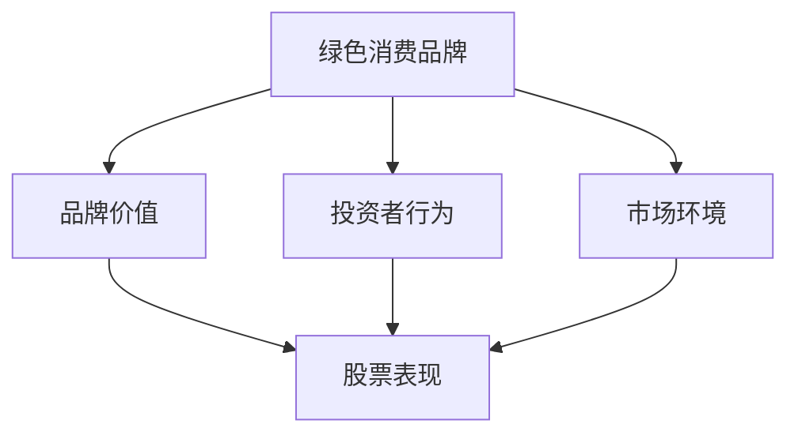
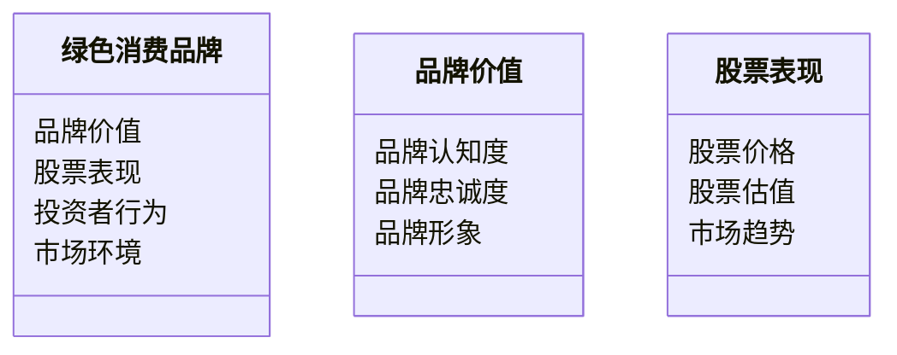
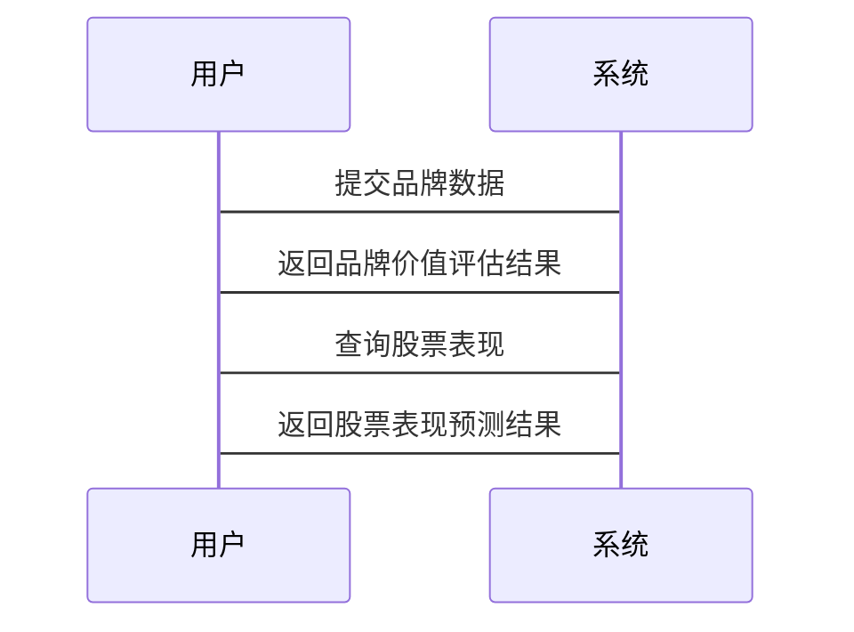

                 


# 绿色消费品牌的品牌价值与股票表现关系

## 关键词：绿色消费品牌，品牌价值，股票表现，可持续发展，投资者行为，企业社会责任

## 摘要：绿色消费品牌以其环保理念和可持续发展实践，正在成为影响股票市场的重要因素。本文分析绿色消费品牌如何通过提升品牌价值影响股票表现，探讨品牌价值的核心要素、股票表现的关键因素，以及两者之间的相互作用。通过实际案例和数学模型，本文揭示绿色消费品牌在股票市场中的潜在影响力，并为投资者提供参考。

---

# 绿色消费品牌的品牌价值与股票表现关系

## 第1章 绿色消费品牌的品牌价值与股票表现关系的背景介绍

### 1.1 绿色消费品牌的核心概念

#### 1.1.1 什么是绿色消费品牌
绿色消费品牌是指以环保、可持续发展为核心理念的企业品牌，其产品或服务在生产和消费过程中注重减少环境影响，强调社会责任和生态友好。

#### 1.1.2 绿色消费品牌的定义与特征
绿色消费品牌具有以下特征：
- 环保生产：采用绿色生产技术，减少资源消耗和污染排放。
- 可持续性：产品生命周期中注重资源的循环利用，减少废弃物产生。
- 社会责任：关注社会公平，推动可持续发展。
- 品牌认知度：通过绿色认证或环保宣传，提升消费者对品牌的认可度。

#### 1.1.3 绿色消费品牌的边界与外延
绿色消费品牌的外延不仅包括产品的环保属性，还涉及企业社会责任、生产方式、消费理念等多方面。

### 1.2 绿色消费品牌的兴起背景

#### 1.2.1 绿色消费的兴起与发展趋势
随着环保意识的增强和气候变化问题的加剧，绿色消费逐渐成为全球趋势，消费者更倾向于选择环保产品。

#### 1.2.2 绿色消费品牌对企业的影响
绿色消费品牌推动企业采用环保生产方式，提升品牌竞争力，同时促进企业社会责任的履行。

#### 1.2.3 绿色消费品牌对社会与环境的影响
绿色消费品牌通过减少环境影响和推动可持续发展，为社会和环境带来积极效益。

### 1.3 绿色消费品牌与股票表现的关系

#### 1.3.1 绿色消费品牌如何影响股票市场
绿色消费品牌通过提升品牌价值和市场竞争力，影响公司的财务表现，进而影响股票价格。

#### 1.3.2 股票表现与品牌价值的互动关系
股票表现反映市场对绿色消费品牌的认可度，而品牌价值的提升又能反过来推动股票价格的增长。

#### 1.3.3 绿色消费品牌对投资者决策的影响
绿色消费品牌因其长期可持续发展潜力，吸引注重社会责任和长期投资的投资者。

---

## 第2章 绿色消费品牌的品牌价值与股票表现关系的核心概念与联系

### 2.1 绿色消费品牌价值的核心要素

#### 2.1.1 品牌认知度与忠诚度
绿色消费品牌通过环保理念和优质产品，提升消费者的品牌认知度和忠诚度。

#### 2.1.2 品牌形象与社会责任感
绿色消费品牌注重品牌形象建设，强调社会责任，增强消费者信任。

#### 2.1.3 品牌创新与可持续发展能力
绿色消费品牌通过持续创新和提升可持续发展能力，增强品牌竞争力。

### 2.2 股票表现的核心要素

#### 2.2.1 股票价格波动与市场情绪
绿色消费品牌的市场表现受投资者情绪和市场趋势的影响，价格波动较大。

#### 2.2.2 股票估值与企业基本面
股票估值基于企业的财务状况和市场前景，绿色消费品牌的财务表现影响其估值。

#### 2.2.3 股票市场的投资者行为分析
投资者对绿色消费品牌的偏好影响市场行为，推动相关股票的价格波动。

### 2.3 绿色消费品牌与股票表现关系的实体关系图



---

## 第3章 绿色消费品牌的品牌价值与股票表现关系的算法原理

### 3.1 算法原理概述

#### 3.1.1 绿色消费品牌价值评估的数学模型
$$ V = \alpha \cdot P + \beta \cdot S + \gamma \cdot E $$
其中，V是品牌价值，P是品牌知名度，S是品牌满意度，E是品牌环保指数。

#### 3.1.2 股票表现预测的算法框架
采用多元回归分析，将品牌价值、企业财务指标和市场环境等因素纳入模型，预测股票表现。

#### 3.1.3 算法的输入与输出
输入：品牌价值指标、财务数据、市场数据；输出：股票表现预测值。

### 3.2 品牌价值与股票表现关系的数学模型

#### 3.2.1 品牌价值评估的公式
$$ V = \alpha \cdot P + \beta \cdot S + \gamma \cdot E $$

#### 3.2.2 股票表现预测的公式
$$ P = a \cdot V + b \cdot F + c \cdot M $$ 
其中，P是股票价格，V是品牌价值，F是财务指标，M是市场环境因素。

---

## 第4章 绿色消费品牌的品牌价值与股票表现关系的系统分析与架构设计

### 4.1 问题场景介绍
绿色消费品牌在股票市场中的表现受到品牌价值、企业基本面和市场环境的综合影响。

### 4.2 系统功能设计

#### 4.2.1 领域模型（Mermaid 类图）


### 4.3 系统架构设计

#### 4.3.1 系统架构图（Mermaid 架构图）


### 4.4 系统接口设计

#### 4.4.1 系统接口设计
- 输入接口：接收品牌数据、财务数据和市场数据。
- 输出接口：提供品牌价值评估、股票表现预测和市场分析报告。

### 4.5 系统交互设计

#### 4.5.1 系统交互序列图（Mermaid 序列图）


---

## 第5章 绿色消费品牌的品牌价值与股票表现关系的项目实战

### 5.1 环境安装

#### 5.1.1 安装 Python 和相关库
安装Python和Pandas、NumPy、Scikit-learn等数据分析库。

#### 5.1.2 安装 Mermaid 和图表工具
安装Mermaid CLI和相关图表绘制工具。

### 5.2 系统核心实现源代码

#### 5.2.1 品牌价值评估代码
```python
import pandas as pd
import numpy as np

# 数据加载
data = pd.read_csv('green_brand_data.csv')

# 品牌价值计算
def calculate_brand_value(data):
    alpha = 0.5
    beta = 0.3
    gamma = 0.2
    data['Brand_Value'] = alpha * data['Popularity'] + beta * data['Satisfaction'] + gamma * data['Environmental_Index']
    return data

# 股票表现预测
from sklearn.linear_model import LinearRegression

model = LinearRegression()
X = data[['Brand_Value', 'Financials', 'Market_Factors']]
y = data['Stock_Price']
model.fit(X, y)

# 预测结果
predicted_prices = model.predict(X)
```

#### 5.2.2 可视化代码
```python
import matplotlib.pyplot as plt

plt.scatter(data['Brand_Value'], data['Stock_Price'])
plt.plot(data['Brand_Value'], model.predict(X), color='red')
plt.xlabel('Brand Value')
plt.ylabel('Stock Price')
plt.title('Brand Value vs Stock Price')
plt.show()
```

### 5.3 实际案例分析与解读

#### 5.3.1 案例分析
以特斯拉为例，分析其作为绿色消费品牌，如何通过品牌价值影响股票表现。

#### 5.3.2 案例解读
特斯拉的品牌价值显著提升，带动了股票价格的上涨，体现了绿色消费品牌对股票市场的积极影响。

### 5.4 项目小结

#### 5.4.1 项目总结
通过项目实战，验证了绿色消费品牌的品牌价值与股票表现之间的正相关关系。

#### 5.4.2 经验与教训
模型的准确性依赖于数据质量和算法选择，需进一步优化数据采集和分析方法。

---

## 第6章 绿色消费品牌的品牌价值与股票表现关系的最佳实践

### 6.1 最佳实践 Tips

#### 6.1.1 投资者视角
投资者应关注绿色消费品牌的核心竞争力和可持续发展潜力。

#### 6.1.2 企业视角
企业需持续提升品牌价值，增强市场竞争力。

#### 6.1.3 研究视角
研究者应结合实际数据，不断优化模型和分析方法。

### 6.2 小结

#### 6.2.1 章节回顾
本文系统分析了绿色消费品牌的品牌价值与股票表现的关系，提供了理论与实践指导。

#### 6.2.2 展望未来
未来，绿色消费品牌将在股票市场中发挥更重要的作用，值得进一步深入研究。

### 6.3 注意事项

#### 6.3.1 数据质量
确保数据准确性和完整性，避免分析偏差。

#### 6.3.2 模型选择
根据实际需求选择合适的模型，避免过度复杂化。

#### 6.3.3 结果验证
通过实际案例验证模型的有效性，确保分析结果的可信度。

### 6.4 拓展阅读

#### 6.4.1 推荐书籍
- 《可持续发展与企业价值》
- 《绿色金融与投资分析》

#### 6.4.2 推荐文章
- 绿色消费品牌的全球发展趋势
- 可持续投资与社会责任

---

## 附录

### 附录1 绿色消费品牌的数据来源

#### 1.1 数据收集方法
通过公开数据平台收集绿色消费品牌的相关数据。

#### 1.2 数据清洗步骤
对数据进行清洗和预处理，确保数据质量。

### 附录2 绿色消费品牌与股票表现关系的工具

#### 2.1 数据分析工具
Pandas、NumPy、Scikit-learn等。

#### 2.2 可视化工具
Matplotlib、Seaborn、Tableau等。

---

通过以上章节内容，我们可以全面了解绿色消费品牌的品牌价值与股票表现关系，从理论分析到实际应用，为投资者和企业提供有价值的参考和指导。

