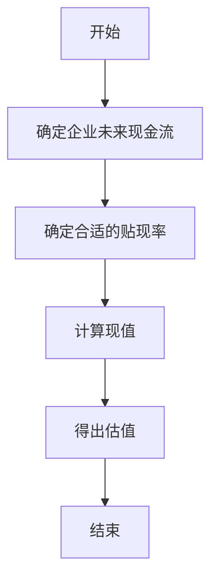
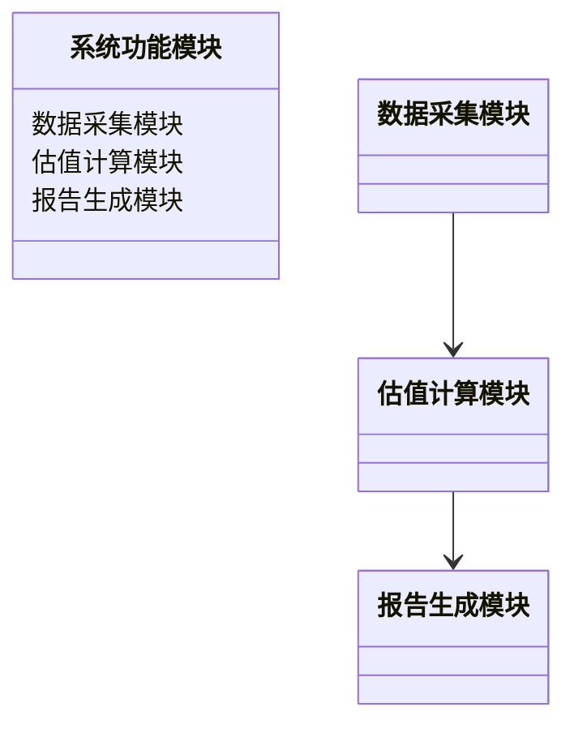
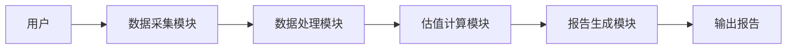
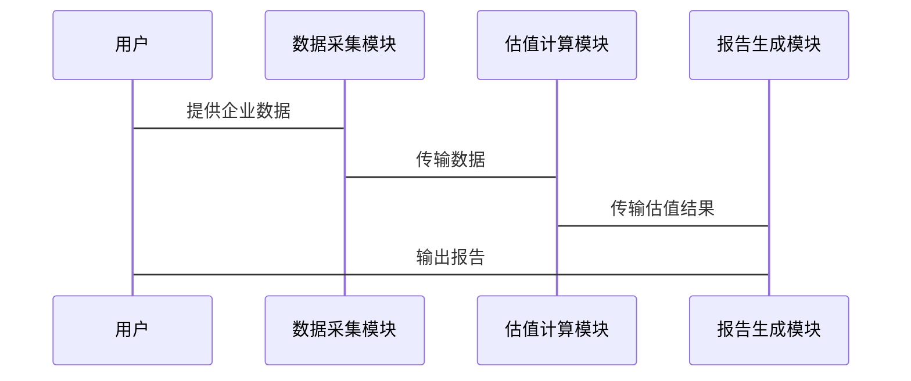

                 


# 绿色科技创新企业的估值挑战与机遇

## 关键词
绿色科技、科技创新企业、企业估值、现金流贴现模型、可持续商业模式

## 摘要
绿色科技创新企业是推动全球经济向可持续发展方向转型的核心力量。这些企业在技术创新、商业模式和生态系统构建方面具有独特性，使得传统的估值方法难以准确评估其价值。本文通过分析绿色科技创新企业的核心概念，探讨其估值的算法原理，并结合实际案例，提出一套适用于这类企业的估值方法。文章还介绍了系统架构设计和项目实战，帮助读者掌握绿色科技创新企业的估值挑战与机遇。

---

# 第一部分：绿色科技创新企业的背景与概念

## 第1章：绿色科技创新企业的定义与背景

### 1.1 绿色科技创新企业的定义
绿色科技创新企业是指在绿色科技领域进行创新，并致力于实现可持续发展目标的企业。这类企业通常聚焦于清洁能源、节能环保、绿色交通等领域，通过技术创新和商业模式创新，推动社会向低碳、环保方向发展。

#### 1.1.1 绿色科技的定义与内涵
绿色科技是指那些能够减少资源消耗、降低污染、提高资源利用效率的技术和产品。它涵盖了从能源生产到消费的各个环节，旨在实现经济发展与环境保护的双重目标。

#### 1.1.2 创新企业在绿色科技中的角色
绿色科技创新企业是绿色科技发展的主体，它们通过技术创新、产品创新和商业模式创新，推动绿色科技的商业化和规模化应用。

#### 1.1.3 绿色科技创新企业的核心特征
- **技术创新性**：绿色科技创新企业注重技术研发，不断推出具有环保特性的新产品。
- **可持续性**：企业的运营和产品生命周期注重环境友好。
- **社会影响力**：通过技术创新和商业模式创新，推动社会向可持续发展方向转型。

### 1.2 绿色科技创新企业的现状与发展
随着全球气候变化问题的加剧，绿色科技在全球范围内得到了快速发展。中国作为全球最大的碳排放国，也在积极推动绿色科技的发展，涌现出一批具有代表性的绿色科技创新企业。

#### 1.2.1 全球绿色科技发展趋势
- 绿色能源需求增长迅速，如太阳能、风能等可再生能源的市场占比不断提升。
- 绿色交通领域快速发展，电动汽车和共享出行模式逐渐普及。
- 绿色建筑和智慧城市建设成为城市发展的新趋势。

#### 1.2.2 中国绿色科技创新企业的崛起
中国的绿色科技创新企业主要集中在新能源、节能环保、绿色交通等领域。这些企业在技术创新和商业模式创新方面取得了显著进展，部分企业已经成为全球行业的领导者。

#### 1.2.3 绿色科技与经济可持续发展的关系
绿色科技不仅是环境保护的重要手段，也是经济发展的重要驱动力。通过发展绿色科技，可以实现经济增长与环境保护的双赢，推动全球经济向可持续方向转型。

### 1.3 绿色科技创新企业的估值问题背景
绿色科技创新企业的估值问题具有特殊性，传统的估值方法往往难以准确反映其价值。

#### 1.3.1 绿色科技企业的特殊性与估值挑战
- 绿色科技企业的商业模式往往具有较高的社会价值，但其经济效益难以量化。
- 绿色科技企业的研发投入较大，但其技术创新的不确定性较高。
- 绿色科技企业的估值需要考虑其对环境的长期影响，这增加了估值的复杂性。

#### 1.3.2 传统估值方法的局限性
传统的估值方法，如市盈率法和市净率法，主要适用于传统企业，而绿色科技创新企业的特殊性使得这些方法难以准确反映其价值。

#### 1.3.3 绿色科技企业的估值需求与目标
绿色科技创新企业的估值需求主要来自于投资者、政府和企业的自身发展需求。准确的估值可以帮助投资者做出合理的投资决策，也可以为企业提供融资支持。

---

## 第2章：绿色科技创新企业的核心概念与联系

### 2.1 绿色科技创新企业的核心要素
绿色科技创新企业的核心要素包括技术创新、可持续商业模式和生态系统构建。

#### 2.1.1 绿色科技的技术创新
技术创新是绿色科技创新企业的核心驱动力。企业通过技术研发，不断推出具有环保特性的新产品和新技术。

#### 2.1.2 可持续商业模式的构建
绿色科技创新企业需要构建可持续的商业模式，以实现经济效益和社会效益的双重目标。

#### 2.1.3 绿色科技创新企业的生态系统
绿色科技创新企业的生态系统包括合作伙伴、客户、政府和社会组织等多方利益相关者。构建良好的生态系统是实现绿色科技可持续发展的关键。

### 2.2 绿色科技创新企业的核心概念对比
绿色科技创新企业与传统企业的核心概念存在显著差异。

#### 2.2.1 绿色科技与传统科技的对比
| 对比维度 | 绿色科技 | 传统科技 |
|----------|-----------|-----------|
| 技术目标 | 环境保护 | 经济发展 |
| 技术特性 | 可持续性 | 高效性 |
| 技术应用 | 清洁能源、节能环保 | 工业生产、信息技术 |

#### 2.2.2 创新企业与传统企业的对比
| 对比维度 | 创新企业 | 传统企业 |
|----------|-----------|-----------|
| 创新驱动 | 技术创新、商业模式创新 | 规模化生产 |
| 变现模式 | 高额研发投入、长期回报 | 稳定的现金流 |
| 社会责任 | 高度关注 | 较低关注 |

#### 2.2.3 绿色科技创新企业的独特性
绿色科技创新企业的独特性体现在技术创新、商业模式创新和社会责任三个方面。

### 2.3 绿色科技创新企业的ER实体关系图
以下是绿色科技创新企业的ER实体关系图：

```mermaid
erd
    entity 绿色科技创新企业 {
        [技术创新]
        [商业模式]
        [生态系统]
    }
    entity 技术创新 {
        关键技术
        专利
    }
    entity 商业模式 {
        客户群体
        收入来源
    }
    entity 生态系统 {
        合作伙伴
        政府支持
    }
    绿色科技创新企业 -- 关键技术
    技术创新 -- 专利
    商业模式 -- 客户群体
    生态系统 -- 合作伙伴
```

---

## 第3章：绿色科技创新企业的估值算法原理

### 3.1 绿色科技创新企业估值的核心算法
绿色科技创新企业的估值需要考虑其技术创新、商业模式和生态系统等多个方面。

#### 3.1.1 现金流贴现模型（DCF）
现金流贴现模型是一种常用的估值方法，适用于具有稳定现金流的企业。

##### DCF模型的步骤
1. **预测未来现金流**：根据企业的商业模式和市场前景，预测未来几年的现金流。
2. **确定贴现率**：选择合适的贴现率，通常使用企业的加权平均资本成本（WACC）。
3. **计算现值**：将未来现金流贴现，计算其现值。
4. **计算终值**：根据永续增长率计算终值。
5. **总估值**：将现值和终值相加，得到企业的总估值。

#### 3.1.2 情景分析法
情景分析法通过模拟不同市场情景下的企业价值，评估企业的估值范围。

##### 情景分析法的步骤
1. **定义情景**：如最佳情景、平均情景和最坏情景。
2. **预测现金流**：根据不同情景，预测企业的现金流。
3. **计算估值**：分别计算不同情景下的企业估值。
4. **综合评估**：根据情景的概率，综合评估企业的估值。

#### 3.1.3 股权激励模型
股权激励模型通过将股权价值与员工激励相结合，评估企业的整体价值。

##### 股权激励模型的步骤
1. **确定股权比例**：根据员工激励计划，确定股权比例。
2. **计算股权价值**：根据企业的整体估值，计算股权价值。
3. **评估激励效果**：根据员工的贡献，评估激励效果。

### 3.2 现金流贴现模型（DCF）的流程图
以下是现金流贴现模型（DCF）的流程图：



### 3.3 DCF模型的Python实现
以下是DCF模型的Python实现代码：

```python
import numpy as np

def discounted_cash_flow(cash_flows, discount_rate):
    present_value = sum(cash_flow / (1 + discount_rate) ** t for t, cash_flow in enumerate(cash_flows))
    return present_value

# 示例数据
discount_rate = 0.1  # 贴现率
cash_flows = [100, 200, 300, 400, 500]  # 未来五年的现金流

# 计算现值
present_value = discounted_cash_flow(cash_flows, discount_rate)
print(f"现值为：{present_value:.2f}")
```

### 3.4 数学模型与公式
现金流贴现模型的数学公式为：

$$
PV = \sum_{t=1}^{n} \frac{CF_t}{(1 + r)^t}
$$

其中：
- \( PV \) 表示现值
- \( CF_t \) 表示第 \( t \) 年的现金流
- \( r \) 表示贴现率
- \( n \) 表示现金流的年数

### 3.5 实际案例分析
以某新能源企业为例，假设未来五年的现金流分别为100万元、200万元、300万元、400万元和500万元，贴现率为10%。

$$
PV = \frac{100}{1.1} + \frac{200}{1.1^2} + \frac{300}{1.1^3} + \frac{400}{1.1^4} + \frac{500}{1.1^5}
$$

计算结果为现值约为 867.81 万元。

---

## 第4章：绿色科技创新企业的系统分析与架构设计

### 4.1 系统分析
绿色科技创新企业的估值系统需要考虑技术创新、商业模式和生态系统等多个方面。

#### 4.1.1 问题场景介绍
绿色科技创新企业的估值系统需要解决以下问题：
- 如何准确预测企业的未来现金流？
- 如何选择合适的贴现率？
- 如何考虑企业的社会责任和环境影响？

#### 4.1.2 项目介绍
本项目旨在开发一个绿色科技创新企业的估值系统，帮助投资者和企业准确评估企业的价值。

### 4.2 系统功能设计
以下是系统的功能模块设计：



#### 4.2.1 数据采集模块
数据采集模块负责采集企业的财务数据、市场数据和技术数据。

#### 4.2.2 估值计算模块
估值计算模块负责根据采集的数据，计算企业的现值和终值。

#### 4.2.3 报告生成模块
报告生成模块负责将估值结果生成报告，供投资者和企业参考。

### 4.3 系统架构设计
以下是系统的架构设计：



### 4.4 系统接口设计
系统接口设计包括数据输入接口和报告输出接口。

### 4.5 系统交互设计
以下是系统的交互流程图：



---

## 第5章：绿色科技创新企业的项目实战

### 5.1 环境安装
需要安装Python和相关的库，如numpy和pandas。

```bash
pip install numpy pandas
```

### 5.2 核心代码实现
以下是DCF模型的Python代码实现：

```python
import numpy as np

def discounted_cash_flow(cash_flows, discount_rate):
    return np.npv(discount_rate, cash_flows)

# 示例数据
discount_rate = 0.1  # 贴现率
cash_flows = [100, 200, 300, 400, 500]  # 未来五年的现金流

# 计算现值
present_value = discounted_cash_flow(cash_flows, discount_rate)
print(f"现值为：{present_value:.2f}")
```

### 5.3 代码应用解读
上述代码通过numpy的npv函数计算了现金流的现值，适用于绿色科技创新企业的估值。

### 5.4 实际案例分析
以某新能源企业为例，假设未来五年的现金流分别为100万元、200万元、300万元、400万元和500万元，贴现率为10%。

计算结果为现值约为 867.81 万元。

### 5.5 项目小结
通过上述项目的实施，我们可以看到DCF模型在绿色科技创新企业估值中的应用。

---

## 第6章：绿色科技创新企业的最佳实践

### 6.1 小结
绿色科技创新企业的估值需要考虑其技术创新、商业模式和生态系统等多个方面。

### 6.2 注意事项
- 确保数据的准确性和完整性。
- 合理选择贴现率。
- 考虑企业的社会责任和环境影响。

### 6.3 拓展阅读
- 《绿色金融：支持绿色科技企业的融资模式》
- 《可持续商业模式：绿色科技企业的成功之道》

---

# 结语

绿色科技创新企业的估值是一个复杂但重要的问题。通过本文的分析，我们可以看到，绿色科技创新企业的独特性使得其估值需要考虑多个方面。通过合理的算法和系统设计，我们可以准确评估绿色科技创新企业的价值，为投资者和企业提供有力支持。

