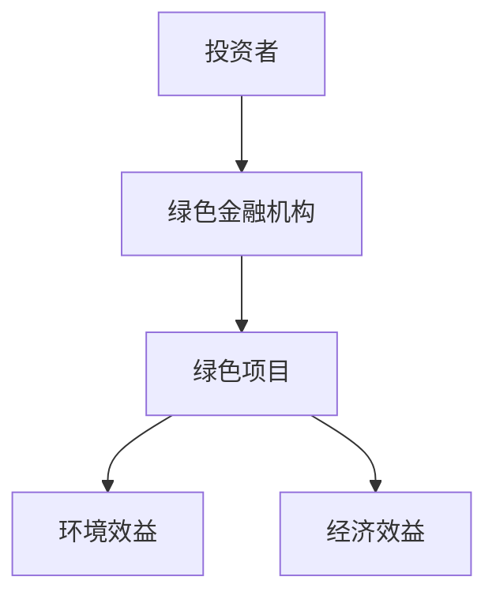
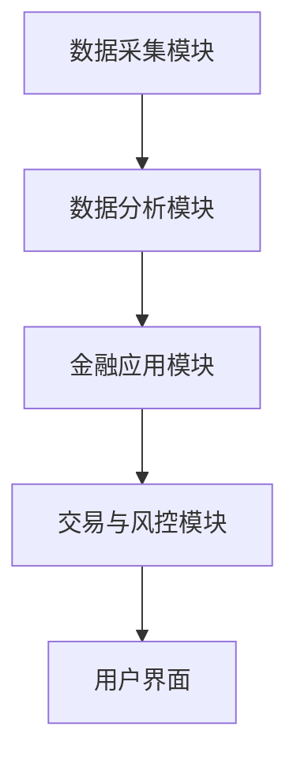
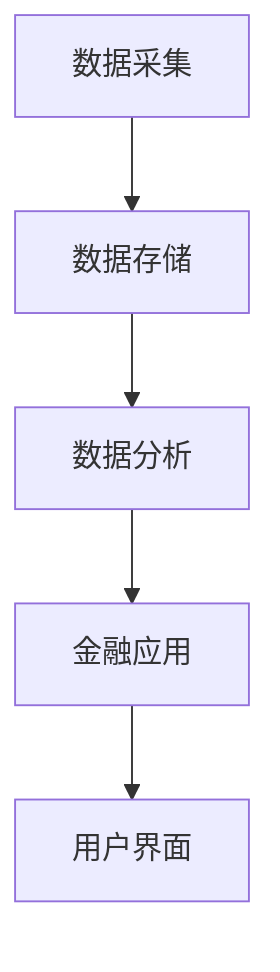

                 


# 绿色金融科技创新的投资机会研究

## 关键词：绿色金融、金融科技、技术创新、投资机会、风险管理、可持续发展

## 摘要：  
绿色金融科技创新是全球可持续发展的重要推动力，结合金融科技的技术优势，绿色金融能够更高效地支持环保项目、优化资源配置、降低环境风险。本文通过分析绿色金融科技创新的核心概念、算法原理、系统架构，并结合实际案例，探讨绿色金融科技创新的投资机会，为投资者提供有价值的参考。

---

# 第一部分: 绿色金融科技创新的背景与概念

## 第1章: 绿色金融科技创新的背景与概述

### 1.1 绿色金融的概念与内涵  
绿色金融是指通过金融工具支持环境保护和气候变化应对的经济活动。其核心在于将环境因素纳入金融决策，支持绿色项目的发展。绿色金融的内涵包括以下几个方面：  
1. 支持绿色产业：如可再生能源、节能环保、绿色交通等领域。  
2. 优化资源配置：通过金融手段引导资金流向环保项目。  
3. 降低环境风险：通过金融工具评估和管理环境风险，减少对环境的负面影响。  

绿色金融的实现依赖于技术创新，尤其是在大数据、人工智能、区块链等技术的加持下，绿色金融的效率和透明度不断提升。

### 1.2 金融科技的概念与发展趋势  
金融科技（FinTech）是指利用技术手段优化或替代传统金融服务的模式。其发展趋势包括：  
1. 数字化：通过大数据、云计算等技术实现金融服务的数字化。  
2. 智能化：利用人工智能技术实现智能投顾、智能风控等应用。  
3. 去中心化：区块链技术的应用推动金融体系的去中心化发展。  

### 1.3 绿色金融与金融科技的融合  
绿色金融科技创新的核心在于将金融科技技术应用于绿色金融领域。这种融合主要体现在以下几个方面：  
1. 数据驱动的环境风险评估：通过大数据分析，评估绿色项目的环境风险。  
2. 智能化投资决策：利用人工智能技术优化绿色投资组合。  
3. 区块链技术的应用：通过区块链技术实现绿色金融交易的透明化和可追溯性。  

### 1.4 本章小结  
本章介绍了绿色金融和金融科技的基本概念，并分析了两者融合的背景和趋势，为后续章节的分析奠定了基础。

---

# 第二部分: 绿色金融科技创新的核心概念与联系

## 第2章: 绿色金融科技创新的核心概念  

### 2.1 绿色金融科技创新的系统架构  
绿色金融科技创新的系统架构包括以下几个部分：  
1. 数据采集层：采集绿色项目的环境数据和金融数据。  
2. 数据分析层：利用大数据和人工智能技术对数据进行分析和建模。  
3. 金融应用层：基于分析结果提供绿色投资、融资等服务。  
4. 交易与风控层：通过区块链技术实现绿色金融交易的透明化和风险控制。  

通过这种分层架构，绿色金融科技创新能够实现数据的高效处理和金融应用的智能化。

### 2.2 绿色金融科技创新的核心要素  
绿色金融科技创新的核心要素包括：  
1. 环境数据：包括碳排放、能源消耗等环境指标。  
2. 金融数据：包括绿色项目的投资回报率、风险评估等。  
3. 技术工具：包括大数据分析、人工智能算法、区块链技术等。  

### 2.3 绿色金融科技创新的实体关系图  


从图中可以看出，投资者通过绿色金融机构支持绿色项目，绿色项目通过环境效益和经济效益实现可持续发展。

---

# 第三部分: 绿色金融科技创新的算法原理与数学模型  

## 第3章: 环境风险评估算法  

### 3.1 环境风险评估的算法原理  
环境风险评估是绿色金融科技创新的重要环节，其算法原理如下：  
1. 数据采集：收集绿色项目的环境数据和金融数据。  
2. 数据预处理：对数据进行清洗和标准化处理。  
3. 模型构建：基于机器学习算法构建环境风险评估模型。  
4. 模型验证：通过历史数据验证模型的准确性。  

### 3.2 环境风险评估的数学模型  
环境风险评估的数学模型可以表示为：  
$$ R = \alpha \cdot E + \beta \cdot S + \gamma \cdot O $$  
其中，$R$ 表示环境风险，$E$ 表示环境影响，$S$ 表示社会影响，$O$ 表示经济影响，$\alpha$、$\beta$、$\gamma$ 是模型的系数。

### 3.3 环境风险评估的实现代码  
以下是环境风险评估算法的Python实现示例：  
```python
import pandas as pd
from sklearn.linear_model import LinearRegression

# 数据预处理
data = pd.read_csv('green_project_data.csv')
X = data[['E', 'S', 'O']]
y = data['R']

# 模型训练
model = LinearRegression()
model.fit(X, y)

# 模型预测
new_data = pd.DataFrame({'E': [1.0], 'S': [0.8], 'O': [0.5]})
predicted_R = model.predict(new_data)
print(predicted_R)
```

---

## 第4章: 绿色项目筛选算法  

### 4.1 绿色项目筛选的算法原理  
绿色项目筛选算法通过大数据分析技术，筛选出符合绿色金融标准的项目。其算法流程如下：  
1. 数据采集：收集绿色项目的行业数据、财务数据和环境数据。  
2. 数据清洗：去除无效数据，填补缺失值。  
3. 特征提取：提取项目的关键特征，如碳排放强度、能源消耗等。  
4. 模型构建：基于决策树算法构建绿色项目筛选模型。  
5. 模型验证：通过实际案例验证模型的准确性。  

### 4.2 绿色项目筛选的数学模型  
绿色项目筛选的数学模型可以表示为：  
$$ P = \theta_1 \cdot X_1 + \theta_2 \cdot X_2 + \theta_3 \cdot X_3 $$  
其中，$P$ 表示项目的绿色概率，$X_1$、$X_2$、$X_3$ 是项目的特征，$\theta_1$、$\theta_2$、$\theta_3$ 是模型的参数。  

### 4.3 绿色项目筛选的实现代码  
以下是绿色项目筛选算法的Python实现示例：  
```python
import pandas as pd
from sklearn.tree import DecisionTreeClassifier

# 数据预处理
data = pd.read_csv('green_project_data.csv')
X = data[['X1', 'X2', 'X3']]
y = data['P']

# 模型训练
model = DecisionTreeClassifier()
model.fit(X, y)

# 模型预测
new_data = pd.DataFrame({'X1': [0.8], 'X2': [0.6], 'X3': [0.7]})
predicted_P = model.predict(new_data)
print(predicted_P)
```

---

# 第四部分: 绿色金融科技创新的系统分析与架构设计  

## 第5章: 绿色金融科技创新的系统分析  

### 5.1 系统功能设计  
绿色金融科技创新系统的功能模块包括：  
1. 数据采集模块：采集环境数据和金融数据。  
2. 数据分析模块：对数据进行建模和分析。  
3. 金融应用模块：提供绿色投资和融资服务。  
4. 交易与风控模块：实现绿色金融交易的透明化和风险控制。  

### 5.2 系统架构设计  
以下是绿色金融科技创新系统的架构图：  


从图中可以看出，系统各模块之间的交互关系清晰，能够实现数据的高效处理和金融应用的智能化。

---

## 第6章: 绿色金融科技创新的系统架构设计  

### 6.1 系统功能设计  
绿色金融科技创新系统的功能设计包括：  
1. 数据采集：通过API接口采集绿色项目的环境数据和金融数据。  
2. 数据分析：利用大数据技术对数据进行清洗和建模。  
3. 金融应用：基于模型结果提供绿色投资建议和融资服务。  
4. 交易与风控：通过区块链技术实现绿色金融交易的透明化和可追溯性。  

### 6.2 系统架构设计  
以下是绿色金融科技创新系统的架构图：  


从图中可以看出，系统的架构设计清晰，能够实现数据的高效处理和金融应用的智能化。

---

# 第五部分: 绿色金融科技创新的项目实战  

## 第7章: 环境风险评估算法的项目实战  

### 7.1 项目背景  
本项目旨在通过环境风险评估算法，筛选出符合绿色金融标准的项目。  

### 7.2 项目实现  
以下是环境风险评估算法的Python实现：  
```python
import pandas as pd
from sklearn.linear_model import LinearRegression

# 数据预处理
data = pd.read_csv('green_project_data.csv')
X = data[['E', 'S', 'O']]
y = data['R']

# 模型训练
model = LinearRegression()
model.fit(X, y)

# 模型预测
new_data = pd.DataFrame({'E': [1.0], 'S': [0.8], 'O': [0.5]})
predicted_R = model.predict(new_data)
print(predicted_R)
```

### 7.3 项目分析  
通过本项目的实施，可以实现绿色项目的环境风险评估，为投资者提供科学的决策依据。

---

## 第8章: 绿色项目筛选算法的项目实战  

### 8.1 项目背景  
本项目旨在通过绿色项目筛选算法，筛选出符合绿色金融标准的项目。  

### 8.2 项目实现  
以下是绿色项目筛选算法的Python实现：  
```python
import pandas as pd
from sklearn.tree import DecisionTreeClassifier

# 数据预处理
data = pd.read_csv('green_project_data.csv')
X = data[['X1', 'X2', 'X3']]
y = data['P']

# 模型训练
model = DecisionTreeClassifier()
model.fit(X, y)

# 模型预测
new_data = pd.DataFrame({'X1': [0.8], 'X2': [0.6], 'X3': [0.7]})
predicted_P = model.predict(new_data)
print(predicted_P)
```

### 8.3 项目分析  
通过本项目的实施，可以实现绿色项目的智能化筛选，为投资者提供高效的投资决策工具。

---

# 第六部分: 绿色金融科技创新的总结与展望  

## 第9章: 绿色金融科技创新的总结与展望  

### 9.1 本章小结  
本章总结了绿色金融科技创新的核心概念、算法原理和系统架构，并通过实际案例展示了绿色金融科技创新的应用场景和投资机会。

### 9.2 投资机会分析  
绿色金融科技创新的投资机会主要体现在以下几个方面：  
1. 大数据技术在环境风险评估中的应用。  
2. 人工智能技术在绿色项目筛选中的应用。  
3. 区块链技术在绿色金融交易中的应用。  

### 9.3 小结  
绿色金融科技创新是全球可持续发展的重要推动力，通过技术创新和模式创新，绿色金融能够为投资者创造更多的价值。

---

## 附录: 绿色金融科技创新的拓展阅读  

### 附录A: 绿色金融科技创新的数学模型  
绿色金融科技创新的数学模型包括环境风险评估模型和绿色项目筛选模型。  

### 附录B: 绿色金融科技创新的系统架构图  
绿色金融科技创新的系统架构图包括数据采集模块、数据分析模块、金融应用模块和交易与风控模块。  

---

## 作者简介  
作者是[此处填写作者姓名]，目前在[此处填写作者职位]，致力于绿色金融科技创新领域的研究与实践。

