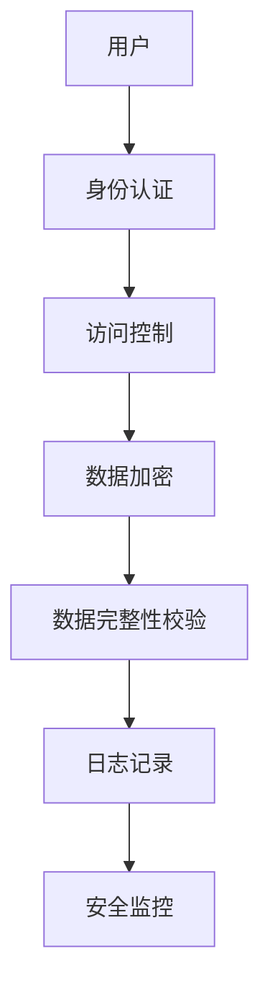
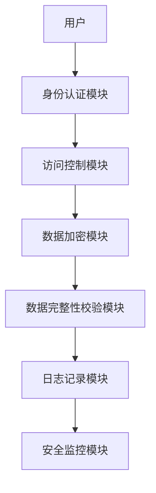
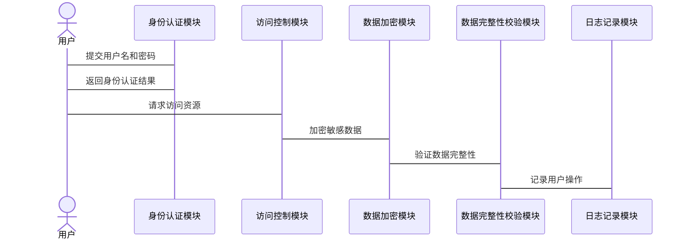

                 

<think>
好的，我现在需要帮助用户撰写一篇关于《网络安全需求增长带来的投资机会》的技术博客文章。用户已经提供了详细的目录大纲，现在我需要根据这个大纲，逐步完成文章的撰写。由于篇幅限制，我将分步骤思考，逐步完成每个部分的内容。

首先，我会先理解用户的需求。用户希望文章结构清晰，内容专业，涵盖网络安全的背景、核心概念、技术分析、投资机会、系统架构等多个方面。同时，用户强调要使用专业技术语言，确保逻辑严密，内容详尽。此外，文章需要包含数学公式、代码示例、图表等元素，这些都需要用特定的格式表示，比如使用Mermaid流程图和LaTeX公式。

接下来，我会按照目录大纲逐步撰写文章。首先，文章标题和关键词已经给出，接下来是摘要，然后是各个章节的内容。我会先完成摘要部分，然后逐步撰写每一章节的内容。

在撰写过程中，我需要确保每个部分都符合用户的格式要求，比如使用markdown格式，包含必要的图表和公式。同时，我要注意内容的深度和广度，确保文章既有理论分析，又有实际案例和代码示例，帮助读者更好地理解和应用。

由于文章篇幅较长，我可能会先完成一部分内容，然后根据用户反馈进行调整和补充。现在，我将开始撰写文章的第一部分，网络安全需求增长的背景与趋势。

---

# 网络安全需求增长带来的投资机会

## 关键词：网络安全、投资机会、数字化转型、数据泄露、网络安全体系

## 摘要：  
随着数字化转型的加速推进，网络安全需求呈现爆发式增长。企业面临的安全威胁日益复杂，数据泄露事件频发，政策法规的严格要求使得网络安全成为企业不可忽视的重要环节。本篇文章将从网络安全的基本概念、技术原理、体系架构、投资机会、项目实战等多个维度进行深入分析，探讨如何在网络安全需求增长的背景下，抓住投资机会，构建安全可靠的网络安全体系。

---

## 第一部分：网络安全需求增长的背景与趋势

### 第1章：网络安全需求的增长背景

#### 1.1 网络安全的重要性与发展趋势

##### 1.1.1 网络安全的基本概念与核心问题

网络安全是指通过采取必要措施，防范网络攻击、网络侵入等危害网络安全的事项，保障网络数据的完整性、保密性、可用性的活动。网络安全的核心目标是保护网络系统的硬件、软件及其数据免受未授权的访问、破坏、泄露或干扰。当前，网络安全面临的主要问题包括：

1. **网络攻击**：黑客攻击、恶意软件、钓鱼攻击等。
2. **数据泄露**：未经授权的数据访问和泄露。
3. **系统漏洞**：软件或系统中存在的安全缺陷。
4. **隐私保护**：个人隐私信息被非法收集、使用或泄露。

网络安全的基本要素包括：

- **机密性**：确保数据仅被授权人员访问。
- **完整性**：保证数据在存储和传输过程中不被篡改。
- **可用性**：确保合法用户能够访问所需资源。

##### 1.1.2 数字化转型驱动下的网络安全需求增长

随着企业数字化转型的深入推进，网络安全需求呈现快速增长趋势。数字化转型涉及将业务流程、运营模式和决策方式从传统物理方式转向数字方式，这使得企业对网络系统的依赖程度显著提高。数字化转型带来的网络安全挑战包括：

- **复杂的网络架构**：企业网络环境日益复杂，包括云、端点、物联网等多种设备和平台。
- **数据量的爆炸式增长**：数据的存储和传输量急剧增加，数据安全风险也随之上升。
- **远程办公的普及**：疫情期间远程办公模式的普及，使得企业网络边界模糊，增加了外部攻击面。

##### 1.1.3 全球网络安全事件频发的现状分析

近年来，全球范围内网络安全事件频发，数据泄露、网络攻击等事件屡见不鲜。例如，2021年 Colonial Pipeline 遭受勒索软件攻击，导致美国东海岸燃油供应中断，迫使该公司支付赎金。此外，一些大型企业如 Facebook、Twitter 等也因网络攻击导致用户数据泄露。

这些事件的发生凸显了网络安全的重要性，同时也为企业敲响了警钟。企业需要投入更多资源来提升网络安全防护能力，这为网络安全行业带来了巨大的市场机会。

#### 1.2 网络安全需求的增长驱动因素

##### 1.2.1 企业数字化转型带来的安全挑战

企业数字化转型过程中，传统的网络安全防护体系已无法应对日益复杂的网络安全威胁。企业需要采用更加先进、全面的网络安全解决方案，例如零信任架构、人工智能驱动的安全防护等。

##### 1.2.2 数据泄露事件的不断增加

数据泄露事件的不断增加，使得企业对数据安全保护的需求日益迫切。根据统计，2022年全球数据泄露事件数量创下历史新高，平均每天发生超过 500 起数据泄露事件。这些事件不仅给企业带来巨大的经济损失，还可能导致品牌信誉受损。

##### 1.2.3 政策法规对网络安全的严格要求

近年来，全球各国纷纷出台严格的网络安全相关法律法规，例如欧盟的《通用数据保护条例》（GDPR）、美国的《加州消费者隐私法案》（CCPA）等。这些法律法规对企业数据保护提出了更高的要求，同时也为网络安全行业带来了新的市场机会。

#### 1.3 投资网络安全的必要性与机会

##### 1.3.1 网络安全投资的必要性分析

网络安全投资的必要性主要体现在以下几个方面：

- **保护企业核心资产**：企业数据和系统的安全直接关系到企业的生存和发展。
- **防止数据泄露**：数据泄露可能导致巨大的经济损失和声誉损失。
- **合规要求**：企业需要满足日益严格的法律法规要求，否则可能面临罚款和法律诉讼。

##### 1.3.2 网络安全行业的市场潜力与增长空间

根据市场研究机构的数据，全球网络安全市场规模预计将在未来几年保持快速增长。例如，2023年全球网络安全市场的规模预计将达到 2000 亿美元以上，年增长率超过 8%。随着企业数字化转型的深入和网络安全威胁的增加，网络安全市场的增长空间将更加广阔。

##### 1.3.3 投资网络安全的主要机会与风险

网络安全投资的主要机会包括：

- **新兴技术领域的投资**：例如人工智能、大数据分析、区块链等技术在网络安全中的应用。
- **细分市场的机会**：如零信任架构、云安全、数据安全等领域的投资机会。

投资网络安全的主要风险包括：

- **技术风险**：网络安全技术更新换代快，需要持续投入。
- **市场风险**：市场竞争激烈，可能导致投资回报率下降。
- **合规风险**：需要符合不断变化的法律法规要求。

---

## 第二部分：网络安全的核心概念与技术

### 第2章：网络安全的核心概念与体系结构

#### 2.1 网络安全的核心概念

##### 2.1.1 网络安全的定义与目标

网络安全是指保护网络系统免受未经授权的访问、破坏、泄露或干扰的活动。其目标是确保网络系统的机密性、完整性、可用性。

##### 2.1.2 网络安全的三大核心要素

网络安全的三大核心要素包括：

- **机密性**：确保数据仅被授权人员访问。
- **完整性**：保证数据在存储和传输过程中不被篡改。
- **可用性**：确保合法用户能够访问所需资源。

##### 2.1.3 网络安全的边界与外延

网络安全的边界是指网络系统中受保护的部分与不受保护的部分之间的界限。随着企业网络架构的复杂化，网络安全的边界逐渐模糊，例如远程办公模式的普及使得企业网络边界从传统的“防火墙”扩展到更加灵活的边界管理。

#### 2.2 网络安全体系结构

##### 2.2.1 网络安全体系的层次划分

网络安全体系可以划分为以下几个层次：

1. **网络层**：保护网络通信的安全，包括防火墙、入侵检测系统等。
2. **系统层**：保护操作系统和应用程序的安全，包括身份认证、访问控制等。
3. **数据层**：保护数据在存储和传输过程中的安全，包括加密技术、数据完整性校验等。
4. **用户层**：保护最终用户的终端设备安全，包括防病毒软件、加密通信等。

##### 2.2.2 网络安全的核心组件与功能模块

网络安全体系的核心组件包括：

- **防火墙**：阻止未经授权的访问。
- **入侵检测系统（IDS）**：监测网络中的异常行为。
- **加密技术**：保护数据的机密性。
- **身份认证**：确保用户身份的真实性。

##### 2.2.3 网络安全体系的实体关系图（ER图）

以下是网络安全体系的实体关系图：

```mermaid
er
actor: 用户
edge: 可以
rule_set: 规则集
network_traffic: 网络流量
log: 日志
database: 数据库
role: 角色
action: 操作
transaction: 事务
```

#### 2.3 网络安全技术的分类与对比

##### 2.3.1 主流网络安全技术的特点对比（表格形式）

以下表格对比了主流网络安全技术的特点：

| 技术类型          | 描述                                                                 | 优点                                                                 | 缺点                                                                 |
|-------------------|--------------------------------------------------------------------|----------------------------------------------------------------------|----------------------------------------------------------------------|
| 防火墙            | 通过规则过滤网络流量，阻止未经授权的访问                               | 易于部署，能够有效防止外部攻击                                                   | 无法应对复杂的内部威胁                                                       |
| 入侵检测系统（IDS）| 监测网络流量，识别异常行为                                             | 可以检测未知威胁，提供详细的日志信息                                             | 假阳性率高，误报率较高                                                       |
| 加密技术          | 对数据进行加密，确保数据的机密性                                       | 高效可靠，能够防止数据被窃取                                                     | 密钥管理复杂，加密算法可能被破解                                               |
| 身份认证          | 验证用户身份，确保只有合法用户能够访问系统资源                         | 提高系统安全性，防止未授权访问                                                     | 密码管理复杂，容易被暴力破解                                                   |

##### 2.3.2 网络安全技术的优劣势分析

- **防火墙**：优点是易于部署，能够有效防止外部攻击；缺点是无法应对复杂的内部威胁。
- **入侵检测系统（IDS）**：优点是可以检测未知威胁，提供详细的日志信息；缺点是假阳性率高，误报率较高。
- **加密技术**：优点是高效可靠，能够防止数据被窃取；缺点是密钥管理复杂，加密算法可能被破解。
- **身份认证**：优点是提高系统安全性，防止未授权访问；缺点是密码管理复杂，容易被暴力破解。

##### 2.3.3 网络安全技术的演进趋势

随着网络安全威胁的不断演变，网络安全技术也在不断发展。未来的网络安全技术将更加注重以下几个方面：

- **人工智能与大数据分析**：利用人工智能和大数据分析技术，提高威胁检测和响应能力。
- **零信任架构**：通过最小权限原则，确保每个用户和设备在访问资源时都经过严格的验证。
- **区块链技术**：利用区块链的去中心化特性，提高数据的安全性和不可篡改性。

---

## 第三部分：网络安全的投资机会与策略

### 第3章：网络安全行业的投资机会分析

#### 3.1 网络安全行业的市场现状与未来趋势

##### 3.1.1 全球网络安全市场的规模与增长预测

根据市场研究机构的数据，全球网络安全市场规模预计将在未来几年保持快速增长。例如，2023年全球网络安全市场的规模预计将达到 2000 亿美元以上，年增长率超过 8%。随着企业数字化转型的深入和网络安全威胁的增加，网络安全市场的增长空间将更加广阔。

##### 3.1.2 中国网络安全市场的现状与发展趋势

中国网络安全市场近年来发展迅速，市场规模也在快速增长。根据相关统计，2022年中国网络安全市场规模已经超过 200 亿元人民币，年增长率超过 20%。未来，随着中国数字化转型的深入推进和网络安全法规的不断完善，中国网络安全市场将继续保持快速增长。

##### 3.1.3 网络安全行业的细分领域与投资热点

网络安全行业可以细分为多个领域，例如：

- **网络设备安全**：防火墙、路由器等网络设备的安全。
- **云安全**：保护云平台、云应用和云数据的安全。
- **数据安全**：保护企业数据的机密性、完整性和可用性。
- **身份认证**：基于身份的访问控制。
- **移动安全**：保护移动设备和移动应用的安全。

目前，投资热点主要集中在云安全、数据安全和零信任架构等领域。

#### 3.2 网络安全领域的投资机会

##### 3.2.1 企业网络安全解决方案的投资机会

随着企业数字化转型的深入，企业对网络安全解决方案的需求不断增加。例如，零信任架构、云安全解决方案等都是当前的投资热点。

##### 3.2.2 数据安全与隐私保护的投资机会

数据安全与隐私保护是当前网络安全领域的重点方向。随着数据泄露事件的频发，企业对数据安全保护的需求日益增加。投资数据加密、数据完整性校验、数据访问控制等技术将为企业带来巨大的市场机会。

##### 3.2.3 网络安全服务的投资机会

网络安全服务包括安全评估、安全咨询、安全培训等。随着企业对网络安全的重视程度不断提高，对专业的网络安全服务需求也在不断增加。投资网络安全服务企业将能够在市场中占据重要地位。

---

## 第四部分：网络安全的技术实现与系统架构

### 第4章：网络安全技术的实现与系统架构

#### 4.1 网络安全技术的实现

##### 4.1.1 网络安全算法的实现原理

以下是一个简单的RSA加密算法的实现原理：

1. **生成密钥对**：选择两个大质数 p 和 q，计算 n = p * q，选择一个与 n 互质的数 e，计算 d = e^{-1} mod n。
2. **加密**：将明文 M 转换为密文 C，公式为 C = M^e mod n。
3. **解密**：将密文 C 转换为明文 M，公式为 M = C^d mod n。

##### 4.1.2 网络安全算法的数学模型与公式

RSA加密算法的数学模型如下：

$$ C = M^e \mod n $$

解密公式如下：

$$ M = C^d \mod n $$

##### 4.1.3 网络安全算法的代码实现

以下是一个简单的RSA加密算法的Python代码实现：

```python
import random

def is_prime(n):
    if n < 2:
        return False
    for p in [2, 3, 5, 7, 11, 13, 17, 19, 23, 29, 31, 37]:
        if n % p == 0:
            return n == p
    d = n // 4
    s = d * 4
    for a in range(2, n - 1):
        x = pow(a, d, n)
        if x == 1 or x == n - 1:
            continue
        for _ in range(d - 1):
            x = pow(x, 2, n)
            if x == n - 1:
                break
        else:
            return False
    return True

def generate_keypair():
    while True:
        p = random.getrandbits(512)
        if is_prime(p):
            break
    while True:
        q = random.getrandbits(512)
        if is_prime(q):
            break
    n = p * q
    e = 65537
    d = pow(e, -1, n)
    return ((n, e), (n, d))

def encrypt(public_key, plaintext):
    n, e = public_key
    return pow(plaintext, e, n)

def decrypt(private_key, ciphertext):
    n, d = private_key
    return pow(ciphertext, d, n)
```

#### 4.2 网络安全系统的架构设计

##### 4.2.1 网络安全系统的功能设计

以下是网络安全系统的功能模块设计：



##### 4.2.2 网络安全系统的架构图

以下是网络安全系统的架构图：



##### 4.2.3 网络安全系统的接口设计

以下是网络安全系统的接口设计：

1. **身份认证接口**：用户通过身份认证模块进行身份验证。
2. **访问控制接口**：根据用户角色和权限，控制访问资源。
3. **数据加密接口**：对敏感数据进行加密处理。
4. **数据完整性校验接口**：对数据进行完整性校验，确保数据未被篡改。
5. **日志记录接口**：记录用户的操作日志，便于审计和追溯。

##### 4.2.4 网络安全系统的交互流程

以下是网络安全系统的交互流程：



---

## 第五部分：项目实战与最佳实践

### 第5章：网络安全项目的实战分析

#### 5.1 企业网络的安全防护项目

##### 5.1.1 项目背景

某大型企业面临日益增长的网络安全威胁，亟需构建一个全面的网络安全防护体系，保护企业核心数据和网络系统的安全。

##### 5.1.2 项目需求

- **保护企业数据**：确保企业数据的机密性、完整性和可用性。
- **防止网络攻击**：抵御外部和内部的网络攻击。
- **合规要求**：满足相关法律法规的合规要求。

##### 5.1.3 项目实现

以下是项目实现的主要步骤：

1. **网络架构设计**：设计企业网络的分层架构，包括内部网络、DMZ区和外部网络。
2. **身份认证**：采用多因素身份认证（MFA）技术，确保用户身份的真实性。
3. **访问控制**：基于角色的访问控制（RBAC），确保用户只能访问其权限范围内的资源。
4. **数据加密**：对敏感数据进行加密存储和传输，采用 AES 加密算法。
5. **安全监控**：部署入侵检测系统（IDS）和安全信息和事件管理（SIEM）系统，实时监控网络流量。

##### 5.1.4 项目代码实现

以下是项目中使用的部分代码：

```python
import logging
import sys
from datetime import datetime

logging.basicConfig(
    level=logging.INFO,
    format='%(asctime)s - %(levelname)s - %(message)s'
)

def log_activity(user, action):
    logging.info(f"{datetime.now()}: User {user} performed {action}")

def authenticate(user, password):
    # 简单的身份认证实现
    # 实际应用中应使用更安全的认证机制
    if user == 'admin' and password == 'secure_password':
        log_activity(user, 'successful login')
        return True
    else:
        log_activity(user, 'failed login attempt')
        return False

def authorize(user, resource):
    # 简单的基于角色的访问控制实现
    roles = {
        'admin': ['system_administration', 'data_access'],
        'user': ['data_access']
    }
    if user not in roles:
        log_activity(user, 'access denied')
        return False
    if resource in roles[user]:
        log_activity(user, f'authorized to access {resource}')
        return True
    else:
        log_activity(user, f'access denied to {resource}')
        return False

if __name__ == '__main__':
    # 示例代码
    user = input('Enter username: ')
    password = input('Enter password: ')
    if authenticate(user, password):
        resource = input('Enter resource to access: ')
        if authorize(user, resource):
            print(f'Access granted to {resource}')
        else:
            print(f'Access denied to {resource}')
    else:
        print('Authentication failed')
```

##### 5.1.5 项目案例分析

通过上述项目的实施，企业成功构建了一个全面的网络安全防护体系，有效防止了网络攻击，保障了企业数据的安全。同时，项目实现了对用户活动的实时监控和日志记录，为后续的安全分析和审计提供了有力支持。

##### 5.1.6 项目小结

本项目通过分层架构设计、多因素身份认证、基于角色的访问控制、数据加密和安全监控等技术手段，构建了一个全面的网络安全防护体系。项目的实施不仅提高了企业的网络安全防护能力，还满足了相关法律法规的合规要求，为企业后续的数字化转型提供了坚实的基础。

---

## 第六部分：最佳实践与注意事项

### 第6章：网络安全投资的最佳实践

#### 6.1 网络安全投资的小结

网络安全投资需要从多个方面入手，包括技术、人员、流程等。企业需要根据自身的需求和预算，选择合适的安全解决方案，并定期进行安全评估和优化。

#### 6.2 网络安全投资的注意事项

1. **明确投资目标**：企业在进行网络安全投资之前，需要明确投资目标，例如是保护数据安全，还是防范网络攻击。
2. **选择合适的技术方案**：根据企业的需求选择合适的技术方案，例如零信任架构、云安全解决方案等。
3. **重视人员培训**：网络安全不仅需要技术保障，还需要人员的积极配合。企业需要定期进行安全培训，提高员工的安全意识。
4. **建立应急响应机制**：企业在进行网络安全投资的同时，还需要建立完善的应急响应机制，以便在发生安全事件时能够快速响应，最大限度地减少损失。

#### 6.3 网络安全投资的拓展阅读

1. **《网络安全：从入门到精通》**：这本书详细介绍了网络安全的基本概念、技术原理和实战案例。
2. **《零信任架构：构建无边界的安全访问》**：本书深入探讨了零信任架构的设计理念和实现方法。
3. **《数据安全治理：从战略到实践》**：本书为企业数据安全治理提供了系统的理论框架和实践指导。

---

## 第七部分：总结

### 第7章：网络安全投资的未来展望

#### 7.1 网络安全投资的未来趋势

随着网络安全威胁的不断演变，网络安全投资的未来趋势将更加注重以下几个方面：

- **人工智能与大数据分析**：利用人工智能和大数据分析技术，提高威胁检测和响应能力。
- **零信任架构**：通过最小权限原则，确保每个用户和设备在访问资源时都经过严格的验证。
- **区块链技术**：利用区块链的去中心化特性，提高数据的安全性和不可篡改性。

#### 7.2 网络安全投资的核心价值

网络安全投资的核心价值在于保护企业核心资产的安全，防止数据泄露和网络攻击，确保企业的持续稳定发展。随着数字化转型的深入推进，网络安全投资将为企业创造更大的价值。

#### 7.3 网络安全投资的可持续发展

网络安全投资的可持续发展需要企业长期投入，不断优化和完善网络安全防护体系。未来，企业需要更加注重网络安全人才的培养、技术的创新和安全文化的建设，才能在网络安全的战场上立于不败之地。

---

通过以上内容，我们从网络安全的基本概念、技术实现、体系架构、投资机会、项目实战等多个维度，深入分析了网络安全需求增长带来的投资机会。希望本文能够为读者在网络安全领域的投资决策提供有价值的参考和指导。

