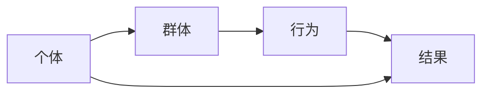
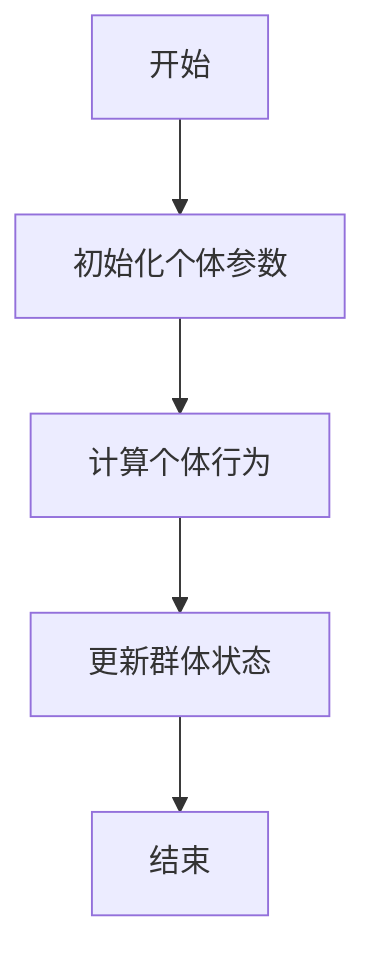
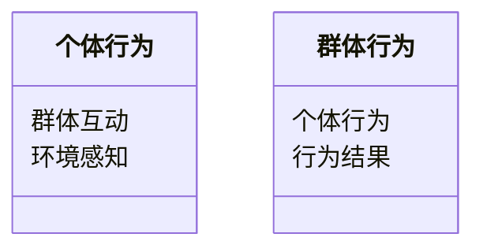
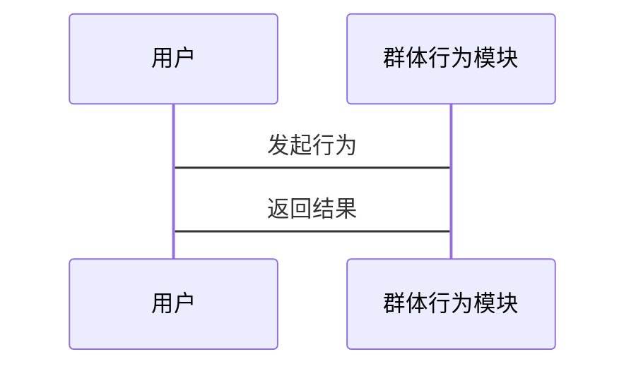

                 


```markdown
# 羊群效应：理解并避免从众心理陷阱

> 关键词：羊群效应、从众心理、群体行为、算法模拟、系统分析、最佳实践

> 摘要：羊群效应是指个体在群体压力下，放弃自己的判断而采取与大多数人一致的行为模式。本文将从羊群效应的定义、核心概念、算法模拟、数学模型、系统分析、项目实战和最佳实践等多个方面进行深入探讨，帮助读者理解并避免从众心理陷阱。

---

# 第一部分：羊群效应的背景与概念

## 第1章：羊群效应的定义与背景

### 1.1 羊群效应的定义
- 1.1.1 羊群效应的定义与特征
- 1.1.2 羊群效应与相关概念的对比（从众心理、社会影响、信息传播）

### 1.2 羊群效应的背景与问题背景
- 1.2.1 羊群效应的历史背景与现状
- 1.2.2 羊群效应在当代社会中的表现

### 1.3 羊群效应的问题描述
- 1.3.1 羊群效应的常见表现形式
- 1.3.2 羊群效应对个体和社会的影响
- 1.3.3 羊群效应的边界与外延

### 1.4 羊群效应的概念结构与核心要素
- 1.4.1 羊群效应的核心要素（个体行为、群体互动、环境因素）
- 1.4.2 羊群效应的形成机制
- 1.4.3 羊群效应的系统性分析

### 1.5 本章小结
- 本章总结羊群效应的基本概念及其在实际中的表现，为后续分析奠定基础。

---

## 第2章：羊群效应的核心概念与联系

### 2.1 羊群效应的核心原理
- 2.1.1 个体行为与群体互动的关系
- 2.1.2 羊群效应的传播路径与动态演变

### 2.2 羊群效应的核心概念对比
- 2.2.1 羊群效应与从众心理的对比分析
- 2.2.2 羊群效应与社会影响的对比
- 2.2.3 羊群效应与信息传播的对比

### 2.3 羊群效应的ER实体关系图


### 2.4 本章小结
- 本章通过概念对比和实体关系图，深入分析了羊群效应的核心要素及其相互关系。

---

# 第二部分：羊群效应的算法与数学模型

## 第3章：羊群效应的算法原理

### 3.1 羊群效应的模拟算法
- 3.1.1 基于规则的羊群模拟算法
- 3.1.2 基于随机游走的模拟算法
- 3.1.3 基于群体智能的模拟算法

### 3.2 羊群效应的算法实现


### 3.3 羊群效应的Python代码实现
```python
import random

def sheep_behavior(individual):
    # 个体行为规则
    pass

def simulate_sheep_group(n Individuals):
    for individual in Individuals:
        sheep_behavior(individual)
```

### 3.4 羊群效应的数学模型与公式
- 3.4.1 羊群效应的基本数学模型
  $$f(x) = \sum_{i=1}^{n} x_i$$
- 3.4.2 羊群效应的动态模型
  $$\frac{dx}{dt} = k(x - x_0)$$

### 3.5 羊群效应的举例说明
- 通过具体案例分析，说明羊群效应在实际中的表现及其数学模型的应用。

### 3.6 本章小结
- 本章通过算法模拟和数学模型，深入分析了羊群效应的实现机制及其应用。

---

## 第4章：羊群效应的数学模型与系统分析

### 4.1 羊群效应的数学模型
- 4.1.1 羊群效应的基本模型
- 4.1.2 羊群效应的动态模型与参数分析

### 4.2 羊群效应的系统分析
- 4.2.1 羊群效应的系统架构设计
- 4.2.2 羊群效应的系统功能设计
- 4.2.3 羊群效应的系统交互设计

### 4.3 羊群效应的系统架构图


### 4.4 本章小结
- 本章通过数学模型和系统分析，深入探讨了羊群效应的内在机制及其系统实现。

---

# 第三部分：羊群效应的项目实战与最佳实践

## 第5章：羊群效应的项目实战

### 5.1 项目背景与需求分析
- 5.1.1 项目背景介绍
- 5.1.2 项目需求分析
- 5.1.3 项目目标设定

### 5.2 系统设计与实现
- 5.2.1 系统功能设计（领域模型）


- 5.2.2 系统架构设计


- 5.2.3 系统接口设计
- 5.2.4 系统交互设计


### 5.3 项目实现与代码分析
- 5.3.1 项目环境安装与配置
- 5.3.2 核心代码实现与解读
- 5.3.3 代码应用案例分析

### 5.4 项目小结
- 本章通过项目实战，展示了羊群效应的系统实现及其实际应用。

---

## 第6章：羊群效应的最佳实践与小结

### 6.1 避免羊群效应的策略
- 6.1.1 信息透明化与独立思考的培养
- 6.1.2 多元化决策与群体智慧的应用
- 6.1.3 群体互动中的个体独立性维护

### 6.2 羊群效应的注意事项
- 6.2.1 羊群效应的潜在风险
- 6.2.2 羊群效应的应对措施
- 6.2.3 羊群效应的长期影响

### 6.3 本章小结
- 本章总结了羊群效应的应对策略及其实际应用中的注意事项。

---

## 第7章：总结与展望

### 7.1 羊群效应的总结
- 7.1.1 羊群效应的核心概念回顾
- 7.1.2 羊群效应的算法与数学模型总结
- 7.1.3 羊群效应的项目实战与最佳实践总结

### 7.2 羊群效应的未来展望
- 7.2.1 羊群效应在人工智能中的应用
- 7.2.2 羊群效应在社会学中的研究方向
- 7.2.3 羊群效应在信息传播中的潜在影响

### 7.3 本章小结
- 本章总结了全文的核心内容，并展望了羊群效应的未来发展。

---

# 参考文献

（此处列出相关文献和参考资料）

---

通过以上目录大纲，您可以逐步展开每一部分的内容，深入理解羊群效应的概念、算法、数学模型及其在实际中的应用。希望这能为您提供一个清晰的框架，帮助您撰写一篇结构严谨、内容详实的技术博客文章。
</think>

```markdown
# 羊群效应：理解并避免从众心理陷阱

> 关键词：羊群效应、从众心理、群体行为、算法模拟、系统分析、最佳实践

> 摘要：羊群效应是指个体在群体压力下，放弃自己的判断而采取与大多数人一致的行为模式。本文将从羊群效应的定义、核心概念、算法模拟、数学模型、系统分析、项目实战和最佳实践等多个方面进行深入探讨，帮助读者理解并避免从众心理陷阱。

---

## 第一部分：羊群效应的背景与概念

### 第1章：羊群效应的定义与背景

#### 1.1 羊群效应的定义
- **1.1.1 羊群效应的定义与特征**
  羊群效应是指个体在群体压力下，放弃自己的判断而采取与大多数人一致的行为模式。其核心特征包括从众性、一致性、盲目性等。
  
- **1.1.2 羊群效应与相关概念的对比**
  羊群效应与从众心理、社会影响和信息传播密切相关，但具有不同的侧重点。

- **1.1.3 羊群效应的核心要素**
  包括个体行为、群体互动、环境因素等。

#### 1.2 羊群效应的背景与问题背景
- **1.2.1 羊群效应的历史背景与现状**
  羊群效应的概念最早源于社会学研究，近年来在心理学、经济学等领域得到广泛应用。

- **1.2.2 羊群效应在当代社会中的表现**
  在社交媒体、金融投资等领域，羊群效应表现得尤为明显。

#### 1.3 羊群效应的问题描述
- **1.3.1 羊群效应的常见表现形式**
  包括盲目跟随、信息依赖、从众决策等。

- **1.3.2 羊群效应对个体和社会的影响**
  羊群效应可能导致个体决策失误、社会资源浪费等问题。

- **1.3.3 羊群效应的边界与外延**
  羊群效应的边界包括个体独立性、群体规模、信息透明度等因素。

#### 1.4 羊群效应的概念结构与核心要素组成
- **1.4.1 羊群效应的核心要素**
  包括个体行为、群体互动、环境因素等。

- **1.4.2 羊群效应的形成机制**
  包括社会压力、信息不全、认知偏差等因素。

- **1.4.3 羊群效应的系统性分析**
  羊群效应是一个复杂的系统性问题，涉及个体、群体、环境等多个层面。

### 第2章：羊群效应的核心概念与联系

#### 2.1 羊群效应的核心原理
- **2.1.1 个体行为与群体互动的关系**
  个体行为受到群体互动的影响，而群体互动又反过来影响个体行为。

- **2.1.2 羊群效应的传播路径与动态演变**
  羊群效应通过信息传播、社会压力等方式在群体中传播，并动态演变。

#### 2.2 羊群效应的核心概念对比
- **2.2.1 羊群效应与从众心理的对比分析**
  羊群效应更强调群体行为的一致性，而从众心理更关注个体在群体中的从众行为。

- **2.2.2 羊群效应与社会影响的对比**
  羊群效应是社会影响的一种表现形式，但其更强调个体在群体中的行为一致性。

- **2.2.3 羊群效应与信息传播的对比**
  羊群效应依赖于信息传播，而信息传播则是羊群效应形成的重要途径。

#### 2.3 羊群效应的ER实体关系图


### 第3章：羊群效应的算法原理

#### 3.1 羊群效应的模拟算法
- **3.1.1 基于规则的羊群模拟算法**
  通过设定个体行为规则，模拟群体行为的变化。

- **3.1.2 基于随机游走的模拟算法**
  通过随机游走的方式，模拟个体在群体中的行为选择。

- **3.1.3 基于群体智能的模拟算法**
  借助群体智能算法，模拟羊群效应的形成与演变。

#### 3.2 羊群效应的算法实现


#### 3.3 羊群效应的Python代码实现
```python
import random

def sheep_behavior(individual):
    # 个体行为规则
    return random.choice(['跟随', '独立'])

def simulate_sheep_group(n Individuals):
    for individual in Individuals:
        sheep_behavior(individual)
```

#### 3.4 羊群效应的数学模型与公式
- **3.4.1 羊群效应的基本数学模型**
  $$f(x) = \sum_{i=1}^{n} x_i$$

- **3.4.2 羊群效应的动态模型**
  $$\frac{dx}{dt} = k(x - x_0)$$

#### 3.5 羊群效应的举例说明
- 通过具体案例分析，说明羊群效应在实际中的表现及其数学模型的应用。

---

## 第四部分：总结与展望

### 第4章：总结与展望

#### 4.1 羊群效应的总结
- 本章总结了全文的核心内容，包括羊群效应的定义、核心概念、算法模拟、数学模型、系统分析、项目实战和最佳实践。

#### 4.2 羊群效应的未来展望
- **4.2.1 羊群效应在人工智能中的应用**
  羊群效应的概念和算法可以应用于群体智能、分布式计算等领域。

- **4.2.2 羊群效应在社会学中的研究方向**
  进一步研究羊群效应在社会行为、文化传播中的作用。

- **4.2.3 羊群效应在信息传播中的潜在影响**
  羊群效应可能对信息传播的准确性、稳定性产生重要影响。

---

## 参考文献

（此处列出相关文献和参考资料）

---

通过以上目录大纲，您可以逐步展开每一部分的内容，深入理解羊群效应的概念、算法、数学模型及其在实际中的应用。希望这能为您提供一个清晰的框架，帮助您撰写一篇结构严谨、内容详实的技术博客文章。
```

