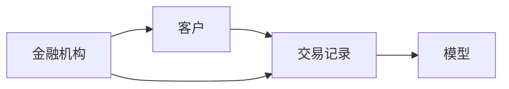
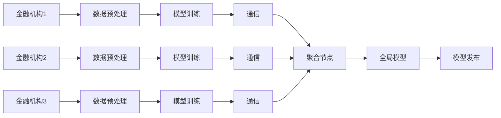

                 

# 联邦学习在金融机构间数据协作中的应用

> **关键词**: 联邦学习, 数据协作, 金融机构, 隐私保护, 分布式计算, 人工智能, 金融科技

> **摘要**: 本文探讨了联邦学习在金融机构间数据协作中的应用，分析了其核心概念、技术原理、系统架构及实际案例，重点阐述了联邦学习如何在保护数据隐私的前提下实现跨机构的数据协作与模型训练。文章还讨论了联邦学习在金融领域的优势、挑战及未来发展方向。

---

# 第一部分: 联邦学习的背景与概念

## 第1章: 联邦学习的背景与概念

### 1.1 数据协作的背景与问题

#### 1.1.1 金融机构间数据协作的背景

在金融行业，数据是核心资产。然而，金融机构之间的数据协作面临以下问题：

- **数据隐私**：金融机构的数据往往包含敏感信息（如客户隐私、交易记录等），直接共享数据会带来合规风险。
- **数据孤岛**：不同金融机构的数据分散在各自的系统中，难以形成合力。
- **数据安全**：传统数据共享方式可能面临数据泄露的风险。

#### 1.1.2 联邦学习的定义与核心概念

联邦学习（Federated Learning）是一种分布式机器学习技术，允许多个参与方在不共享原始数据的前提下，协作训练模型。其核心概念包括：

- **本地数据**：每个参与方只使用自己的本地数据。
- **模型更新**：通过加密通信，各方仅共享模型更新信息，而非原始数据。
- **隐私保护**：通过隐私计算技术（如加密、差分隐私等）确保数据隐私。

#### 1.1.3 联邦学习的优势与特点

与传统数据共享方式相比，联邦学习的优势包括：

- **数据隐私**：无需共享原始数据，保护客户隐私。
- **数据可用性**：在不共享数据的情况下，利用多方数据提升模型性能。
- **灵活性**：支持多种机器学习任务（如分类、回归等）。

### 1.2 联邦学习与传统数据协作方式的区别

#### 1.2.1 传统数据协作方式的局限性

- **数据泄露风险**：直接共享数据可能引发数据泄露。
- **合规性问题**：许多法律法规（如GDPR）禁止未经加密的数据共享。
- **效率低下**：数据共享流程复杂，耗时较长。

#### 1.2.2 联邦学习的特点

- **分布式计算**：模型训练在多个节点上进行，数据无需集中。
- **加密通信**：通过加密技术确保模型更新的安全性。
- **异构环境**：支持不同机构的数据格式和模型架构。

### 1.3 联邦学习在金融领域的应用前景

#### 1.3.1 金融机构间数据协作的需求

金融机构需要跨机构协作的场景包括：

- **信用评估**：通过多家机构的数据提升信用评分模型的准确性。
- **反欺诈**：利用多方数据识别跨机构的欺诈行为。
- **风险管理**：通过多方数据协作优化风险控制模型。

#### 1.3.2 联邦学习在金融领域的潜在应用

- **联合风控模型**：多家金融机构协作训练风控模型，提升模型泛化能力。
- **客户画像构建**：通过多方数据协作构建更全面的客户画像。
- **实时欺诈检测**：利用联邦学习技术实现实时的欺诈检测。

#### 1.3.3 联邦学习对金融机构的价值

- **提升模型性能**：通过多方数据协作，模型性能更优。
- **降低合规风险**：无需共享原始数据，合规性得到保障。
- **提升效率**：通过分布式计算提升数据处理效率。

### 1.4 本章小结

本章介绍了联邦学习的背景、定义、核心概念及其在金融领域的应用前景。通过对比传统数据协作方式，突出了联邦学习在保护数据隐私的同时实现数据协作的优势。

---

# 第二部分: 联邦学习的核心概念与技术原理

## 第2章: 联邦学习的核心概念

### 2.1 联邦学习的定义与核心要素

#### 2.1.1 联邦学习的定义

联邦学习是一种分布式机器学习技术，允许多个参与方在不共享原始数据的前提下，协作训练模型。

#### 2.1.2 联邦学习的核心要素

- **参与方**：数据所有者（如金融机构）。
- **模型**：需要在本地数据上进行训练的模型。
- **通信协议**：参与方之间的通信机制。
- **加密技术**：确保数据隐私和模型安全。

#### 2.1.3 联邦学习的分类与场景

- **横向联邦学习**：参与方的数据样本不同，特征相同。
- **纵向联邦学习**：参与方的数据样本相同，特征不同。
- **混合联邦学习**：结合横向和纵向的特征。

### 2.2 联邦学习的关键技术

#### 2.2.1 数据加密与隐私保护

- **同态加密**：允许在加密数据上进行计算，结果解密后与直接计算结果一致。
- **差分隐私**：通过添加噪声保护数据隐私。

#### 2.2.2 分布式计算与通信协议

- **点对点通信**：参与方之间直接通信。
- **代理节点**：通过代理节点汇总各方模型更新。

#### 2.2.3 联邦学习的算法框架

- **基于梯度的联邦学习**：通过交换梯度信息更新模型。
- **基于模型参数的联邦学习**：通过交换模型参数更新信息。

### 2.3 联邦学习的实体关系与概念结构

#### 2.3.1 实体关系图（ER图）

#### 2.3.2 概念结构与核心要素的对比表格

| 核心要素 | 定义 | 示例 |
|----------|------|------|
| 参与方    | 数据所有者 | 金融机构 |
| 模型      | 需要训练的模型 | 分类模型 |
| 数据      | 参与方本地数据 | 客户交易记录 |
| 通信协议  | 参与方之间的通信机制 | HTTPS |

### 2.4 本章小结

本章详细介绍了联邦学习的核心概念，包括定义、核心要素、关键技术及其在金融领域的应用场景。

---

## 第3章: 联邦学习的算法原理

### 3.1 联邦学习的算法流程

#### 3.1.1 联邦学习的基本流程

1. **初始化**：设定初始模型参数。
2. **本地训练**：各参与方在本地数据上训练模型，计算梯度或更新参数。
3. **通信**：通过加密通信将模型更新信息传递给聚合节点。
4. **聚合**：聚合节点汇总各方模型更新，生成新的全局模型。
5. **迭代**：重复本地训练和通信过程，直到模型收敛。

#### 3.1.2 联邦学习的通信机制

- **同步联邦学习**：所有参与方同时更新模型，并在每个回合结束时同步更新。
- **异步联邦学习**：参与方可以异步更新模型，通信延迟较低。

#### 3.1.3 联邦学习的同步与异步模式

- **同步模式**：所有参与方在每个回合同时更新模型。
- **异步模式**：参与方可以异步更新模型，减少通信延迟。

### 3.2 联邦学习的数学模型与公式

#### 3.2.1 联邦学习的优化目标

$$ \text{目标函数} = \sum_{i=1}^{n} f_i(w) $$

其中，$w$ 是模型参数，$f_i(w)$ 是第 $i$ 个参与方的损失函数。

#### 3.2.2 联邦学习的更新规则

$$ w_{t+1} = w_t - \eta \sum_{i=1}^{n} \nabla f_i(w_t) $$

其中，$\eta$ 是学习率，$\nabla f_i(w_t)$ 是第 $i$ 个参与方的梯度。

#### 3.2.3 联邦学习的收敛性分析

通过优化理论，可以证明在满足一定条件下，联邦学习算法能够收敛到全局最优解。

### 3.3 联邦学习的算法流程图

### 3.4 本章小结

本章详细讲解了联邦学习的算法流程、数学模型和通信机制，为后续章节的系统设计和项目实现奠定了基础。

---

## 第4章: 联邦学习的算法实现与流程图

### 4.1 联邦学习的算法实现步骤

#### 4.1.1 数据准备与预处理

- **数据清洗**：处理缺失值、异常值。
- **数据格式化**：确保各参与方数据格式一致。

#### 4.1.2 模型初始化与分布

- **模型初始化**：设定初始模型参数。
- **模型分布**：将模型分发给各参与方。

#### 4.1.3 联邦训练过程

- **本地训练**：各参与方在本地数据上训练模型，计算梯度或更新参数。
- **通信**：通过加密通信将模型更新信息传递给聚合节点。
- **聚合**：聚合节点汇总各方模型更新，生成新的全局模型。

#### 4.1.4 模型聚合与更新

- **模型聚合**：通过加权平均等方式聚合各方模型更新。
- **模型更新**：更新全局模型参数。

### 4.2 联邦学习的算法流程图（Mermaid）

### 4.3 本章小结

本章通过详细步骤和流程图，展示了联邦学习的算法实现过程，为实际项目提供了参考。

---

# 第三部分: 联邦学习在金融机构间的应用与挑战

## 第5章: 联邦学习在金融机构间的应用

### 5.1 联邦学习在金融机构间的应用场景

#### 5.1.1 联合风控模型

- **目标**：通过多家金融机构的数据协作，训练更准确的风控模型。
- **实现**：各机构在本地数据上训练模型，通过联邦学习聚合各方模型更新。

#### 5.1.2 联合客户画像

- **目标**：通过多方数据协作，构建更全面的客户画像。
- **实现**：各机构在本地数据上提取特征，通过联邦学习聚合特征向量。

#### 5.1.3 联合欺诈检测

- **目标**：通过多方数据协作，提升欺诈检测的准确性。
- **实现**：各机构在本地数据上训练欺诈检测模型，通过联邦学习聚合模型更新。

### 5.2 联邦学习在金融机构间的系统架构

#### 5.2.1 系统功能设计

- **数据预处理**：清洗、格式化数据。
- **模型训练**：本地训练、通信、聚合。
- **模型管理**：模型版本管理、更新发布。

#### 5.2.2 系统架构设计（Mermaid图）

#### 5.2.3 系统接口设计

- **数据接口**：数据预处理、数据上传。
- **模型接口**：模型训练、模型更新、模型查询。

#### 5.2.4 系统交互流程（Mermaid图）

### 5.3 本章小结

本章详细介绍了联邦学习在金融机构间的应用场景、系统架构设计及交互流程，为实际项目提供了参考。

---

## 第6章: 联邦学习的安全性与法律合规

### 6.1 联邦学习的安全性

#### 6.1.1 数据隐私保护

- **同态加密**：允许在加密数据上进行计算，结果解密后与直接计算结果一致。
- **差分隐私**：通过添加噪声保护数据隐私。

#### 6.1.2 模型安全保护

- **模型隐私保护**：通过加密技术保护模型参数。
- **模型鲁棒性**：防止模型被攻击者利用。

#### 6.1.3 安全威胁分析

- **数据泄露**：防止模型更新信息被恶意利用。
- **拒绝服务攻击**：防止部分参与方恶意干扰通信。

### 6.2 联邦学习的法律合规

#### 6.2.1 数据隐私法规

- **GDPR**：《通用数据保护条例》（欧盟）。
- **CCPA**：《加利福尼亚消费者隐私法案》。

#### 6.2.2 合规性要求

- **数据使用授权**：确保数据使用符合法律法规。
- **数据最小化**：仅收集实现目的所需的最小数据。

#### 6.2.3 联邦学习的合规性挑战

- **数据跨境传输**：跨国金融机构需要遵守不同国家的隐私法规。
- **数据访问控制**：确保只有授权人员可以访问敏感数据。

### 6.3 本章小结

本章分析了联邦学习在安全性与法律合规方面的要求和挑战，为金融机构的应用提供了合规建议。

---

## 第7章: 联邦学习的最佳实践与未来展望

### 7.1 联邦学习的最佳实践

#### 7.1.1 数据预处理与清洗

- **数据格式统一**：确保各参与方数据格式一致。
- **数据去重**：避免重复数据影响模型训练。

#### 7.1.2 模型选择与调优

- **选择合适的模型架构**：根据任务需求选择模型。
- **调优通信频率**：平衡通信开销与模型收敛速度。

#### 7.1.3 安全性保障

- **加密通信**：确保模型更新信息传输安全。
- **访问控制**：限制只有授权人员可以访问模型更新。

### 7.2 联邦学习的未来展望

#### 7.2.1 技术发展

- **隐私计算技术**：如同态加密、零知识证明等。
- **分布式计算优化**：提升联邦学习的效率和性能。

#### 7.2.2 应用场景扩展

- **跨行业协作**：联邦学习不仅限于金融行业，还可以应用于医疗、教育等领域。
- **实时协作**：提升联邦学习的实时性，支持实时模型更新。

#### 7.2.3 挑战与解决方案

- **模型收敛速度**：通过优化算法提升模型收敛速度。
- **数据异构性**：通过数据预处理和模型架构调整应对数据异构性。

### 7.3 本章小结

本章总结了联邦学习的最佳实践，并展望了未来的技术发展和应用场景，为读者提供了进一步研究的方向。

---

# 第四部分: 总结与展望

## 第8章: 总结与展望

### 8.1 联邦学习的应用现状

- **技术成熟度**：联邦学习技术已趋于成熟，但在大规模应用中仍面临挑战。
- **行业应用**：金融、医疗等领域已开始尝试应用联邦学习技术。

### 8.2 未来发展趋势

- **技术融合**：联邦学习将与隐私计算、区块链等技术深度融合。
- **智能化协作**：通过人工智能优化联邦学习的协作过程。
- **标准化建设**：行业标准的制定和推广将加速联邦学习的普及。

### 8.3 挑战与解决方案

- **数据隐私**：通过技术创新进一步提升数据隐私保护能力。
- **计算效率**：通过优化算法和系统架构提升计算效率。
- **合规性**：制定符合法律法规的联邦学习应用规范。

### 8.4 本章小结

本章总结了联邦学习的现状，分析了未来的发展趋势和挑战，为读者提供了进一步研究的方向。

---

# 参考文献

（此处可以列出相关的参考文献，如书籍、论文、技术报告等。）

---

通过以上目录和内容，您可以开始撰写完整的文章。每一章的内容都需要详细展开，确保逻辑清晰、内容丰富。

