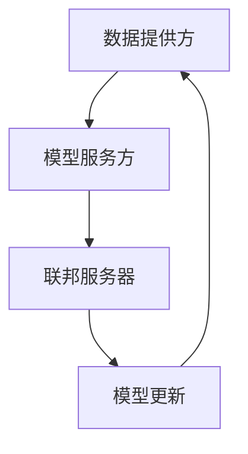
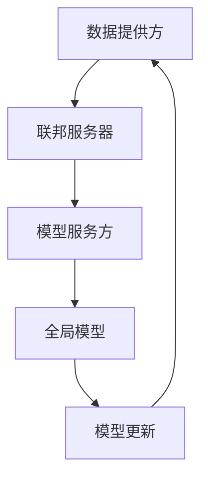

                 


# 联邦学习：保护隐私的分布式AI Agent训练

## 关键词：
联邦学习、数据隐私、分布式AI、机器学习、数据协作

## 摘要：
联邦学习是一种在保护数据隐私的前提下，实现分布式人工智能模型训练的技术。本文将从联邦学习的背景出发，详细阐述其核心概念、算法原理、系统设计与项目实战，帮助读者全面理解如何在保护隐私的前提下，高效地进行分布式AI模型训练。

---

# 第一部分: 联邦学习的背景与核心概念

## 第1章: 联邦学习的背景与问题背景

### 1.1 数据隐私与分布式AI的挑战

#### 1.1.1 数据隐私问题的现状
在当今数字时代，数据成为最重要的资源之一。然而，数据的集中存储和共享也带来了巨大的隐私风险。企业和机构在收集和使用数据时，必须遵守严格的隐私保护法规，如GDPR（通用数据保护法规）和CCPA（加利福尼亚消费者隐私法案）。数据泄露事件频发，使得数据隐私保护成为一项重要的技术挑战。

#### 1.1.2 分布式AI的需求与挑战
传统的机器学习模型训练需要集中收集和处理数据，这不仅违反了数据隐私保护的要求，还可能导致数据孤岛问题。随着人工智能技术的快速发展，分布式AI的需求日益增长。分布式AI的目标是让多个机构或个人在不共享原始数据的情况下，协作训练出一个高性能的AI模型。

#### 1.1.3 联邦学习的提出与目标
联邦学习（Federated Learning，FL）作为一种新兴的技术，旨在解决数据隐私保护与分布式AI训练之间的矛盾。其核心思想是：在保护数据隐私的前提下，通过多个分布式节点协作训练模型，同时避免原始数据的集中存储和传输。

---

### 1.2 联邦学习的核心问题描述

#### 1.2.1 数据孤岛问题
数据孤岛指的是数据分布在不同的机构或系统中，由于数据格式、隐私政策或技术限制，导致数据无法有效共享和利用。例如，在医疗领域，不同医院的数据可能无法共享，但可以通过联邦学习技术在不共享数据的情况下协作训练疾病预测模型。

#### 1.2.2 数据隐私保护的重要性
数据隐私保护是联邦学习的核心目标之一。通过联邦学习，数据提供方可以在本地保存数据，仅上传模型更新信息，从而避免原始数据的泄露风险。

#### 1.2.3 联邦学习的目标与边界
联邦学习的目标是在保护数据隐私的前提下，实现分布式AI模型的高效训练。其边界包括数据不共享、模型更新的隐私保护、通信安全等。

---

### 1.3 联邦学习的背景与应用场景

#### 1.3.1 医疗领域中的数据隐私保护
在医疗领域，患者数据的高度敏感性使得数据共享变得困难。联邦学习可以通过在各个医院或诊所之间协作训练模型，同时保护患者隐私，实现疾病预测、药物研发等目标。

#### 1.3.2 金融领域的数据共享需求
在金融领域，不同机构（如银行、保险公司）之间需要协作训练风险评估模型，但数据隐私问题使得直接共享数据变得不可行。联邦学习可以在保护数据隐私的前提下，实现模型的联合训练。

#### 1.3.3 联邦学习的其他潜在应用场景
除了医疗和金融，联邦学习还可以应用于推荐系统、广告投放、智能交通等领域。例如，在推荐系统中，多个平台可以通过联邦学习协作训练推荐模型，同时保护用户数据隐私。

---

## 第2章: 联邦学习的核心概念与联系

### 2.1 联邦学习的定义与核心要素

#### 2.1.1 联邦学习的定义
联邦学习是一种分布式机器学习技术，允许多个数据提供方在不共享原始数据的情况下，协作训练一个全局模型。数据提供方可以在本地设备或服务器上运行训练任务，并仅上传模型更新信息，从而保护数据隐私。

#### 2.1.2 联邦学习的核心要素
- **数据提供方**：数据提供方是拥有数据的机构或个人，负责在本地运行训练任务。
- **模型服务方**：模型服务方负责协调多个数据提供方的模型更新，并生成全局模型。
- **联邦服务器**：联邦服务器是模型服务方的实现载体，负责接收和聚合各个数据提供方的模型更新。

#### 2.1.3 联邦学习的体系结构
联邦学习的体系结构通常包括以下组件：
- 数据提供方：本地数据和模型训练。
- 模型服务方：全局模型的聚合与分发。
- 联邦服务器：支持数据提供方和模型服务方之间的通信与数据交换。

---

### 2.2 联邦学习与相关技术的对比

#### 2.2.1 联邦学习与传统机器学习的对比
- **传统机器学习**：集中式数据训练，数据需要集中存储和处理。
- **联邦学习**：分布式训练，数据不共享，仅传输模型更新。

#### 2.2.2 联邦学习与数据共享技术的对比
- **数据共享**：直接共享原始数据，存在隐私风险。
- **联邦学习**：仅共享模型更新，保护数据隐私。

#### 2.2.3 联邦学习与区块链技术的结合
区块链技术可以为联邦学习提供数据可信性和透明性。通过区块链，可以记录数据提供方的贡献，确保数据来源的可信性，同时防止数据篡改。

---

### 2.3 联邦学习的核心概念属性特征对比表
| 概念       | 属性特征                                                                 |
|------------|--------------------------------------------------------------------------|
| 数据隐私   | 数据不直接共享，仅传输模型更新信息                                       |
| 分布式计算 | 多方协作训练，避免数据集中存储                                           |
| 模型更新   | 梯度更新或参数更新，而非直接传输数据                                       |
| 安全性      | 数据加密与隐私保护，防止数据泄露                                         |

---

### 2.4 联邦学习的ER实体关系图


---

## 第3章: 联邦学习的算法原理

### 3.1 联邦学习的基本原理

#### 3.1.1 联邦学习的数学模型
联邦学习的目标是通过多个数据提供方协作训练一个全局模型。假设全局模型为参数$\theta$，每个数据提供方$i$拥有数据集$D_i$，其模型更新为$\Delta\theta_i$。全局模型的更新为：

$$
\theta_{\text{new}} = \theta_{\text{old}} + \sum_{i=1}^n \Delta\theta_i
$$

其中，$n$是数据提供方的数量。

#### 3.1.2 联邦学习的优化目标
联邦学习的优化目标是最大化全局模型的性能，同时最小化数据隐私泄露的风险。这通常通过优化目标函数来实现：

$$
\min_{\theta} \sum_{i=1}^n \mathcal{L}_i(\theta)
$$

其中，$\mathcal{L}_i$是数据提供方$i$的损失函数。

---

### 3.2 联邦学习的横向与纵向算法

#### 3.2.1 横向联邦学习
横向联邦学习适用于数据提供方之间特征相同但样本不重叠的场景。例如，多个医院协作训练一个疾病预测模型，每个医院的数据集包含相同的特征，但样本不重叠。

#### 3.2.2 纵向联邦学习
纵向联邦学习适用于数据提供方之间特征部分重叠的场景。例如，多个金融机构协作训练一个信用评分模型，每个机构的数据集包含部分相同的特征。

---

### 3.3 联邦学习的通信与聚合机制

#### 3.3.1 梯度聚合方法
联邦学习中，数据提供方计算本地模型的梯度，并将梯度上传到联邦服务器。联邦服务器将所有数据提供方的梯度进行聚合，生成全局模型的更新。

$$
\Delta\theta_{\text{global}} = \sum_{i=1}^n \Delta\theta_i
$$

---

### 3.4 联邦学习的隐私保护机制

#### 3.4.1 数据加密与匿名化
数据提供方可以通过加密技术（如同态加密）对本地数据进行加密，确保数据在传输过程中的安全性。

#### 3.4.2 差分隐私
差分隐私是一种通过添加噪声来保护数据隐私的技术。在联邦学习中，数据提供方可以在本地计算的梯度中添加噪声，确保全局模型的更新无法反推出单个样本的信息。

---

## 第4章: 联邦学习的系统设计

### 4.1 系统架构设计

#### 4.1.1 系统功能模块
- **数据提供方模块**：本地训练模型，生成模型更新。
- **联邦服务器模块**：接收并聚合模型更新，生成全局模型。
- **模型服务方模块**：协调数据提供方和联邦服务器，管理模型训练过程。

#### 4.1.2 系统架构图


---

### 4.2 系统交互流程

#### 4.2.1 初始化阶段
1. 数据提供方向联邦服务器注册。
2. 联邦服务器分配模型参数给各个数据提供方。

#### 4.2.2 训练阶段
1. 数据提供方在本地数据集上训练模型，生成梯度更新。
2. 数据提供方将梯度更新上传到联邦服务器。
3. 联邦服务器聚合所有数据提供方的梯度更新，生成新的全局模型。

#### 4.2.3 结束阶段
1. 联邦服务器将全局模型分发给数据提供方。
2. 数据提供方在本地更新模型，开始新一轮训练。

---

## 第5章: 联邦学习的项目实战

### 5.1 项目背景与目标
假设我们有一个医疗数据集，分布在多个医院，每个医院的数据集包含患者的医疗记录和诊断结果。我们的目标是通过联邦学习技术，在不共享患者数据的前提下，协作训练一个疾病预测模型。

---

### 5.2 环境配置

#### 5.2.1 安装依赖
```bash
pip install fed学习库 # 假设我们使用一个联邦学习框架
```

---

### 5.3 系统核心实现

#### 5.3.1 数据提供方实现
```python
class 数据提供方:
    def __init__(self, 数据集):
        self.数据集 = 数据集
        self.模型 = 初始化模型()
    
    def 训练模型(self):
        # 在本地数据集上训练模型，生成梯度更新
        return self.模型训练()
```

#### 5.3.2 联邦服务器实现
```python
class 联邦服务器:
    def __init__(self, 初始模型):
        self.模型 = 初始模型
        self.数据提供方列表 = []
    
    def 接收更新(self, 更新):
        self.模型更新 += 更新
    
    def 聚合模型(self):
        # 聚合所有数据提供方的模型更新，生成新的全局模型
        return self.模型更新
```

---

### 5.4 测试与优化

#### 5.4.1 模型性能测试
在每个训练轮次结束后，测试全局模型的性能，如准确率、召回率等。

#### 5.4.2 模型收敛速度优化
通过调整通信频率、更新步长等参数，优化模型的收敛速度和最终性能。

---

## 第6章: 总结与展望

### 6.1 总结
联邦学习是一种在保护数据隐私的前提下，实现分布式AI模型训练的技术。本文详细介绍了联邦学习的背景、核心概念、算法原理、系统设计和项目实战，帮助读者全面理解联邦学习的核心思想和实现方法。

---

### 6.2 最佳实践 Tips

#### 6.2.1 数据隐私保护
- 在联邦学习中，数据加密和差分隐私是保护数据隐私的重要手段。
- 数据提供方应确保本地数据的安全性，避免数据泄露。

#### 6.2.2 系统设计建议
- 系统设计应考虑数据提供方的数量和数据规模，选择合适的通信协议和聚合算法。
- 系统应具备良好的扩展性，支持动态增加或减少数据提供方。

#### 6.2.3 模型优化建议
- 通过调整模型结构和优化算法，提高模型的训练效率和最终性能。
- 定期更新模型，确保模型的适应性和准确性。

---

### 6.3 注意事项

- 联邦学习的实现需要考虑数据提供方的协作意愿和数据质量。
- 模型更新的通信成本可能成为性能瓶颈，需要优化通信协议和数据传输方式。
- 数据隐私保护是联邦学习的核心目标，必须严格遵守相关法律法规。

---

### 6.4 拓展阅读

- 《Differential Privacy: A Survey of the State-of-the-Art》
- 《Federated Learning: Challenges, Methods, and Future Directions》
- 《Blockchain and Federated Learning: A New Paradigm for Data Privacy》

---

通过本文的介绍，读者可以全面理解联邦学习的核心思想和实现方法，同时掌握如何在实际项目中应用联邦学习技术。希望本文能为分布式AI和数据隐私保护领域的研究和实践提供有价值的参考。

