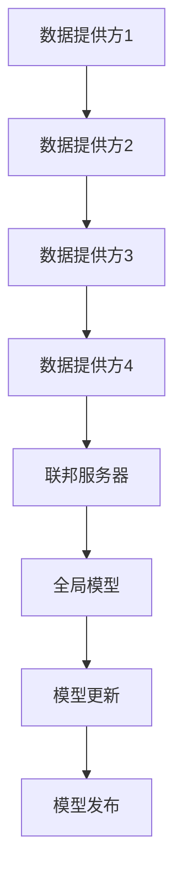
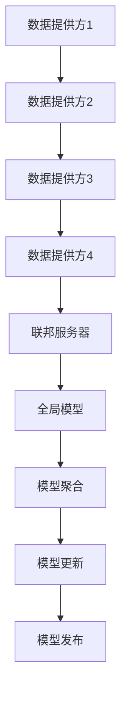
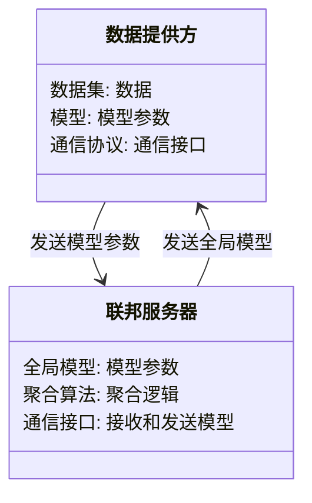
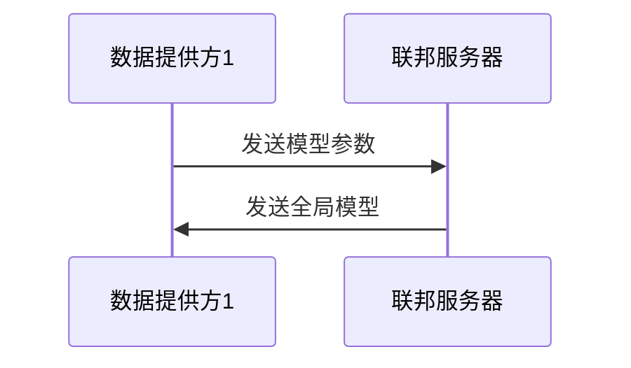

                 


# 联邦学习：在保护隐私的前提下训练AI Agent

## 关键词：联邦学习, 数据隐私, 分布式机器学习, AI Agent, 联邦平均算法

## 摘要：联邦学习是一种在保护数据隐私的前提下，通过分布式计算协同训练AI模型的技术。本文详细介绍了联邦学习的背景、核心概念、算法原理、系统架构设计以及实际项目案例，帮助读者全面理解如何在保护隐私的同时高效训练AI Agent。

---

# 第一部分: 联邦学习的背景与核心概念

## 第1章: 联邦学习的背景与问题背景

### 1.1 联邦学习的起源与现状

#### 1.1.1 从集中式机器学习到分布式学习的演进
传统的机器学习方法通常依赖于集中式数据，这导致了数据隐私和数据孤岛的问题。随着数据量的爆炸式增长，各个机构的数据逐渐分散，难以集中共享。联邦学习作为一种分布式机器学习技术，提供了在不共享原始数据的情况下协同训练模型的解决方案。

#### 1.1.2 数据隐私保护的迫切需求
数据隐私问题日益严重，尤其是在医疗、金融等领域，数据泄露可能导致严重的经济损失和法律风险。联邦学习通过局部模型训练和模型参数聚合的方式，避免了原始数据的共享，有效保护了数据隐私。

#### 1.1.3 联邦学习的定义与特点
联邦学习（Federated Learning）是在多个数据拥有者之间协同训练模型的技术，核心特点包括数据本地训练、模型参数聚合、隐私保护和分布式计算。

### 1.2 联邦学习的核心问题背景

#### 1.2.1 数据孤岛问题
数据孤岛指的是数据分散在不同的机构或系统中，彼此无法有效共享和利用。联邦学习通过在各个数据源本地进行模型训练，解决了数据孤岛问题。

#### 1.2.2 数据隐私保护的挑战
数据隐私保护是联邦学习的核心目标之一。如何在不共享原始数据的情况下，协同训练出高性能的模型，是联邦学习需要解决的关键问题。

#### 1.2.3 联邦学习的解决思路
通过在各个数据源本地训练模型，并将模型参数上传到中央服务器进行聚合，最终生成全局模型。这种方式避免了原始数据的共享，同时充分利用了多方数据进行模型优化。

### 1.3 联邦学习的基本概念与核心要素

#### 1.3.1 联邦学习的定义
联邦学习是一种分布式机器学习技术，允许多个数据拥有者在不共享原始数据的情况下协同训练模型。

#### 1.3.2 联邦学习的核心要素
- **数据本地性**：模型训练在数据拥有者本地进行。
- **模型参数聚合**：通过中央服务器聚合各个参与方的模型参数。
- **隐私保护**：确保数据隐私不被泄露。
- **通信协议**：定义数据传输和模型更新的规则。

#### 1.3.3 联邦学习的边界与外延
联邦学习主要关注模型的分布式训练，但并不直接涉及数据存储和管理。其外延包括数据预处理、模型评估和部署等环节。

### 1.4 联邦学习的优势与应用场景

#### 1.4.1 联邦学习的优势
- **隐私保护**：避免原始数据泄露。
- **数据利用**：充分利用分散数据进行模型优化。
- **灵活性**：适用于不同数据源和数据格式的场景。

#### 1.4.2 联邦学习的主要应用场景
- **医疗领域**：保护患者隐私，协同训练疾病诊断模型。
- **金融领域**：联合多家金融机构训练风险评估模型。
- **推荐系统**：基于用户行为数据，协同训练个性化推荐模型。

#### 1.4.3 联邦学习的未来发展趋势
随着技术的成熟，联邦学习将在更多领域得到应用，同时在模型性能、通信效率和隐私保护方面进一步优化。

### 1.5 本章小结
本章介绍了联邦学习的背景、核心概念和优势，为后续内容奠定了基础。

---

# 第二部分: 联邦学习的核心概念与联系

## 第2章: 联邦学习的核心概念与原理

### 2.1 联邦学习的核心原理

#### 2.1.1 联邦学习的通信协议
联邦学习需要定义清晰的通信协议，包括数据传输格式、模型更新频率和同步机制。常用的通信协议包括基于HTTP的请求响应模式和基于WebSocket的实时通信模式。

#### 2.1.2 联邦学习的数据安全机制
数据安全机制是联邦学习的核心，通常包括数据加密传输、模型参数签名和访问控制等技术。通过这些措施，确保数据在传输和存储过程中的安全性。

#### 2.1.3 联邦学习的隐私保护机制
隐私保护机制包括局部模型训练、差分隐私和同态加密等技术。这些技术可以有效防止模型参数泄露和数据重构攻击。

### 2.2 联邦学习的核心概念对比

#### 2.2.1 联邦学习与集中式学习的对比
| 对比维度 | 联邦学习 | 集中式学习 |
|----------|----------|------------|
| 数据存储 | 分散在多个数据源 | 集中在一个数据源 |
| 数据共享 | 不共享原始数据 | 共享原始数据 |
| 隐私保护 | 高 | 低 |

#### 2.2.2 联邦学习与分布式计算的对比
| 对比维度 | 联邦学习 | 分布式计算 |
|----------|----------|------------|
| 计算目标 | 协同训练模型 | 分布式任务处理 |
| 数据共享 | 低 | 高 |
| 隐私保护 | 高 | 中 |

#### 2.2.3 联邦学习与边缘计算的对比
| 对比维度 | 联邦学习 | 边缘计算 |
|----------|----------|------------|
| 应用场景 | AI模型训练 | 数据处理与计算 |
| 数据共享 | 低 | 中 |
| 隐私保护 | 高 | 中 |

### 2.3 联邦学习的ER实体关系图



### 2.4 联邦学习的流程图



### 2.5 本章小结
本章详细讲解了联邦学习的核心原理和相关概念，通过对比分析和图表展示了其独特性和实现机制。

---

# 第三部分: 联邦学习的算法原理

## 第3章: 联邦学习的核心算法

### 3.1 联邦平均（FedAvg）算法

#### 3.1.1 联邦平均算法的数学模型
$$ \text{模型参数更新公式} $$

$$ w_{\text{new}} = w_{\text{old}} + \sum_{i=1}^{n} (w_i - w_{\text{old}}) \times \alpha_i $$

其中，$w_{\text{new}}$ 是更新后的模型参数，$w_{\text{old}}$ 是旧模型参数，$w_i$ 是第 $i$ 个数据提供方的模型参数，$\alpha_i$ 是对应的权重系数。

#### 3.1.2 联邦平均算法的代码实现
以下是使用Python实现的联邦平均算法示例：

```python
import numpy as np

def fed_avg(local_weights, global_weight, num_clients):
    # 初始化全局模型参数
    global_weights = global_weight.copy()
    # 计算每个客户端的权重系数
    total_clients = len(local_weights)
    for i in range(total_clients):
        # 计算客户端权重
        client_weight = local_weights[i]
        # 更新全局模型参数
        global_weights += client_weight * (1 / total_clients)
    return global_weights
```

#### 3.1.3 联邦平均算法的流程图


### 3.2 联邦学习的数学公式

#### 3.2.1 模型训练公式
$$ \text{损失函数} = \frac{1}{n} \sum_{i=1}^{n} \text{loss}_i(w) $$

其中，$w$ 是模型参数，$\text{loss}_i(w)$ 是第 $i$ 个数据提供方的损失函数。

#### 3.2.2 模型更新公式
$$ w_{\text{new}} = w_{\text{old}} - \eta \nabla_w \text{损失函数} $$

其中，$\eta$ 是学习率，$\nabla_w$ 是损失函数对模型参数的梯度。

### 3.3 本章小结
本章详细讲解了联邦学习的核心算法——联邦平均算法，包括其数学模型和代码实现，帮助读者理解联邦学习的基本原理。

---

# 第四部分: 联邦学习的系统分析与架构设计

## 第4章: 联邦学习的系统分析与架构设计

### 4.1 联邦学习的系统分析

#### 4.1.1 问题场景介绍
以医疗领域为例，假设有多家医院希望联合训练一个疾病诊断模型，但又不希望共享患者数据。联邦学习可以在这个场景中发挥作用。

#### 4.1.2 系统介绍
设计一个典型的联邦学习系统，包括数据提供方、联邦服务器和全局模型三个主要部分。

### 4.2 联邦学习的系统架构设计

#### 4.2.1 领域模型（类图）



#### 4.2.2 系统架构图


### 4.3 联邦学习的接口设计

#### 4.3.1 数据提供方接口
- `get_model_weights()`: 获取当前模型参数
- `update_model()`: 更新本地模型参数
- `send_model_to_server()`: 将模型参数发送到联邦服务器

#### 4.3.2 联邦服务器接口
- `receive_models()`: 接收各个数据提供方的模型参数
- `aggregate_models()`: 聚合模型参数
- `send_global_model()`: 发送全局模型到数据提供方

### 4.4 联邦学习的交互过程

#### 4.4.1 序列图



### 4.5 本章小结
本章通过系统分析和架构设计，展示了联邦学习的实际应用场景和实现机制。

---

# 第五部分: 联邦学习的项目实战

## 第5章: 联邦学习的项目实战

### 5.1 项目实战介绍

#### 5.1.1 环境配置
- 安装必要的Python库，如TensorFlow、Keras、numpy等。
- 配置分布式环境，如使用多台服务器或本地虚拟机。

#### 5.1.2 数据准备
- 数据分为多个数据源，每个数据源包含部分训练数据。
- 数据格式统一，方便后续处理和模型训练。

### 5.2 系统核心实现

#### 5.2.1 模型实现
- 定义模型结构，如多层感知机、卷积神经网络等。
- 编写模型训练函数，定义损失函数和优化器。

#### 5.2.2 联邦学习实现
- 实现数据提供方和联邦服务器的通信接口。
- 实现模型参数聚合算法，如联邦平均算法。

### 5.3 代码实现与解读

#### 5.3.1 数据提供方代码

```python
import numpy as np
import tensorflow as tf

# 数据提供方1的本地数据和模型
class DataProvider:
    def __init__(self, data, label):
        self.data = data
        self.label = label
        self.model = self.build_model()
    
    def build_model(self):
        model = tf.keras.Sequential([
            tf.keras.layers.Dense(128, activation='relu'),
            tf.keras.layers.Dense(10, activation='softmax')
        ])
        return model

# 加载本地数据
data_provider1 = DataProvider(x_train1, y_train1)
```

#### 5.3.2 联邦服务器代码

```python
import numpy as np
import tensorflow as tf

# 联邦服务器的全局模型
class FederatedServer:
    def __init__(self):
        self.global_model = self.build_model()
    
    def build_model(self):
        model = tf.keras.Sequential([
            tf.keras.layers.Dense(128, activation='relu'),
            tf.keras.layers.Dense(10, activation='softmax')
        ])
        return model

# 初始化联邦服务器
server = FederatedServer()
```

#### 5.3.3 模型聚合代码

```python
def fed_avg(local_weights, global_weights, num_clients):
    # 计算平均权重
    total_clients = len(local_weights)
    for i in range(total_clients):
        global_weights += local_weights[i] * (1 / total_clients)
    return global_weights

# 聚合模型参数
global_weights = server.global_model.get_weights()
local_weights = [provider.model.get_weights() for provider in data_providers]
new_global_weights = fed_avg(local_weights, global_weights, len(data_providers))
server.global_model.set_weights(new_global_weights)
```

### 5.4 实际案例分析与详细讲解

#### 5.4.1 案例选择
以医疗数据分类为例，假设有多家医院希望联合训练一个疾病诊断模型。

#### 5.4.2 训练过程
1. 各数据提供方本地训练模型。
2. 将模型参数发送到联邦服务器。
3. 联邦服务器聚合模型参数，生成全局模型。
4. 全局模型下发到各数据提供方，继续训练。

### 5.5 项目小结
本章通过实际案例展示了联邦学习的实现过程，包括环境配置、数据准备、模型实现和训练过程。

---

# 第六部分: 最佳实践与小结

## 第6章: 小结与注意事项

### 6.1 最佳实践 Tips

#### 6.1.1 数据隐私保护
- 使用加密技术保护数据传输。
- 实施访问控制，确保只有授权方可以参与训练。
- 定期进行安全审计和漏洞扫描。

#### 6.1.2 模型优化策略
- 使用差分隐私技术防止模型参数泄露。
- 采用同态加密技术保护数据隐私。
- 优化通信协议，减少数据传输量。

### 6.2 本章小结
联邦学习是一种在保护数据隐私的前提下，通过分布式计算协同训练AI模型的技术。通过本文的详细介绍，读者可以全面理解联邦学习的核心概念、算法原理和实际应用。

### 6.3 注意事项

#### 6.3.1 数据隐私风险
- 数据在传输和存储过程中可能会被攻击者窃取，需采取加密措施。
- 需防范模型参数被恶意攻击者篡改或泄露。

#### 6.3.2 模型性能限制
- 联邦学习的模型性能可能低于集中式训练，需通过优化算法和增加数据量来提升性能。
- 需关注模型收敛速度和通信效率，减少计算开销。

#### 6.3.3 通信成本
- 数据提供方数量越多，通信成本越高，需优化通信协议和数据压缩技术。
- 需考虑网络延迟和带宽限制，确保模型训练的效率。

### 6.4 拓展阅读
- 《Differential Privacy: A New Privacy Method》
- 《Federated Learning in Practice》
- 《Secure Multi-Party Computation for Machine Learning》

---

# 本文结束

感谢您的阅读！希望本文能帮助您更好地理解联邦学习的核心概念和实际应用。如果需要进一步探讨或有其他问题，欢迎随时联系！

