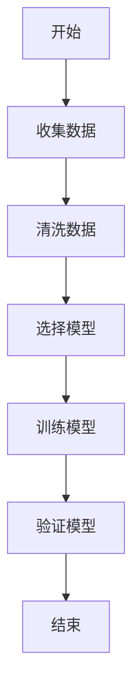
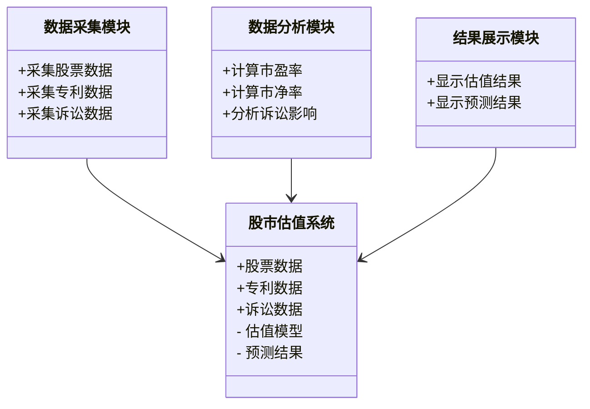
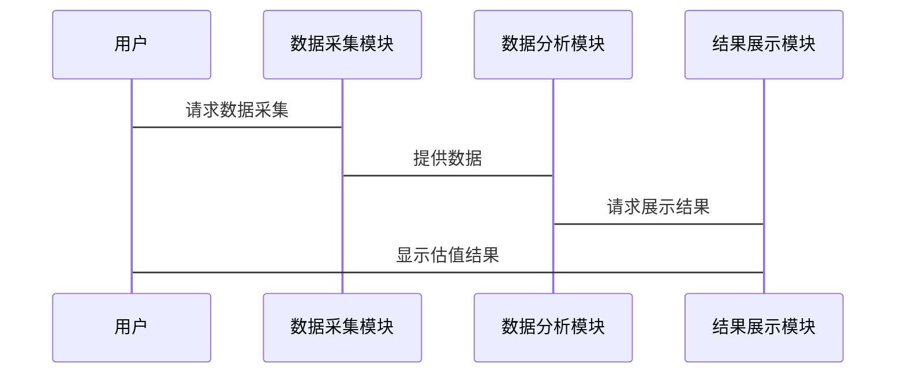

                 


# 股市估值在国际专利诉讼中的应用

## 关键词：股市估值，国际专利诉讼，法律与经济，算法建模，案例分析

## 摘要：股市估值在国际专利诉讼中扮演着重要角色，通过分析公司的财务数据和市场表现，可以评估专利诉讼对公司价值的影响。本文探讨了股市估值的核心方法、国际专利诉讼的法律与经济因素，以及如何利用算法建模进行风险评估和价值分析。结合实际案例，展示了如何将股市估值应用于专利诉讼中的策略制定和结果预测。

---

## 第一部分：背景介绍

### 第1章：股市估值的基本概念

#### 1.1 股市估值的定义与方法

- **1.1.1 股市估值的定义**  
  股市估值是指通过分析公司的财务数据和市场表现，评估其股票的合理价格范围。常用方法包括市盈率（P/E）、市净率（P/B）和股息率等。

- **1.1.2 常见的股市估值方法**  
  - 市盈率（P/E）：市盈率 = 股票价格 / 每股净利润。  
  - 市净率（P/B）：市净率 = 股票价格 / 每股净资产。  
  - 股息率：股息率 = 每股股息 / 股票价格。

- **1.1.3 股市估值的核心要素**  
  包括公司财务状况、行业地位、市场环境和宏观经济因素等。

#### 1.2 国际专利诉讼的背景

- **1.2.1 专利诉讼的定义**  
  专利诉讼是通过法律手段保护专利权的行动，通常涉及专利侵权、无效或许可纠纷。

- **1.2.2 专利诉讼的流程**  
  包括起诉、答辩、证据收集、审理和判决等阶段。

- **1.2.3 专利诉讼的法律依据**  
  主要依据专利法及其相关法规。

#### 1.3 股市估值与国际专利诉讼的关系

- **1.3.1 股市估值对专利诉讼的影响**  
  股市估值帮助投资者和公司评估专利诉讼的风险和潜在损失。

- **1.3.2 专利诉讼对股市估值的影响**  
  专利诉讼可能导致股价波动，影响公司的市场价值。

---

### 第2章：国际专利诉讼的核心概念

#### 2.1 专利诉讼的影响因素

- **2.1.1 专利的价值评估**  
  专利的价值取决于其技术先进性、市场应用和法律保护程度。

- **2.1.2 专利诉讼的经济成本**  
  包括诉讼费用、律师费和可能的赔偿支出。

- **2.1.3 专利诉讼的市场反应**  
  专利诉讼可能导致股价下跌，影响投资者信心。

#### 2.2 股市估值在专利诉讼中的应用

- **2.2.1 股市估值用于评估专利价值**  
  通过分析公司股价和财务数据，评估专利对公司的贡献。

- **2.2.2 股市估值用于预测诉讼结果**  
  股价走势可能反映市场对公司诉讼结果的预期。

---

## 第二部分：核心概念与联系

### 第3章：核心概念对比与ER图

#### 3.1 核心概念对比

| 股市估值 | 国际专利诉讼 |
|----------|----------------|
| 市盈率   | 专利侵权       |
| 市净率   | 专利无效       |
| 股息率   | 专利许可       |

#### 3.2 ER图展示

```mermaid
erd
  entity 股票 (Stock) {
    key: 股票代码 (StockCode)
    股票名称 (StockName)
    股价 (Price)
    市盈率 (P/E)
    市净率 (P/B)
  }
  entity 专利 (Patent) {
    key: 专利编号 (PatentID)
    专利名称 (PatentName)
    申请人 (Applicant)
    申请日期 (FilingDate)
  }
  entity 诉讼 (Litigation) {
    key: 诉讼编号 (LitigationID)
    诉讼类型 (LitigationType)
    涉案专利 (PatentID) --> 股票 (StockCode)
  }
  股票 (Stock) <--> 诉讼 (Litigation): 受影响的股票
```

---

### 第4章：算法原理

#### 4.1 多元回归模型



#### 4.2 Python代码示例

```python
import pandas as pd
from sklearn.linear_model import LinearRegression

# 数据加载与清洗
data = pd.read_csv('patent_litigation.csv')
data = data.dropna()

# 特征选择
features = ['P/E', 'P/B']
target = 'LitigationRisk'

# 模型训练
model = LinearRegression()
model.fit(data[features], data[target])

# 预测与评估
predictions = model.predict(data[features])
print('预测准确率:', model.score(data[features], data[target]))
```

---

## 第三部分：系统分析与架构设计

### 第5章：系统架构设计

#### 5.1 系统功能设计



#### 5.2 系统交互设计



---

## 第四部分：项目实战

### 第6章：案例分析与代码实现

#### 6.1 环境配置

- 安装Python和相关库：
  ```bash
  pip install pandas scikit-learn
  ```

#### 6.2 数据采集与处理

```python
import pandas as pd

# 采集数据
data = pd.read_csv('patent_litigation.csv')

# 数据清洗
data = data.dropna()
```

#### 6.3 模型训练

```python
from sklearn.linear_model import LinearRegression

# 特征选择
features = ['P/E', 'P/B']
target = 'LitigationRisk'

# 训练模型
model = LinearRegression()
model.fit(data[features], data[target])
```

#### 6.4 结果分析

```python
# 预测结果
predictions = model.predict(data[features])
print('预测准确率:', model.score(data[features], data[target]))
```

---

## 第五部分：小结与最佳实践

### 第7章：总结与展望

#### 7.1 总结

- 股市估值与国际专利诉讼密切相关，可以通过分析股价走势预测诉讼结果。
- 多元回归模型是一种有效的估值工具，帮助企业在专利诉讼中制定策略。

#### 7.2 最佳实践

- 定期监测股价和诉讼动态，及时调整估值模型。
- 结合法律和经济因素，全面评估专利价值。
- 引入机器学习算法，提高估值模型的准确性。

---

通过以上结构，文章详细探讨了股市估值在国际专利诉讼中的应用，结合理论分析和实际案例，为读者提供了全面的视角和实用的指导。

