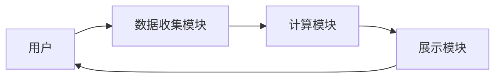

                 


# 股市估值在国际品牌价值评估标准化中的应用

## 关键词：股市估值、品牌价值评估、标准化、国际品牌、金融模型

## 摘要：本文探讨了股市估值方法在国际品牌价值评估中的应用，分析了核心概念、算法原理，并通过系统设计和项目实战展示了标准化评估的重要性。文章旨在提供理论支持和实践指导，帮助读者理解如何将股市估值应用于品牌价值评估。

---

# 文章正文

## 第一部分：背景介绍

### 第1章：股市估值与品牌价值评估概述

#### 1.1 股市估值的基本概念

##### 1.1.1 股市估值的定义与作用

股市估值是通过对公司财务数据和市场信息的分析，评估公司股票的内在价值。其作用在于帮助投资者做出理性投资决策，避免盲目跟风。

##### 1.1.2 股票价值的决定因素

股票价值受多种因素影响，包括公司盈利能力、行业地位、市场环境、宏观经济状况等。其中，盈利能力和成长性是最重要的驱动因素。

##### 1.1.3 股市估值的常见方法

常用方法包括市盈率（P/E）、市净率（P/B）、现金流折现模型（DCF）等。

#### 1.2 品牌价值评估的定义与特点

##### 1.2.1 品牌价值的定义

品牌价值是指品牌在市场中所能带来的超额收益，是品牌资产的量化表现。

##### 1.2.2 品牌价值的核心要素

包括品牌知名度、品牌忠诚度、品牌认知度、品牌联想等。

##### 1.2.3 品牌价值评估的难点与挑战

品牌价值受主观因素影响较大，且缺乏统一的评估标准，不同方法得出的结果可能差异显著。

#### 1.3 国际品牌价值评估标准化的背景

##### 1.3.1 全球化背景下品牌价值的重要性

在全球化市场中，品牌价值已成为企业核心竞争力的重要组成部分，影响企业市值和投资者决策。

##### 1.3.2 标准化评估的必要性

由于不同国家和地区的会计准则、市场环境差异，品牌价值评估缺乏统一标准，导致评估结果不一致，影响跨国公司估值的准确性。

##### 1.3.3 国际品牌价值评估的现状与趋势

当前，品牌价值评估逐渐走向标准化，国际机构如BrandZ提出了品牌价值评估模型，为跨国企业提供参考。

---

## 第二部分：核心概念与联系

### 第2章：股市估值与品牌价值评估的核心概念

#### 2.1 股市估值的核心模型

##### 2.1.1 市盈率模型

市盈率（P/E）是股票价格与每股收益的比率，用于衡量股票的估值水平。公式为：

$$市盈率 = \frac{股价}{每股收益}$$

##### 2.1.2 市净率模型

市净率（P/B）是股票价格与每股净资产的比率，适用于评估资产密集型行业的企业价值。

##### 2.1.3 现金流折现模型（DCF）

DCF模型通过将未来现金流折现，计算企业价值。公式为：

$$企业价值 = \sum_{t=1}^{n} \frac{CF_t}{(1 + r)^t}$$

其中，$CF_t$为第t年的现金流，$r$为折现率。

#### 2.2 品牌价值评估的核心方法

##### 2.2.1 品牌资产模型（BrandZ）

BrandZ模型将品牌价值分解为品牌强度、品牌贡献和品牌倍数三个因素，公式为：

$$品牌价值 = 品牌强度 \times 品牌贡献 \times 品牌倍数$$

##### 2.2.2 品牌价值树模型

该模型通过构建品牌价值的树状结构，分析品牌核心价值和外部影响因素。

##### 2.2.3 品牌强度模型

品牌强度模型基于消费者调研数据，评估品牌在市场中的相对强度。

#### 2.3 股市估值与品牌价值评估的联系

##### 2.3.1 品牌价值对股价的影响

品牌价值是影响股价的重要因素，特别是对于消费品行业，品牌忠诚度高的企业通常具有较高的股价溢价。

##### 2.3.2 股市估值在品牌价值评估中的应用

通过DCF模型评估品牌未来现金流，确定其市场价值。

##### 2.3.3 标准化评估的重要性

统一的评估标准有助于跨国公司准确衡量品牌价值，优化投资决策。

---

## 第三部分：算法原理讲解

### 第3章：股市估值的核心算法

#### 3.1 市盈率模型的数学公式

市盈率公式：$$市盈率 = \frac{股价}{每股收益}$$

例如，某公司股价为50元，每股收益为5元，市盈率为10倍。

#### 3.2 现金流折现模型（DCF）

DCF模型的公式：$$企业价值 = \sum_{t=1}^{n} \frac{CF_t}{(1 + r)^t}$$

假设某公司未来三年现金流分别为1000万元、1200万元、1500万元，折现率为10%。计算现值：

$$PV = \frac{1000}{1.1} + \frac{1200}{1.1^2} + \frac{1500}{1.1^3} \approx 909.09 + 974.36 + 1025.61 = 2909.06万元$$

---

## 第四部分：系统分析与架构设计方案

### 第4章：品牌价值评估系统的架构设计

#### 4.1 系统功能设计

##### 4.1.1 数据收集模块

负责收集公司财务数据和品牌相关信息，如品牌知名度、消费者调研数据等。

##### 4.1.2 计算模块

应用市盈率、DCF等模型，计算品牌价值。

##### 4.1.3 展示模块

将评估结果以可视化形式呈现，生成报告。

#### 4.2 系统架构设计



#### 4.3 系统接口设计

API接口设计：提供RESTful API，支持数据上传、模型调用和结果查询。

---

## 第五部分：项目实战

### 第5章：基于股市估值的国际品牌价值评估系统开发

#### 5.1 环境安装

安装Python、Pandas、Matplotlib等工具，搭建开发环境。

#### 5.2 核心代码实现

```python
def calculate_brand_value(roe, growth_rate):
    # 计算DCF模型
    cash_flows = [1000, 1200, 1500]
    discount_rate = 0.1
    pv = sum([cf / (1 + discount_rate)**t for t, cf in enumerate(cash_flows)])
    return pv

# 示例调用
brand_value = calculate_brand_value(0.1, 0.05)
print(f"品牌价值：{brand_value}万元")
```

#### 5.3 案例分析

以某国际品牌为例，使用DCF模型评估其品牌价值，分析结果并提出改进建议。

---

## 第六部分：最佳实践

### 第6章：小结与注意事项

#### 6.1 小结

本文详细探讨了股市估值在国际品牌价值评估中的应用，通过理论分析和项目实战，展示了标准化评估的重要性。

#### 6.2 注意事项

- 数据准确性是关键，需选择可靠的数据源。
- 模型选择需结合行业特点，避免一刀切。
- 结果分析需结合市场环境，动态调整评估策略。

#### 6.3 拓展阅读

建议进一步学习品牌管理、金融建模和数据分析相关知识，深入理解品牌价值评估的复杂性。

---

## 结语

通过系统化的分析和实践，我们可以看到，股市估值方法为国际品牌价值评估提供了有力工具。未来，随着技术进步和数据的丰富，品牌价值评估将更加精准，为企业决策提供更有力的支持。

