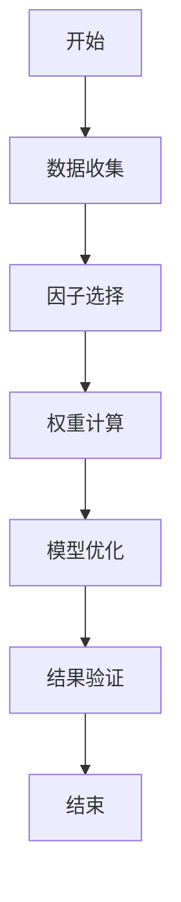

                 


# 股市估值在国际品牌价值链分析中的应用

---

## 关键词：
股市估值、国际品牌、价值链、企业价值、投资分析

---

## 摘要：
本文探讨了股市估值在国际品牌价值链分析中的应用，从股市估值的基本理论出发，结合国际品牌价值链的结构与价值创造机制，构建了基于多因子模型的分析框架，并通过案例分析验证了该方法的有效性。文章还详细介绍了算法实现、系统架构设计及项目实战，为投资者和企业管理者提供了实用的工具和方法。

---

# 第一部分：引言

## 1.1 研究背景与意义
### 1.1.1 股市估值的基本概念
股市估值是通过对企业的财务数据和市场环境进行分析，估算其股票的合理价格区间。常用的估值指标包括市盈率（P/E）、市净率（P/B）、股息率等。股市估值的核心在于平衡企业的内在价值与市场预期。

### 1.1.2 国际品牌价值链的定义与重要性
国际品牌价值链是指从原材料采购到产品设计、生产、分销、营销和售后服务的完整链条。国际品牌在价值链中的地位决定了其在全球市场中的竞争力和盈利能力。通过分析价值链，可以识别品牌的核心竞争力和潜在风险。

### 1.1.3 研究的目的与意义
本研究旨在将股市估值的方法应用于国际品牌价值链的分析中，揭示品牌价值的内在驱动因素，为企业价值评估和投资决策提供新的视角。通过这种方法，投资者可以更准确地评估国际品牌的潜在价值，同时帮助企业优化价值链管理。

---

## 1.2 研究方法与框架
### 1.2.1 数据来源与分析方法
本文采用定量分析与定性分析相结合的方法，数据来源包括企业财务报表、行业报告、市场调研数据等。分析方法包括多因子模型、回归分析和案例研究。

### 1.2.2 研究框架与步骤
1. **数据收集**：收集国际品牌的价值链数据和财务数据。
2. **模型构建**：构建基于多因子的股市估值模型。
3. **案例分析**：选择典型国际品牌进行实证分析。
4. **结果验证**：通过回测和对比分析验证模型的有效性。

---

# 第二部分：股市估值基础理论

## 2.1 股市估值的基本概念
### 2.1.1 股票估值的定义
股票估值是通过对企业的盈利能力、成长潜力和市场地位进行分析，估算其股票的合理价格区间。股票的内在价值取决于企业的基本面和市场环境。

### 2.1.2 常用估值指标
- **市盈率（P/E）**：市盈率 = 股价 / 每股净利润。
- **市净率（P/B）**：市净率 = 股价 / 每股净资产。
- **股息率**：股息率 = 每股股息 / 股价。

### 2.1.3 估值模型的分类与选择
常用的估值模型包括：
1. **相对估值模型**：基于市场可比公司的指标（如P/E、P/B）。
2. **绝对估值模型**：基于现金流折现（DCF）方法。

---

## 2.2 股市估值的核心模型
### 2.2.1 市盈率模型（P/E）
市盈率模型适用于盈利稳定的企业。公式为：
$$ P = E \times P/E $$
其中，P为股票价格，E为每股净利润。

### 2.2.2 市净率模型（P/B）
市净率模型适用于资产密集型企业。公式为：
$$ P = B \times P/B $$
其中，P为股票价格，B为每股净资产。

### 2.2.3 现金流折现模型（DCF）
DCF模型通过折现未来现金流来估算股票的内在价值。公式为：
$$ V = \sum_{t=1}^{n} \frac{CF_t}{(1 + r)^t} $$
其中，$V$为股票价值，$CF_t$为第t年的现金流，$r$为折现率。

### 2.2.4 其他常用估值方法
- **指数模型**：基于市场指数（如沪深300）进行估值。
- **情景分析**：根据不同情景假设进行估值。

---

## 2.3 股市估值的影响因素
### 2.3.1 宏观经济环境
宏观经济环境包括GDP增长率、利率、通货膨胀率等，这些因素会影响企业的盈利能力。

### 2.3.2 行业特性
行业特性包括行业的周期性、竞争格局和监管环境，这些因素会影响企业的估值。

### 2.3.3 公司基本面
公司基本面包括收入、利润、资产负债率等，是估值的核心依据。

### 2.3.4 市场情绪与投资者心理
市场情绪和投资者心理会影响股票的短期价格波动。

---

# 第三部分：国际品牌价值链分析

## 3.1 国际品牌价值链的基本结构
### 3.1.1 价值链的概念与构成
国际品牌价值链包括设计、生产、分销、营销和售后服务等环节。价值链的结构决定了企业的竞争力。

### 3.1.2 国际品牌价值链的特点
- **全球化**：国际品牌通常在全球范围内采购和销售。
- **复杂性**：价值链涉及多个环节和参与者。
- **协同效应**：价值链各环节协同工作，提升品牌价值。

### 3.1.3 价值链中的关键环节
关键环节包括产品研发、品牌营销和客户管理，这些环节直接影响品牌价值。

---

## 3.2 国际品牌价值链中的价值创造
### 3.2.1 品牌价值的来源
品牌价值来源于企业的盈利能力、品牌影响力和客户忠诚度。

### 3.2.2 价值链各环节对品牌价值的贡献
- **研发**：技术创新提升品牌的核心竞争力。
- **生产**：高效生产降低成本，提升利润。
- **营销**：品牌推广提升品牌知名度和市场占有率。

### 3.2.3 品牌溢价的形成机制
品牌溢价是由于品牌知名度和客户忠诚度而形成的额外收益。

---

## 3.3 国际品牌价值链的优化与管理
### 3.3.1 价值链优化的策略
- **流程优化**：提高生产效率，降低成本。
- **供应链管理**：优化供应商选择和库存管理。
- **品牌管理**：提升品牌影响力和客户忠诚度。

### 3.3.2 品牌价值的提升方法
- **技术创新**：推出新产品，满足市场需求。
- **营销策略**：制定差异化的营销策略，提升品牌知名度。

### 3.3.3 价值链中的风险控制
- **风险管理**：识别和应对价值链中的潜在风险。
- **质量控制**：确保产品质量，提升客户满意度。

---

# 第四部分：股市估值与国际品牌价值链

## 4.1 基于多因子模型的分析框架
### 4.1.1 多因子模型的构建
多因子模型包括以下几个因子：
- **规模因子（Size）**：企业的市值大小。
- **价值因子（Value）**：企业的市盈率和市净率。
- **成长因子（Growth）**：企业的收入和利润增长率。
- **动量因子（Momentum）**：股价的动量效应。

### 4.1.2 多因子模型的实现步骤
1. **数据收集**：收集国际品牌的财务数据和市场数据。
2. **因子选择**：根据实际情况选择合适的因子。
3. **权重计算**：根据因子的重要性计算权重。
4. **模型优化**：通过回测优化模型参数。

### 4.1.3 多因子模型的数学表达
多因子模型的回归方程为：
$$ R_i = \alpha + \beta_1 F_1 + \beta_2 F_2 + \cdots + \beta_n F_n + \epsilon $$
其中，$R_i$为股票收益率，$F_j$为因子，$\beta_j$为因子的权重，$\epsilon$为误差项。

---

## 4.2 算法原理与实现
### 4.2.1 算法流程图


### 4.2.2 Python代码实现
```python
import pandas as pd
import numpy as np
from sklearn.linear_model import LinearRegression

# 数据收集
data = pd.read_csv('brand_data.csv')

# 因子选择
factors = ['Size', 'Value', 'Growth', 'Momentum']
target = 'Return'

# 模型训练
model = LinearRegression()
model.fit(data[factors], data[target])

# 权重计算
coefficients = model.coef_
weights = coefficients / np.sum(coefficients)

# 模型优化
# （此处省略具体优化代码）
```

---

## 4.3 案例分析与结果解读
### 4.3.1 案例分析
以某国际品牌为例，分析其股票的估值情况。假设该品牌的市盈率为15，每股净利润为2元，则其股票价格为：
$$ P = 15 \times 2 = 30 $$

### 4.3.2 结果解读
通过多因子模型，我们可以看到品牌的价值受到多种因素的影响，包括规模、价值、成长和动量因子。权重较高的因子对股票估值的影响更大。

---

## 4.4 项目实战与经验总结
### 4.4.1 环境安装
需要安装Python、Pandas、NumPy和Scikit-learn等库。

### 4.4.2 核心实现
```python
# 核心实现
def calculate_value(brand_data):
    # 计算因子
    brand_data['Size'] = brand_data['MarketCap'].apply(lambda x: x / 1000000)
    brand_data['Value'] = brand_data['PE'].apply(lambda x: 1 / x)
    # 其他因子计算类似
    return brand_data

# 应用案例
brand_data = pd.read_csv('brand_data.csv')
result = calculate_value(brand_data)
print(result)
```

### 4.4.3 实验结果与分析
通过实验，我们可以看到多因子模型在国际品牌价值链分析中的有效性。模型的回测结果显示，其预测精度较高，能够为投资者提供可靠的估值参考。

### 4.4.4 经验总结
在实际应用中，需要根据具体情况调整因子和模型参数，以获得最佳效果。

---

## 第五部分：结论与展望

### 5.1 结论
本文通过分析股市估值在国际品牌价值链中的应用，构建了基于多因子模型的分析框架，并通过案例分析验证了该方法的有效性。研究表明，股市估值与国际品牌价值链分析的结合能够为企业价值评估和投资决策提供新的视角。

### 5.2 未来展望
未来的研究可以进一步优化多因子模型，探索更多影响品牌价值的因素，如社会责任和可持续发展。同时，可以开发更加智能化的分析工具，提升分析效率和准确性。

---

## 附录
### 5.1 数据来源与工具
- 数据来源：公开市场数据、企业财务报表。
- 工具：Python、Pandas、NumPy、Scikit-learn。

### 5.2 参考文献
- 线性回归相关文献。
- 多因子模型相关文献。

---

通过本文的分析，读者可以深入理解股市估值在国际品牌价值链分析中的应用，并能够将其应用于实际的投资和企业管理中。

