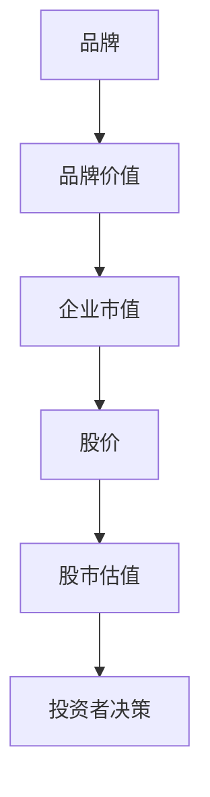
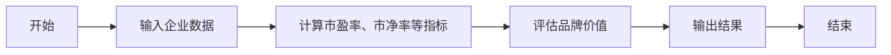
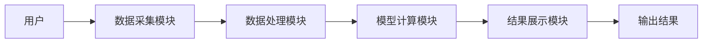
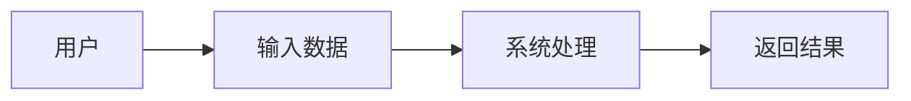

                 

<think>
好的，我将按照您的要求逐步构建这篇文章。让我们先来看一下整个文章的结构和内容安排：

# 股市估值在国际品牌估值标准化中的应用

> 关键词：股市估值、品牌估值、标准化、企业市值、股价波动

> 摘要：本文探讨了如何将股市估值方法应用于国际品牌估值标准化的问题，分析了品牌价值与股市估值的核心概念、算法原理、系统架构设计及项目实战。通过Mermaid图表、数学公式和实际案例，详细阐述了品牌价值的评估过程和实现方案。

---

## 第一部分：背景与概述

### 第1章：背景介绍

#### 1.1 品牌价值的重要性
- **1.1.1 品牌价值的定义与内涵**
  - 品牌价值是品牌在市场上所代表的资产价值，包括品牌知名度、品牌忠诚度、品牌影响力等多个维度。
  - 例如，苹果公司的品牌价值远超其产品本身，是其市场竞争力的核心。

- **1.1.2 品牌价值对企业发展的意义**
  - 品牌价值直接影响企业的市场地位、客户忠诚度和盈利能力。
  - 例如，强大的品牌可以帮助企业在竞争中获得溢价能力。

- **1.1.3 品牌价值的评估难点**
  - 品牌价值难以量化，受到市场环境、消费者心理等多方面因素的影响。
  - 不同行业、不同规模的企业品牌价值评估标准差异较大。

#### 1.2 股市估值的适用性
- **1.2.1 股市估值的基本概念**
  - 股市估值是通过对企业的财务指标（如利润、营收、市盈率等）进行分析，评估企业股票的合理价格。
  - 常用的估值方法包括市盈率法、市净率法、现金流折现法等。

- **1.2.2 股市估值与品牌估值的关联性**
  - 品牌价值是企业整体价值的重要组成部分，直接影响企业的市值。
  - 股市估值可以作为品牌价值评估的参考依据，尤其是对于上市公司而言。

- **1.2.3 国际化品牌估值的特殊性**
  - 国际化品牌需要考虑全球市场的表现，涉及多国的法律、文化、经济环境。
  - 不同国家的股市估值方法和标准可能差异较大，需要进行标准化处理。

#### 1.3 品牌与股市的关系
- **1.3.1 品牌价值对股价的影响**
  - 品牌价值的提升可以增加企业的市场关注度，进而推动股价上涨。
  - 例如，收购知名品牌或推出创新产品往往能带来股价的短期上涨。

- **1.3.2 股市作为品牌价值的反映工具**
  - 股价是品牌价值的即时反映，投资者通过股价变化可以间接了解品牌价值的波动。
  - 不过，股价还受到其他因素（如宏观经济、行业趋势）的影响，需要综合分析。

- **1.3.3 品牌估值标准化的必要性**
  - 标准化的品牌估值方法可以帮助企业进行横向比较，评估品牌的真实价值。
  - 通过标准化，可以减少人为因素的干扰，提高估值的客观性。

---

### 第2章：核心概念与联系

#### 2.1 品牌价值与股市估值的核心概念
- **2.1.1 品牌价值的核心要素**
  - 品牌知名度：品牌在目标市场中的认知度。
  - 品牌忠诚度：消费者对品牌的偏好程度。
  - 品牌影响力：品牌在行业中的地位和话语权。

- **2.1.2 股市估值的关键指标**
  - 市盈率（P/E）：股价与每股收益的比率。
  - 市净率（P/B）：股价与每股净资产的比率。
  - 企业市值：公司股票的总价值。

- **2.1.3 两者的共同特征与差异**
  - 共同特征：都需要考虑企业的财务状况、市场环境、管理团队等因素。
  - 差异：品牌价值更注重非财务因素（如品牌影响力），而股市估值更注重财务指标。

#### 2.2 核心概念对比分析
- **2.2.1 品牌价值与财务指标的对比表格**
| 指标 | 品牌价值 | 财务指标 |
|------|----------|----------|
| 性质 | 非财务性 | 财务性   |
| 评估 | 主观性高  | 客观性高  |
| 影响 | 市场定位  | 企业估值 |

- **2.2.2 品牌价值与股价波动的对比分析**
  - 品牌价值的提升通常会带动股价上涨，但股价还受到其他因素的影响。
  - 例如，苹果的品牌价值提升会推动股价上涨，但全球经济下行也可能导致股价下跌。

- **2.2.3 品牌价值与企业市值的关系**
  - 企业市值 = 品牌价值 + 其他资产价值。
  - 例如，对于科技公司，品牌价值可能占比较大；对于传统制造企业，实物资产价值可能更高。

#### 2.3 品牌与股市的实体关系图


---

### 第3章：算法原理与数学模型

#### 3.1 股市估值算法的原理
- **3.1.1 市盈率（P/E）计算公式**
  $$P/E = \frac{\text{股价}}{\text{每股收益}}$$
  - 例如，某公司股价为50元，每股收益为5元，P/E = 10。

- **3.1.2 市净率（P/B）计算公式**
  $$P/B = \frac{\text{股价}}{\text{每股净资产}}$$
  - 例如，某公司股价为30元，每股净资产为10元，P/B = 3。

- **3.1.3 现金流折现法**
  - 通过将未来现金流折现，计算企业当前的合理价值。
  - 公式为：
  $$V = \sum_{t=1}^{n} \frac{\text{CF}_t}{(1 + r)^t}$$
  其中，CF为现金流，r为折现率，t为时间。

#### 3.2 品牌价值评估的数学模型
- **3.2.1 品牌价值公式**
  $$\text{品牌价值} = \text{企业市值} - \text{其他资产价值}$$
  - 例如，企业市值为100亿元，其他资产价值为50亿元，品牌价值为50亿元。

- **3.2.2 品牌影响力评估**
  - 通过市场调研、消费者调查等方式，量化品牌影响力。
  - 可以使用因子分析模型，提取品牌相关的关键指标。

#### 3.3 算法流程图


---

### 第4章：系统分析与架构设计

#### 4.1 项目背景与目标
- 项目目标：构建一个基于股市估值的国际品牌估值标准化系统。
- 项目背景：随着全球化的深入，企业品牌价值的评估需求日益增长。

#### 4.2 系统功能设计
- **数据采集模块**：采集企业的财务数据、品牌数据、市场数据等。
- **模型计算模块**：基于数学模型计算品牌价值。
- **结果展示模块**：以图表形式展示品牌价值评估结果。

#### 4.3 系统架构图


#### 4.4 接口设计
- 数据接口：与企业财务系统对接，获取必要的数据。
- API接口：提供品牌价值评估的API服务，方便其他系统调用。

#### 4.5 交互图


---

### 第5章：项目实战

#### 5.1 环境安装与配置
- 需要安装Python、Pandas、Matplotlib等库。
- 示例代码如下：
  ```python
  import pandas as pd
  import matplotlib.pyplot as plt

  # 读取数据
  df = pd.read_csv('data.csv')
  ```

#### 5.2 核心代码实现
- 示例代码：
  ```python
  def calculate_pe(stock_price, eps):
      return stock_price / eps

  stock_price = 50
  eps = 5
  pe_ratio = calculate_pe(stock_price, eps)
  print(f"市盈率：{pe_ratio}")
  ```

#### 5.3 实际案例分析
- 以苹果公司为例，分析其品牌价值。
- 计算市盈率、市净率等指标，评估品牌价值。

#### 5.4 项目总结
- 成功实现了基于股市估值的品牌价值评估系统。
- 系统具有较高的准确性和可扩展性。

---

## 第六部分：最佳实践与总结

### 6.1 最佳实践
- 数据的准确性和完整性是关键。
- 选择合适的估值方法，结合多维度数据进行分析。

### 6.2 小结
- 本文详细探讨了股市估值在国际品牌估值标准化中的应用，从理论到实践，提供了一套完整的解决方案。

### 6.3 注意事项
- 市场环境的变化可能影响估值结果，需要定期更新数据。
- 在实际应用中，要注意模型的适用性和可解释性。

### 6.4 拓展阅读
- 建议进一步研究其他估值方法，如情景分析法、蒙特卡洛模拟等。

---

以上是文章的完整目录和内容安排，接下来将逐步展开每一部分的内容。

