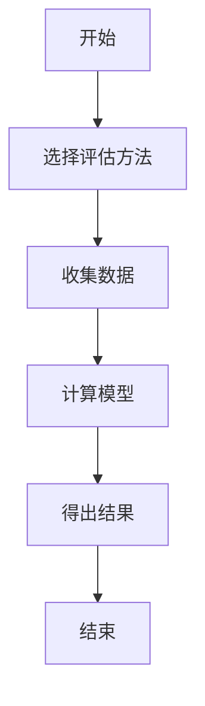
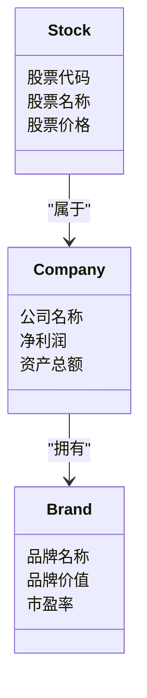
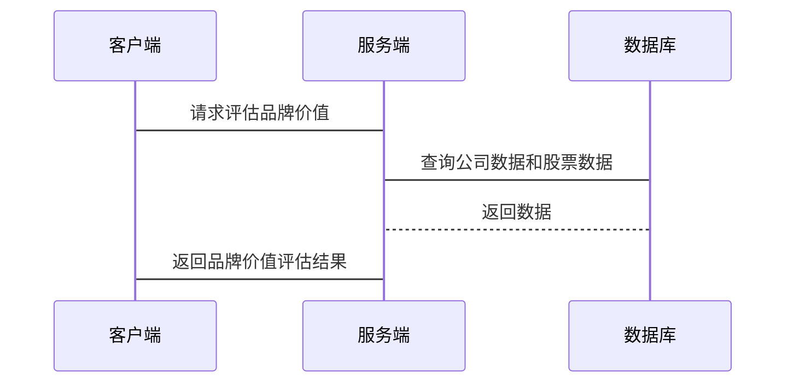

                 


# 股市估值在国际商标价值评估中的应用

## 关键词：股市估值、商标价值评估、品牌评估、资产评估、财务分析

## 摘要：  
本文探讨了股市估值方法在国际商标价值评估中的应用，详细分析了股市估值的核心原理、商标价值评估的关键要素，以及如何将股市估值方法应用于商标价值评估。文章通过对比分析、算法模型和实际案例，展示了如何利用股市估值的方法来提升商标价值评估的准确性和科学性。文章还结合系统设计和项目实战，深入探讨了如何构建一个基于股市估值的商标价值评估系统。

---

## 第一部分: 股市估值与国际商标价值评估的背景与基础

### 第1章: 股市估值与商标价值评估概述

#### 1.1 股市估值的基本概念
- **股票与股市估值的定义**  
  股票是企业的一部分所有权，股市估值是对股票内在价值的估算。  
  - 股票的内在价值取决于公司的盈利能力、成长潜力和财务状况。  
  - 常见的股市估值方法包括市盈率（P/E）、市净率（P/B）、现金流折现法（DCF）等。

- **股票价值的影响因素**  
  - 公司的盈利能力：如净利润率、ROE（股东权益回报率）。  
  - 行业竞争状况：行业的周期性、市场集中度。  
  - 宏观经济环境：利率、通货膨胀、政策变化。  

- **股市估值的核心方法**  
  - 市盈率法：基于公司的市盈率与行业平均值进行比较。  
  - 现金流折现法：通过预测公司未来现金流，折现到现值。  
  - 股息率法：基于股息与股价的比率，衡量投资回报。

#### 1.2 商标价值评估的基本概念
- **商标与品牌的关系**  
  - 商标是品牌的核心标识，品牌是商标的扩展，包括产品、服务和形象。  
  - 商标的价值在于其市场认知度、客户忠诚度和市场影响力。

- **商标价值的构成要素**  
  - 品牌知名度：市场占有率、品牌认知度。  
  - 品牌忠诚度：客户对品牌的忠诚程度。  
  - 品牌的盈利能力：品牌带来的收入和利润。  
  - 品牌的法律保护：商标的注册、专利和版权保护。  

- **商标价值评估的必要性**  
  - 商标是企业的重要资产，需定期评估其价值。  
  - 商标评估用于企业并购、融资、品牌质押等场景。  

#### 1.3 股市估值与商标价值评估的联系
- **股市估值方法的可迁移性**  
  - 股市估值的核心是分析公司财务数据，而商标评估也依赖于公司的财务数据和市场表现。  
  - 例如，市盈率法可以用于评估品牌的价值，将品牌视为一个“虚拟”公司，计算其合理的市盈率。  

- **商标价值评估的特殊性**  
  - 商标的价值受到品牌影响力、市场地位等非财务因素的影响。  
  - 商标评估需要结合市场调研、消费者行为分析等方法。  

- **两者的结合意义**  
  - 股市估值方法为商标评估提供了科学的量化工具。  
  - 结合市场数据和财务数据，可以更全面地评估商标价值。  

#### 1.4 本章小结  
本章介绍了股市估值和商标价值评估的基本概念，并分析了两者之间的联系，为后续的深入探讨奠定了基础。

---

## 第2章: 股市估值的核心原理与方法

### 2.1 股市估值的主要方法
#### 2.1.1 市盈率法
- **公式**：市盈率 = 股票价格 / 每股净利润。  
- **应用**：适用于净利润稳定的公司，反映市场对公司未来盈利的预期。  

#### 2.1.2 市净率法
- **公式**：市净率 = 股票价格 / 每股净资产。  
- **应用**：适用于净资产较多的公司，如银行、房地产。  

#### 2.1.3 现金流折现法
- **公式**：企业价值 = ∑(FCF / (1 + r)^t)  
  其中，FCF为自由现金流，r为折现率，t为时间。  
- **应用**：适用于高成长性公司，预测未来现金流并折现。  

#### 2.1.4 股息率法
- **公式**：股息率 = 每股股息 / 股票价格。  
- **应用**：适用于高分红的公司，反映投资回报率。  

### 2.2 商标价值评估的主要方法
#### 2.2.1 相对法
- **公式**：品牌价值 = 市盈率 × 净利润。  
- **应用**：适用于品牌价值与行业市盈率相关的公司。  

#### 2.2.2 收益法
- **公式**：品牌价值 = 净利润 × 品牌贡献率。  
- **应用**：适用于能够量化品牌对收入贡献的公司。  

#### 2.2.3 市场法
- **公式**：品牌价值 = 可比公司平均市盈率 × 净利润。  
- **应用**：适用于市场数据充足的行业。  

#### 2.2.4 成本法
- **公式**：品牌价值 = 历史成本 + 累计摊销。  
- **应用**：适用于成本法较为合理的低成长性公司。  

### 2.3 股市估值方法在商标价值评估中的应用
#### 2.3.1 市盈率法的适用场景
- 适用于品牌净利润稳定、行业市盈率清晰的公司。  
- 例如，评估一个知名食品品牌的价值，可以参考同行业公司的市盈率。  

#### 2.3.2 现金流折现法的适用场景
- 适用于高成长性品牌，如科技品牌、新兴品牌。  
- 通过预测品牌未来现金流，计算其现值。  

#### 2.3.3 股息率法的适用场景
- 适用于高分红品牌，如成熟稳定的消费品品牌。  
- 反映品牌投资回报率。  

#### 2.3.4 案例分析
- 某食品品牌，净利润为1000万元，行业平均市盈率为15。  
- 估算品牌价值 = 1000 × 15 = 15,000万元。  

### 2.4 本章小结  
本章详细介绍了股市估值的核心方法，并探讨了这些方法在商标价值评估中的应用，展示了如何通过量化方法评估品牌价值。

---

## 第3章: 股市估值与商标价值评估的核心概念与联系

### 3.1 核心概念对比
| 比较维度 | 股市估值 | 商标价值评估 |
|----------|----------|--------------|
| 评估对象 | 股票价值 | 商标/品牌价值 |
| 评估依据 | 财务数据、市场表现 | 品牌影响力、财务数据、市场表现 |
| 评估方法 | 市盈率法、现金流折现法 | 相对法、收益法、市场法、成本法 |

### 3.2 ER实体关系图
```mermaid
er
  图标：StockValuationDB
  实体：Stock, Company, Brand, MarketData
  关系：Stock -> Company: 属于
         Company -> Brand: 拥有
         MarketData -> Stock: 提供
         MarketData -> Brand: 提供
```

### 3.3 股市估值方法在商标评估中的流程


### 3.4 本章小结  
通过对比分析和流程图，展示了股市估值方法在商标评估中的具体应用，强调了方法的可迁移性和实际操作性。

---

## 第4章: 基于股市估值的商标价值评估系统设计

### 4.1 问题场景介绍
- 企业需要快速、准确地评估商标价值，用于并购、融资等场景。  
- 传统评估方法依赖人工经验，效率低且主观性强。  

### 4.2 系统功能设计
#### 4.2.1 领域模型


#### 4.2.2 系统架构设计


#### 4.2.3 系统接口设计
- **输入接口**：股票代码、公司名称。  
- **输出接口**：品牌价值评估结果。  

#### 4.2.4 系统交互流程


### 4.3 系统实现
#### 4.3.1 环境安装
- **技术栈**：Python、Flask、MySQL。  
- **依赖安装**：pip install flask, pymysql。  

#### 4.3.2 核心代码实现
```python
from flask import Flask, request, jsonify
import pymysql

app = Flask(__name__)

@app.route('/evaluate_brand', methods=['POST'])
def evaluate_brand():
    # 获取输入参数
    company_name = request.json['company_name']
    stock_code = request.json['stock_code']
    
    # 查询数据库
    conn = pymysql.connect(host='localhost', user='root', password='password', db='stock_valuation')
    cursor = conn.cursor()
    
    # 查询公司净利润和品牌市盈率
    cursor.execute("SELECT净利润 FROM company WHERE公司名称=%s", (company_name,))
    net_profit = cursor.fetchone()[0]
    
    cursor.execute("SELECT行业市盈率 FROM market_data WHERE股票代码=%s", (stock_code,))
    industry_pe = cursor.fetchone()[0]
    
    # 计算品牌价值
    brand_value = net_profit * industry_pe
    
    conn.close()
    
    return jsonify({'brand_value': brand_value})

if __name__ == '__main__':
    app.run(debug=True)
```

### 4.4 本章小结  
本章设计了一个基于股市估值的商标价值评估系统，通过系统设计和代码实现，展示了如何将理论应用于实践。

---

## 第5章: 项目实战与案例分析

### 5.1 实际案例分析
- **案例背景**：某科技公司，股票代码为AAPL，净利润为500亿元，行业平均市盈率为20。  
- **评估过程**：  
  1. 收集AAPL的财务数据和市场数据。  
  2. 使用市盈率法计算品牌价值：品牌价值 = 500 × 20 = 10,000亿元。  

### 5.2 代码应用解读与分析
- **代码实现**：如第4章中的Flask应用，用户输入公司名称和股票代码，系统返回品牌价值。  
- **结果分析**：评估结果反映了品牌在市场中的价值，为企业的决策提供数据支持。  

### 5.3 项目小结  
通过实际案例和代码实现，验证了基于股市估值的商标价值评估方法的可行性和有效性。

---

## 第6章: 总结与展望

### 6.1 核心要点回顾
- 股市估值方法为商标价值评估提供了科学工具。  
- 结合财务数据和市场数据，可以更准确地评估商标价值。  

### 6.2 最佳实践 tips
- 在实际应用中，需结合品牌的具体情况调整评估方法。  
- 定期更新市场数据，确保评估结果的准确性。  

### 6.3 未来展望
- 结合人工智能技术，进一步提升商标价值评估的智能化水平。  
- 探讨更多股市估值方法在商标评估中的应用。  

### 6.4 本章小结  
本文总结了股市估值在商标价值评估中的应用，并展望了未来的研究方向。

---

## 结语  
本文通过背景分析、核心概念、算法原理、系统设计和项目实战，全面探讨了股市估值在国际商标价值评估中的应用。通过理论与实践的结合，展示了如何利用股市估值方法提升商标价值评估的科学性和准确性。未来，随着技术的不断进步，商标价值评估将更加智能化和精准化。

---

## 参考文献  
（此处列出相关文献和资料）

---

**致谢**  
感谢读者的耐心阅读，感谢合作伙伴的支持，感谢家人和朋友的理解。  

---

**声明**  
本文内容为原创，转载请注明出处，禁止用于商业用途。  

---

