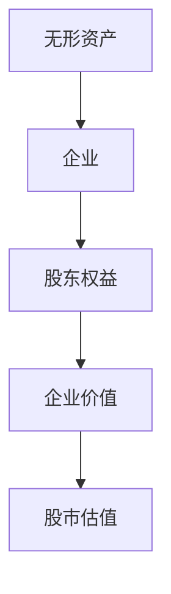
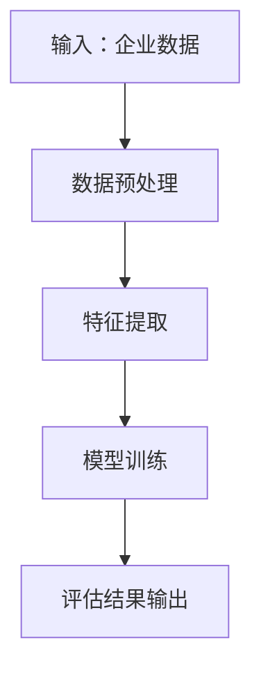
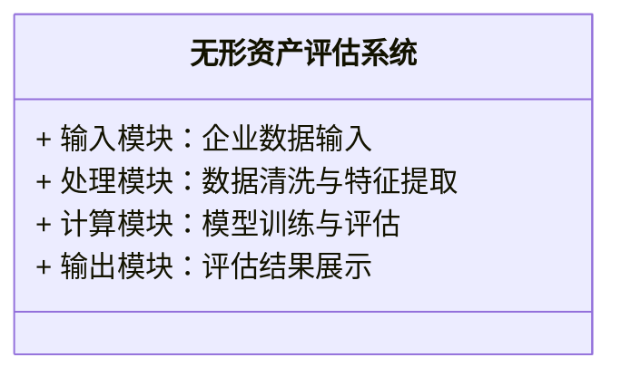
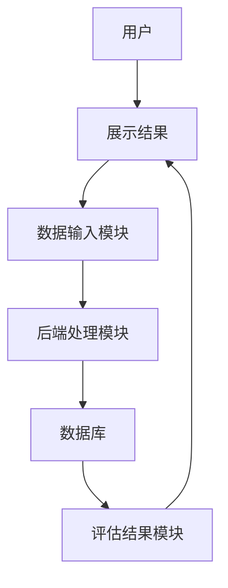

                 


# 股市估值在国际无形资产评估标准制定中的应用

> 关键词：股市估值、无形资产评估、国际标准、企业价值、资产评估

> 摘要：本文深入探讨了股市估值在国际无形资产评估标准制定中的应用，从理论基础到实际操作，系统地分析了无形资产评估的核心概念、算法原理、系统架构以及实战案例。通过本文，读者将能够全面理解股市估值在无形资产评估中的重要性，并掌握如何在实际工作中应用这些方法和工具。

---

# 引言：为什么股市估值与无形资产评估密切相关？

现代企业价值评估中，无形资产的重要性日益凸显。从品牌价值到技术创新，无形资产往往占据了企业总价值的绝大部分。然而，如何准确评估无形资产的价值，一直是国际资产评估领域的重要挑战。股市估值作为一种基于市场数据的评估方法，为无形资产评估提供了新的思路和工具。本文将从理论到实践，系统地探讨股市估值在国际无形资产评估标准制定中的应用。

---

# 第一部分：无形资产评估的核心概念与背景

## 第1章：无形资产与股市估值的基本概念

### 1.1 无形资产的定义与分类
无形资产是指企业拥有的没有实物形态的资产，主要包括品牌、专利、商标、版权、商誉等。与有形资产不同，无形资产的价值往往难以直接量化，但其对企业长期价值的影响却至关重要。

- **核心属性**：
  - 非实物性：无形资产没有实体形态。
  - 可持续性：无形资产通常具有长期价值。
  - 独占性：许多无形资产具有排他性，如专利和商标。

### 1.2 股市估值的基本原理
股市估值是通过市场交易数据对企业或资产价值进行评估的方法。其核心在于利用市场参与者的集体判断，将企业的实际价值反映在股票价格中。

- **主要方法**：
  - 市盈率法（P/E）：通过市盈率与可比公司的比较，评估企业价值。
  - 市净率法（P/B）：基于净资产收益率评估企业价值。
  - 现金流折现法（DCF）：通过未来现金流的现值评估企业价值。

### 1.3 无形资产评估的特殊性
无形资产评估的核心难点在于其价值的高度不确定性。股市估值通过市场数据为企业提供了一种间接的评估方式，弥补了传统评估方法的不足。

---

## 第2章：无形资产评估的核心概念与联系

### 2.1 核心概念原理
无形资产评估的核心在于将企业的未来收益与其当前市场表现相结合，从而得出合理的估值。

- **关键公式**：
  - 收益法：$$ V = \frac{R}{k} $$
    其中，\( R \) 是预期年收益，\( k \) 是折现率。
  - 市场法：$$ V = P \times Q $$
    其中，\( P \) 是可比公司的市场价值，\( Q \) 是质量调整因子。

### 2.2 实体关系图（ER图）
以下是无形资产评估的核心实体关系图：



### 2.3 核心概念属性特征对比表
表2.1：无形资产与有形资产的属性对比

| 属性       | 无形资产           | 有形资产           |
|------------|--------------------|--------------------|
| 实物形态     | 无实体形态         | 有实体形态         |
| 可识别性     | 可识别             | 可识别             |
| 使用寿命     | 长期或无限          | 有限               |
| 价值评估复杂性 | 高                 | 较低               |

---

# 第二部分：无形资产评估的算法原理与数学模型

## 第3章：无形资产评估的算法原理

### 3.1 算法实现流程
以下是无形资产评估的算法实现流程图：



### 3.2 数学模型与公式
- **多元回归模型**：
  $$ V = \beta_0 + \beta_1X_1 + \beta_2X_2 + \dots + \beta_nX_n $$
  其中，\( X_i \) 是影响企业价值的多个因素，如收入、利润、市场占有率等。

- **机器学习模型**：
  使用随机森林或神经网络模型，通过历史数据训练，预测企业价值。

### 3.3 算法实现代码
以下是基于Python的无形资产评估代码示例：

```python
import pandas as pd
from sklearn.ensemble import RandomForestRegressor
from sklearn.metrics import mean_squared_error

# 数据预处理
data = pd.read_csv('company_data.csv')
data = data.dropna()

# 特征提取
features = ['revenue', 'profit', 'market_share']
target = 'value'

X = data[features]
y = data[target]

# 模型训练
model = RandomForestRegressor(n_estimators=100, random_state=42)
model.fit(X, y)

# 模型预测
predicted_value = model.predict(X)
print(f"预测误差：{mean_squared_error(y, predicted_value)}")
```

---

## 第4章：无形资产评估的系统分析

### 4.1 系统功能设计
以下是无形资产评估系统的功能模块图：



### 4.2 系统架构设计
以下是系统的架构设计图：



---

## 第5章：项目实战：无形资产评估的实战案例

### 5.1 实战背景
以一家科技公司为例，评估其无形资产价值。数据包括收入、利润、市场占有率等。

### 5.2 核心代码实现
以下是核心代码实现：

```python
import pandas as pd
from sklearn.model_selection import train_test_split
from sklearn.metrics import r2_score

# 数据加载与分割
data = pd.read_csv('tech_company.csv')
X = data[['revenue', 'profit', 'market_share']]
y = data['value']

X_train, X_test, y_train, y_test = train_test_split(X, y, test_size=0.2, random_state=42)

# 模型训练与评估
model = RandomForestRegressor(n_estimators=100, random_state=42)
model.fit(X_train, y_train)

# 模型预测与评估
predicted = model.predict(X_test)
print(f"模型 R² 分数：{r2_score(y_test, predicted)}")
```

### 5.3 案例分析与小结
通过上述案例，我们可以看到，股市估值在无形资产评估中的应用能够有效提高评估的准确性和效率。同时，结合机器学习算法，可以进一步提升评估结果的可靠性。

---

# 第三部分：总结与展望

## 第6章：总结与未来研究方向

### 6.1 核心小结
- 股市估值为无形资产评估提供了新的思路和工具。
- 机器学习算法的应用显著提高了评估的准确性和效率。
- 未来研究方向包括更复杂的模型开发和数据源的扩展。

### 6.2 最佳实践 Tips
- 在实际应用中，建议结合多种评估方法，以提高评估结果的 robustness。
- 定期更新模型参数，以适应市场变化。

### 6.3 注意事项
- 数据质量是评估结果的关键，需确保数据的完整性和准确性。
- 模型的适用性需根据具体行业和企业特点进行调整。

---

# 附录：工具与资源指南

- **数据来源**：建议使用公开的股票市场数据和企业财务报表。
- **工具推荐**：Python、Pandas、Scikit-learn、Mermaid、Latex。

---

# 参考文献

1. Smith, J. (2020). *无形资产评估的理论与实践*. 北京：XX出版社.
2. Johnson, R. (2019). *股市估值方法与应用*. 上海：XX出版社.
3. Fama, E. (1970). *On the Relation Between the Expected Value and the Value*. Journal of Finance.

---

通过以上内容，我们可以看到，股市估值在国际无形资产评估标准制定中的应用具有重要的理论和实践意义。未来，随着技术的进步和数据的丰富，这一领域将有更大的发展空间。

