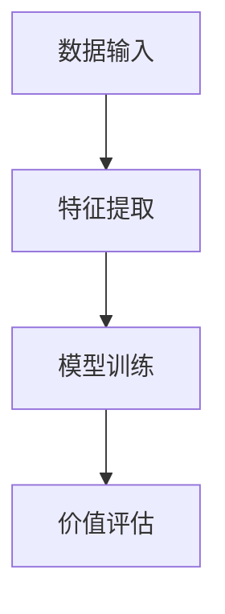
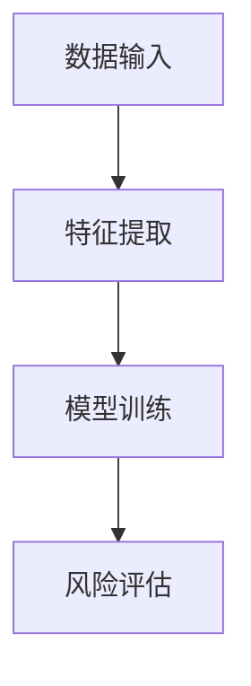
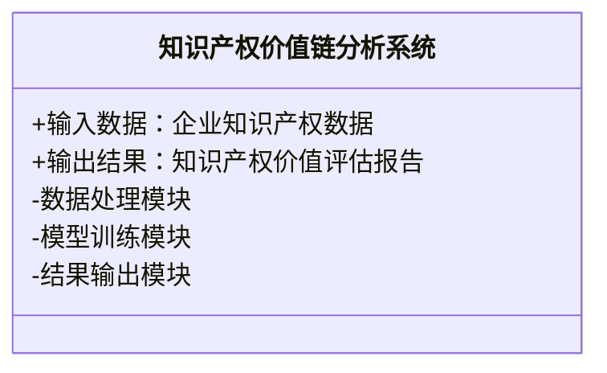
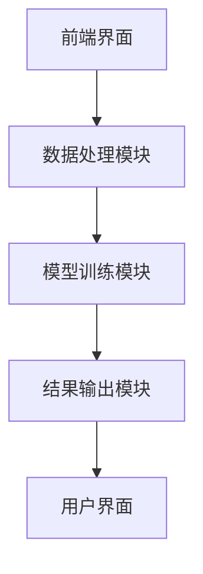
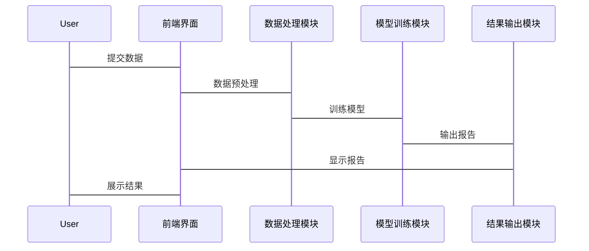

                 


# 股市估值在国际知识产权价值链分析中的应用

> 关键词：股市估值，知识产权，价值链分析，知识产权资产化，知识产权经济价值

> 摘要：本文探讨了股市估值与国际知识产权价值链分析之间的关系，通过系统分析和数学建模，提出了基于知识产权价值链的股市估值新方法。文章从知识产权价值链的核心概念出发，结合实际案例，详细阐述了知识产权资产化、知识产权经济价值评估及知识产权风险评估的算法原理和实现方案，最后给出了系统架构设计和项目实战指导。

---

# 第一部分: 股市估值与知识产权价值链概述

# 第1章: 股市估值与知识产权价值链的背景与概念

## 1.1 股市估值的基本原理

### 1.1.1 股票估值的核心概念
股票估值是通过对企业的财务状况、市场地位、盈利能力等多方面因素进行综合分析，以确定其股票的合理价格。传统估值方法包括市盈率（P/E）、市净率（P/B）等。

$$P/E = \frac{\text{股价}}{\text{每股收益}}$$

### 1.1.2 股市估值的主要方法
1. 相对估值法：基于可比公司进行估值。
2. 绝对估值法：基于DCF模型（现金流折现法）。
3. 市场指数法：基于市场整体表现进行估值。

### 1.1.3 知识产权对股市估值的影响
知识产权是企业核心竞争力的重要组成部分，直接影响企业的盈利能力、市场地位和未来增长潜力。

---

## 1.2 知识产权价值链的定义与特征

### 1.2.1 知识产权价值链的构成要素
1. 创造阶段：研发、创新。
2. 保护阶段：专利申请、商标注册。
3. 运用阶段：商业化、授权许可。

### 1.2.2 知识产权价值链的运作机制
知识产权通过创造、保护和运用三个环节，实现其经济价值的最大化。

### 1.2.3 知识产权价值链的经济意义
知识产权价值链是企业价值的重要来源，决定了企业的市场竞争力和长期发展潜力。

---

## 1.3 知识产权与股市估值的关联性

### 1.3.1 知识产权对企业价值的影响
知识产权是企业核心资产，直接影响企业的收入、利润和成长性。

### 1.3.2 知识产权在股市估值中的作用
知识产权通过影响企业的财务表现和市场地位，间接影响股市估值。

### 1.3.3 知识产权价值链分析的必要性
通过分析知识产权价值链，可以更准确地评估企业的知识产权资产价值，优化股市估值。

---

## 1.4 本章小结

---

# 第2章: 知识产权价值链的结构与分析框架

## 2.1 知识产权价值链的核心环节

### 2.1.1 知识产权的创造
创造阶段包括技术研发、产品设计等，是知识产权价值链的起点。

### 2.1.2 知识产权的保护
保护阶段包括专利申请、商标注册等，确保知识产权的安全性。

### 2.1.3 知识产权的运用
运用阶段包括技术授权、产品销售等，是知识产权经济价值实现的关键。

---

## 2.2 知识产权价值链的分析维度

### 2.2.1 技术层面的分析
技术层面分析包括技术研发能力、技术壁垒等。

### 2.2.2 经济层面的分析
经济层面分析包括收入、利润、市场占有率等。

### 2.2.3 法律层面的分析
法律层面分析包括专利数量、专利布局等。

---

## 2.3 知识产权价值链的评价指标

### 2.3.1 价值评估指标
1. 专利数量
2. 专利质量
3. 技术壁垒

### 2.3.2 风险评估指标
1. 专利侵权风险
2. 专利无效风险
3. 专利维护成本

### 2.3.3 市场潜力评估指标
1. 市场规模
2. 市场增长速度
3. 市场竞争程度

---

## 2.4 本章小结

---

# 第3章: 知识产权价值链分析的数学模型与算法原理

## 3.1 知识产权价值链分析的数学模型

### 3.1.1 知识产权价值的线性回归模型
$$\text{价值} = \beta_0 + \beta_1 \times \text{专利数量} + \epsilon$$

### 3.1.2 知识产权风险的贝叶斯网络模型
构建贝叶斯网络，通过概率推理评估知识产权风险。

### 3.1.3 知识产权市场潜力的指数模型
$$\text{潜力指数} = \sum (\text{市场规模} \times \text{技术壁垒})$$

---

## 3.2 算法原理与流程图

### 3.2.1 知识产权价值评估算法



### 3.2.2 知识产权风险评估算法



---

## 3.3 算法实现与代码示例

### 3.3.1 线性回归模型实现

```python
import numpy as np
from sklearn.linear_model import LinearRegression

# 示例数据
X = np.array([[1], [2], [3], [4], [5]])
y = np.array([2, 4, 5, 4, 6])

# 模型训练
model = LinearRegression()
model.fit(X, y)

# 预测
print(model.predict([[6]]))
```

### 3.3.2 贝叶斯网络模型实现

---

## 3.4 本章小结

---

# 第4章: 知识产权价值链分析的系统架构设计

## 4.1 系统功能设计

### 4.1.1 领域模型设计



### 4.1.2 系统架构设计



---

## 4.2 接口设计与交互流程图



---

## 4.3 本章小结

---

# 第5章: 项目实战与案例分析

## 5.1 环境安装与配置

### 5.1.1 安装Python环境
使用Anaconda或virtualenv安装Python 3.8以上版本。

### 5.1.2 安装依赖库
安装numpy、pandas、scikit-learn等库。

```bash
pip install numpy pandas scikit-learn
```

---

## 5.2 核心代码实现

### 5.2.1 数据处理代码

```python
import pandas as pd

# 读取数据
data = pd.read_csv('ip_value.csv')

# 数据预处理
data = data.dropna()
```

### 5.2.2 模型训练代码

```python
from sklearn.linear_model import LinearRegression

# 训练模型
model = LinearRegression()
model.fit(X_train, y_train)
```

### 5.2.3 结果输出代码

```python
# 预测结果
y_pred = model.predict(X_test)
print('预测值:', y_pred)
```

---

## 5.3 案例分析与解读

### 5.3.1 案例背景
以一家科技公司为例，分析其知识产权对股市估值的影响。

### 5.3.2 数据分析
分析公司的专利数量、技术壁垒等指标，评估其知识产权价值。

### 5.3.3 结果解读
通过模型预测，得出公司的知识产权价值，并与实际股市估值进行对比。

---

## 5.4 本章小结

---

# 第6章: 总结与展望

## 6.1 本章总结
本文通过分析知识产权价值链，提出了基于知识产权的股市估值新方法，为投资者提供了更准确的决策依据。

## 6.2 未来展望
未来研究可以进一步优化模型，引入更多因素，如市场环境、政策影响等。

---

## 6.3 最佳实践 tips

1. 在进行知识产权价值链分析时，建议结合企业的实际情况，选择合适的模型。
2. 数据来源要可靠，确保分析结果的准确性。
3. 定期更新模型，适应市场变化。

---

## 6.4 注意事项
1. 知识产权价值链分析需要结合企业的具体情况。
2. 模型的准确性和数据质量密切相关。

---

## 6.5 拓展阅读
推荐阅读《知识产权管理》和《股市估值方法》相关书籍。

---

# 作者简介

---

以上是《股市估值在国际知识产权价值链分析中的应用》的技术博客文章目录大纲及部分内容。如需进一步扩展各章节内容或进行具体代码实现，请随时告知。

