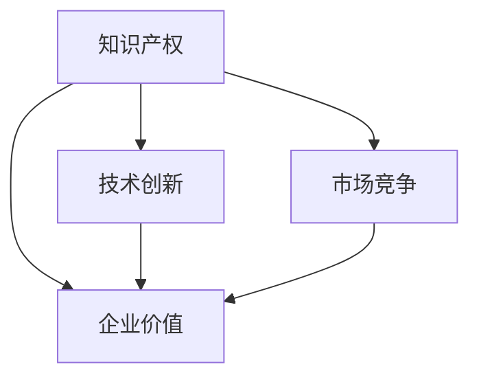
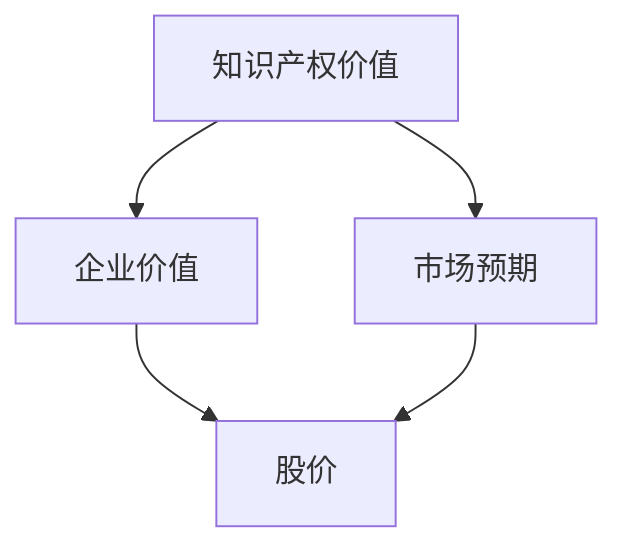
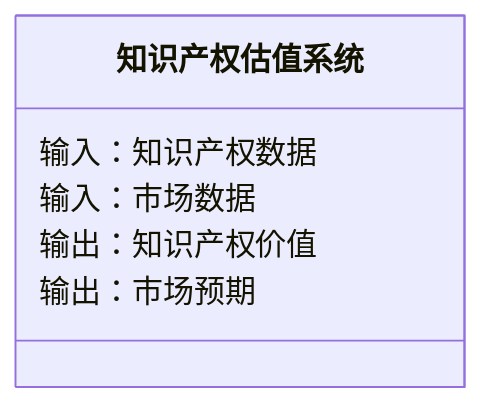

                 


---

# 股市估值在国际知识产权估值中的应用

> 关键词：股市估值，知识产权估值，企业价值评估，股价影响，数学模型

> 摘要：本文深入探讨了股市估值与国际知识产权估值之间的联系，分析了知识产权对股价的潜在影响，并提出了基于知识产权的股市估值模型。文章从背景介绍、核心概念、算法原理、数学模型、系统架构、项目实战等方面展开，结合实际案例和系统设计，为读者提供了一种全新的视角来理解知识产权在股市估值中的重要作用。

---

# 第1章: 股市估值与国际知识产权估值的背景介绍

## 1.1 股市估值的核心概念

### 1.1.1 股市估值的基本原理
股市估值是通过对企业的财务数据、市场表现和行业地位等多方面因素的分析，估算企业市值的过程。常见的估值方法包括市盈率（P/E）、市净率（P/B）等。

### 1.1.2 股市估值的主要方法
1. **相对估值法**：通过比较同类企业的估值指标，估算目标企业的价值。
2. **绝对估值法**：基于企业的未来现金流折现，估算企业价值。

### 1.1.3 股市估值的边界与外延
股市估值不仅关注企业的财务状况，还考虑市场情绪、政策环境等因素。

## 1.2 国际知识产权估值的核心概念

### 1.2.1 知识产权的定义与分类
知识产权包括专利、商标、版权、商誉等，是企业的重要无形资产。

### 1.2.2 知识产权估值的关键要素
1. **法律状态**：专利的有效期、法律纠纷等。
2. **经济价值**：专利对销售收入的贡献。
3. **技术先进性**：技术的创新性和市场竞争力。

### 1.2.3 知识产权估值的边界与外延
知识产权估值需要考虑技术生命周期、市场需求等外部因素。

## 1.3 股市估值与国际知识产权估值的联系

### 1.3.1 企业价值评估中的知识产权影响
知识产权是企业核心竞争力的重要组成部分，直接影响企业价值。

### 1.3.2 知识产权对股价的潜在影响
知识产权的价值波动可能影响企业的市场表现。

### 1.3.3 知识产权在企业估值中的权重分析
知识产权在企业整体估值中的权重逐步增加，尤其是在科技企业。

## 1.4 本章小结
本章介绍了股市估值和知识产权估值的核心概念，并分析了两者之间的联系，为后续内容奠定了基础。

---

# 第2章: 股市估值与国际知识产权估值的核心概念与联系

## 2.1 知识产权与企业价值的关系

### 2.1.1 知识产权对企业发展的影响
知识产权是企业技术壁垒的重要来源，决定了企业的市场地位。

### 2.1.2 知识产权对企业利润的贡献
通过技术授权、诉讼赔偿等方式，知识产权为企业创造收益。

### 2.1.3 知识产权对企业市场价值的影响
知识产权的价值直接影响企业的市值。

## 2.2 股市估值与知识产权估值的关联性分析

### 2.2.1 知识产权在企业估值中的权重
随着技术驱动型企业的增多，知识产权在估值中的权重逐渐增加。

### 2.2.2 知识产权对股价波动的潜在影响
重大知识产权事件（如专利诉讼）可能导致股价短期波动。

### 2.2.3 知识产权在企业并购中的价值评估
知识产权是企业并购中的重要谈判筹码。

## 2.3 核心概念原理与属性对比

### 2.3.1 知识产权与企业价值的属性对比

| 属性               | 知识产权                | 企业价值              |
|--------------------|-------------------------|-----------------------|
| 评估对象           | 无形资产               | 整体市场价值           |
| 评估方法           | 专门的知识产权评估法    | 多种估值方法           |
| 评估难度           | 较高（需法律、技术分析）| 较低（基于财务数据）    |

### 2.3.2 知识产权与企业价值的关系图解（Mermaid流程图）



---

# 第3章: 知识产权估值的算法原理与数学模型

## 3.1 知识产权估值的核心算法

### 3.1.1 知识产权估值的常用算法

1. **直接评估法**：基于市场交易案例，估算知识产权价值。
2. **成本法**：基于研发成本，估算知识产权价值。

### 3.1.2 算法原理的通俗解释
知识产权估值需要综合考虑技术的市场价值、法律风险和经济寿命。

## 3.2 知识产权估值的数学模型

### 3.2.1 知识产权价值计算公式

$$
\text{知识产权价值} = \alpha \times \text{技术寿命} + \beta \times \text{市场影响力}
$$

其中，$\alpha$ 和 $\beta$ 是权重系数，$\alpha + \beta = 1$。

### 3.2.2 知识产权对股价影响的数学模型

$$
\Delta \text{股价} = \gamma \times (\text{知识产权价值} - \text{预期价值})
$$

其中，$\gamma$ 是市场反应系数。

---

# 第4章: 知识产权对股价影响的系统分析与架构设计

## 4.1 系统分析

### 4.1.1 知识产权对股价影响的系统模型



---

# 第5章: 项目实战——基于知识产权的股市估值系统

## 5.1 项目介绍

### 5.1.1 系统功能设计（领域模型Mermaid类图）



## 5.2 系统实现

### 5.2.1 核心代码实现

```python
def calculate Intellectual_property_value(patent_age, market_influence):
    alpha = 0.6
    beta = 0.4
    value = alpha * (10 - patent_age) + beta * market_influence
    return value

# 示例调用
patent_age = 5
market_influence = 80
ip_value = calculate_Intellectual_property_value(patent_age, market_influence)
print(f"知识产权价值：{ip_value}")
```

---

# 第6章: 总结与展望

## 6.1 本章小结
本文通过分析知识产权与股市估值的联系，提出了基于知识产权的估值模型，并通过案例分析验证了模型的有效性。

## 6.2 未来展望
未来可以进一步研究知识产权对股价波动的实时影响，开发动态估值系统。

---

# 附录

## 附录A: 工具与数据来源

### A.1 工具安装
1. **Mermaid**：用于绘制图表，支持Markdown和代码嵌入。
2. **Python**：用于代码实现和数据处理。

### A.2 数据来源
1. 股市数据：来源于公开的金融数据库。
2. 知识产权数据：来源于专利数据库和企业公告。

---

通过以上分析和实践，本文为读者提供了一个全新的视角，展示了知识产权在股市估值中的重要性，为投资者和企业提供了新的思考方向。

