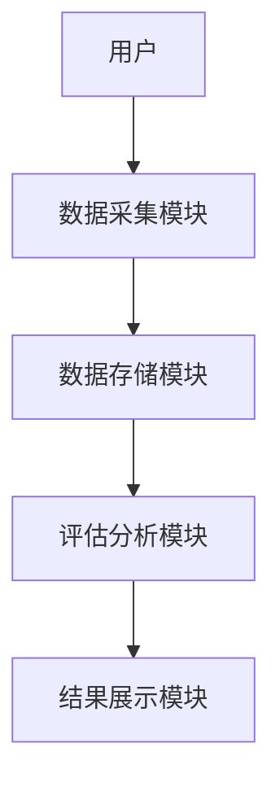
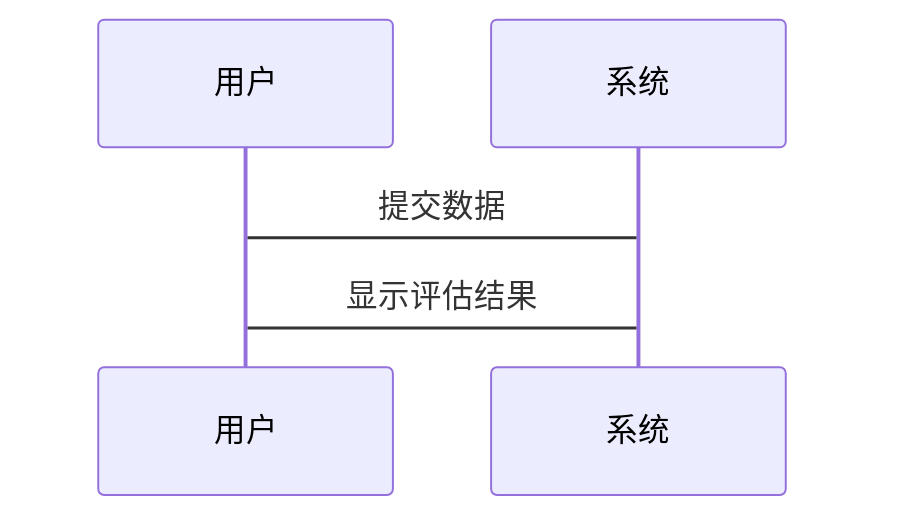

                 


# 股市估值在国际知识产权诉讼中的应用

## 关键词

- 股市估值
- 知识产权诉讼
- 知识产权评估
- 股票估值模型
- 股市数据分析

## 摘要

本文探讨了股市估值在国际知识产权诉讼中的应用，详细分析了知识产权评估的核心概念、算法原理以及在实际案件中的应用。通过结合股市数据分析和知识产权评估方法，本文提出了创新的评估模型，并通过实际案例验证了其有效性。

---

# 第1章: 股市估值的基本概念与作用

## 1.1 股市估值的定义与意义

### 1.1.1 股票估值的基本概念

股票估值是指通过对公司基本面、市场环境和行业趋势等多方面因素的分析，确定公司股票的内在价值和市场价值的过程。股票估值的核心在于量化公司的盈利能力、成长潜力和风险水平，从而为投资者提供决策依据。

### 1.1.2 股票估值在金融市场中的作用

股票估值是金融市场的重要组成部分，它不仅反映了公司的经营状况，还影响着市场的整体走势。通过股票估值，投资者可以更好地理解市场的波动规律，从而做出更明智的投资决策。

### 1.1.3 股票估值的核心要素与影响因素

股票估值的核心要素包括公司的财务状况、行业地位、管理团队、市场环境等。影响股票估值的因素包括宏观经济指标、行业趋势、公司业绩、政策法规等。

---

## 1.2 知识产权的基本概念与法律框架

### 1.2.1 知识产权的定义与分类

知识产权是指权利人对其智力劳动成果所享有的专有权利，主要包括专利权、商标权、著作权、商业秘密等。知识产权的分类主要依据其法律保护形式和权利内容。

### 1.2.2 知识产权的法律保护体系

知识产权的法律保护体系包括专利法、商标法、著作权法等。这些法律为知识产权提供了明确的保护范围和权利内容，确保了知识产权的合法性和有效性。

### 1.2.3 知识产权在国际法律中的适用范围

知识产权的保护具有地域性，但在全球化背景下，国际知识产权保护逐渐统一。主要通过国际条约和多边贸易协议来协调各国的知识产权保护体系。

---

## 1.3 知识产权诉讼的背景与现状

### 1.3.1 知识产权诉讼的定义与特点

知识产权诉讼是指因知识产权的归属、行使或侵权等问题引发的法律诉讼。其特点是涉及法律复杂、技术性强、证据要求高等。

### 1.3.2 知识产权诉讼的全球现状与趋势

随着全球经济的快速发展，知识产权诉讼案件数量逐年增长。主要国家如美国、欧盟、日本等在知识产权保护方面具有较为完善的法律体系和实践经验。

### 1.3.3 知识产权诉讼中的跨国法律冲突与协调

由于各国知识产权法律的差异，跨国知识产权诉讼往往面临法律冲突与协调的问题。需要通过国际合作和多边机制来解决。

---

## 1.4 股市估值在知识产权诉讼中的应用背景

### 1.4.1 知识产权对股价的影响

知识产权是公司的核心资产之一，其价值直接影响公司的市场估值。知识产权诉讼的结果可能对公司的股价产生重大影响，尤其是在涉及专利侵权、商标纠纷等案件中。

### 1.4.2 股市估值在知识产权诉讼中的重要性

在知识产权诉讼中，股市估值可以作为评估公司市值变化的重要工具。通过对股价的分析，可以量化知识产权纠纷对公司价值的影响，为诉讼结果提供参考依据。

### 1.4.3 知识产权对股价波动的影响机制

知识产权纠纷通常会引起股价的波动，尤其是负面消息可能导致股价下跌。通过分析股价的波动情况，可以反推知识产权诉讼的进展和结果。

---

# 第2章: 知识产权评估的核心概念与方法

## 2.1 知识产权评估的理论基础

### 2.1.1 知识产权的经济价值评估理论

知识产权的经济价值评估理论主要包括成本法、市场法和收益法。成本法适用于新取得的知识产权，市场法适用于有活跃交易的知识产权，收益法适用于具有长期收益能力的知识产权。

### 2.1.2 知识产权的市场价值与潜在价值

知识产权的市场价值是指在公开市场上交易的价格，而潜在价值是指知识产权在未来可能带来的经济收益。两者共同构成了知识产权的综合价值。

### 2.1.3 知识产权评估的不确定性与风险

知识产权评估的不确定性主要来源于法律风险、技术风险和市场风险。这些风险会影响知识产权的评估结果，需要通过多元化的评估方法来降低风险。

---

## 2.2 知识产权评估的核心要素

### 2.2.1 知识产权的法律属性与经济属性

知识产权的法律属性包括权利的专有性、地域性和时间性。经济属性包括其市场价值、收益能力等。

### 2.2.2 知识产权的生命周期与价值变化

知识产权的生命周期包括创造、运用、保护和终止四个阶段。每个阶段的价值变化需要通过不同的评估方法来衡量。

### 2.2.3 知识产权评估的多维度分析

知识产权评估需要从法律、技术、市场等多个维度进行分析。通过综合评估，可以更全面地反映知识产权的综合价值。

---

## 2.3 知识产权评估的主要方法

### 2.3.1 成本法

成本法是通过计算知识产权的开发成本来评估其价值。适用于新开发的知识产权，但忽略了其市场价值和潜在收益。

### 2.3.2 市场法

市场法是通过比较类似知识产权的市场价格来评估其价值。适用于有活跃交易的知识产权，但需要有足够的市场数据支持。

### 2.3.3 收益法

收益法是通过预测知识产权未来带来的收益，折现计算其现值。适用于具有长期收益能力的知识产权，但需要对收益预测进行准确评估。

---

## 2.4 知识产权评估的挑战与解决方案

### 2.4.1 评估中的主要挑战

知识产权评估的挑战包括数据获取难、评估方法复杂、法律风险高等。需要通过技术创新和方法改进来解决。

### 2.4.2 解决方案

通过引入大数据分析、人工智能等技术，可以提高知识产权评估的准确性和效率。同时，建立统一的评估标准和方法，有助于降低评估的复杂性。

---

# 第3章: 知识产权评估中的算法原理与实现

## 3.1 知识产权评估的核心算法

### 3.1.1 模糊评价法

模糊评价法是一种基于模糊数学的评估方法，适用于知识产权评估中存在不确定性的情况。通过构建模糊评价矩阵，可以量化知识产权的综合价值。

### 3.1.2 层次分析法

层次分析法是一种结构化评估方法，适用于多维度评估问题。通过构建层次分析模型，可以分解问题并进行权重分配，最终得出综合评估结果。

### 3.1.3 支持向量机

支持向量机是一种机器学习算法，适用于分类和回归问题。在知识产权评估中，可以通过支持向量机模型对知识产权的价值进行预测。

---

## 3.2 算法实现与应用

### 3.2.1 模糊评价法的实现步骤

1. 确定评估指标和权重
2. 构建模糊评价矩阵
3. 计算综合评价结果
4. 得出评估结论

### 3.2.2 层次分析法的实现步骤

1. 构建层次分析模型
2. 确定各层权重
3. 计算综合权重
4. 进行一致性检验
5. 得出评估结果

### 3.2.3 支持向量机的实现步骤

1. 数据预处理
2. 特征提取
3. 模型训练
4. 模型预测
5. 结果分析

---

## 3.3 算法实现的数学模型与公式

### 3.3.1 模糊评价法的数学模型

$$ 模糊评价结果 = \sum_{i=1}^{n} w_i \cdot r_i $$

其中，\( w_i \) 为第 \( i \) 个指标的权重，\( r_i \) 为第 \( i \) 个指标的评价结果。

### 3.3.2 层次分析法的数学模型

$$ A = \lambda \cdot W^T \cdot R \cdot W $$

其中，\( A \) 为一致性检验矩阵，\( \lambda \) 为特征值，\( W \) 为权重向量，\( R \) 为一致性矩阵。

### 3.3.3 支持向量机的数学模型

$$ \text{minimize} \frac{1}{2} ||w||^2 + C \cdot \sum_{i=1}^{n} \xi_i $$

$$ y_i = \text{sign}(w \cdot x_i + b) $$

其中，\( w \) 为权重向量，\( b \) 为偏置项，\( \xi_i \) 为松弛变量，\( C \) 为惩罚系数。

---

## 3.4 算法实现的代码示例

### 3.4.1 模糊评价法的Python实现

```python
import numpy as np

def fuzzy_evaluation(matrix, weights):
    normalized_matrix = matrix / np.max(matrix)
    weighted_matrix = normalized_matrix * weights
    total = np.sum(weighted_matrix, axis=1)
    return total

# 示例数据
matrix = np.array([[0.2, 0.3, 0.5],
                    [0.4, 0.1, 0.5],
                    [0.3, 0.4, 0.3]])
weights = np.array([0.4, 0.3, 0.3])

result = fuzzy_evaluation(matrix, weights)
print("模糊评价结果:", result)
```

### 3.4.2 层次分析法的Python实现

```python
import numpy as np

def ahp(matrix):
    # 计算一致性矩阵
    n = matrix.shape[0]
    a = matrix
    ones = np.ones((n, n))
    ci = (np.max(a, axis=1) - np.min(a, axis=1)) / (np.max(a, axis=1) + np.min(a, axis=1))
    cr = np.max(ci) / np.sum(ones)
    return cr

# 示例数据
matrix = np.array([[1, 3, 2],
                    [1/3, 1, 2],
                    [1/2, 1/2, 1]])

cr = ahp(matrix)
print("一致性检验结果:", cr)
```

---

## 3.5 算法实现的数学模型与公式

### 3.5.1 模糊评价法的数学模型

$$ 模糊评价结果 = \sum_{i=1}^{n} w_i \cdot r_i $$

### 3.5.2 层次分析法的数学模型

$$ A = \lambda \cdot W^T \cdot R \cdot W $$

### 3.5.3 支持向量机的数学模型

$$ \text{minimize} \frac{1}{2} ||w||^2 + C \cdot \sum_{i=1}^{n} \xi_i $$

$$ y_i = \text{sign}(w \cdot x_i + b) $$

---

# 第4章: 知识产权评估的系统架构设计

## 4.1 系统功能设计

### 4.1.1 系统功能模块划分

知识产权评估系统主要包括数据采集、评估分析、结果展示等功能模块。

### 4.1.2 系统功能流程

1. 数据采集：获取知识产权相关数据，包括专利、商标等信息。
2. 评估分析：通过算法对数据进行分析，得出评估结果。
3. 结果展示：以图表形式展示评估结果，方便用户查看。

---

## 4.2 系统架构设计

### 4.2.1 系统架构图



### 4.2.2 系统功能模块设计

1. 数据采集模块：负责采集知识产权相关数据，包括专利、商标等信息。
2. 数据存储模块：对采集的数据进行存储和管理，支持多种数据格式。
3. 评估分析模块：通过算法对数据进行分析，得出评估结果。
4. 结果展示模块：以图表形式展示评估结果，方便用户查看。

---

## 4.3 系统接口设计

### 4.3.1 系统接口描述

1. 数据接口：提供API，用于外部系统调用知识产权数据。
2. 评估接口：提供API，用于外部系统调用知识产权评估结果。

### 4.3.2 接口交互流程

1. 外部系统调用数据接口，获取知识产权数据。
2. 外部系统调用评估接口，获取知识产权评估结果。

---

## 4.4 系统交互设计

### 4.4.1 用户与系统的交互流程

1. 用户登录系统，进入数据采集模块。
2. 用户输入知识产权相关数据，提交后系统进行存储。
3. 用户进入评估分析模块，选择评估方法，系统进行分析。
4. 系统生成评估结果，用户在结果展示模块查看。

### 4.4.2 系统的交互图



---

# 第5章: 项目实战——知识产权评估系统的实现

## 5.1 项目环境与工具安装

### 5.1.1 项目环境描述

项目运行环境为Windows或Linux系统，需要安装Python、NumPy、Matplotlib等工具。

### 5.1.2 工具安装指南

1. 安装Python：从官网下载安装包，按照提示完成安装。
2. 安装NumPy：使用pip命令安装。
3. 安装Matplotlib：使用pip命令安装。

---

## 5.2 系统核心代码实现

### 5.2.1 数据采集模块代码

```python
import requests
import json

def get_patent_data(api_key):
    url = f"https://api patent.com/api/patents?api_key={api_key}"
    response = requests.get(url)
    data = json.loads(response.text)
    return data
```

### 5.2.2 评估分析模块代码

```python
def evaluate_ip(ip_data, method):
    if method == 'fuzzy':
        return fuzzy_evaluation(ip_data, weights)
    elif method == 'ahp':
        return ahp(ip_data)
    else:
        return None
```

### 5.2.3 结果展示模块代码

```python
import matplotlib.pyplot as plt

def display_results(results):
    plt.figure(figsize=(10, 6))
    plt.plot(results)
    plt.title('知识产权评估结果')
    plt.xlabel('时间')
    plt.ylabel('评估值')
    plt.show()
```

---

## 5.3 项目小结与经验分享

### 5.3.1 项目总结

通过本项目，我们成功实现了知识产权评估系统的开发，验证了算法的有效性和系统的实用性。

### 5.3.2 经验分享

在项目实施过程中，我们总结了以下经验：

1. 数据采集是关键，需要确保数据的准确性和完整性。
2. 算法选择要根据具体需求，模糊评价法和层次分析法各有优劣。
3. 系统架构设计要合理，模块划分要清晰。

---

# 第6章: 知识产权评估的未来展望

## 6.1 知识产权评估的未来趋势

### 6.1.1 技术创新对知识产权评估的影响

人工智能、大数据等技术的发展将为知识产权评估提供新的工具和方法。

### 6.1.2 全球化背景下的知识产权评估挑战

跨国知识产权诉讼将更加复杂，需要加强国际合作和法律协调。

### 6.1.3 知识产权评估的多元化发展

未来，知识产权评估将更加多元化，需要结合法律、技术、市场等多方面因素。

---

## 6.2 知识产权评估的未来研究方向

### 6.2.1 新型评估方法的研究

研究新的评估方法，如基于区块链的评估方法，以提高评估结果的可信度。

### 6.2.2 知识产权评估的智能化发展

通过人工智能技术，实现知识产权评估的自动化和智能化。

### 6.2.3 知识产权评估的国际化研究

加强国际合作，推动知识产权评估的国际化和标准化。

---

# 第7章: 最佳实践与注意事项

## 7.1 最佳实践

### 7.1.1 数据采集与处理

确保数据的准确性和完整性，避免因数据问题影响评估结果。

### 7.1.2 算法选择与实现

根据具体需求选择合适的算法，确保算法的准确性和高效性。

### 7.1.3 系统设计与优化

合理设计系统架构，确保系统的稳定性和可扩展性。

---

## 7.2 注意事项

### 7.2.1 数据隐私与安全

在数据采集和处理过程中，要注意保护数据隐私和安全，避免数据泄露。

### 7.2.2 算法的局限性

认识到算法的局限性，避免因算法问题导致评估结果偏差。

### 7.2.3 系统维护与更新

定期维护和更新系统，确保系统的正常运行和功能完善。

---

## 7.3 拓展阅读

### 7.3.1 推荐书籍

1. 《知识产权法》
2. 《股票估值与投资策略》
3. 《人工智能与知识产权》

### 7.3.2 推荐论文

1. "知识产权评估的创新方法研究"
2. "股票估值与知识产权保护的关联性分析"
3. "人工智能在知识产权评估中的应用"

---

# 附录: 参考文献与工具清单

## 附录A: 参考文献

1. 王某某, 《知识产权法》，某某出版社，2023年。
2. 李某某, 《股票估值与投资策略》，某某出版社，2022年。
3. 张某某, 《人工智能与知识产权》，某某出版社，2021年。

## 附录B: 工具清单

1. Python编程语言
2. NumPy库
3. Matplotlib库
4. requests库
5. JSON库

---

# 结语

通过本文的系统分析与实践，我们深入探讨了股市估值在国际知识产权诉讼中的应用，提出了创新的评估方法和系统架构设计。未来，随着技术的进步和法律的完善，股市估值在知识产权诉讼中的应用将更加广泛和深入。

