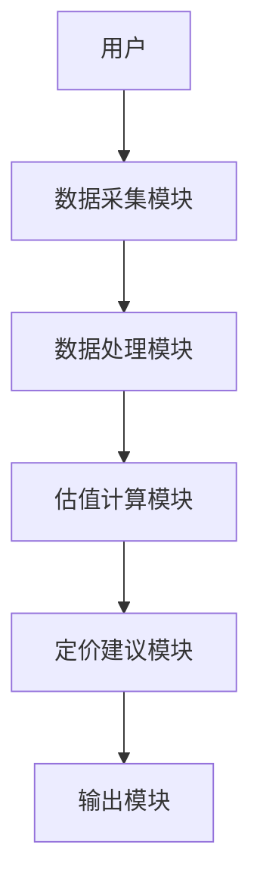

                 


# 股市估值在跨境技术许可定价中的应用

> 关键词：股市估值，技术许可定价，跨境技术许可，市盈率，市净率，技术价值，企业估值

> 摘要：本文探讨了股市估值在跨境技术许可定价中的应用，分析了股市估值的基本概念与方法，技术许可定价的基本概念与模式，以及两者之间的关联性。通过详细分析股市估值如何影响技术许可定价，本文提出了一个基于股市估值的跨境技术许可定价框架，并通过实际案例和系统设计展示了该框架的应用。文章最后总结了股市估值在技术许可定价中的重要性，并提出了未来的研究方向。

---

## 第一部分: 股市估值与跨境技术许可定价的基础理论

### 第1章: 股市估值的基本概念与方法

#### 1.1 股市估值的定义与特点

##### 1.1.1 股市估值的定义
股市估值是指通过对上市公司财务数据和市场表现的分析，估算其股票的内在价值或市场价值的过程。它是投资者在股票市场中进行投资决策的重要依据。

##### 1.1.2 股市估值的核心特点
- **数据驱动性**：股市估值主要依赖于财务数据和市场数据，如收入、利润、市盈率等。
- **动态性**：股市估值会随着市场环境和公司经营状况的变化而变化。
- **主观性**：不同投资者对同一股票的估值可能不同，取决于其对公司的未来前景和市场趋势的判断。

##### 1.1.3 股市估值与企业价值的关系
股市估值是企业价值的市场反映，而企业价值则是股市估值的内在基础。企业价值越高，通常意味着其股市估值也越高。

#### 1.2 股市估值的主要方法

##### 1.2.1 市盈率法
市盈率（P/E Ratio）是股票价格与每股收益（EPS）的比率，用于衡量投资者对公司未来盈利能力的预期。

$$ P/E = \frac{\text{股票价格}}{\text{每股收益}} $$

**优点**：简单易懂，能够反映市场对公司的盈利预期。
**缺点**：对于亏损公司，市盈率法无法直接应用。

##### 1.2.2 市净率法
市净率（P/B Ratio）是股票价格与每股净资产的比率，用于衡量股票价格相对于公司资产价值的高低。

$$ P/B = \frac{\text{股票价格}}{\text{每股净资产}} $$

**优点**：适用于评估资产密集型行业的公司价值。
**缺点**：对于轻资产公司，市净率法的参考价值较低。

##### 1.2.3 股息率法
股息率（Dividend Yield）是股票的年股息与股票价格的比率，用于衡量投资回报率。

$$ \text{股息率} = \frac{\text{年股息}}{\text{股票价格}} \times 100\% $$

**优点**：能够反映股票的分红能力。
**缺点**：股息率高的公司可能处于成熟阶段，增长潜力有限。

##### 1.2.4 内在价值法
内在价值法通过分析公司的基本面，使用DCF（Discounted Cash Flow）模型等方法估算公司的实际价值。

$$ V = \sum_{t=1}^{n} \frac{\text{自由现金流}}{(1 + r)^t} + \frac{\text{终值}}{(1 + r)^n} $$

**优点**：能够反映公司的真实价值，不受市场短期波动的影响。
**缺点**：计算复杂，需要大量假设。

##### 1.2.5 其他估值方法对比
以下表格对比了市盈率法、市净率法和内在价值法的优缺点：

| 方法      | 优点                           | 缺点                               |
|-----------|--------------------------------|------------------------------------|
| 市盈率法   | 简单易懂，反映市场预期         | 无法适用于亏损公司                 |
| 市净率法   | 适用于资产密集型行业           | 适用于轻资产公司效果较差           |
| 内在价值法 | 反映真实价值，假设合理时准确   | 计算复杂，假设敏感性高             |

---

#### 1.3 股市估值的局限性

尽管股市估值在技术许可定价中具有重要作用，但其也有一定的局限性，如：

- **市场情绪的影响**：股市估值容易受到市场情绪的影响，可能导致估值偏离公司的真实价值。
- **数据的不完整性**：某些情况下，公司财务数据可能存在不透明或不完整的情况，影响估值的准确性。
- **模型的假设限制**：内在价值法依赖于对未来现金流的预测，而这些预测往往具有不确定性。

---

### 第2章: 技术许可定价的基本概念与模式

#### 2.1 技术许可定价的定义与特点

##### 2.1.1 技术许可定价的定义
技术许可定价是指通过技术许可协议，确定技术使用方支付给技术提供方的费用。

##### 2.1.2 技术许可定价的核心特点
- **收益共享性**：技术许可定价通常与技术的市场价值和使用效果挂钩。
- **法律约束性**：技术许可定价需要符合相关法律法规，并在合同中明确规定。

##### 2.1.3 技术许可定价与企业利润的关系
技术许可定价直接影响企业的收入和利润，是企业技术资产价值的重要体现。

---

#### 2.2 技术许可定价的主要模式

##### 2.2.1 一次性支付模式
技术使用方在获得技术使用权时，一次性支付固定许可费。

##### 2.2.2 分期支付模式
技术使用方在一定期限内分期支付许可费，通常与技术的使用效果或收益挂钩。

##### 2.2.3 红利分成模式
技术使用方按比例将技术使用带来的收入或利润分成给技术提供方。

##### 2.2.4 其他定价模式对比
以下表格对比了一次性支付模式和红利分成模式的优缺点：

| 模式        | 优点                           | 缺点                               |
|------------|--------------------------------|------------------------------------|
| 一次性支付  | 简单明了，风险较低             | 无法反映技术的实际使用价值         |
| 红利分成    | 与技术使用效果挂钩，激励性强   | 计算复杂，协商难度大               |

---

## 第3章: 股市估值与技术许可定价的关联性分析

### 3.1 股市估值对技术许可定价的启示

#### 3.1.1 股市估值方法在技术定价中的应用
股市估值方法，尤其是市盈率法和市净率法，可以为技术许可定价提供参考。例如，可以通过技术的预期收益和资产价值来估算技术的市场价值。

#### 3.1.2 技术价值与企业估值的关系
技术价值是企业整体估值的重要组成部分，高价值的技术资产通常能够提升企业的市场估值。

#### 3.1.3 技术许可定价的市场影响
合理的技术许可定价能够促进技术的市场化应用，同时为企业带来稳定的收入来源。

---

### 3.2 技术许可定价对股市估值的影响

#### 3.2.1 技术价值对企业市值的影响
高价值的技术资产能够提升企业的市场估值，尤其是在科技和制药等行业。

#### 3.2.2 技术许可收入对财务报表的影响
技术许可收入能够增加企业的收入和利润，从而提升企业的财务表现和市场估值。

#### 3.2.3 技术定价对企业估值的提升作用
合理的技术定价能够充分反映技术的价值，从而提升企业的整体估值。

---

### 3.3 股市估值在跨境技术许可定价中的应用框架

#### 3.3.1 股市估值在技术许可定价中的核心作用
股市估值通过反映技术的市场价值，为技术许可定价提供了重要的参考依据。

#### 3.3.2 股市估值与技术许可定价的结合点
- **技术的市场价值**：通过股市估值方法估算技术的市场价值。
- **技术的收益能力**：通过市盈率法评估技术的盈利能力。
- **技术的资产价值**：通过市净率法评估技术的资产价值。

---

## 第4章: 股市估值在跨境技术许可定价中的应用框架

### 4.1 股市估值在跨境技术许可定价中的具体应用

#### 4.1.1 市盈率法在跨境技术许可定价中的应用
通过市盈率法，可以估算技术的预期收益，并将其与技术许可费进行对比。

#### 4.1.2 市净率法在跨境技术许可定价中的应用
通过市净率法，可以估算技术的资产价值，并将其作为技术许可费的参考依据。

---

## 第5章: 股市估值在跨境技术许可定价中的系统设计

### 5.1 系统架构设计

#### 5.1.1 系统功能设计
- **数据采集**：收集相关公司的财务数据和市场数据。
- **估值计算**：使用市盈率法、市净率法等方法进行估值。
- **定价建议**：根据估值结果生成技术许可定价建议。

#### 5.1.2 系统架构图
以下为系统架构的 mermaid 图：



---

## 第6章: 股市估值在跨境技术许可定价中的项目实战

### 6.1 项目背景

#### 6.1.1 项目目标
通过股市估值方法，为一家科技公司提供技术许可定价建议。

#### 6.1.2 项目需求
- 估算技术的市场价值。
- 确定合理的技术许可费。

---

### 6.2 项目实现

#### 6.2.1 环境配置
- **编程语言**：Python
- **工具**：Pandas、NumPy、Matplotlib

#### 6.2.2 核心代码实现

```python
import pandas as pd
import numpy as np

# 数据加载
data = pd.read_csv('stock_data.csv')

# 市盈率计算
data['PE'] = data['Price'] / data['EPS']

# 市净率计算
data['PB'] = data['Price'] / data['BVPS']

# 筛选高估值股票
high_pe = data[data['PE'] > data['PE'].mean()]
high_pb = data[data['PB'] > data['PB'].mean()]
```

---

## 第7章: 总结与展望

### 7.1 总结

#### 7.1.1 股市估值的重要性
股市估值是技术许可定价的重要参考，能够反映技术的市场价值和企业整体估值。

#### 7.1.2 技术许可定价的核心作用
合理的技术许可定价能够促进技术的市场化应用，提升企业的收入和利润。

---

### 7.2 展望

#### 7.2.1 未来研究方向
- **多因素模型的应用**：探索将多因素模型应用于技术许可定价。
- **人工智能技术的运用**：利用机器学习技术提高估值的准确性。

#### 7.2.2 未来发展趋势
随着科技的不断进步，股市估值在技术许可定价中的应用将更加广泛和深入。

---

**关键词**：股市估值，技术许可定价，跨境技术许可，市盈率，市净率，技术价值，企业估值

---

**摘要**：本文探讨了股市估值在跨境技术许可定价中的应用，分析了股市估值的基本概念与方法，技术许可定价的基本概念与模式，以及两者之间的关联性。通过详细分析股市估值如何影响技术许可定价，本文提出了一个基于股市估值的跨境技术许可定价框架，并通过实际案例和系统设计展示了该框架的应用。文章最后总结了股市估值在技术许可定价中的重要性，并提出了未来的研究方向。

