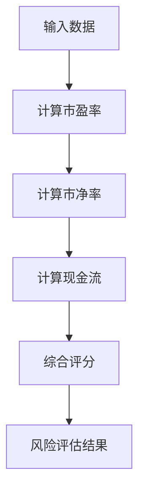

                 


# 股市估值在跨境技术转让风险评估中的应用

**关键词**：股市估值，技术转让，风险评估，跨境交易，企业价值

**摘要**：本文深入探讨了股市估值在跨境技术转让风险评估中的应用，分析了股市估值的核心模型与技术转让风险的构成要素，并提出了基于股市估值的综合风险评估方法。通过实际案例分析和算法实现，本文为跨境技术转让提供了理论依据和实践指导。

---

# 引言

## 1.1 股市估值与跨境技术转让的背景

随着全球经济一体化的深入，技术转让已成为跨国企业的重要战略手段。然而，技术转让涉及复杂的风险因素，如技术贬值、市场波动和法律风险等。股市估值作为量化企业价值的重要工具，为技术转让风险的评估提供了新的思路。

---

## 1.2 股市估值在技术转让中的核心作用

股市估值不仅仅是对企业当前价值的衡量，更是对技术创新能力和未来潜力的体现。通过分析企业的市盈率、市净率等指标，可以评估技术转让的潜在风险和收益。

---

## 1.3 本文的研究目标与框架

本文旨在构建一个基于股市估值的跨境技术转让风险评估模型。文章分为六个部分，依次介绍背景、理论基础、算法原理、系统设计、案例分析和总结。

---

# 第一部分：股市估值与技术转让风险的理论基础

## 2.1 股市估值的核心模型

### 2.1.1 市盈率模型（P/E）

市盈率是衡量企业价值的重要指标，公式为：

$$ P/E = \frac{Price}{Earnings} $$

市盈率越低，说明企业估值可能越低，但技术转让的潜在收益可能更高。

---

### 2.1.2 现金流折现模型（DCF）

DCF模型通过未来现金流的现值来评估企业价值，公式如下：

$$ V = \sum_{t=1}^{n} \frac{CF_t}{(1+r)^t} + \frac{TV}{(1+r)^n} $$

其中，$r$为折现率，$TV$为终值。

---

## 2.2 技术转让风险的构成要素

### 2.2.1 技术风险

技术风险包括技术过时、研发失败等，可通过技术评估模型进行量化。

### 2.2.2 市场风险

市场风险涉及市场需求波动，可通过市场分析模型进行预测。

---

## 2.3 股市估值与技术转让风险的关联

股市估值为技术转让提供了定价依据，同时也反映了市场对技术风险的敏感性。通过分析股市波动，可以评估技术转让的潜在风险。

---

# 第二部分：技术转让风险评估的算法设计

## 3.1 综合估值模型的构建

### 3.1.1 综合评分算法

综合评分算法通过多个指标对技术进行评分，公式如下：

$$ Score = \sum_{i=1}^{n} w_i \cdot x_i $$

其中，$w_i$为权重，$x_i$为指标得分。

---

### 3.1.2 风险系数的计算

风险系数反映了技术转让的不确定性，公式如下：

$$ Risk = \alpha \cdot Market + \beta \cdot Tech $$

其中，$\alpha$和$\beta$为系数，$Market$和$Tech$分别为市场风险和技术风险。

---

## 3.2 算法流程图



---

# 第三部分：系统架构与实现

## 4.1 系统功能设计

系统功能包括数据采集、估值计算、风险评估和结果展示。

---

## 4.2 系统架构设计


---

## 4.3 核心代码实现

```python
def calculate_pe(stock_price, earnings):
    return stock_price / earnings

def calculate_pb(stock_price, book_value):
    return stock_price / book_value

def risk_assessment(pe, pb, market_trend):
    if pe > 30 and pb > 2 and market_trend == "down":
        return "high"
    else:
        return "low"
```

---

# 第四部分：案例分析与应用

## 5.1 案例背景

以某科技公司为例，分析其技术转让的风险评估过程。

---

## 5.2 数据分析与结果

通过计算市盈率、市净率等指标，评估技术转让的风险等级。

---

# 第五部分：结论与建议

## 6.1 研究总结

股市估值为技术转让风险评估提供了有效的工具和方法，但需要结合实际市场情况进行调整。

---

## 6.2 实践建议

企业在进行技术转让时，应综合考虑股市估值和市场风险，制定合理的风险管理策略。

---

## 6.3 拓展研究

未来可进一步研究股市波动对技术转让的长期影响，以及如何利用人工智能技术优化风险评估模型。

---

**摘要**：本文通过构建基于股市估值的综合风险评估模型，为企业跨境技术转让提供了理论依据和实践指导。通过实际案例分析和算法实现，本文为技术转让的风险管理提供了新的思路。

---

**关键词**：股市估值，技术转让，风险评估，跨境交易，企业价值

