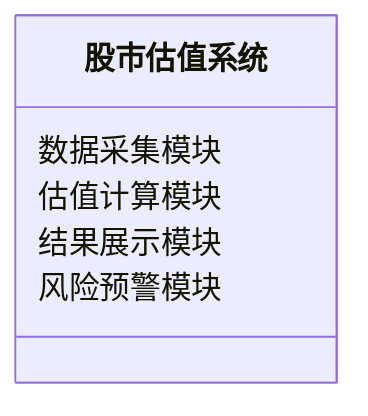
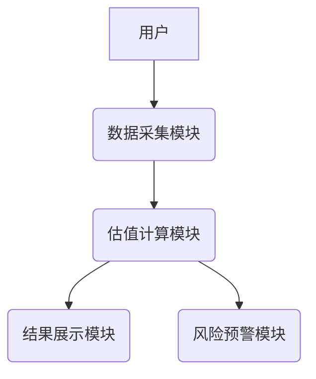

                 


# 股市估值在跨境数字服务价值评估中的应用

## 关键词：股市估值，跨境数字服务，价值评估，数字资产评估，金融市场分析

## 摘要：  
随着全球化和数字化的深入发展，跨境数字服务逐渐成为全球经济的重要组成部分。然而，如何准确评估其价值成为企业和投资者面临的共同挑战。本文将深入探讨股市估值方法在跨境数字服务价值评估中的应用，分析其核心概念、算法原理和系统架构，结合实际案例进行详细解读，为读者提供系统化的解决方案。

---

## 第1章: 股市估值与跨境数字服务概述

### 1.1 股市估值的核心概念  
股市估值是通过对企业的财务状况、市场表现和行业前景等多方面因素的分析，估算其股票的内在价值或市场价值的过程。常用的方法包括市盈率法、市净率法和现金流折现法等。  

#### 1.1.1 股市估值的定义与作用  
股市估值是投资者评估企业价值的重要工具，能够帮助投资者判断股票是否被高估或低估，从而做出合理的投资决策。  

#### 1.1.2 股市估值的主要方法  
- 市盈率法：通过市盈率（P/E）=股票价格/每股收益来衡量股票的估值。  
- 市净率法：通过市净率（P/B）=股票价格/每股净资产来衡量股票的估值。  
- 现金流折现法：通过将未来现金流折现，计算企业价值。  

#### 1.1.3 股市估值与企业价值的关系  
股市估值不仅是企业内在价值的体现，还受到市场情绪、宏观经济环境等因素的影响。  

### 1.2 跨境数字服务的定义与特点  
跨境数字服务是指通过互联网提供跨越国界的数字产品或服务，如云服务、在线教育、跨境支付等。其特点包括数字化、全球化和边际成本低。  

#### 1.2.1 跨境数字服务的定义  
跨境数字服务是指通过数字技术手段，跨越地理边界提供服务的模式。  

#### 1.2.2 跨境数字服务的主要形式  
- 云服务：如AWS、Azure等。  
- 在线教育：如Coursera、Udemy等。  
- 跨境支付：如PayPal、支付宝等。  

#### 1.2.3 跨境数字服务的市场现状  
随着互联网技术的发展，跨境数字服务市场快速增长，但同时也面临法律法规、数据隐私等问题。  

### 1.3 股市估值在跨境数字服务中的应用背景  
随着越来越多的跨境数字服务企业上市，如何对其价值进行准确评估成为投资者和企业的关注点。  

#### 1.3.1 跨境数字服务的价值评估需求  
投资者需要通过估值方法判断跨境数字服务企业的投资价值。  

#### 1.3.2 股市估值方法的适用性分析  
尽管股市估值方法主要针对上市公司，但其核心原理可以借鉴到跨境数字服务的价值评估中。  

#### 1.3.3 股市估值与跨境数字服务的结合意义  
通过结合股市估值方法，可以为跨境数字服务提供更科学的价值评估依据。  

---

## 第2章: 股市估值与跨境数字服务的核心概念

### 2.1 股市估值的核心要素  
股市估值的核心要素包括企业的盈利能力、成长潜力、财务状况和行业环境等。  

#### 2.1.1 股票的内在价值  
股票的内在价值是企业未来现金流的现值，受企业盈利能力、成长潜力和风险因素的影响。  

#### 2.1.2 市场价值与内在价值的关系  
市场价值受市场情绪影响，可能偏离内在价值，但长期来看，市场会回归内在价值。  

#### 2.1.3 影响股票价值的主要因素  
- 盈利能力：如净利润率、ROE等。  
- 成长潜力：如收入增长率、行业前景。  
- 财务状况：如资产负债率、现金流情况。  

### 2.2 跨境数字服务的核心要素  
跨境数字服务的核心要素包括用户规模、技术壁垒、市场竞争力和法律法规环境等。  

#### 2.2.1 数字服务的主要构成  
数字服务包括软件、数据、平台和网络服务等。  

#### 2.2.2 跨境服务的特殊性  
- 数据跨境传输的法律法规限制。  
- 不同国家的市场环境差异。  

#### 2.2.3 数字服务的可量化性  
数字服务的价值可以通过用户活跃度、收入增长等指标进行量化。  

### 2.3 股市估值与跨境数字服务的联系  
#### 2.3.1 股市估值方法的可迁移性  
股市估值的核心原理可以借鉴到跨境数字服务的价值评估中。  

#### 2.3.2 跨境数字服务的估值挑战  
- 数据隐私和法律风险。  
- 业务模式的不确定性。  

#### 2.3.3 综合评估模型的构建  
结合股市估值方法和跨境数字服务的特点，构建综合评估模型。  

---

## 第3章: 股市估值与跨境数字服务的核心原理

### 3.1 股市估值的核心原理  
股市估值的核心原理是通过对企业财务数据和市场数据的分析，估算股票的内在价值。  

#### 3.1.1 市盈率法  
市盈率法通过比较股票的市盈率与行业平均水平，判断股票的估值高低。  

#### 3.1.2 市净率法  
市净率法通过比较股票的市净率与行业平均水平，判断股票的估值高低。  

#### 3.1.3 现金流折现法  
现金流折现法通过将未来现金流折现，计算企业的内在价值。  

### 3.2 跨境数字服务的核心原理  
跨境数字服务的核心原理是通过数字化技术实现跨国服务，其价值受到用户需求、技术壁垒和市场环境的影响。  

#### 3.2.1 数字服务的无形资产特性  
数字服务的核心资产是数据和技术，而非实体资产。  

#### 3.2.2 跨境服务的法律与政策影响  
不同国家的法律法规对数据跨境传输和数字服务有不同限制，影响企业的估值。  

#### 3.2.3 数字服务的边际成本特性  
数字服务的边际成本较低，随着用户数量增加，单位成本下降。  

### 3.3 股市估值与跨境数字服务的结合原理  
#### 3.3.1 股市估值方法的适用性分析  
股市估值方法在跨境数字服务中的适用性需要结合行业特点进行调整。  

#### 3.3.2 跨境数字服务的特殊估值因素  
- 数据隐私风险。  
- 市场环境差异。  

#### 3.3.3 综合评估模型的构建  
通过结合股市估值方法和跨境数字服务的特点，构建综合评估模型。  

---

## 第4章: 股市估值与跨境数字服务的核心概念对比

### 4.1 股市估值与跨境数字服务的属性对比  
通过对比股市估值和跨境数字服务的核心属性，可以更好地理解它们的异同。  

#### 4.1.1 价值评估对象的差异  
- 股市估值：评估股票的内在价值。  
- 跨境数字服务：评估数字服务的用户价值和市场潜力。  

#### 4.1.2 估值方法的差异  
- 股市估值：主要依赖财务数据和市场数据。  
- 跨境数字服务：需要考虑法律法规和市场环境。  

### 4.2 股市估值与跨境数字服务的核心概念对比表  
| 比较维度          | 股市估值                  | 跨境数字服务              |  
|-------------------|--------------------------|--------------------------|  
| 价值评估对象      | 股票价值                 | 数字服务价值              |  
| 核心影响因素      | 财务数据、市场情绪        | 用户需求、技术壁垒、法律法规 |  
| 估值方法          | 市盈率法、市净率法、现金流折现法 | 用户活跃度、收入增长、市场渗透率 |  

### 4.3 股市估值与跨境数字服务的ER实体关系图  
通过ER图展示股市估值和跨境数字服务之间的关系。  

```mermaid
erd
  股票
  组织
  服务
  用户
  股票-|{拥有}|组织
  组织-|{提供}|服务
  服务-|{被使用}|用户
```

---

## 第5章: 算法原理

### 5.1 股市估值算法  
股市估值算法主要是通过对企业的财务数据和市场数据进行分析，计算股票的内在价值。  

#### 5.1.1 多元回归分析法  
多元回归分析法通过将股票价格与其他多个变量（如收益、市盈率等）进行回归分析，预测股票的合理估值。  

```python
import statsmodels.api as sm

# 示例数据
X = df[['收益', '市盈率', '市净率']]
y = df['股价']

# 添加截距项
X = sm.add_constant(X)

# 多元回归分析
model = sm.OLS(y, X).fit()
print(model.summary())
```

#### 5.1.2 估值公式  
多元回归分析的数学模型如下：  
$$股价 = \beta_0 + \beta_1 \times 收益 + \beta_2 \times 市盈率 + \beta_3 \times 市净率 + \epsilon$$  

### 5.2 跨境数字服务估值算法  
跨境数字服务的估值需要结合用户数据和市场数据，采用定制化的算法。  

#### 5.2.1 用户行为分析  
通过分析用户活跃度、留存率等指标，评估数字服务的用户价值。  

#### 5.2.2 收入模型  
根据用户的付费率和收入来源，预测数字服务的未来收入。  

#### 5.2.3 估值公式  
$$服务价值 = \alpha_0 + \alpha_1 \times 用户活跃度 + \alpha_2 \times 收入增长率 + \alpha_3 \times 市场渗透率 + \epsilon$$  

---

## 第6章: 系统分析与架构设计

### 6.1 项目背景  
随着数字化转型的深入，跨境数字服务的价值评估需求日益增长。  

### 6.2 系统功能设计  
系统功能包括数据采集、估值计算、结果展示和风险预警。  



### 6.3 系统架构设计  
采用微服务架构，各模块独立运行，便于扩展和维护。  



### 6.4 接口设计  
系统提供API接口，方便第三方调用估值结果。  

### 6.5 交互流程  
用户输入数据，系统进行估值计算并展示结果，同时提供风险预警。  

---

## 第7章: 项目实战

### 7.1 环境安装  
安装Python、Pandas、Scikit-learn等工具。  

### 7.2 核心代码实现  
实现多元回归分析和用户行为分析的代码。  

```python
import pandas as pd
from sklearn.linear_model import LinearRegression

# 示例数据
data = pd.DataFrame({
    '收益': [10, 20, 30, 40],
    '市盈率': [15, 25, 35, 45],
    '股价': [50, 60, 70, 80]
})

# 多元回归分析
model = LinearRegression()
model.fit(data[['收益', '市盈率']], data['股价'])

# 预测结果
print(model.predict([[25, 35]]))
```

### 7.3 代码解读与分析  
代码实现多元回归分析，预测股票价格。  

### 7.4 实际案例分析  
以某跨境数字服务企业为例，进行估值分析和结果解读。  

### 7.5 项目总结  
总结项目实施过程中的经验和教训，提出改进建议。  

---

## 第8章: 最佳实践

### 8.1 小结  
股市估值方法在跨境数字服务中的应用具有重要的现实意义，但需要结合行业特点进行调整。  

### 8.2 注意事项  
- 数据质量是估值的关键，需确保数据的准确性和完整性。  
- 风险因素需充分考虑，尤其是法律法规和市场环境的影响。  

### 8.3 拓展阅读  
建议进一步阅读相关领域的书籍和论文，深入理解股市估值和跨境数字服务的理论与实践。  

---

## 总结  
本文系统地探讨了股市估值在跨境数字服务价值评估中的应用，从核心概念、算法原理到系统设计和项目实战，为读者提供了全面的指导。希望本文能够为相关领域的研究和实践提供有价值的参考。

