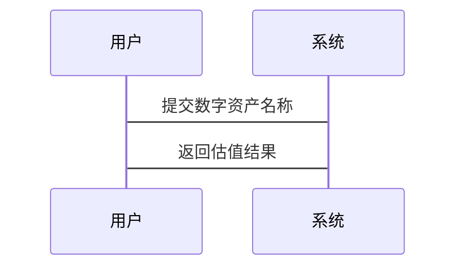

                 


# 股市估值在跨境数字资产评估中的应用

## 关键词：
- 股市估值
- 数字资产评估
- 跨境交易
- 金融分析
- 人工智能

## 摘要：
本文探讨了股市估值方法在跨境数字资产评估中的应用，重点分析了数字资产的特点、估值方法的挑战与创新，结合实际案例和系统设计，展示了如何利用传统金融工具与现代技术手段进行高效、准确的数字资产评估。文章内容涵盖从基础概念到算法实现，再到系统架构的完整流程，为读者提供了全面的理论与实践指导。

---

## 第1章 股市估值与数字资产评估概述

### 1.1 股市估值的基本概念
股票估值是通过对公司财务数据、市场环境和行业趋势进行分析，确定其股票的内在价值。传统估值方法包括市盈率（P/E）、市净率（P/B）和现金流折现模型（DCF）。这些方法在数字资产评估中面临新的挑战，如高波动性和跨境交易的复杂性。

### 1.2 数字资产的特点
数字资产具有去中心化、匿名性、可分割性和全球流动性等特点。这些特点使得数字资产的估值方法需要结合技术分析和市场行为分析。

### 1.3 股市估值在数字资产评估中的作用
股市估值方法为数字资产评估提供了理论基础，但需要结合数字资产的特殊性进行调整和创新。

---

## 第2章 股市估值的核心原理

### 2.1 股票估值的关键指标
- **市盈率（P/E）**：衡量股票价格与每股收益的比例。
- **市净率（P/B）**：衡量股票价格与每股净资产的比例。
- **股息率**：衡量股票分红与股票价格的比例。

### 2.2 数字资产评估的核心要素
- **市场流动性**：影响数字资产的买卖价差和交易成本。
- **信用风险**：评估数字资产发行方的信用状况。
- **监管环境**：不同国家的监管政策对数字资产估值的影响。

### 2.3 股市估值与数字资产评估的联系与区别
- **联系**：两者都需要分析财务数据和市场环境。
- **区别**：数字资产评估需要考虑技术特性和去中心化因素。

---

## 第3章 数字资产评估的核心算法

### 3.1 基于DCF模型的数字资产评估
#### 算法流程：
1. 预测未来现金流。
2. 确定合适的折现率。
3. 计算现值并评估内在价值。

#### Python代码示例：
```python
import numpy as np

def dcf_valuation(cash_flows, discount_rate):
    present_value = np.npv(discount_rate, cash_flows)
    return present_value
```

### 3.2 基于相对估值法的数字资产评估
#### 算法流程：
1. 选择可比公司。
2. 计算可比公司的估值倍数。
3. 应用到目标公司进行估值。

#### Python代码示例：
```python
import pandas as pd

def relative_valuation(ticker, benchmark):
    df = pd.DataFrame({ticker: [100, 200, 300], benchmark: [10, 20, 30]})
    pe_ratio = df[ticker] / df[benchmark]
    return pe_ratio.mean()
```

### 3.3 基于机器学习的数字资产评估
#### 算法流程：
1. 数据预处理。
2. 特征提取。
3. 模型训练与预测。

#### Python代码示例：
```python
from sklearn.ensemble import RandomForestRegressor

model = RandomForestRegressor()
model.fit(X_train, y_train)
prediction = model.predict(X_test)
```

---

## 第4章 系统分析与架构设计

### 4.1 系统功能模块设计
- **数据采集模块**：获取数字资产的市场数据和财务数据。
- **估值模块**：应用多种估值方法进行综合评估。
- **风险评估模块**：分析市场风险和信用风险。

### 4.2 系统架构设计


### 4.3 接口设计与交互流程


---

## 第5章 项目实战

### 5.1 环境配置
- 安装必要的Python库，如Pandas、NumPy、Scikit-learn。

### 5.2 核心代码实现
```python
import pandas as pd
from sklearn.model_selection import train_test_split
from sklearn.metrics import mean_squared_error

# 加载数据
data = pd.read_csv('digital_assets.csv')

# 数据分割
X = data.drop('target', axis=1)
y = data['target']

# 训练模型
X_train, X_test, y_train, y_test = train_test_split(X, y, test_size=0.2)

# 模型训练
model = RandomForestRegressor()
model.fit(X_train, y_train)

# 预测与评估
y_pred = model.predict(X_test)
print(mean_squared_error(y_test, y_pred))
```

### 5.3 案例分析
以比特币为例，分析其历史价格、市场波动性和监管环境，应用上述算法进行估值。

### 5.4 结果解读
通过对比实际价格与模型预测值，评估模型的准确性和适用性。

---

## 第6章 总结与展望

### 6.1 本章小结
本文详细探讨了股市估值在数字资产评估中的应用，结合传统方法与现代技术，提出了一套完整的解决方案。

### 6.2 未来研究方向
- 更复杂的机器学习模型。
- 跨境交易中的多因素分析。
- 监管政策对估值的影响。

### 6.3 最佳实践 tips
- 结合技术分析和基本面分析。
- 定期更新模型参数。
- 注意市场波动性和监管风险。

---

通过本文的系统分析和实战案例，读者可以全面理解股市估值在数字资产评估中的应用，并能够实际操作相关技术。希望本文能为数字资产评估领域提供有价值的参考和指导。

