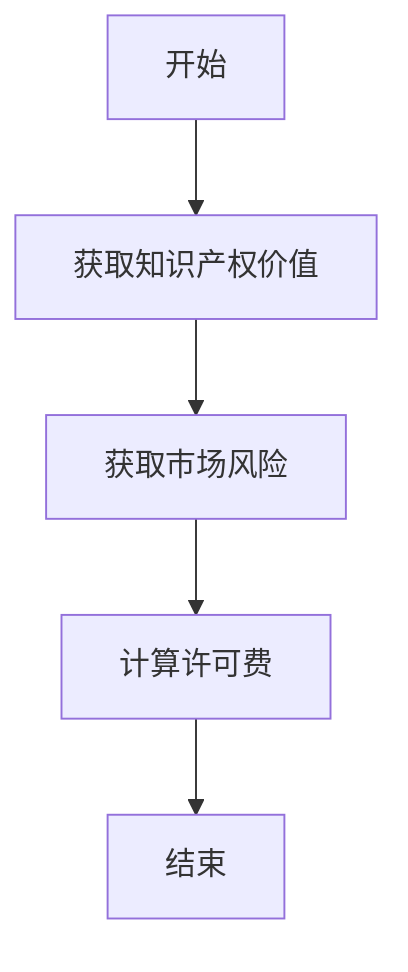
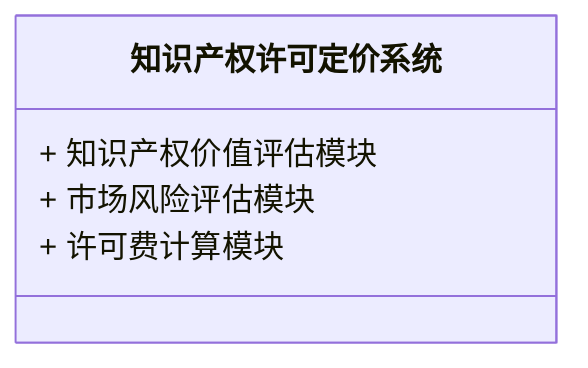

                 


# 股市估值在跨境知识产权许可定价中的应用

## 关键词：股市估值、知识产权许可定价、跨境、数学模型、算法原理、系统架构

## 摘要

本文探讨了股市估值方法在跨境知识产权许可定价中的应用，分析了股市估值的核心概念与知识产权定价的关联性，构建了基于股市数据的数学模型，并通过算法实现和系统架构设计展示了如何将股市估值应用于实际定价策略中。文章还提供了具体的项目实战案例，帮助读者理解如何利用股市估值优化知识产权许可定价。

---

## 第1章: 股市估值与知识产权许可定价概述

### 1.1 股市估值的基本概念

#### 1.1.1 股市估值的定义与核心要素

股市估值是通过对上市公司财务数据和市场表现的分析，评估其市场价值的过程。核心要素包括：

- **市盈率（P/E）**：股价与每股收益的比率。
- **市净率（P/B）**：股价与每股净资产的比率。
- **现金流（DCF）**：通过现金流折现法评估企业价值。

#### 1.1.2 知识产权许可定价的定义与特点

知识产权许可定价是指在跨国交易中，许可方与被许可方就知识产权的使用达成价格的过程。其特点包括：

- **技术依赖性**：定价受技术创新程度影响。
- **地域差异性**：不同国家的市场环境和法律差异会影响定价。
- **动态调整性**：定价需根据市场变化和交易条件进行调整。

#### 1.1.3 股市估值在知识产权定价中的应用背景

随着全球化的发展，知识产权的跨国交易日益频繁。股市估值提供了企业价值评估的工具，为知识产权定价提供了新的思路。

---

### 1.2 股市估值与知识产权许可定价的核心联系

#### 1.2.1 股市估值方法的可迁移性

股市估值方法可应用于知识产权定价，因为两者都需要对无形资产进行市场评估。

#### 1.2.2 知识产权价值评估的市场定价逻辑

知识产权的价值取决于其市场应用前景和技术创新性，这与股市估值中的企业价值评估逻辑相似。

#### 1.2.3 股市估值在跨境许可中的独特优势

股市估值考虑了市场波动和企业风险，为跨境知识产权定价提供了动态调整的依据。

---

## 第2章: 股市估值与知识产权许可定价的理论基础

### 2.1 股市估值的主要方法

#### 2.1.1 市盈率法

市盈率法通过比较同类企业的市盈率来评估目标企业的价值。公式为：

$$ P/E = \frac{\text{股价}}{\text{每股收益}} $$

#### 2.1.2 市净率法

市净率法通过比较同类企业的市净率来评估目标企业的价值。公式为：

$$ P/B = \frac{\text{股价}}{\text{每股净资产}} $$

#### 2.1.3 现金流折现法

现金流折现法通过将未来现金流折现至现值来评估企业价值。公式为：

$$ DCF = \sum_{t=1}^{n} \frac{CF_t}{(1+r)^t} + \frac{TV}{(1+r)^n} $$

---

### 2.2 知识产权价值评估的关键因素

#### 2.2.1 技术创新性

技术创新性高的知识产权价值更高，可通过技术评估模型量化。

#### 2.2.2 市场需求

市场需求影响知识产权的使用价值，可通过市场调研数据评估。

#### 2.2.3 法律保护力度

法律保护力度影响知识产权的市场风险，可通过法律分析量化。

---

## 第3章: 股市估值在知识产权许可定价中的数学模型构建

### 3.1 股市估值的核心公式

#### 3.1.1 市盈率公式

$$ P/E = \frac{\text{股价}}{\text{每股收益}} $$

#### 3.1.2 现金流折现公式

$$ DCF = \sum_{t=1}^{n} \frac{CF_t}{(1+r)^t} + \frac{TV}{(1+r)^n} $$

---

### 3.2 知识产权许可定价模型

#### 3.2.1 许可费计算公式

$$ L = \alpha \times V + \beta \times R $$

其中：
- \( L \)：许可费
- \( V \)：知识产权价值
- \( R \)：市场风险溢价
- \( \alpha \) 和 \( \beta \)：系数，根据市场情况确定。

---

## 第4章: 知识产权许可定价的算法原理

### 4.1 算法实现

```python
def calculate_license_fee(value, risk, alpha, beta):
    return alpha * value + beta * risk
```

---

### 4.2 算法流程图



---

## 第5章: 系统分析与架构设计

### 5.1 系统功能设计



---

### 5.2 系统架构设计


---

## 第6章: 项目实战

### 6.1 环境安装

安装Python和相关库：

```bash
pip install numpy pandas matplotlib
```

---

### 6.2 核心代码实现

```python
import numpy as np
import pandas as pd

def calculate_license_fee(value, risk, alpha, beta):
    return alpha * value + beta * risk

data = pd.read_csv('intellectual_property.csv')
data['许可费'] = calculate_license_fee(data['价值'], data['风险'], 0.5, 0.3)
print(data.head())
```

---

### 6.3 实际案例分析

以某技术专利为例，通过上述代码计算许可费，并分析结果。

---

## 第7章: 总结与展望

### 7.1 本章总结

本文通过股市估值方法，构建了知识产权许可定价的数学模型，并提供了算法实现和系统架构设计。案例分析验证了模型的有效性。

### 7.2 未来展望

未来研究可进一步优化模型，引入更多市场因素，并探索其他估值方法。

---

## 附录

### 附录A: 常用股票估值公式

1. 市盈率：$$ P/E = \frac{\text{股价}}{\text{每股收益}} $$
2. 现金流折现：$$ DCF = \sum_{t=1}^{n} \frac{CF_t}{(1+r)^t} + \frac{TV}{(1+r)^n} $$

---

通过本文的分析，读者可以深入了解股市估值在跨境知识产权许可定价中的应用，并掌握实际操作的方法。

