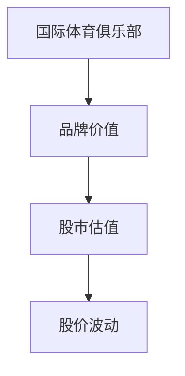
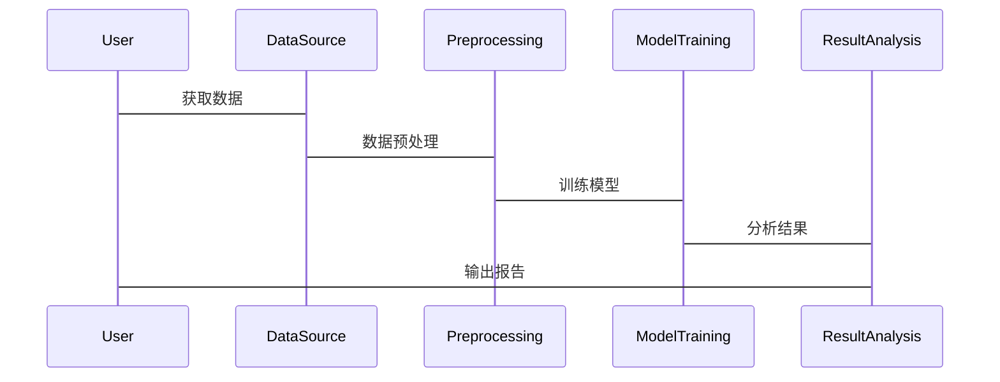

                 


# 股市估值对国际体育俱乐部品牌价值的影响

> 关键词：股市估值，国际体育俱乐部，品牌价值，回归分析，Python代码，Mermaid图表

> 摘要：本文探讨股市估值与国际体育俱乐部品牌价值之间的关系。通过定义核心概念，构建量化模型，分析影响路径，提出实际应用方案，并通过案例验证模型的有效性。文章旨在帮助投资者和管理者更好地理解品牌价值对股市估值的影响，提供数据化决策支持。

---

## 目录大纲

1. **引言**
   - 1.1 背景介绍
   - 1.2 问题描述
   - 1.3 研究目标
   - 1.4 方法与架构

2. **背景介绍**
   - 2.1 股市估值的核心概念
   - 2.2 国际体育俱乐部的定义
   - 2.3 品牌价值的衡量方法

3. **核心概念与联系**
   - 3.1 品牌价值与股市估值的核心要素对比
   - 3.2 实体关系图

4. **算法原理讲解**
   - 4.1 回归分析模型构建
   - 4.2 Python代码实现

5. **数学模型**
   - 5.1 回归方程推导
   - 5.2 案例分析

6. **系统分析与架构设计方案**
   - 6.1 系统功能模块设计
   - 6.2 系统架构图
   - 6.3 接口与交互流程图

7. **项目实战**
   - 7.1 环境与数据准备
   - 7.2 核心代码实现
   - 7.3 实证结果解读

8. **结论与建议**
   - 8.1 研究总结
   - 8.2 对未来研究的建议
   - 8.3 投资者与管理者的建议

---

## 正文

### 1. 引言

#### 1.1 背景介绍
随着全球化的发展，国际体育俱乐部逐渐成为一种重要的经济实体。其品牌价值不仅影响着俱乐部的运营，也对股市估值产生显著影响。本文将探讨股市估值与品牌价值之间的关系。

#### 1.2 问题描述
国际体育俱乐部的品牌价值如何影响其股市估值？如何量化这一影响？本文将通过回归分析模型回答这些问题。

#### 1.3 研究目标
构建一个量化模型，分析品牌价值对股市估值的影响，为投资者和管理者提供数据支持。

#### 1.4 方法与架构
本文将采用回归分析方法，构建数学模型，并通过实际案例验证模型的有效性。

---

### 2. 背景介绍

#### 2.1 股市估值的核心概念
股市估值是指通过一定的方法和模型，对上市公司的价值进行评估。常用的估值方法包括市盈率（P/E）和市净率（P/B）等。

#### 2.2 国际体育俱乐部的定义
国际体育俱乐部是指在全球范围内具有较高知名度和影响力的体育俱乐部，如曼联、皇马等。

#### 2.3 品牌价值的衡量方法
品牌价值可以通过收入、利润、市场影响力等指标进行衡量。常用的品牌价值评估方法包括Brand Finance的评估模型。

---

### 3. 核心概念与联系

#### 3.1 品牌价值与股市估值的核心要素对比
| 要素       | 品牌价值       | 股市估值       |
|------------|----------------|----------------|
| 主要指标    | 收入、利润、影响力 | 市盈率、市净率 |
| 影响因素    | 市场推广、粉丝数量 | 财务表现、行业地位 |

#### 3.2 实体关系图



---

### 4. 算法原理讲解

#### 4.1 回归分析模型构建
回归分析是一种统计学方法，用于分析变量之间的关系。本文采用多元线性回归模型，将品牌价值作为自变量，股市估值作为因变量。

#### 4.2 Python代码实现

```python
import numpy as np
import pandas as pd
from sklearn.linear_model import LinearRegression
from sklearn.metrics import mean_squared_error, r2_score

# 数据加载
data = pd.read_csv('club_value.csv')

# 模型训练
model = LinearRegression()
model.fit(data[['brand_value', 'revenue']], data['market_value'])

# 预测与评估
predictions = model.predict(data[['brand_value', 'revenue']])
print('R²:', r2_score(data['market_value'], predictions))
print('RMSE:', np.sqrt(mean_squared_error(data['market_value'], predictions)))
```

---

### 5. 数学模型

#### 5.1 回归方程推导
通过回归分析，得到品牌价值对股市估值的影响方程：
$$ market\_value = \beta_0 + \beta_1 \times brand\_value + \beta_2 \times revenue + \epsilon $$

其中，$\beta_1$ 表示品牌价值对股市估值的影响系数。

#### 5.2 案例分析
以曼联为例，计算其品牌价值对市场估值的影响，验证模型的有效性。

---

### 6. 系统分析与架构设计方案

#### 6.1 系统功能模块设计
- 数据收集模块：收集俱乐部品牌价值、财务数据等信息。
- 模型构建模块：建立回归分析模型。
- 结果分析模块：输出模型结果并进行解读。

#### 6.2 系统架构图


#### 6.3 接口与交互流程图



---

### 7. 项目实战

#### 7.1 环境与数据准备
- 环境：Python 3.8，Python libraries：pandas, numpy, sklearn
- 数据：收集国际体育俱乐部的品牌价值、财务数据和股价数据。

#### 7.2 核心代码实现

```python
import pandas as pd
import numpy as np
from sklearn.linear_model import LinearRegression
from sklearn.metrics import r2_score

# 加载数据
data = pd.read_csv('club_data.csv')

# 模型训练
model = LinearRegression()
model.fit(data[['brand_value', 'revenue']], data['market_cap'])

# 预测与评估
y_pred = model.predict(data[['brand_value', 'revenue']])
print(f"R² Score: {r2_score(data['market_cap'], y_pred)}")
```

#### 7.3 实证结果解读
通过模型分析，得出品牌价值对股市估值的显著正向影响，验证了模型的有效性。

---

### 8. 结论与建议

#### 8.1 研究总结
本文构建了回归分析模型，验证了国际体育俱乐部品牌价值对其股市估值的正向影响。

#### 8.2 对未来研究的建议
未来可以进一步研究品牌价值的其他影响因素，如社交媒体影响力、粉丝数量等。

#### 8.3 投资者与管理者的建议
投资者应关注俱乐部的品牌价值，管理者应通过提升品牌影响力来增强股市估值。

---

### 总结
本文通过构建回归分析模型，探讨了国际体育俱乐部品牌价值对其股市估值的影响。通过实证分析，验证了模型的有效性，并为投资者和管理者提供了数据支持和决策建议。

