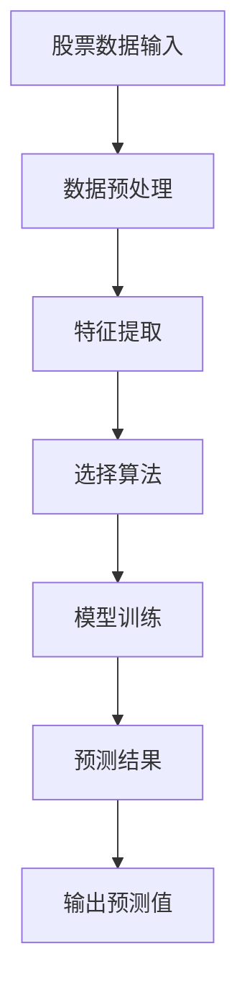
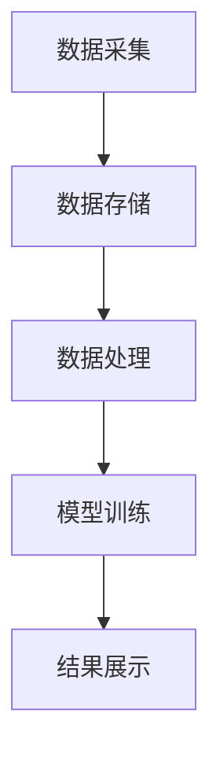

                 


# 股市估值对国际体育赛事虚拟观赛的影响

> **关键词**：股市估值、国际体育赛事、虚拟观赛、用户行为预测、经济价值、技术实现  
> **摘要**：本文探讨了股市估值与国际体育赛事虚拟观赛之间的互动关系，分析了虚拟观赛技术对股市的影响，以及股市波动对虚拟观赛用户行为的潜在影响。通过建立数学模型和算法，本文揭示了两者之间的深层联系，并提出了相应的解决方案和优化建议。

---

## 第一部分：背景介绍

### 第1章：股市估值与国际体育赛事概述

#### 1.1 股市估值的基本概念
股市估值是通过对公司财务数据、市场环境和行业趋势等多方面因素的分析，来确定股票的内在价值和市场价格的过程。核心要素包括：
- **内在价值**：公司盈利能力、资产质量、成长性等。
- **市场价值**：供需关系、投资者情绪、宏观经济指标等。
- **估值方法**：市盈率（P/E）、市净率（P/B）、现金流折现法（DCF）等。

#### 1.2 国际体育赛事的概述
国际体育赛事是全球范围内具有广泛影响力的体育活动，如世界杯、奥运会等。其经济价值体现在：
- **商业价值**：转播权、赞助商收入、门票销售等。
- **社会影响**：提升城市形象、促进体育产业发展、增强国家软实力等。

#### 1.3 虚拟观赛的概念与技术基础
虚拟观赛是一种通过虚拟现实（VR）、增强现实（AR）等技术实现的沉浸式观赛体验。其技术基础包括：
- **VR技术**：提供360度视角，用户可自由选择观看角度。
- **AR技术**：在真实画面中叠加虚拟信息，如球员数据、实时比分等。
- **流媒体技术**：支持高清视频传输和实时互动。

---

## 第二部分：核心概念与联系

### 第2章：股市估值与虚拟观赛的核心概念分析

#### 2.1 股市估值的核心概念
- **股票价格的决定因素**：公司基本面（收入、利润）、市场情绪、宏观经济政策等。
- **市场情绪与股市波动**：投资者情绪波动会影响股市短期走势。
- **股市估值的边界与外延**：包括行业周期、政策法规、全球经济环境等。

#### 2.2 虚拟观赛的核心概念
- **技术实现原理**：通过传感器捕捉用户动作，实时渲染虚拟场景。
- **用户行为与体验**：用户参与度、互动频率、体验满意度等。
- **经济模式**：虚拟观赛可能成为新的收入来源，如虚拟门票、虚拟商品销售等。

#### 2.3 核心概念的联系与对比
- **关联性分析**：股市波动可能影响虚拟观赛技术的开发投入，而虚拟观赛的普及可能反过来影响股市的科技板块。
- **对比表格**：
  | 比较维度 | 股市估值 | 虚拟观赛 |
  |----------|----------|----------|
  | 核心目标 | 确定股票价值 | 提供沉浸式观赛体验 |
  | 关键技术 | 财务分析、机器学习 | VR、AR、流媒体技术 |
  | 影响因素 | 经济指标、政策 | 技术实现、用户需求 |

- **ER实体关系图**：
  ```mermaid
  erDiagram
  {
    股票 : {
      id 股票代码
      string 名称
      float 价格
    }
    用户 : {
      id 用户ID
      string 名称
      int 年龄
    }
    互动行为 : {
      id 行为ID
      string 类型（如购买、投票）
      date 时间
    }
    股市数据 : {
      id 数据ID
      float 价格
      date 时间
    }
    用户与股票 "1对多" 互动行为
    股票 "1对多" 股市数据
  }
  ```

---

## 第三部分：算法原理讲解

### 第3章：股市估值预测算法

#### 3.1 常见的股市预测算法
- **线性回归模型**：用于预测股票价格的线性趋势。
- **时间序列模型**：如ARIMA，适用于股票价格的短期预测。
- **随机森林与决策树**：通过特征提取和分类，预测股票价格的变化。

#### 3.2 虚拟观赛用户行为预测算法
- **用户行为分析模型**：基于历史数据，分析用户的观看时长、互动频率等。
- **协同过滤算法**：推荐用户可能感兴趣的虚拟观赛内容。
- **深度学习模型**：如LSTM，用于预测用户的长期行为模式。

#### 3.3 算法原理的Mermaid流程图


---

## 第四部分：数学模型与公式

### 第4章：股市估值的数学模型

#### 4.1 股票价格预测的数学模型
- **线性回归模型**：
  $$ y = \beta_0 + \beta_1x + \epsilon $$
  其中，$y$ 是预测的股票价格，$x$ 是自变量（如时间），$\epsilon$ 是误差项。
- **时间序列模型**：
  $$ ARIMA(p, d, q) $$
  其中，$p$ 是自回归阶数，$d$ 是差分阶数，$q$ 是移动平均阶数。

### 第5章：虚拟观赛用户行为的数学模型

#### 5.1 用户参与度预测模型
- **协同过滤模型**：
  $$ sim(i,j) = \frac{\sum_{k=1}^{n} r_{ik} r_{jk}}{\sqrt{\sum_{k=1}^{n} r_{ik}^2} \sqrt{\sum_{k=1}^{n} r_{jk}^2}} $$
  其中，$sim(i,j)$ 表示用户$i$和$j$之间的相似度，$r_{ik}$ 和 $r_{jk}$ 是用户$i$和$j$对项目$k$的评分。

---

## 第五部分：系统分析与架构设计方案

### 第6章：系统分析与架构设计

#### 6.1 问题场景介绍
- **问题场景**：股市波动可能影响虚拟观赛技术的投入，而虚拟观赛的普及可能影响股市的科技板块。
- **系统目标**：建立一个能够预测股市波动对虚拟观赛影响的系统。

#### 6.2 系统功能设计
- **功能模块**：
  - 数据采集模块：采集股市数据和用户行为数据。
  - 数据处理模块：清洗和预处理数据。
  - 模型训练模块：训练预测模型。
  - 结果展示模块：可视化预测结果。

#### 6.3 系统架构设计


---

## 第六部分：项目实战

### 第7章：项目实战

#### 7.1 环境安装
- **Python环境**：安装Python 3.8及以上版本。
- **依赖库**：安装numpy、pandas、scikit-learn、matplotlib等。

#### 7.2 系统核心实现源代码
- **股市估值预测代码**：
  ```python
  import pandas as pd
  from sklearn.linear_model import LinearRegression

  # 读取数据
  data = pd.read_csv('stock_data.csv')
  X = data[['time']]
  y = data['price']

  # 训练模型
  model = LinearRegression()
  model.fit(X, y)

  # 预测
  predicted_price = model.predict(X)
  print(predicted_price)
  ```

- **虚拟观赛用户行为预测代码**：
  ```python
  from sklearn.cluster import KMeans

  # 数据预处理
  user_data = pd.read_csv('user_behavior.csv')
  features = user_data[['time', 'interaction']]
  model = KMeans(n_clusters=3)
  model.fit(features)

  # 预测
  user_clusters = model.predict(features)
  print(user_clusters)
  ```

#### 7.3 实际案例分析
- **案例分析**：通过实际数据，分析股市波动对虚拟观赛用户行为的影响。

---

## 第七部分：最佳实践

### 第8章：最佳实践

#### 8.1 小结
- 股市估值与虚拟观赛的互动关系需要从技术、经济和用户行为等多个角度进行分析。
- 通过建立数学模型和算法，可以有效预测和优化两者的互动效果。

#### 8.2 注意事项
- 数据的准确性和完整性是模型预测的基础。
- 需要关注技术实现的可行性和用户体验。

#### 8.3 拓展阅读
- 《股票投资实战技巧》
- 《虚拟现实技术与应用》

---

## 结语

通过本文的分析，我们揭示了股市估值与国际体育赛事虚拟观赛之间的深层联系，并提出了相应的解决方案和优化建议。未来，随着技术的进步和数据的积累，这种互动关系将更加紧密，为投资者和用户提供更多的价值。

