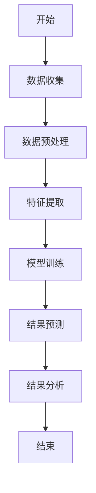
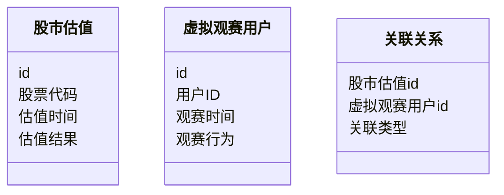
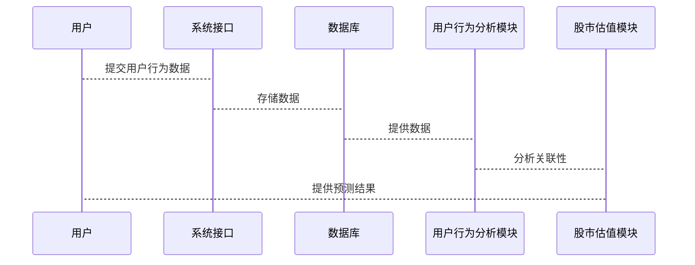

                 


# 股市估值对国际体育赛事虚拟观赛的影响

> **关键词**：股市估值、国际体育赛事、虚拟观赛、用户行为预测、算法原理、系统架构

> **摘要**：本文探讨股市估值与国际体育赛事虚拟观赛之间的关系，分析股市波动如何影响虚拟观赛行为，以及虚拟观赛如何反过来影响体育产业的经济表现。通过机器学习算法，本文提出了一种基于股市估值预测用户虚拟观赛行为的方法，并结合系统架构设计，展示了如何通过技术手段优化虚拟观赛体验，从而间接影响股市估值。

---

# 第一部分: 背景介绍与核心概念

## 第1章: 背景介绍与问题背景

### 1.1 问题背景

#### 1.1.1 股市估值的定义与作用
股市估值是指通过对公司财务数据、市场趋势和行业动态的分析，估算公司股票的合理价格。股市估值的准确性直接影响投资者的决策，进而影响市场的波动。

#### 1.1.2 国际体育赛事的虚拟观赛现象
随着技术的发展，虚拟观赛已成为一种新兴的体育消费方式。用户可以通过虚拟现实（VR）、增强现实（AR）或流媒体技术，在家中或任何地方观看体育赛事，提升观赛体验。

#### 1.1.3 股市估值与虚拟观赛的关联性
股市估值与虚拟观赛看似无关，但其实两者通过用户行为和市场情绪相互关联。股市波动可能影响消费者的经济状况，从而影响他们对虚拟观赛的消费能力；而虚拟观赛的普及也可能改变用户对体育产业的消费行为，进而影响相关企业的股市估值。

### 1.2 问题描述

#### 1.2.1 股市估值对虚拟观赛行为的影响
股市波动可能导致消费者信心下降，从而减少他们在虚拟观赛上的消费。例如，经济不景气时，用户可能减少购买虚拟观赛设备或订阅虚拟观赛服务。

#### 1.2.2 虚拟观赛对体育产业的经济影响
虚拟观赛的普及可能改变传统体育赛事的收入模式。例如，门票收入可能减少，但虚拟观赛的订阅收入可能增加。这种转变会影响相关企业的收入预期，进而影响其股市估值。

#### 1.2.3 股市波动与体育消费行为的关系
股市波动可能影响消费者的经济状况，从而影响他们的消费行为。例如，股市上涨时，消费者可能更愿意在虚拟观赛上投入更多资金；而股市下跌时，消费者可能减少相关支出。

### 1.3 问题解决

#### 1.3.1 通过股市估值预测虚拟观赛需求
通过分析股市估值的变化，预测虚拟观赛用户的需求变化，从而帮助企业更好地制定市场策略。

#### 1.3.2 虚拟观赛对体育产业经济的影响分析
研究虚拟观赛如何改变传统体育产业的收入结构，帮助企业调整业务模式，以适应新的市场环境。

#### 1.3.3 提升虚拟观赛体验以影响股市估值
通过优化虚拟观赛技术，提升用户体验，吸引更多用户参与，从而增加相关企业的收入，改善其股市估值。

### 1.4 边界与外延

#### 1.4.1 股市估值的边界条件
- 股市估值的计算方法和模型
- 数据来源的可靠性
- 市场环境的稳定性

#### 1.4.2 虚拟观赛的边界条件
- 技术实现的可行性
- 用户接受度
- 市场推广的策略

#### 1.4.3 两者关系的外延分析
- 股市估值对虚拟观赛的长期影响
- 虚拟观赛对股市估值的反馈效应
- 其他经济因素对两者关系的调节作用

### 1.5 核心概念与组成

#### 1.5.1 核心概念的结构
- 股市估值：核心概念包括股票价格、市场趋势、财务数据
- 虚拟观赛：核心概念包括技术实现、用户体验、商业模式

#### 1.5.2 核心要素的对比分析
- 股市估值的动态性与虚拟观赛的技术性
- 股市估值的经济属性与虚拟观赛的消费属性

---

# 第二部分: 核心概念与联系

## 第2章: 核心概念与联系

### 2.1 核心概念原理

#### 2.1.1 股市估值的计算方法
股市估值通常基于以下方法：
1. **市盈率法**：用公司股价除以每股收益，评估股票价值。
2. **市净率法**：用公司股价除以每股净资产，评估股票价值。
3. **现金流折现法**：基于未来现金流的现值评估股票价值。

#### 2.1.2 虚拟观赛的技术实现
虚拟观赛的技术实现包括：
1. **虚拟现实（VR）**：提供沉浸式的观赛体验。
2. **增强现实（AR）**：在真实环境中叠加虚拟元素，增强观赛体验。
3. **流媒体技术**：通过高速网络传输高质量视频，实现实时观赛。

### 2.2 概念属性特征对比

| **属性**         | **股市估值**               | **虚拟观赛**               |
|------------------|---------------------------|---------------------------|
| **技术基础**     | 财务分析、市场数据         | VR、AR、流媒体技术         |
| **用户行为**     | 投资者决策、交易行为       | 消费者选择、使用频率       |
| **经济影响**     | 影响企业市值、投资者信心   | 影响企业收入、消费模式     |

### 2.3 ER实体关系图
```mermaid
er
    entity 股市估值 {
        id
        股票代码
        估值时间
        估值结果
    }
    entity 虚拟观赛 {
        id
        用户ID
        观赛时间
        观赛行为
    }
    relation 关联关系 {
        股市估值id
        虚拟观赛id
        关联类型
    }
```

---

# 第三部分: 算法原理与数学模型

## 第3章: 算法原理与数学模型

### 3.1 算法原理

#### 3.1.1 基于机器学习的用户行为预测
通过分析股市估值和用户行为数据，构建机器学习模型，预测用户在虚拟观赛中的行为变化。

#### 3.1.2 股市估值与虚拟观赛的关联模型
建立股市估值与虚拟观赛用户行为之间的数学模型，分析两者之间的相关性。

### 3.2 算法流程图


### 3.3 算法实现

#### 3.3.1 Python代码实现
```python
import pandas as pd
from sklearn.model_selection import train_test_split
from sklearn.linear_model import LinearRegression
from sklearn.metrics import mean_squared_error

# 数据加载与预处理
data = pd.read_csv('user_behavior.csv')
X = data[['stock_valuation', 'user_behavior']]
y = data['virtual_viewing']

# 数据划分
X_train, X_test, y_train, y_test = train_test_split(X, y, test_size=0.2, random_state=42)

# 模型训练
model = LinearRegression()
model.fit(X_train, y_train)

# 模型预测
y_pred = model.predict(X_test)

# 模型评估
mse = mean_squared_error(y_test, y_pred)
print(f'Mean Squared Error: {mse}')
```

#### 3.3.2 数学模型与公式
股票价格预测模型：
$$ y = \beta_0 + \beta_1 x + \epsilon $$
其中，$y$ 是股票价格，$x$ 是用户虚拟观赛行为，$\beta_0$ 和 $\beta_1$ 是模型参数，$\epsilon$ 是误差项。

用户行为预测模型：
$$ P(y|X) = \theta_0 + \theta_1 x_1 + \theta_2 x_2 + \ldots + \theta_n x_n $$

---

# 第四部分: 系统分析与架构设计

## 第4章: 系统分析与架构设计

### 4.1 问题场景介绍
用户希望通过虚拟观赛技术提升观赛体验，同时企业希望通过股市估值预测用户行为，优化市场策略。

### 4.2 系统功能设计

#### 4.2.1 领域模型类图


#### 4.2.2 系统架构设计


### 4.3 系统接口设计
- **输入接口**：用户行为数据、股市数据
- **输出接口**：预测结果、用户行为分析报告

### 4.4 系统交互序列图


---

# 第五部分: 项目实战

## 第5章: 项目实战

### 5.1 环境安装
安装Python、Pandas、Scikit-learn等工具。

### 5.2 核心功能实现

#### 5.2.1 数据收集与预处理
```python
import pandas as pd
data = pd.read_csv('user_behavior.csv')
data.head()
```

#### 5.2.2 模型训练与预测
```python
from sklearn.linear_model import LinearRegression
model = LinearRegression()
model.fit(X_train, y_train)
y_pred = model.predict(X_test)
```

### 5.3 案例分析

#### 5.3.1 数据分析
分析股市估值与用户虚拟观赛行为的相关性。

#### 5.3.2 结果解读
解读模型预测结果，评估模型的准确性和实用性。

### 5.4 项目小结
总结项目实施过程中的经验和教训，提出改进建议。

---

# 第六部分: 最佳实践与小结

## 第6章: 最佳实践与小结

### 6.1 最佳实践

#### 6.1.1 数据质量管理
确保数据的准确性和完整性，避免因数据问题影响模型预测。

#### 6.1.2 模型优化
通过交叉验证和超参数调优，提升模型的预测精度。

### 6.2 小结
本文通过分析股市估值与虚拟观赛的关系，提出了基于机器学习的预测方法，并设计了系统的架构方案，展示了如何通过技术手段优化虚拟观赛体验，从而影响股市估值。

### 6.3 注意事项
- 数据隐私保护
- 模型的实时性与可扩展性
- 用户体验的持续优化

### 6.4 拓展阅读
建议读者进一步阅读相关领域的最新研究成果，如：
1. 《股票市场预测的机器学习方法》
2. 《虚拟现实技术在体育产业中的应用》

---

通过本文的分析与实践，我们不仅了解了股市估值与虚拟观赛之间的复杂关系，还掌握了一种基于机器学习的技术方法，为后续的研究和实践提供了参考。

