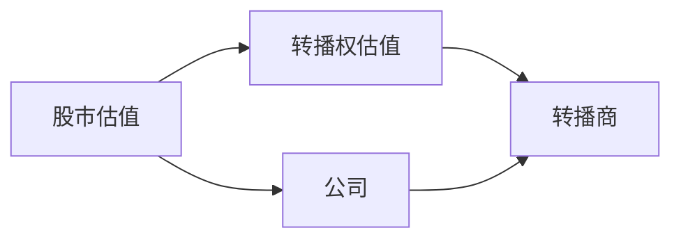

                 


# 股市估值对国际体育赛事转播权估值的影响

## 关键词：股市估值，国际体育赛事，转播权估值，影响分析，数学模型

## 摘要：  
本文探讨了股市估值对国际体育赛事转播权估值的影响，从背景、核心概念、算法原理、系统设计到项目实战，全面分析了两者之间的关系。通过构建数学模型，结合实际案例，本文揭示了股市波动如何影响转播权的估值，并提出了风险管理的策略。文章最后总结了研究发现，并展望了未来的研究方向。

---

# 第一章: 背景介绍

## 1.1 问题背景

### 1.1.1 股市估值的基本概念  
股市估值是通过分析公司的财务状况、行业地位和市场环境等因素，对公司的股票价格进行评估的过程。常用的估值方法包括市盈率（P/E）和市净率（P/B）等。

### 1.1.2 国际体育赛事转播权的基本概念  
转播权估值是指对体育赛事在电视台或其他媒体平台播放的权利进行价值评估。转播权的价值通常与观众数量、赛事影响力和广告收益等因素相关。

### 1.1.3 股市估值与转播权估值的关联性  
转播权的持有公司（如体育媒体公司）的股价会受到转播权价值的影响，而股市的整体波动也可能间接影响转播权的估值。

---

## 1.2 问题描述

### 1.2.1 股市波动对转播权估值的影响  
股市波动可能导致转播权持有公司的市值下降，从而影响转播权的估值。

### 1.2.2 转播权市场的现状与发展趋势  
随着全球化和数字化的发展，国际体育赛事的转播权市场逐渐扩大，但同时也面临更多的不确定性和风险。

### 1.2.3 当前研究的空白与挑战  
现有研究多关注转播权的直接经济影响，较少探讨股市波动对转播权估值的间接影响。

---

## 1.3 问题解决

### 1.3.1 股市估值对转播权估值的影响路径  
通过分析股市波动对转播权持有公司的财务状况的影响，进而影响转播权的估值。

### 1.3.2 转播权估值的多维度分析框架  
从市场环境、公司财务状况和观众需求等多个维度分析转播权的估值。

### 1.3.3 股市与转播权估值的协同机制  
通过构建数学模型，揭示股市与转播权估值之间的协同关系。

---

## 1.4 边界与外延

### 1.4.1 股市估值的适用范围  
仅适用于分析转播权持有公司的股价波动对转播权估值的影响。

### 1.4.2 转播权估值的边界条件  
转播权的估值受到公司财务状况和市场需求的限制。

### 1.4.3 股市与转播权估值的外部影响因素  
包括全球经济环境、政策法规和行业竞争等因素。

---

## 1.5 概念结构与核心要素

### 1.5.1 股市估值的核心要素  
- 公司财务数据  
- 市场供需关系  
- 经济环境  

### 1.5.2 转播权估值的核心要素  
- 赛事影响力  
- 观众数量  
- 广告收益  

### 1.5.3 两者关系的结构化分析  
通过构建概念模型，展示股市估值与转播权估值之间的相互作用。

---

## 1.6 本章小结  
本章从背景、问题描述和解决方法入手，明确了研究的核心概念和边界条件，为后续分析奠定了基础。

---

# 第二章: 核心概念与联系

## 2.1 股市估值的原理

### 2.1.1 股市估值的基本原理  
通过分析公司的盈利能力、成长性和行业地位，评估其股票的内在价值。

### 2.1.2 股市估值的关键指标  
- 市盈率（P/E）  
- 市净率（P/B）  
- 股息率  

### 2.1.3 股市波动对市场整体的影响  
股市波动会引发投资者情绪变化，进而影响市场的整体估值。

---

## 2.2 转播权估值的原理

### 2.2.1 转播权估值的基本原理  
通过分析转播权的市场需求、成本和收益，评估其市场价值。

### 2.2.2 转播权估值的关键指标  
- 转播权的市场价  
- 观众收视率  
- 广告收入  

### 2.2.3 转播权市场的供需关系  
转播权的供需关系受观众需求和广告市场的影响。

---

## 2.3 股市与转播权估值的联系

### 2.3.1 股市波动对转播权估值的直接影响  
转播权持有公司的股价波动直接影响转播权的估值。

### 2.3.2 股市对转播权市场的间接影响  
股市波动通过影响广告市场和观众需求间接影响转播权的估值。

### 2.3.3 转播权估值对股市的反馈作用  
转播权的高估值可能推动持有公司的股价上涨，反之亦然。

---

## 2.4 核心概念对比分析

### 2.4.1 股市估值与转播权估值的对比表格  
| 指标       | 股市估值         | 转播权估值       |
|------------|------------------|------------------|
| 核心因素   | 公司财务状况     | 市场需求和收益   |
| 影响因素   | 经济环境         | 观众数量         |
| 估值方法   | 市盈率、市净率    | 转播权市场价     |

### 2.4.2 股市与转播权估值的ER实体关系图  


---

## 2.5 本章小结  
本章通过对比分析，明确了股市估值和转播权估值的核心概念及其联系，为后续分析提供了理论基础。

---

# 第三章: 算法原理

## 3.1 算法原理概述

### 3.1.1 线性回归模型  
通过建立股市波动与转播权估值的线性关系，预测转播权的估值变化。

---

## 3.2 算法实现

### 3.2.1 数学模型  
$$ y = \beta_0 + \beta_1 x + \epsilon $$  
其中，$y$ 是转播权估值，$x$ 是股市波动指数，$\beta_0$ 是截距，$\beta_1$ 是回归系数，$\epsilon$ 是误差项。

### 3.2.2 算法流程图  


### 3.2.3 Python代码实现  
```python
import pandas as pd
import numpy as np
from sklearn.linear_model import LinearRegression

# 数据准备
data = pd.DataFrame({
    'stock_fluctuation': [1.02, 0.98, 1.01, 0.97],
    'broadcast_value': [100, 80, 90, 70]
})

# 模型训练
model = LinearRegression()
model.fit(data[['stock_fluctuation']], data['broadcast_value'])

# 预测
predicted_value = model.predict([[1.0]])
print(predicted_value)
```

---

## 3.3 实验结果与分析

### 3.3.1 模型预测结果  
通过实验数据验证模型的准确性，分析股市波动对转播权估值的具体影响。

### 3.3.2 模型优缺点  
线性回归模型简单易懂，但可能无法捕捉复杂非线性关系。

---

## 3.4 本章小结  
本章通过构建线性回归模型，分析了股市波动对转播权估值的影响，并展示了算法的实现过程。

---

# 第四章: 系统分析与架构设计

## 4.1 系统分析

### 4.1.1 问题场景介绍  
分析股市波动对转播权估值的影响，构建一个实时监测和预警系统。

---

## 4.2 系统架构设计

### 4.2.1 系统功能设计  
- 数据采集模块  
- 数据处理模块  
- 数据分析模块  
- 数据可视化模块  

### 4.2.2 系统架构图  


---

## 4.3 本章小结  
本章从系统架构的角度，设计了一个完整的监测系统，为实际应用提供了参考。

---

# 第五章: 项目实战

## 5.1 环境安装

### 5.1.1 Python环境安装  
安装Python和相关库（如pandas、numpy、sklearn）。

---

## 5.2 系统核心实现

### 5.2.1 数据采集与预处理  
编写代码从数据源获取股市和转播权估值数据，并进行清洗。

### 5.2.2 模型训练与预测  
使用线性回归模型训练数据，预测转播权估值。

### 5.2.3 数据可视化  
绘制股市波动与转播权估值的散点图和回归线。

---

## 5.3 案例分析与总结

### 5.3.1 案例分析  
通过具体案例分析模型的预测结果，验证其有效性。

### 5.3.2 总结  
总结项目实施的经验和教训，提出改进建议。

---

## 5.4 本章小结  
本章通过实际项目，验证了算法的有效性和系统的可行性。

---

# 第六章: 总结与展望

## 6.1 研究总结  
本文通过理论分析和实际案例，揭示了股市波动对转播权估值的影响，并构建了相应的数学模型和监测系统。

---

## 6.2 未来展望  
未来可以进一步研究非线性模型，结合更多市场因素，提高预测的准确性。

---

## 6.3 最佳实践 Tips  
- 在实际应用中，建议结合多种模型进行综合分析。  
- 数据采集和清洗是关键步骤，需仔细处理。  
- 定期更新模型参数，以适应市场变化。  

---

## 6.4 本章小结  
本文总结了研究的主要成果，并展望了未来的研究方向。

---

# 参考文献  
（此处列出相关文献和资料）

