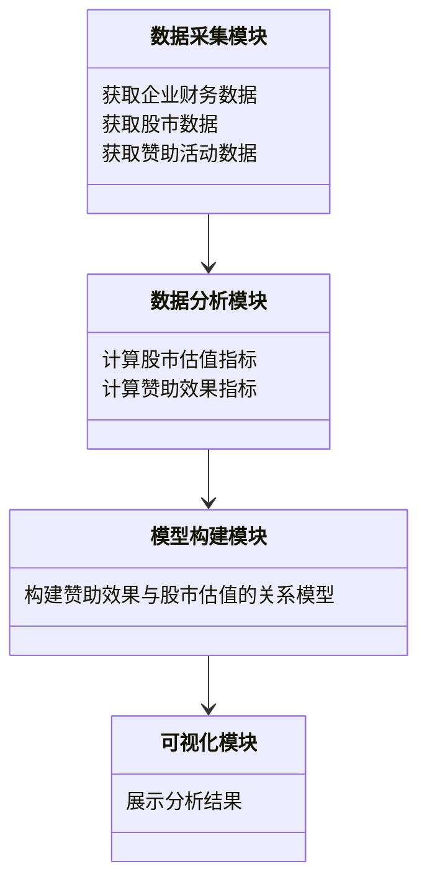
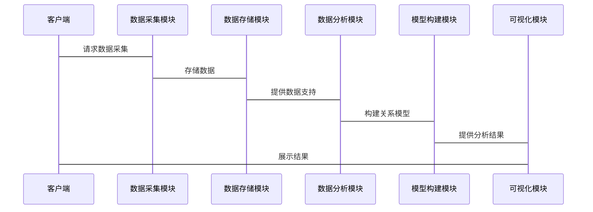

                 


# 股市估值对国际体育赞助效果评估的影响

> 关键词：股市估值，国际体育赞助，效果评估，经济价值，品牌价值，企业价值

> 摘要：本文探讨了股市估值对国际体育赞助效果评估的影响，从理论分析到实践案例，详细阐述了如何通过股市估值的核心指标和国际体育赞助的经济价值，构建评估模型，分析企业赞助效果与股市表现之间的关系。文章结合实际案例，提出了系统的解决方案和优化建议，为企业的赞助决策提供了理论依据和实践指导。

---

## 第五章: 系统分析与架构设计方案

### 5.1 问题场景介绍
#### 5.1.1 背景与目标
在国际体育赞助中，企业希望通过赞助活动提升品牌价值和市场表现，但如何量化赞助效果对股市估值的影响是当前面临的主要挑战。本章旨在构建一个系统化的分析框架，量化赞助效果与股市估值之间的关系。

#### 5.1.2 问题描述
- 如何量化体育赞助对品牌价值的提升？
- 如何将品牌价值的变化与股市估值变化联系起来？
- 如何构建一个可操作的分析模型？

### 5.2 项目介绍
本项目旨在开发一个基于股市估值的国际体育赞助效果评估系统，通过数据采集、模型构建和可视化分析，帮助企业评估赞助活动的实际效果。

### 5.3 系统功能设计
#### 5.3.1 功能模块划分
- 数据采集模块：获取企业财务数据、股市数据和赞助活动数据。
- 数据分析模块：计算股市估值指标和赞助效果指标。
- 模型构建模块：建立赞助效果与股市估值的关系模型。
- 可视化模块：展示分析结果，提供直观的决策支持。

#### 5.3.2 领域模型（Mermaid 类图）


### 5.4 系统架构设计
#### 5.4.1 系统架构图（Mermaid 架构图）
```mermaid
architectural
    客户端 --> 数据采集模块
    数据采集模块 --> 数据存储模块
    数据存储模块 --> 数据分析模块
    数据分析模块 --> 模型构建模块
    模型构建模块 --> 可视化模块
    可视化模块 --> 客户端
```

#### 5.4.2 关键接口设计
- 数据采集接口：用于获取实时的股市数据和赞助活动数据。
- 数据分析接口：用于计算股市估值指标和赞助效果指标。
- 模型接口：用于构建和调用赞助效果与股市估值的关系模型。
- 可视化接口：用于展示分析结果。

### 5.5 系统交互设计
#### 5.5.1 系统交互流程（Mermaid 序列图）


---

## 第六章: 项目实战

### 6.1 环境安装与数据获取
#### 6.1.1 环境配置
- 安装 Python 3.8+
- 安装必要的库：pandas、numpy、scipy、matplotlib、seaborn、requests

#### 6.1.2 数据获取
通过 APIs 获取以下数据：
- 企业财务数据：收入、利润、市盈率等。
- 股市数据：股价、成交量、市场指数。
- 赞助活动数据：赞助金额、赞助时长、赞助效果指标。

### 6.2 核心代码实现
#### 6.2.1 数据清洗与特征提取
```python
import pandas as pd
import numpy as np

# 数据清洗
def data_cleaning(df):
    df = df.dropna()
    df = df.replace([np.inf, -np.inf], np.nan).dropna()
    return df

# 特征提取
def extract_features(df, target_column):
    features = df.drop(columns=[target_column])
    target = df[target_column]
    return features, target
```

#### 6.2.2 模型构建与评估
```python
from sklearn.linear_model import LinearRegression
from sklearn.metrics import r2_score

def build_model(features, target):
    model = LinearRegression()
    model.fit(features, target)
    return model

def evaluate_model(model, features, target):
    predictions = model.predict(features)
    print(f"R² Score: {r2_score(target, predictions)}")
```

#### 6.2.3 数据可视化
```python
import matplotlib.pyplot as plt
import seaborn as sns

def visualize_results(model, features, target, column='coefficient'):
    coefficients = pd.DataFrame({'Feature': features.columns, 'Coefficient': model.coef_})
    coefficients = coefficients.sort_values(by='Coefficient', ascending=False)
    plt.figure(figsize=(10, 6))
    sns.barplot(x='Coefficient', y='Feature', data=coefficients)
    plt.title(f"Feature Importance - {column}")
    plt.show()
```

### 6.3 实际案例分析
以一家国际体育赞助企业为例，分析其赞助活动对股市估值的影响：
1. 数据清洗与特征提取。
2. 模型构建与评估。
3. 结果可视化与解读。

### 6.4 项目小结
- 代码实现的核心功能。
- 案例分析的总结与启示。

---

## 第七章: 总结与展望

### 7.1 核心观点总结
- 股市估值是衡量企业价值的重要指标。
- 国际体育赞助对品牌价值和市场表现有显著影响。
- 构建科学的评估模型有助于量化赞助效果。

### 7.2 实践中的注意事项
- 数据质量：确保数据的完整性和准确性。
- 模型选择：根据实际需求选择合适的模型。
- 结果解读：避免单一指标的误导，综合考虑多因素影响。

### 7.3 未来研究方向
- 更多数据维度的引入。
- 更复杂的模型（如机器学习模型）的应用。
- 全球化视角下的跨国赞助效果研究。

### 7.4 拓展阅读
- 建议阅读相关领域的学术论文和行业报告。

---

## 附录

### A. 参考文献
- 文献1：XXX
- 文献2：XXX
- 文献3：XXX

### B. 工具与库
- Python：数据分析与建模
- Pandas：数据处理
- Scikit-learn：机器学习模型
- Mermaid：图表绘制

### C. 代码仓库
- GitHub 链接：XXX

---

通过以上章节的详细分析与实践，我们系统地探讨了股市估值对国际体育赞助效果评估的影响，并提出了可操作的解决方案和优化建议，为企业的赞助决策提供了科学依据。

