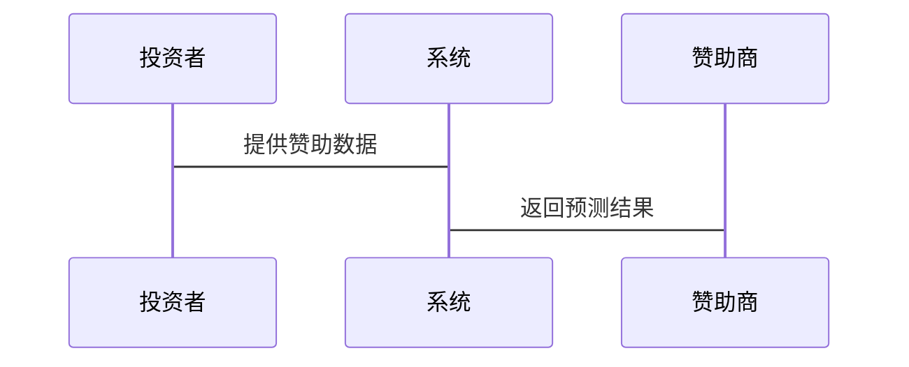

                 


# 股市估值对国际体育赞助数字化的影响

> **关键词**：股市估值，国际体育赞助，数字化转型，企业赞助，投资价值，数据分析  
> **摘要**：随着数字化转型的推进，国际体育赞助逐渐从传统模式向数字化模式转变，这种变化对企业的股市估值产生了深远影响。本文通过分析股市估值的核心概念、数字化赞助的影响机制，结合数学模型和系统架构设计，深入探讨数字化赞助如何提升企业价值，优化投资回报。

---

## 第一部分：背景介绍

### 第1章：股市估值与国际体育赞助数字化的背景分析

#### 1.1 问题背景

- **1.1.1 股市估值的基本概念**  
  股市估值是衡量企业市场价值的重要指标，通常通过市盈率、市净率等指标反映企业的投资吸引力。

- **1.1.2 国际体育赞助的现状**  
  传统赞助模式依赖线下活动，难以实时追踪赞助效果和 ROI（投资回报率）。

- **1.1.3 数字化转型的必要性**  
  数字化技术（如大数据、AI）的应用，使赞助效果的评估和优化成为可能。

#### 1.2 问题描述

- **1.2.1 股市估值与体育赞助的关系**  
  赞助支出可能影响企业的短期财务表现，但优质的赞助项目能提升长期品牌价值。

- **1.2.2 数字化赞助对体育产业的影响**  
  数字化赞助通过数据驱动的决策，优化赞助支出，提升品牌影响力。

- **1.2.3 当前存在的主要问题**  
  赞助效果难以量化， ROI 不易评估。

#### 1.3 问题解决

- **1.3.1 数字化赞助如何影响股市估值**  
  通过实时数据分析，优化赞助策略，提升品牌价值和市场表现。

- **1.3.2 股市估值对赞助决策的影响**  
  投资者关注企业的赞助支出是否能带来长期收益。

- **1.3.3 数字化转型的解决方案**  
  引入数据分析技术，实时监控赞助效果，优化赞助策略。

#### 1.4 边界与外延

- **1.4.1 股市估值的边界条件**  
  股市估值受到企业财务状况、行业趋势等多因素影响。

- **1.4.2 数字化赞助的外延范围**  
  包括线上互动、社交媒体推广等新型赞助形式。

- **1.4.3 相关领域的相互作用**  
  数字化赞助与企业营销、品牌管理密切相关。

#### 1.5 概念结构与核心要素

- **核心概念的组成**  
  包括股市估值模型、数字化赞助模式、数据分析技术等。

- **要素之间的关系**  
  数字化赞助通过数据驱动优化赞助策略，进而影响股市估值。

---

## 第2章：核心概念与联系

### 2.1 核心概念原理

- **2.1.1 股市估值的数学模型**  
  股市估值常用市盈率（P/E）和市净率（P/B）等指标。

- **2.1.2 数字化赞助的定义与特征**  
  数字化赞助通过数据技术优化赞助策略，提升赞助 ROI。

- **2.1.3 两者之间的相互作用**  
  数字化赞助优化品牌价值，进而提升股市估值。

### 2.2 概念属性特征对比

| **属性**       | **股市估值**                  | **数字化赞助**                  |
|-----------------|-------------------------------|-------------------------------|
| 核心目标         | 评估企业市场价值              | 优化赞助策略，提升 ROI         |
| 依赖因素         | 财务数据、行业趋势            | 数据分析、技术手段             |
| 应用场景         | 投资决策、企业市值管理          | 赞助策略优化、品牌推广          |

### 2.3 ER实体关系图

```mermaid
erDiagram
    actor 投资者 {
        <属性> 投资金额
        <属性> 投资时间
    }
    actor 赞助商 {
        <属性> 赞助金额
        <属性> 赞助类型
    }
    entity 股票 {
        <属性> 股票代码
        <属性> 市场价值
        <属性> 股东数量
    }
    entity 赞助项目 {
        <属性> 项目名称
        <属性> 项目类型
        <属性> 项目影响力
    }
    投资者 -> 股票 : 股票持有
    赞助商 -> 赞助项目 : 提供赞助
    股票 -> 赞助项目 : 影响
```

---

## 第3章：算法原理

### 3.1 数据分析与预测模型

#### 3.1.1 数据收集与预处理

- 从赞助项目中收集数据，包括赞助金额、赞助类型、项目影响力等。

#### 3.1.2 数据分析模型

- 使用线性回归模型预测赞助对股市估值的影响。

#### 3.1.3 代码实现

```python
import pandas as pd
import numpy as np
from sklearn.linear_model import LinearRegression

# 示例数据
data = {
    '赞助金额': [100, 200, 300, 400, 500],
    '市场价值': [1000, 1200, 1300, 1400, 1500],
}
df = pd.DataFrame(data)

# 训练模型
model = LinearRegression()
model.fit(df[['赞助金额']], df['市场价值'])

# 预测
new_sponsorship = 350
predicted_value = model.predict([[new_sponsorship]])[0]
print(f'预测市场价值：{predicted_value}')
```

#### 3.1.4 数学公式

- 线性回归公式：
  $$ y = \beta_0 + \beta_1 x + \epsilon $$
  其中，$x$ 是赞助金额，$y$ 是市场价值。

---

## 第4章：系统分析与架构设计

### 4.1 项目介绍

- **项目名称**：数字化赞助与股市估值分析系统。

### 4.2 系统功能设计

- **功能模块**：
  - 数据采集模块：实时收集赞助数据。
  - 数据分析模块：预测股市估值。
  - 可视化模块：展示赞助效果和估值变化。

### 4.3 系统架构设计


### 4.4 接口设计

- **输入接口**：接收赞助数据和财务数据。
- **输出接口**：提供预测结果和可视化报告。

### 4.5 交互流程



---

## 第5章：项目实战

### 5.1 环境安装

- 安装Python和相关库（如pandas、numpy、scikit-learn）。

### 5.2 核心代码实现

```python
import pandas as pd
import numpy as np
from sklearn.linear_model import LinearRegression
import matplotlib.pyplot as plt

# 数据加载
data = pd.read_csv('sponsorship.csv')

# 数据预处理
X = data[['赞助金额', '赞助类型']]
y = data['市场价值']

# 训练模型
model = LinearRegression()
model.fit(X, y)

# 可视化
plt.scatter(data['赞助金额'], data['市场价值'])
plt.plot(data['赞助金额'], model.predict(X), color='red')
plt.xlabel('赞助金额')
plt.ylabel('市场价值')
plt.show()
```

### 5.3 案例分析

- 案例：某公司赞助体育赛事后的市场价值变化。

---

## 第6章：最佳实践

### 6.1 小结

- 数字化赞助通过数据驱动优化策略，显著提升股市估值。

### 6.2 注意事项

- 数据质量是关键，需确保数据的准确性和完整性。

### 6.3 拓展阅读

- 推荐阅读《数据驱动的商业决策》和《数字化转型实战》。

---

通过以上分析，数字化赞助对股市估值的影响显著，企业应充分利用数据技术优化赞助策略，提升品牌价值和市场表现。

