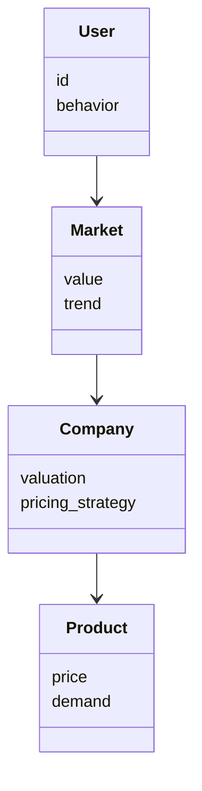

                 


# 《股市估值对国际数字文化产品定价的影响》

> 关键词：股市估值、数字文化产品、定价策略、用户行为、市场分析、定价模型

> 摘要：本文探讨了股市估值与国际数字文化产品定价之间的复杂关系，分析了股市波动如何影响数字文化产品的定价策略，并通过实际案例和数学模型，展示了如何利用这些因素优化定价，最终提升企业市场竞争力。

---

## 第二部分: 核心概念与联系

## 第4章: 核心概念对比与ER实体关系图

### 4.1 核心概念属性特征对比表格

| **核心概念**   | **属性特征**         | **具体描述**                                                                 |
|----------------|----------------------|------------------------------------------------------------------------------|
| 股市估值       | 宏观经济因素         | 包括GDP增长率、通货膨胀率、利率水平等，影响股市整体走势。                 |
|                | 行业发展趋势         | 数字文化产品行业的增长率、竞争态势、技术创新等，影响企业的估值。             |
|                | 企业财务状况         | 包括收入、利润、资产负债情况等，直接反映企业的市场价值。                   |
| 数字文化产品定价 | 市场需求             | 用户对产品的需求程度，影响定价策略。                                     |
|                | 用户行为             | 用户的购买习惯、使用频率等，影响定价模式的选择。                           |
|                | 竞争格局             | 行业内的竞争状况，影响产品的定价策略。                                     |

### 4.2 ER实体关系图

以下是数字文化产品定价与股市估值之间的关系架构：

```mermaid
er
actor: User
actor: Market
actor: Company
actor: Product
```

---

## 第三部分: 算法原理讲解

## 第5章: 算法原理与流程图

### 5.1 算法原理

我们通过回归分析来建立股市波动与数字文化产品定价之间的关系模型，具体步骤如下：

1. **数据采集**：收集过去几年的股市数据和数字文化产品的定价数据。
2. **数据预处理**：清洗数据，处理缺失值和异常值。
3. **特征选择**：选择影响定价的关键特征，如用户需求指数、市场波动率等。
4. **模型训练**：使用线性回归或随机森林模型进行训练。
5. **结果分析**：评估模型的准确性，并根据结果调整定价策略。

### 5.2 算法流程图

```mermaid
graph TD
    A[数据采集] -> B[数据预处理]
    B -> C[特征选择]
    C -> D[模型训练]
    D -> E[结果分析]
```

### 5.3 算法代码实现

以下是使用Python进行回归分析的代码示例：

```python
import pandas as pd
import numpy as np
from sklearn.linear_model import LinearRegression
from sklearn.metrics import mean_squared_error

# 数据加载
data = pd.read_csv('pricing_data.csv')

# 特征与目标变量分离
X = data[['user_demand', 'market_fluctuation']]
y = data['product_price']

# 模型训练
model = LinearRegression()
model.fit(X, y)

# 预测与评估
predictions = model.predict(X)
mse = mean_squared_error(y, predictions)
print(f"均方误差: {mse}")
```

---

## 第四部分: 数学模型与公式

## 第6章: 数学模型与公式

### 6.1 定价模型

我们可以通过多元回归模型来描述股市估值对数字文化产品定价的影响：

$$
\text{Price} = \beta_0 + \beta_1 \times \text{MarketValue} + \beta_2 \times \text{UserDemand} + \epsilon
$$

其中：
- $\text{Price}$ 表示产品价格
- $\beta_0$ 是截距项
- $\beta_1$ 和 $\beta_2$ 是回归系数
- $\epsilon$ 是误差项

### 6.2 市场估值模型

市盈率（P/E比率）用于评估股市估值：

$$
\text{P/E} = \frac{\text{股价}}{\text{每股收益}}
$$

---

## 第五部分: 系统分析与架构设计

## 第7章: 系统分析与架构设计

### 7.1 系统功能设计

以下是系统功能模块的类图：



### 7.2 系统架构设计

以下是系统的整体架构图：


### 7.3 系统接口设计

系统主要接口包括：
- 数据接口：用于获取实时市场数据和用户行为数据。
- 接口调用：通过API进行数据处理和模型预测。

---

## 第六部分: 项目实战

## 第8章: 项目实战与案例分析

### 8.1 环境安装

安装所需的Python库：

```bash
pip install pandas numpy scikit-learn matplotlib
```

### 8.2 核心代码实现

以下是定价模型的核心代码：

```python
import pandas as pd
from sklearn.ensemble import RandomForestRegressor
from sklearn.metrics import r2_score

# 数据加载
data = pd.read_csv('digital_product.csv')

# 特征工程
features = data[['market_value', 'user_behavior', 'competition']]
target = data['price']

# 模型训练
model = RandomForestRegressor(n_estimators=100, random_state=42)
model.fit(features, target)

# 预测与评估
predictions = model.predict(features)
score = r2_score(target, predictions)
print(f"R² Score: {score}")
```

### 8.3 案例分析

以某在线音乐流媒体服务为例，分析其定价策略如何受股市估值影响，并展示如何通过模型优化定价。

---

## 第七部分: 总结与展望

## 第9章: 总结与展望

### 9.1 小结

本文通过分析股市估值对数字文化产品定价的影响，揭示了两者之间的复杂关系，并提出了优化定价策略的方法。

### 9.2 注意事项

在实际应用中，需考虑市场波动的不确定性，定期更新模型参数。

### 9.3 拓展阅读

建议进一步研究动态定价模型和个性化定价策略。

---

## 结语

通过本文的分析，我们可以看到，股市估值与数字文化产品定价之间存在密切的联系。理解这些关系，企业可以更好地制定定价策略，提升市场竞争力。

--- 

感谢您的阅读！如需进一步探讨，欢迎留言交流。

