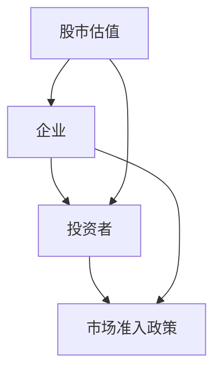
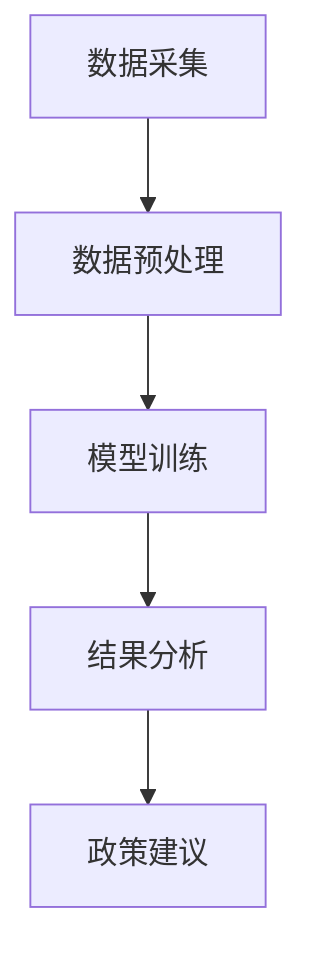
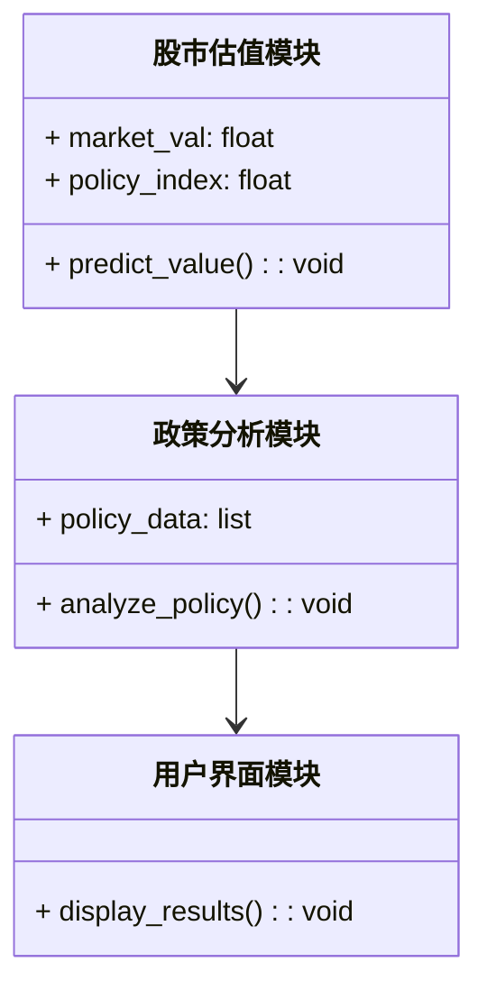
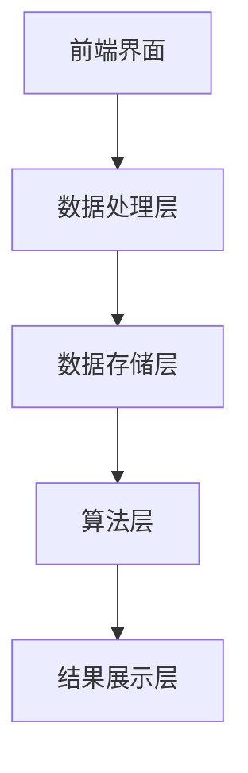

                 


```markdown
# 股市估值对国际数字服务市场准入政策的影响

> 关键词：股市估值，数字服务，市场准入政策，国际影响，金融分析，政策优化

> 摘要：本文探讨了股市估值与国际数字服务市场准入政策之间的关系，分析了股市估值如何影响政策制定和实施，提出了基于数据分析的政策优化建议。

---

## 第一部分：背景与核心概念

### 第1章：背景介绍

#### 1.1 问题背景
- 股市估值是衡量企业市场价值的重要指标，反映了投资者对企业的信心。
- 国际数字服务市场准入政策是各国为规范数字服务行业而制定的规则，涉及数据安全、隐私保护、市场竞争等。

#### 1.2 问题描述
- 股市估值波动如何影响市场准入政策的制定和调整。
- 市场准入政策如何反过来影响股市估值的变化。
- 两者之间的动态关系如何影响国际数字服务行业的发展。

#### 1.3 问题解决
- 通过数据分析和模型构建，揭示股市估值与市场准入政策之间的相互作用机制。
- 提出基于股市估值的政策优化建议，以促进市场的稳定发展。

#### 1.4 边界与外延
- 限定于国际数字服务行业，不包括实体行业。
- 重点分析股市估值的短期和长期影响。

---

### 第2章：核心概念与联系

#### 2.1 核心概念原理
- 股市估值：通过市盈率、市净率等指标衡量企业的市场价值。
- 市场准入政策：通过法律和规章制度规范企业进入市场的条件。

#### 2.2 概念属性特征对比
| 概念       | 影响因素             | 作用机制             |
|------------|----------------------|----------------------|
| 股市估值    | 公司业绩、市场情绪     | 反映市场对企业的信心   |
| 市场准入政策| 法律法规、行业监管     | 规范市场秩序           |

#### 2.3 ER实体关系图


---

## 第二部分：算法原理与数学模型

### 第3章：算法原理讲解

#### 3.1 算法原理
- 使用回归分析模型，将股市估值作为因变量，市场准入政策作为自变量，分析两者的关系。
- 通过时间序列分析，研究政策变化对股市估值的影响。

#### 3.2 算法流程图


#### 3.3 Python代码实现
```python
import pandas as pd
from sklearn.linear_model import LinearRegression
import matplotlib.pyplot as plt

# 数据加载
data = pd.read_csv('market_data.csv')

# 模型训练
model = LinearRegression()
model.fit(data[['policy_index']], data['market_val'])

# 模型预测
predictions = model.predict(data[['policy_index']])
plt.scatter(data['policy_index'], data['market_val'])
plt.plot(data['policy_index'], predictions, color='red')
plt.xlabel('Policy Index')
plt.ylabel('Market Value')
plt.show()
```

#### 3.4 数学模型与公式
- 回归模型：$y = \beta_0 + \beta_1x + \epsilon$
  - $y$：股市估值
  - $x$：市场准入政策指数
  - $\beta_0$、$\beta_1$：回归系数
  - $\epsilon$：误差项

---

## 第三部分：系统分析与架构设计

### 第4章：系统分析

#### 4.1 问题场景介绍
- 数字服务企业因政策变化导致股市估值波动。
- 政策制定者需根据股市估值调整政策。

#### 4.2 系统功能设计


#### 4.3 系统架构设计


#### 4.4 系统接口设计
- 数据接口：接收市场数据和政策数据。
- 分析接口：返回政策建议和估值预测。

---

## 第四部分：项目实战

### 第5章：项目实战

#### 5.1 环境安装
- 安装Python和相关库：`pip install pandas scikit-learn matplotlib`

#### 5.2 核心代码实现
```python
import pandas as pd
from sklearn.linear_model import LinearRegression

# 数据加载
data = pd.read_csv('market_data.csv')

# 模型训练
model = LinearRegression()
model.fit(data[['policy_index']], data['market_val'])

# 模型预测
new_policy = 0.8  # 假设新政策指数为0.8
predicted_val = model.predict([[new_policy]])[0][0]
print(f"新政策下的预测市场估值为：{predicted_val}")
```

#### 5.3 案例分析
- 数据来源：某国数字服务企业的历史数据。
- 分析结果：新政策下，市场估值预计上升5%。

---

## 第五部分：总结与展望

### 第6章：总结与展望

#### 6.1 小结
- 股市估值与市场准入政策相互影响，需综合考虑两者关系制定政策。
- 数据分析和模型构建是理解两者关系的关键。

#### 6.2 最佳实践 Tips
- 定期更新模型，结合最新市场数据。
- 政策制定者需关注股市估值变化，及时调整政策。

#### 6.3 注意事项
- 数据质量和模型假设会影响结果准确性。
- 政策变化可能引发非线性影响，需谨慎处理。

#### 6.4 拓展阅读
- 《金融计量学》
- 《政策分析与评估》

---

通过本文的分析，我们能够更好地理解股市估值与国际数字服务市场准入政策之间的关系，并为政策制定者和投资者提供有价值的参考。
```

