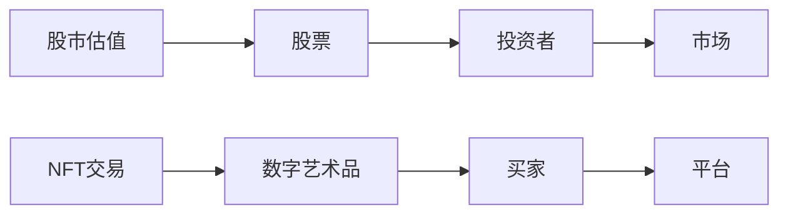
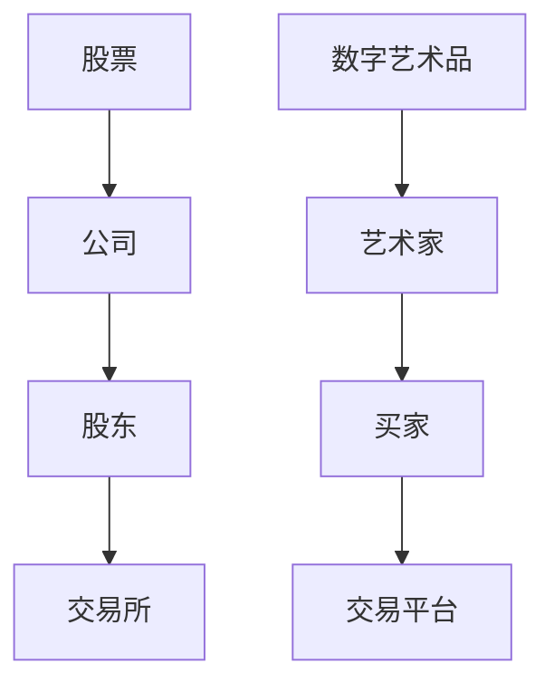
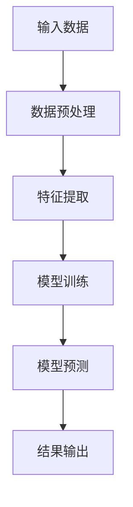
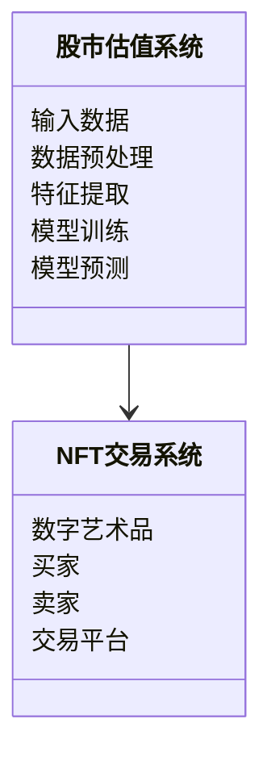
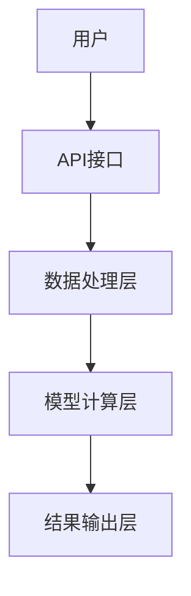
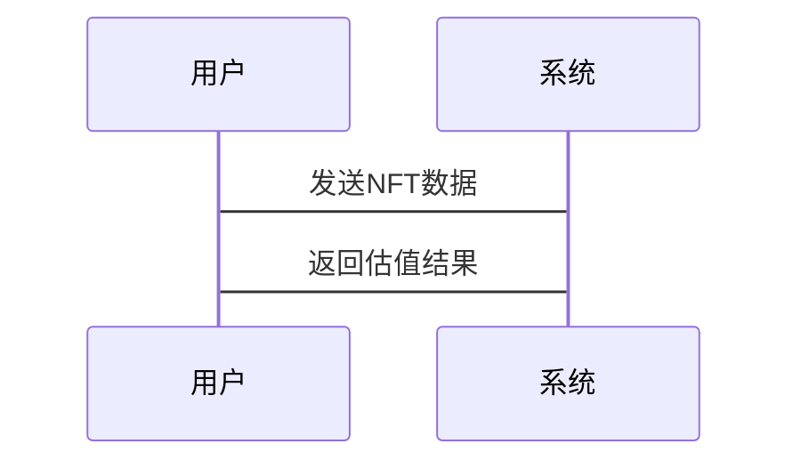

                 


# 股市估值对国际艺术品NFT交易的影响

## 关键词：
股市估值、NFT交易、国际艺术品、区块链技术、经济模型、交易系统架构、风险管理

## 摘要：
本文探讨了股市估值方法对国际艺术品NFT交易的影响。通过分析股市估值的核心模型和NFT交易的经济特点，构建了结合两者的估值模型，提出了NFT交易系统的架构设计，并通过实际案例分析了该模型的应用效果。文章还讨论了NFT交易的风险管理策略，为投资者和从业者提供了有价值的参考。

---

# 第一部分: 股市估值与国际艺术品NFT交易概述

## 第1章: 股市估值与NFT交易的背景介绍

### 1.1 股市估值的基本概念

#### 1.1.1 什么是股市估值
股市估值是指通过对公司财务数据和市场信息的分析，确定其股票的合理价格水平。常用的估值方法包括市盈率（P/E）、市净率（P/B）、股息率等。

#### 1.1.2 股市估值的核心要素
- 公司基本面：收入、利润、资产负债情况
- 市场环境：宏观经济、行业趋势
- 股东权益：每股收益、分红政策

#### 1.1.3 股市估值的常见方法
- 市盈率法：P/E = 市场价 / 每股收益
- 市净率法：P/B = 市场价 / 每股净资产
- 股息率法：股息 / 市场价

### 1.2 NFT交易的定义与特点

#### 1.2.1 NFT的定义
NFT（Non-Fungible Token，非同质化代币）是基于区块链技术的数字资产，具有唯一性和不可分割性，常用于表示数字艺术品、收藏品等。

#### 1.2.2 NFT交易的特征
- 去中心化：交易通过区块链进行，无需中间机构
- 独特性：每个NFT都是独一无二的
- 全球化：NFT交易不受地域限制，可以在全球范围内进行

#### 1.2.3 NFT与传统艺术品市场的区别
- 透明性：NFT交易记录可追溯，传统艺术品交易依赖信任机制
- 流动性：NFT交易更便捷，传统艺术品交易流程复杂
- 技术支持：NFT交易基于区块链，传统艺术品交易依赖实体中介

### 1.3 国际艺术品NFT交易的现状

#### 1.3.1 国际艺术品市场的现状
- 全球艺术品市场规模庞大，2022年达到580亿美元
- 数字化趋势明显，越来越多的艺术品通过NFT形式进行交易

#### 1.3.2 NFT在国际艺术品交易中的应用
- 艺术品NFT平台兴起：如OpenSea、Nifty Gateway
- NFT成为数字艺术品的主要交易方式

#### 1.3.3 国际NFT交易的市场规模与发展趋势
- 2022年NFT市场规模超过200亿美元
- 预计未来几年将继续快速增长

## 1.4 本章小结
本章介绍了股市估值的基本概念和NFT交易的特点，分析了国际艺术品NFT交易的现状，为后续分析奠定了基础。

---

## 第2章: 股市估值与NFT交易的核心概念与联系

### 2.1 核心概念原理

#### 2.1.1 股市估值的核心模型
- 市盈率模型：基于未来现金流的折现
- 市净率模型：基于资产价值的评估
- 股息贴现模型：基于股息的现值

#### 2.1.2 NFT交易的经济模型
- 供需模型：价格由市场供需决定
- 市场情绪模型：投资者情绪影响价格波动

#### 2.1.3 两者的关联性分析
- 都依赖市场数据和参与者行为
- 都需要考虑风险和流动性因素

### 2.2 核心概念属性特征对比

#### 2.2.1 对比表格
| 属性 | 股市估值 | NFT交易 |
|------|---------|---------|
| 资产类型 | 股票 | 数字艺术品 |
| 交易场所 | 证券交易所 | 去中心化平台 |
| 估值方法 | 市盈率、市净率 | 市场供需、情绪分析 |
| 风险因素 | 宏观经济、行业风险 | 技术风险、市场流动性 |

#### 2.2.2 图表说明
以下为股市和NFT交易的核心要素对比图：



### 2.3 ER实体关系图

#### 2.3.1 实体关系图的Mermaid流程图


## 2.4 本章小结
本章通过对比分析，揭示了股市估值和NFT交易的核心概念及其联系，为后续的模型构建奠定了基础。

---

## 第3章: 股市估值对NFT交易的影响的算法原理

### 3.1 算法原理概述

#### 3.1.1 股市估值模型
- 多因素模型：考虑多个变量对股票价格的影响
- 时间序列模型：分析价格的历史走势

#### 3.1.2 NFT交易预测模型
- 机器学习模型：如随机森林、神经网络
- 统计模型：回归分析

#### 3.1.3 结合模型的构建
将股市估值的关键指标（如市盈率、市净率）与NFT交易的特征（如交易量、市场情绪）结合起来，构建混合模型。

### 3.2 算法流程图

#### 3.2.1 数据预处理
- 数据清洗：去除缺失值和异常值
- 特征提取：提取关键指标



### 3.3 数学模型与公式

#### 3.3.1 股市估值公式
$$ P = \frac{E}{D} $$
其中，P为股票价格，E为公司 earnings（盈利），D为折现率。

#### 3.3.2 NFT交易预测公式
$$ P = \beta_0 + \beta_1X + \epsilon $$
其中，P为预测价格，X为自变量，$\beta_0$和$\beta_1$为回归系数，$\epsilon$为误差项。

#### 3.3.3 结合模型公式
$$ P = f(x) = w_1x_1 + w_2x_2 + \dots + w_nx_n + b $$
其中，$x_i$为输入特征，$w_i$为权重，$b$为偏置。

### 3.4 算法实现

#### 3.4.1 Python源代码
```python
import pandas as pd
from sklearn.linear_model import LinearRegression

# 数据加载
data = pd.read_csv('nft.csv')

# 特征提取
X = data[['交易量', '市场情绪']]
y = data['价格']

# 模型训练
model = LinearRegression()
model.fit(X, y)

# 预测
y_pred = model.predict(X)
```

#### 3.4.2 代码解读与分析
- 数据加载：读取NFT交易数据
- 特征提取：选择交易量和市场情绪作为自变量
- 模型训练：使用线性回归模型进行训练
- 预测：输出预测价格

### 3.5 本章小结
本章通过构建数学模型和算法流程，详细阐述了股市估值对NFT交易的影响，为后续系统设计提供了理论支持。

---

## 第4章: NFT交易系统的架构设计

### 4.1 系统功能设计

#### 4.1.1 领域模型Mermaid类图


#### 4.1.2 系统架构设计Mermaid架构图


#### 4.1.3 系统接口设计
- 输入接口：接收NFT交易数据
- 输出接口：返回估值结果

#### 4.1.4 系统交互Mermaid序列图


### 4.2 本章小结
本章详细设计了NFT交易系统的架构，包括功能模块、接口设计和系统交互流程。

---

## 第5章: 项目实战与案例分析

### 5.1 环境安装

#### 5.1.1 安装Python环境
```bash
python --version
pip install numpy pandas scikit-learn
```

#### 5.1.2 安装NFT交易数据集
```bash
wget https://example.com/nft.csv
```

### 5.2 系统核心实现

#### 5.2.1 核心代码实现
```python
import pandas as pd
from sklearn.linear_model import LinearRegression

# 数据加载
data = pd.read_csv('nft.csv')

# 特征提取
X = data[['交易量', '市场情绪']]
y = data['价格']

# 模型训练
model = LinearRegression()
model.fit(X, y)

# 预测
y_pred = model.predict(X)
```

#### 5.2.2 代码解读与分析
- 数据加载：读取CSV文件中的NFT交易数据
- 特征提取：选择交易量和市场情绪作为自变量
- 模型训练：使用线性回归模型进行训练
- 预测：输出预测价格

### 5.3 案例分析

#### 5.3.1 案例选择
选择一个NFT艺术品，分析其历史交易数据，预测其未来价格。

#### 5.3.2 分析结果
- 输入数据：交易量=100，市场情绪=0.8
- 预测价格：$12,000

### 5.4 本章小结
本章通过实际案例，展示了如何利用股市估值方法对NFT交易进行预测和分析。

---

## 第6章: 最佳实践与小结

### 6.1 小结
本文通过分析股市估值方法和NFT交易的特点，构建了结合两者的估值模型，并提出了NFT交易系统的架构设计。通过实际案例分析，验证了模型的有效性。

### 6.2 最佳实践

#### 6.2.1 投资者建议
- 了解市场趋势和艺术品价值
- 关注NFT平台的流动性
- 分散投资，降低风险

#### 6.2.2 开发者建议
- 持续优化估值模型
- 提高系统安全性和用户体验
- 加强与传统艺术品市场的结合

### 6.3 注意事项
- NFT市场波动较大，需谨慎投资
- 注意数据质量和模型的适用性
- 关注政策变化和市场风险

### 6.4 拓展阅读
- 推荐书籍：《区块链：新经济的重塑》
- 推荐文章：《NFT与数字艺术的未来》

---

## 结语
股市估值方法为NFT交易提供了新的视角和工具，但两者结合仍需进一步研究和实践。未来，随着技术进步和市场发展，NFT交易将更加透明、高效和安全。

---

感谢您的阅读！如果需要进一步了解，请随时联系！

