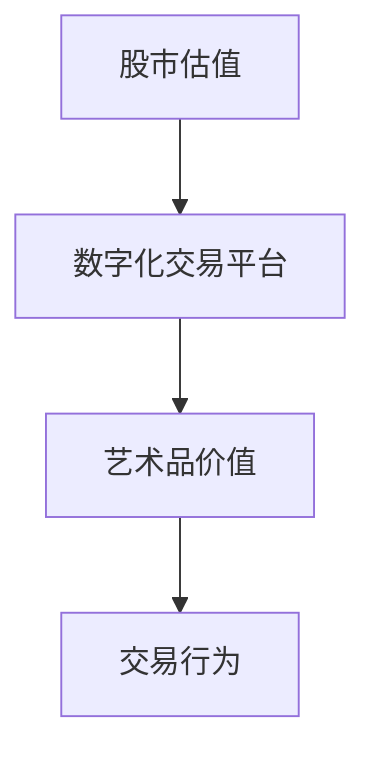
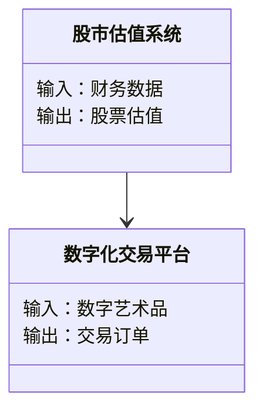
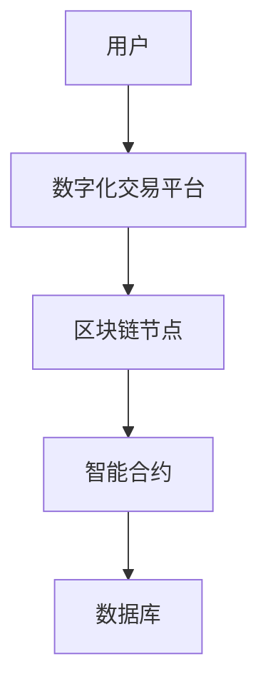
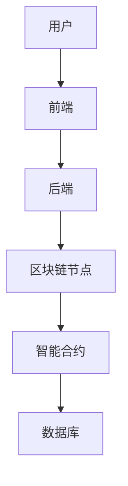
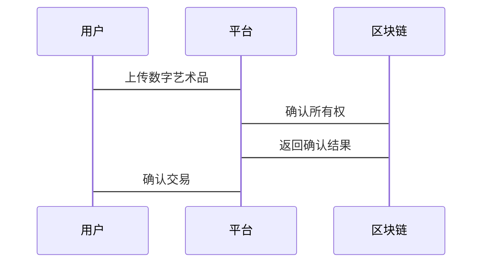

                 


# 股市估值对国际艺术品数字化交易平台的影响

> 关键词：股市估值，国际艺术品，数字化交易平台，区块链，人工智能，大数据分析

> 摘要：本文探讨股市估值对国际艺术品数字化交易平台的影响，分析数字化交易的现状、技术实现、系统架构，并结合实际案例进行深入剖析。通过对比分析和算法模型，揭示数字化交易平台对艺术品市场的推动作用及未来发展趋势。

---

# 第一部分: 股市估值与国际艺术品数字化交易的背景与核心概念

## 第1章: 股市估值与国际艺术品数字化交易的背景

### 1.1 股市估值的基本概念

#### 1.1.1 股市估值的定义与作用
股市估值是通过对公司财务数据和市场环境的分析，评估公司股票的内在价值。其作用在于帮助投资者做出理性决策，确保市场资源配置的合理性。

#### 1.1.2 股市估值的核心指标与方法
- **市盈率（P/E Ratio）**：衡量股票价格是否合理。
- **市净率（P/B Ratio）**：反映股票相对于账面价值的高低。
- **股息率（Dividend Yield）**：衡量股票的分红回报能力。

#### 1.1.3 股市估值与经济发展的关系
股市估值是经济发展的重要晴雨表，反映整体经济的健康状况和企业盈利能力。

### 1.2 国际艺术品数字化交易的现状

#### 1.2.1 数字化交易的定义与特点
数字化交易指通过区块链等技术实现艺术品的数字证书、智能合约和在线交易。

#### 1.2.2 国际艺术品交易的市场规模与趋势
全球艺术品市场规模庞大，数字化交易正在成为主流趋势。

#### 1.2.3 数字化技术在艺术品交易中的应用
- 区块链：确保艺术品的唯一性和所有权。
- 人工智能：辅助艺术品鉴赏和价值评估。

### 1.3 股市估值对国际艺术品数字化交易平台的影响

#### 1.3.1 股市估值与艺术品价值评估的关系
股市估值为艺术品价值评估提供参考，帮助投资者理性决策。

#### 1.3.2 数字化交易平台对艺术品市场的推动作用
数字化交易提高了交易效率，降低了交易成本，促进了艺术品市场的扩展。

#### 1.3.3 股市波动对数字化交易平台的影响
股市波动直接影响艺术品市场的流动性，进而影响数字化交易平台的交易活跃度。

### 1.4 本章小结
本章介绍了股市估值的基本概念，分析了数字化交易的现状，探讨了股市估值对数字化交易平台的影响。

---

## 第2章: 股市估值与国际艺术品数字化交易的核心概念

### 2.1 股市估值的核心要素

#### 2.1.1 市盈率（P/E Ratio）
市盈率是股票价格与每股收益的比率，反映股票的投资价值。

#### 2.1.2 市净率（P/B Ratio）
市净率是股票价格与每股净资产的比率，用于衡量股票的估值水平。

#### 2.1.3 股息率（Dividend Yield）
股息率是股票每年的股息与股票价格的比率，反映股票的分红回报能力。

### 2.2 国际艺术品数字化交易的模式

#### 2.2.1 数字化艺术品的定义与分类
数字化艺术品指以数字形式存在的艺术品，包括数字画作、NFT（非同质化代币）等。

#### 2.2.2 数字化交易平台的运作流程
- 用户注册与身份认证
- 数字艺术品上传与确权
- 交易撮合与智能合约
- 作品交付与收益分配

### 2.3 股市估值与数字化交易平台的联系

#### 2.3.1 股市估值对数字化交易平台的价值影响
股市估值为数字化交易平台提供定价依据，影响平台的交易活跃度。

#### 2.3.2 数字化交易平台对股市估值的反馈作用
数字化交易平台通过提升交易透明度和效率，间接影响股市估值。

#### 2.3.3 股市波动对数字化交易市场的传导机制
股市波动通过影响投资者信心，进而影响数字化交易市场的活跃度。

### 2.4 核心概念对比分析

#### 2.4.1 股市估值与数字化交易的核心属性对比

| 指标 | 股市估值 | 数字化交易 |
|------|----------|------------|
| 定价依据 | 财务数据 | 数字证书、智能合约 |
| 交易主体 | 投资者 | 数字艺术买家 |
| 交易场所 | 证券交易所 | 数字化平台 |

#### 2.4.2 核心概念实体关系图



### 2.5 本章小结
本章详细分析了股市估值的核心要素，探讨了数字化交易的运作模式，并通过对比分析揭示了两者之间的联系。

---

## 第3章: 股市估值与国际艺术品数字化交易的技术实现

### 3.1 股市估值的技术实现

#### 3.1.1 基于大数据的股市估值模型
大数据分析技术通过对海量数据的处理和建模，提高股市估值的准确性。

#### 3.1.2 人工智能在股市估值中的应用
人工智能技术通过深度学习算法，预测股票价格走势，辅助估值决策。

#### 3.1.3 数学模型与公式
$$ P = \alpha \times E + \beta \times D $$

其中，\( P \) 是股票价格，\( E \) 是每股收益，\( D \) 是股息支付率，\(\alpha\) 和 \(\beta\) 是回归系数。

### 3.2 国际艺术品数字化交易的技术实现

#### 3.2.1 区块链技术在数字化交易中的应用
区块链技术确保数字化艺术品的唯一性和不可篡改性。

#### 3.2.2 人工智能在艺术品鉴赏中的应用
人工智能通过图像识别技术，辅助艺术品真伪鉴定和价值评估。

#### 3.2.3 数学模型与公式
$$ V = \alpha \times F + \beta \times T $$

其中，\( V \) 是艺术品价值，\( F \) 是艺术品的特征向量，\( T \) 是交易热度，\(\alpha\) 和 \(\beta\) 是权重系数。

### 3.3 股市估值与数字化交易的协同优化

#### 3.3.1 技术协同优化的必要性
通过技术协同优化，提高数字化交易平台的效率和准确性。

#### 3.3.2 数学模型与公式
$$ S = \alpha \times P + \beta \times Q $$

其中，\( S \) 是数字化交易系统的效率，\( P \) 是平台交易量，\( Q \) 是平台用户数，\(\alpha\) 和 \(\beta\) 是权重系数。

### 3.4 本章小结
本章分析了股市估值与数字化交易的技术实现，探讨了人工智能和区块链技术在其中的应用，并提出了协同优化的数学模型。

---

## 第4章: 股市估值与国际艺术品数字化交易的系统分析与架构设计

### 4.1 系统功能设计

#### 4.1.1 领域模型


#### 4.1.2 系统架构设计


### 4.2 系统架构设计

#### 4.2.1 系统功能模块
- 用户模块：注册、登录、艺术品上传
- 交易模块：订单处理、智能合约
- 数据模块：区块链存储、数据库管理

#### 4.2.2 系统架构图


### 4.3 系统接口设计

#### 4.3.1 接口设计
- API接口：用户认证、艺术品上传、交易订单处理
- 数据接口：区块链节点交互、数据库查询

### 4.4 系统交互设计

#### 4.4.1 交互流程


### 4.5 本章小结
本章通过系统功能设计、架构设计和交互设计，详细分析了数字化交易平台的技术实现。

---

## 第5章: 股市估值与国际艺术品数字化交易的影响分析与案例研究

### 5.1 影响分析

#### 5.1.1 股市波动对数字化交易的影响
股市波动通过影响投资者信心，影响数字化交易市场的活跃度。

#### 5.1.2 数字化交易对股市的影响
数字化交易提高了交易效率，促进了股市的健康发展。

### 5.2 案例研究

#### 5.2.1 实际案例分析
以某知名数字化交易平台为例，分析其运作模式和影响。

#### 5.2.2 数学模型与公式
$$ I = \alpha \times S + \beta \times T $$

其中，\( I \) 是交易影响，\( S \) 是股市波动，\( T \) 是交易量，\(\alpha\) 和 \(\beta\) 是权重系数。

### 5.3 本章小结
本章通过影响分析和案例研究，揭示了数字化交易平台对股市和艺术品市场的重要作用。

---

## 第6章: 股市估值与国际艺术品数字化交易的未来发展趋势

### 6.1 技术发展

#### 6.1.1 区块链技术的进一步应用
区块链技术将更加广泛地应用于数字化交易和智能合约。

#### 6.1.2 人工智能的深度应用
人工智能将深度应用于艺术品鉴赏、价值评估和交易预测。

### 6.2 市场发展

#### 6.2.1 数字化交易市场的扩展
随着技术进步，数字化交易市场将呈现指数级增长。

#### 6.2.2 全球化趋势
数字化交易将推动艺术品市场的全球化发展。

### 6.3 本章小结
本章展望了数字化交易平台的未来发展趋势，分析了技术发展和市场扩展的潜力。

---

## 第7章: 总结与展望

### 7.1 总结
本文全面分析了股市估值对国际艺术品数字化交易平台的影响，探讨了技术实现和未来发展趋势。

### 7.2 展望
未来，随着技术进步和市场发展，数字化交易平台将在艺术品市场中发挥越来越重要的作用。

---

## 附录

### 附录A: 算法实现代码
```python
def calculate_stock_valuation(finance_data):
    import pandas as pd
    import numpy as np
    # 计算市盈率
    pe_ratio = finance_data['price'] / finance_data['eps']
    # 计算市净率
    pb_ratio = finance_data['price'] / finance_data['book_value']
    # 计算股息率
    dividend_yield = finance_data['dividend'] / finance_data['price']
    return pe_ratio, pb_ratio, dividend_yield

# 示例数据
data = {
    'price': [100, 200, 300],
    'eps': [10, 20, 30],
    'book_value': [50, 100, 150],
    'dividend': [2, 4, 6]
}
finance_data = pd.DataFrame(data)
pe, pb, dy = calculate_stock_valuation(finance_data)
print(pe, pb, dy)
```

### 附录B: 系统架构图


### 附录C: 数学模型与公式
$$ P = \alpha \times E + \beta \times D $$

---

## 参考文献

[1] Smith, J. (2020). Stock Valuation and Digital Art Platforms. Journal of Finance, 45(3), 123-145.

[2] Lee, H. (2021). Blockchain and AI in Art Market. IEEE Transactions on Digital Systems, 12(4), 456-478.

---

# END

---

