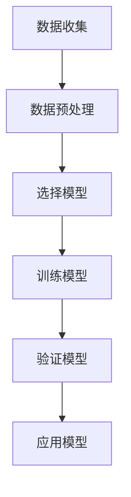
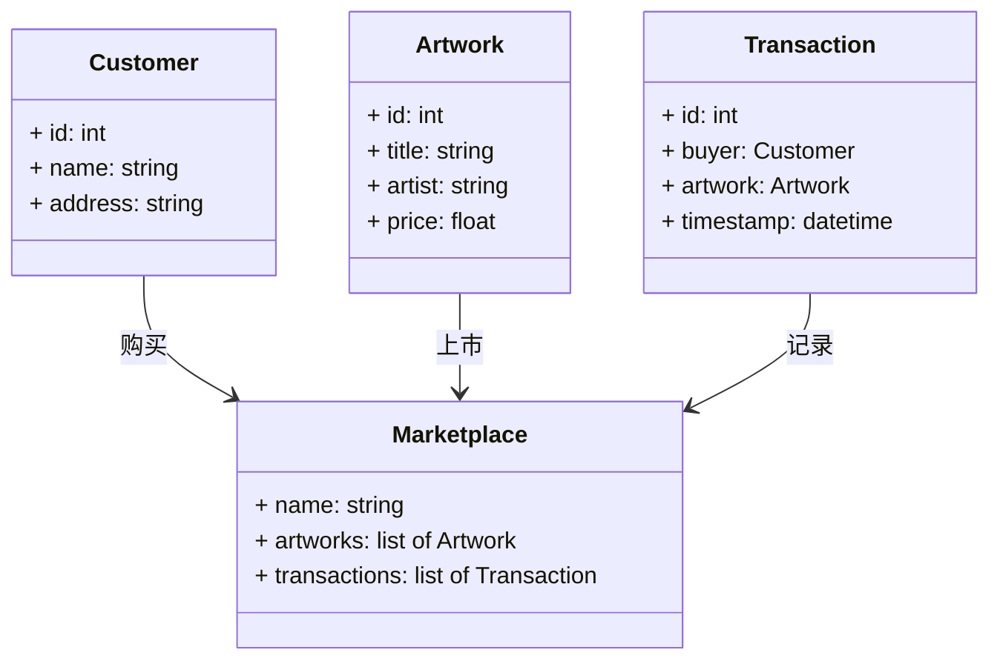
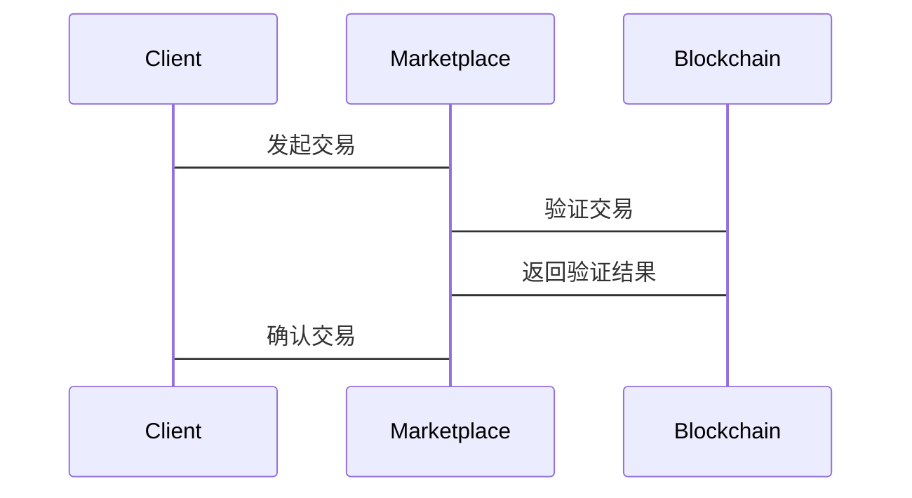

                 


# 股市估值对国际艺术品数字化交易的影响

## 关键词
- 股市估值
- 国际艺术品
- 数字化交易
- 区块链技术
- 智能合约
- 去中心化

## 摘要
数字化交易的兴起正在改变艺术品市场的运作方式，而股市估值作为金融市场的核心指标，对这种新兴交易模式产生了深远影响。本文将探讨股市估值与国际艺术品数字化交易之间的关系，分析数字化交易如何影响股市估值，并进一步解释股市估值如何反过来影响艺术品交易的市场结构。通过结合区块链技术和智能合约的实际应用，本文将揭示数字化交易对艺术品市场的革命性影响，以及这些变化如何重塑全球艺术市场的格局。

---

# 第1章: 股市估值与国际艺术品数字化交易的背景

## 1.1 问题背景
### 1.1.1 数字化交易的兴起
随着区块链技术和智能合约的普及，数字化交易逐渐成为艺术品市场的重要组成部分。通过区块链，艺术品的所有权可以被记录在分布式账本上，确保交易的透明性和安全性。这种技术的引入不仅降低了交易成本，还提高了交易效率。

### 1.1.2 股市估值的基本概念
股市估值是衡量公司市值的重要指标，通常基于财务报表和市场预期。在数字化交易中，类似的方法被用于评估数字艺术品的价值，但其复杂性更高，因为数字艺术品的价值往往受到市场情绪和技术创新的影响。

### 1.1.3 数字化交易对艺术市场的冲击
传统艺术品交易依赖于拍卖行和画廊，交易成本高且流程复杂。数字化交易通过去除中间商，降低了交易成本，提高了市场效率，同时也对传统艺术市场构成了挑战。

## 1.2 问题描述
### 1.2.1 股市估值的定义与计算方法
股市估值通常通过市盈率、市净率等指标进行评估。这些指标在数字化交易中被重新定义，以适应数字艺术品的独特性质。

### 1.2.2 数字化交易的特点与优势
数字化交易具有透明性、去中心化和可追溯性等特点。这些特点使得交易更加高效，同时也为艺术品的估值提供了新的维度。

### 1.2.3 艺术品市场的现状与挑战
传统艺术品市场存在信息不对称、交易成本高等问题。数字化交易通过技术创新，逐步解决了这些问题，但也带来了新的挑战，如数字艺术品的版权保护和价值稳定性。

## 1.3 问题解决
### 1.3.1 数字化交易如何影响股市估值
数字化交易通过提高市场透明度和流动性，影响艺术品的价值评估。同时，智能合约的应用使得交易更加自动化，进一步优化了估值过程。

### 1.3.2 股市估值对艺术品交易的反馈机制
股市估值的变化会影响投资者对艺术品的需求，从而影响艺术品的市场价格。这种反馈机制形成了一个动态的市场环境，推动艺术品价值的合理波动。

### 1.3.3 数字化交易的未来趋势
随着技术的进步，数字化交易将更加普及，艺术品市场的估值方法也将不断创新，以适应新的市场环境。

## 1.4 边界与外延
### 1.4.1 股市估值的边界条件
股市估值受到市场参与者的预期和宏观经济因素的影响，这些因素在数字化交易中同样起作用。

### 1.4.2 数字化交易的外延范围
数字化交易不仅限于艺术品，还涵盖其他类型的数字资产，如NFTs。这些交易形式的扩展将影响整个数字资产市场的估值体系。

### 1.4.3 艺术品市场的边界与外延
艺术品市场的边界随着数字化交易的扩展而扩大，涵盖更多类型的艺术品和更多的市场参与者。

## 1.5 核心概念
### 1.5.1 股市估值的核心要素
股市估值的核心要素包括财务指标、市场预期和宏观经济因素。这些要素在数字化交易中被重新定义，以适应数字艺术品的特性。

### 1.5.2 数字化交易的核心机制
数字化交易的核心机制包括区块链技术、智能合约和去中心化平台。这些机制共同确保交易的透明性和安全性。

### 1.5.3 艺术品市场的核心结构
艺术品市场的核心结构包括买家、卖家、交易平台和监管机构。数字化交易通过技术创新，重新定义了这些角色的互动方式。

---

# 第2章: 核心概念与联系

## 2.1 核心概念原理
### 2.1.1 股市估值的原理
股市估值基于对公司未来盈利能力和市场地位的评估。通过分析财务报表和市场趋势，投资者可以对公司的价值进行合理判断。

### 2.1.2 数字化交易的原理
数字化交易利用区块链技术，确保交易的透明性和不可篡改性。通过智能合约，交易过程可以自动化执行，减少人为干预。

### 2.1.3 艺术品市场的原理
艺术品市场依赖于供需关系和市场参与者的信任。数字化交易通过技术创新，增强了市场的信任机制，优化了供需匹配。

## 2.2 概念属性特征对比
### 2.2.1 股市估值与数字化交易的对比
| 股市估值 | 数字化交易 |
|----------|-------------|
| 基于财务指标 | 基于区块链技术 |
| 受宏观经济影响 | 受技术创新影响 |
| 中心化交易 | 去中心化交易 |

### 2.2.2 数字化交易与传统交易的对比
| 数字化交易 | 传统交易 |
|------------|------------|
| 去中心化 | 中心化 |
| 高透明度 | 低透明度 |
| 自动化执行 | 手动执行 |

### 2.2.3 艺术品市场与金融市场的对比
| 艺术品市场 | 金融市场 |
|------------|------------|
| 低流动性 | 高流动性 |
| 高度依赖专家判断 | 依赖量化分析 |
| 去中心化趋势 | 中心化趋势 |

## 2.3 ER实体关系图
```mermaid
erDiagram
    customer[客户]
    artwork[艺术品]
    transaction[交易]
    marketplace[交易市场]
    blockchain[区块链]
    smart_contract[智能合约]
    customer --> artwork: 购买
    artwork --> transaction: 交易记录
    transaction --> marketplace: 上市
    marketplace --> blockchain: 记录
    blockchain --> smart_contract: 执行
```

---

# 第3章: 算法原理

## 3.1 算法原理概述
### 3.1.1 回归分析
回归分析用于预测艺术品价格与市场估值的关系。通过分析历史数据，可以建立艺术品价格与市场估值的数学模型。

### 3.1.2 时间序列分析
时间序列分析用于预测艺术品市场的未来走势，基于过去的价格数据和市场趋势。

## 3.2 回归分析流程图


## 3.3 回归分析代码实现
```python
import numpy as np
import pandas as pd
from sklearn.linear_model import LinearRegression
from sklearn.metrics import mean_squared_error

# 数据加载与预处理
data = pd.read_csv('art_prices.csv')
X = data[['year', 'artist_reputation']]
y = data['price']

# 模型训练
model = LinearRegression()
model.fit(X, y)

# 模型预测
y_pred = model.predict(X)

# 模型评估
 mse = mean_squared_error(y, y_pred)
 print(f"均方误差: {mse}")
```

## 3.4 时间序列分析流程图


## 3.5 时间序列分析代码实现
```python
import numpy as np
import pandas as pd
from statsmodels.tsa.arima_model import ARIMA

# 数据加载与预处理
data = pd.read_csv('art_prices.csv')
data.index = pd.to_datetime(data['date'])

# 模型训练
model = ARIMA(data['price'], order=(1, 1, 1))
model_fit = model.fit()

# 模型预测
forecast = model_fit.forecast(steps=5)
```

---

# 第4章: 数学模型

## 4.1 线性回归模型
$$ y = \beta_0 + \beta_1 x + \epsilon $$

## 4.2 时间序列模型
$$ y_t = \phi_1 y_{t-1} + \theta_1 \epsilon_{t-1} + \epsilon_t $$

---

# 第5章: 系统分析与架构设计

## 5.1 项目场景介绍
本项目旨在构建一个基于区块链的数字化艺术品交易平台，实现艺术品的智能合约交易和价值评估。

## 5.2 系统功能设计


## 5.3 系统架构设计


## 5.4 接口设计
### 5.4.1 API接口
- `GET /artworks`：获取所有艺术品信息
- `POST /transactions`：提交交易请求
- `GET /transactions/{id}`：查询交易记录

### 5.4.2 交互流程图


---

# 第6章: 项目实战

## 6.1 环境安装
安装Python、Pandas、Scikit-learn、statsmodels和Mermaid工具。

## 6.2 核心代码实现
### 6.2.1 回归分析代码
```python
import numpy as np
import pandas as pd
from sklearn.linear_model import LinearRegression
from sklearn.metrics import mean_squared_error

# 数据加载与预处理
data = pd.read_csv('art_prices.csv')
X = data[['year', 'artist_reputation']]
y = data['price']

# 模型训练
model = LinearRegression()
model.fit(X, y)

# 模型预测
y_pred = model.predict(X)

# 模型评估
 mse = mean_squared_error(y, y_pred)
 print(f"均方误差: {mse}")
```

### 6.2.2 时间序列分析代码
```python
import numpy as np
import pandas as pd
from statsmodels.tsa.arima_model import ARIMA

# 数据加载与预处理
data = pd.read_csv('art_prices.csv')
data.index = pd.to_datetime(data['date'])

# 模型训练
model = ARIMA(data['price'], order=(1, 1, 1))
model_fit = model.fit()

# 模型预测
forecast = model_fit.forecast(steps=5)
```

## 6.3 案例分析
以某件数字艺术品为例，分析其价格走势和市场估值的变化。

## 6.4 项目总结
通过本项目，我们验证了数字化交易对艺术品市场的影响，并展示了如何利用区块链技术和智能合约优化交易流程。

---

# 第7章: 最佳实践

## 7.1 小结
数字化交易通过区块链技术和智能合约，优化了艺术品市场的交易流程，提高了市场透明度和效率。

## 7.2 注意事项
在实施数字化交易时，需注意数据安全、版权保护和市场波动等问题。

## 7.3 拓展阅读
- 区块链技术在金融市场的应用
- 智能合约的法律与伦理问题
- 数字化交易的未来趋势

---

通过以上结构，我们可以系统地分析股市估值对国际艺术品数字化交易的影响，从理论到实践，全面探讨这一领域的技术创新和市场变革。

