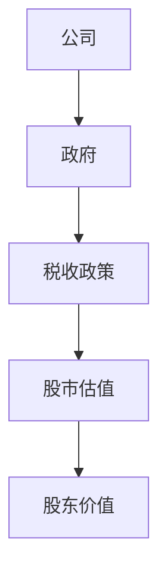
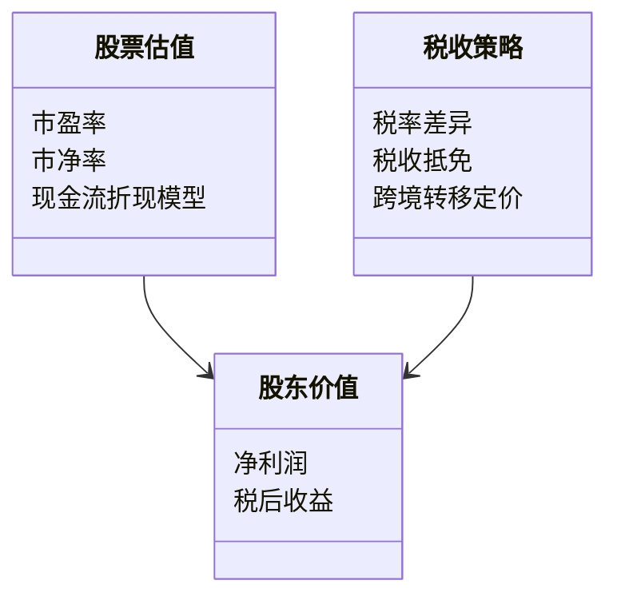
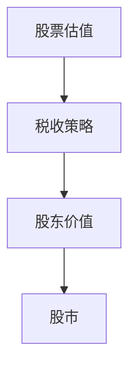

                 


# 股市估值对跨国公司税收策略的影响

---

## 关键词：
股市估值、跨国公司、税收策略、股票估值模型、税务优化、税收政策

---

## 摘要：
本文深入探讨了股市估值与跨国公司税收策略之间的复杂关系，分析了税收政策如何影响股市估值，并从技术角度解析了跨国公司如何通过优化税收策略来提升股东价值。文章结合实际案例，详细阐述了股市估值的核心模型、税收策略的核心要素，以及两者之间的相互影响，并提出了系统的解决方案和最佳实践。

---

# 第一部分: 背景介绍

## 第1章: 股市估值与税收策略的背景概述

### 1.1 股市估值的基本概念

#### 1.1.1 股票估值的定义与意义
股票估值是通过对公司财务数据和市场环境的分析，估算股票内在价值的过程。其意义在于帮助投资者做出合理的投资决策，同时为公司的市值管理提供参考。

#### 1.1.2 股票估值的主要方法
1. 市盈率（P/E）模型：通过市盈率倍数与行业平均水平的对比，评估股票的估值水平。
2. 市净率（P/B）模型：通过市净率倍数与行业平均水平的对比，评估股票的估值水平。
3. 现金流折现模型（DCF）：通过未来现金流的现值估算公司价值。

#### 1.1.3 股票市场的基本运作机制
股票市场是公司与投资者之间的交易场所，通过供需关系决定股票价格。股票价格受多种因素影响，包括公司业绩、宏观经济环境、政策变化等。

### 1.2 跨国公司税收策略的核心要素

#### 1.2.1 税收规划的基本概念
税收规划是指企业通过合法手段优化税务负担，降低税负成本，提高净利润的过程。

#### 1.2.2 跨国公司税务优化的常见手段
1. 利用避税天堂：通过在低税率国家设立子公司，降低全球税率。
2. 税收抵免：通过在高税率国家的税收抵免，减少整体税负。
3. 跨境转移定价：通过合理分配收入和成本，优化税率。

#### 1.2.3 税收政策对跨国公司的影响
税收政策直接影响跨国公司的净利润和股东价值，同时也影响公司的投资决策和全球布局。

### 1.3 股市估值与税收策略的关联性

#### 1.3.1 税收政策如何影响股市估值
税收政策直接影响公司的净利润，从而影响股票的内在价值和市场价格。

#### 1.3.2 股东价值与税务优化的关系
税务优化可以提高公司的净利润，从而提升股票的内在价值和市场价格。

#### 1.3.3 税收风险对股市估值的潜在影响
税收政策的变化可能带来税收风险，影响公司的净利润和股票估值。

---

## 第2章: 股市估值与税收策略的核心概念分析

### 2.1 股市估值的核心模型

#### 2.1.1 市盈率（P/E）模型
市盈率模型通过比较股票的市场价格与每股收益的比率，评估股票的估值水平。

公式：
$$ P/E = \frac{P}{E} $$
其中，P为股票价格，E为每股收益。

#### 2.1.2 市净率（P/B）模型
市净率模型通过比较股票的市场价格与每股净资产的比率，评估股票的估值水平。

公式：
$$ P/B = \frac{P}{B} $$
其中，P为股票价格，B为每股净资产。

#### 2.1.3 现金流折现模型（DCF）
DCF模型通过将未来现金流折现，估算公司的内在价值。

公式：
$$ V = \sum_{t=1}^{n} \frac{CF_t}{(1 + r)^t} $$
其中，CF_t为第t年的现金流，r为折现率。

### 2.2 税收策略的核心要素

#### 2.2.1 税率差异与税收抵免
税率差异是跨国公司进行税务优化的重要因素，通过在不同国家的税率差异，降低整体税负。

#### 2.2.2 跨国税务规划的法律框架
跨国税务规划需要遵守相关国家的税收法律法规，确保税务优化的合法性。

#### 2.2.3 税收政策的国际协调与差异
国际税收政策的协调与差异是跨国公司进行税务优化的重要背景。

### 2.3 股市估值与税收策略的实体关系图


---

## 第3章: 股市估值与税收策略的数学模型

### 3.1 股票估值的核心数学模型

#### 3.1.1 市盈率模型
$$ P/E = \frac{P}{E} $$

#### 3.1.2 现金流折现模型
$$ V = \sum_{t=1}^{n} \frac{CF_t}{(1 + r)^t} $$

### 3.2 税收策略的核心数学模型

#### 3.2.1 税后净利润计算
$$ Net\ Profit = EBIT \times (1 - Tax\ Rate) $$

#### 3.2.2 税收抵免计算
$$ Tax\ Credit = \sum_{i=1}^{n} Tax\ Paid\_i \times Tax\ Rate\_i $$

---

## 第4章: 系统分析与架构设计方案

### 4.1 问题场景介绍
跨国公司在全球范围内进行税务优化，同时需要考虑不同国家的税收政策对公司股价的影响。

### 4.2 系统功能设计

#### 4.2.1 领域模型


#### 4.2.2 系统架构设计


---

## 第5章: 项目实战

### 5.1 环境安装
安装必要的数据处理工具，如Python、Pandas、Matplotlib等。

### 5.2 核心代码实现

#### 5.2.1 市盈率计算
```python
import pandas as pd

# 假设df为包含股票数据的DataFrame
df['P/E'] = df['Price'] / df['Earnings']
```

#### 5.2.2 税收优化计算
```python
def calculate_tax_optimization(revenue, cost, tax_rate):
    taxable_income = revenue - cost
    tax = taxable_income * tax_rate
    return tax
```

### 5.3 案例分析
以某跨国公司为例，分析其税收策略对公司股价的影响。

---

## 第6章: 最佳实践与小结

### 6.1 小结
本文深入分析了股市估值与跨国公司税收策略之间的关系，提出了系统的解决方案和最佳实践。

### 6.2 注意事项
在进行税收优化时，需遵守相关法律法规，避免税务风险。

### 6.3 拓展阅读
推荐相关书籍和报告，进一步了解跨国公司税收策略与股市估值的关系。

---

通过本文的分析与实践，读者可以更好地理解股市估值与跨国公司税收策略之间的复杂关系，并能够将其应用于实际投资和税务规划中。

