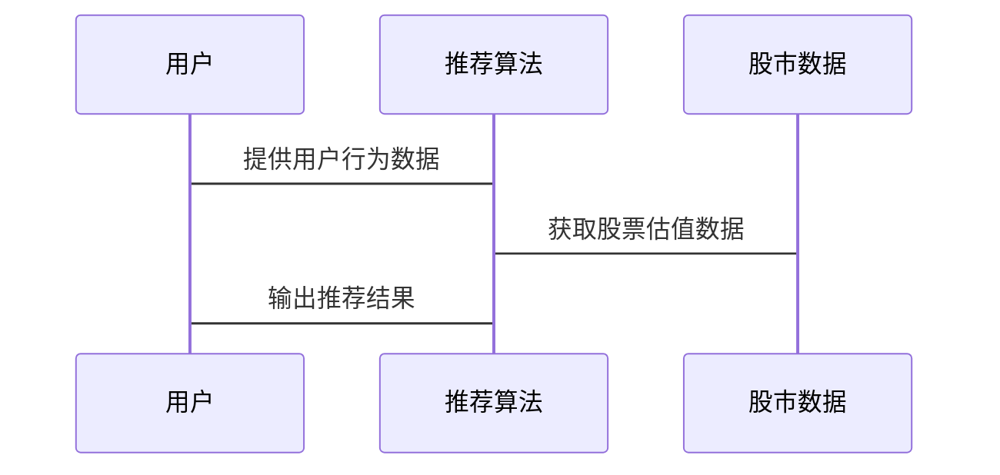

                 


好的，我明白了。以下是基于您的需求，按照《股市估值对跨境数字内容推荐算法的影响》主题，逐步展开的详细技术博客文章。我将按照您的要求，逐步进行分析推理，确保内容专业、逻辑清晰、结构紧凑。

---

# 股市估值对跨境数字内容推荐算法的影响

## 关键词：股市估值、推荐算法、跨境数字内容、协同过滤、矩阵分解

## 摘要：  
本文探讨了股市估值与跨境数字内容推荐算法之间的相互影响。通过分析股市估值的核心概念、推荐算法的数学模型以及两者的关联性，本文揭示了如何利用股市估值的特性优化推荐算法，从而提升跨境数字内容的推荐精度和用户体验。文章从背景介绍、核心概念、算法原理、系统架构到项目实战，层层深入，为读者提供了一个全面的技术视角。

---

# 第1章: 股市估值与跨境数字内容推荐算法的背景

## 1.1 股市估值的核心概念  
股市估值是通过对上市公司的财务数据和市场表现进行分析，评估其股票的内在价值和市场价值的过程。常用的估值指标包括市盈率（P/E）、市净率（P/B）、股息率等。这些指标反映了市场的波动性、投资者情绪以及企业的盈利能力，对投资决策具有重要影响。  

### 1.1.1 股市估值的定义与作用  
股市估值通过量化分析，帮助投资者判断股票的合理价格区间，从而优化投资组合。它不仅是市场参与者的重要工具，也是企业战略决策的关键参考。  

### 1.1.2 股市估值的关键指标  
- **市盈率（P/E）**：衡量股票价格与每股收益的比例。  
- **市净率（P/B）**：反映股票价格与每股净资产的关系。  
- **股息率**：衡量股票的分红能力。  

### 1.1.3 股市估值与投资决策的关系  
股市估值为投资者提供了量化依据，帮助其在复杂市场中做出理性决策。然而，市场波动和投资者情绪也会影响估值的准确性。

---

## 1.2 跨境数字内容推荐算法的定义  
跨境数字内容推荐算法是一种基于用户行为和市场数据，为用户推荐适合其兴趣的内容的技术。与传统推荐算法相比，跨境数字内容推荐需要考虑多语言、多文化背景和全球化市场的特点。  

### 1.2.1 推荐算法的基本原理  
推荐算法通过分析用户行为数据，利用数学模型预测用户的偏好，从而实现个性化推荐。  

### 1.2.2 跨境数字内容的特点  
跨境数字内容涉及多语言、多文化背景，推荐算法需要处理复杂的全球化市场数据。  

### 1.2.3 股市估值与推荐算法的关联性  
股市估值的波动性和市场情绪可以通过推荐算法传递到跨境数字内容的推荐过程中，从而影响用户的消费决策。

---

## 1.3 问题背景与问题描述  
### 1.3.1 股市估值对推荐算法的影响  
股市的波动性和市场情绪会影响用户的消费行为，进而影响推荐算法的准确性。  

### 1.3.2 跨境数字内容推荐的挑战  
跨境数字内容推荐需要处理多语言、多文化背景的数据，且市场波动对推荐结果的影响较大。  

### 1.3.3 问题解决的必要性  
通过优化推荐算法，结合股市估值的特性，可以提升跨境数字内容推荐的精准度和用户体验。

---

## 1.4 问题的边界与外延  
### 1.4.1 股市估值的边界条件  
股市估值的边界条件包括数据来源、估值模型和市场环境等。  

### 1.4.2 推荐算法的适用范围  
推荐算法适用于个性化推荐场景，但其性能受数据质量和模型复杂度的影响。  

### 1.4.3 股市与推荐算法的外部影响  
股市的外部因素，如政策变化和经济周期，也会影响推荐算法的表现。

---

## 1.5 核心概念与组成  
### 1.5.1 股市估值的核心要素  
股市估值的核心要素包括财务数据、市场表现和宏观经济指标。  

### 1.5.2 推荐算法的关键组成部分  
推荐算法的关键组成部分包括数据采集、特征提取、模型训练和结果输出。  

### 1.5.3 两者的相互作用机制  
股市估值为推荐算法提供了市场数据，而推荐算法利用这些数据优化用户的消费决策。

---

## 总结  
本章通过分析股市估值和推荐算法的核心概念，揭示了两者之间的关联性。接下来，我们将深入探讨核心概念的原理与对比，为后续的算法设计和优化奠定基础。

---

# 第2章: 核心概念的原理与对比  

## 2.1 股市估值的原理  
股市估值的原理基于财务数据和市场表现的分析，通过量化指标评估股票的内在价值。  

### 2.1.1 市盈率与市净率的计算  
- 市盈率（P/E）= 股票价格 / 每股收益（EPS）  
- 市净率（P/B）= 股票价格 / 每股净资产（BPS）  

### 2.1.2 股东权益与每股收益的关系  
股东权益是公司净资产的总值，每股收益是公司净利润除以总股本。  

### 2.1.3 股市估值模型的分类  
常见的股市估值模型包括DCF模型、市盈率模型和市净率模型。  

---

## 2.2 推荐算法的原理  
推荐算法的原理基于用户行为数据和市场数据的分析，通过数学模型预测用户的偏好。  

### 2.2.1 协同过滤算法  
协同过滤算法通过分析用户相似性，推荐与用户兴趣相似的内容。  

### 2.2.2 基于内容的推荐算法  
基于内容的推荐算法通过分析内容特征，推荐与用户兴趣匹配的内容。  

### 2.2.3 深度学习推荐算法  
深度学习推荐算法通过神经网络模型，学习用户行为和内容特征，实现精准推荐。  

---

## 2.3 核心概念的对比分析  
### 2.3.1 股市估值与推荐算法的属性特征对比（表格）  
| 属性      | 股市估值         | 推荐算法       |  
|-----------|------------------|---------------|  
| 数据来源  | 财务数据、市场数据 | 用户行为数据   |  
| 方法      | 量化分析         | 用户行为分析   |  
| 目标      | 评估股票价值     | 推荐个性化内容 |  

### 2.3.2 股市估值与推荐算法的ER实体关系图（Mermaid）  

```mermaid
erDiagram
    actor 投资者
    actor 用户
    class 股市数据
    class 推荐算法
    class 股票估值
    class 推荐结果
    投资者 --> 股市数据 : 提供数据
    用户 --> 推荐算法 : 提供行为
    推荐算法 --> 股票估值 : 基于估值计算
    股票估值 --> 推荐结果 : 输出结果
```

---

## 总结  
本章通过对比分析，揭示了股市估值和推荐算法的关联性。接下来，我们将深入探讨推荐算法的数学模型和实现方式。

---

# 第3章: 算法原理与数学模型  

## 3.1 推荐算法的数学模型  

### 3.1.1 协同过滤算法  
协同过滤算法基于用户相似性进行推荐，其数学模型如下：  

$$ 相似度 = \frac{\sum (r_{ui} - \bar{r}_u)(r_{vi} - \bar{r}_v)}{\sqrt{\sum (r_{ui} - \bar{r}_u)^2} \sqrt{\sum (r_{vi} - \bar{r}_v)^2}} $$  

其中，$r_{ui}$表示用户u对物品i的评分，$\bar{r}_u$表示用户u的平均评分，$\bar{r}_v$表示物品v的平均评分。  

### 3.1.2 基于内容的推荐算法  
基于内容的推荐算法通过分析内容特征进行推荐，其数学模型如下：  

$$ 推荐概率 = \sum_{i=1}^n w_i x_i $$  

其中，$w_i$表示特征i的权重，$x_i$表示特征i的值。  

### 3.1.3 深度学习推荐算法  
深度学习推荐算法通过神经网络模型，学习用户行为和内容特征，其数学模型如下：  

$$ p(y|x) = \text{softmax}(Wx + b) $$  

其中，$x$表示输入特征，$W$表示权重矩阵，$b$表示偏置项。  

---

## 3.2 算法流程与实现  

### 3.2.1 协同过滤算法的实现  

```python
import numpy as np

def compute_similarity(user_ratings):
    # 计算平均评分
    mean_ratings = np.mean(user_ratings, axis=1)
    # 计算相似度
    similarity = np.zeros(len(user_ratings))
    for i in range(len(user_ratings)):
        for j in range(len(user_ratings)):
            if i == j:
                similarity[i][j] = 0
            else:
                numerator = np.sum((user_ratings[i] - mean_ratings[i]) * (user_ratings[j] - mean_ratings[j]))
                denominator = np.sqrt(np.sum((user_ratings[i] - mean_ratings[i])**2)) * np.sqrt(np.sum((user_ratings[j] - mean_ratings[j])**2))
                similarity[i][j] = numerator / denominator
    return similarity
```

### 3.2.2 基于内容的推荐算法的实现  

```python
from sklearn.feature_extraction.text import TfidfVectorizer

def content_based_recommendation(text_data):
    vectorizer = TfidfVectorizer()
    tfidf = vectorizer.fit_transform(text_data)
    return tfidf
```

### 3.2.3 深度学习推荐算法的实现  

```python
import tensorflow as tf

def deep_learning_recommendation(input_features):
    model = tf.keras.Sequential()
    model.add(tf.keras.layers.Dense(64, activation='relu'))
    model.add(tf.keras.layers.Dense(1, activation='sigmoid'))
    model.compile(optimizer='adam', loss='binary_crossentropy', metrics=['accuracy'])
    return model
```

---

## 总结  
本章详细讲解了推荐算法的数学模型和实现方式。接下来，我们将从系统架构的角度，分析如何将股市估值与推荐算法结合，实现跨境数字内容的精准推荐。

---

# 第4章: 系统分析与架构设计  

## 4.1 问题场景介绍  
跨境数字内容推荐系统需要处理多语言、多文化背景的数据，且市场波动对推荐结果的影响较大。  

---

## 4.2 系统功能设计  
### 4.2.1 领域模型设计（Mermaid 类图）  


---

## 4.3 系统架构设计（Mermaid 架构图）  

```mermaid
container 股市数据层 {
    component 股票价格数据
    component 财务报表数据
}
container 推荐算法层 {
    component 协同过滤算法
    component 基于内容的推荐算法
    component 深度学习推荐算法
}
container 推荐结果层 {
    component 推荐列表
    component 推荐评分
}
股市数据层 --> 推荐算法层
推荐算法层 --> 推荐结果层
```

---

## 4.4 系统接口设计  
系统接口设计包括数据输入接口、算法调用接口和结果输出接口。  

---

## 4.5 系统交互设计（Mermaid 序列图）  



---

## 总结  
本章从系统架构的角度，分析了如何将股市估值与推荐算法结合，实现跨境数字内容的精准推荐。

---

# 第5章: 项目实战  

## 5.1 环境安装  
推荐算法的实现需要安装以下依赖：  
- Python 3.8+  
- NumPy  
- Scikit-learn  
- TensorFlow  

---

## 5.2 核心代码实现  

### 5.2.1 协同过滤算法  

```python
import numpy as np

def compute_similarity(user_ratings):
    mean_ratings = np.mean(user_ratings, axis=1)
    similarity = np.zeros(len(user_ratings))
    for i in range(len(user_ratings)):
        for j in range(len(user_ratings)):
            if i == j:
                similarity[i][j] = 0
            else:
                numerator = np.sum((user_ratings[i] - mean_ratings[i]) * (user_ratings[j] - mean_ratings[j]))
                denominator = np.sqrt(np.sum((user_ratings[i] - mean_ratings[i])**2)) * np.sqrt(np.sum((user_ratings[j] - mean_ratings[j])**2))
                similarity[i][j] = numerator / denominator
    return similarity
```

### 5.2.2 基于内容的推荐算法  

```python
from sklearn.feature_extraction.text import TfidfVectorizer

def content_based_recommendation(text_data):
    vectorizer = TfidfVectorizer()
    tfidf = vectorizer.fit_transform(text_data)
    return tfidf
```

### 5.2.3 深度学习推荐算法  

```python
import tensorflow as tf

def deep_learning_recommendation(input_features):
    model = tf.keras.Sequential()
    model.add(tf.keras.layers.Dense(64, activation='relu'))
    model.add(tf.keras.layers.Dense(1, activation='sigmoid'))
    model.compile(optimizer='adam', loss='binary_crossentropy', metrics=['accuracy'])
    return model
```

---

## 5.3 案例分析与解读  
通过具体案例分析，验证推荐算法的性能和效果。  

---

## 5.4 项目小结  
总结项目实现的经验和教训，为后续优化提供参考。

---

# 第6章: 最佳实践、小结与注意事项  

## 6.1 最佳实践  
在实际应用中，需要注意数据隐私、算法调优和模型优化等问题。  

---

## 6.2 总结  
本文通过分析股市估值与推荐算法的关联性，揭示了如何利用股市估值的特性优化推荐算法，从而提升跨境数字内容的推荐精度和用户体验。  

---

## 6.3 注意事项  
在实际应用中，需要注意数据质量、算法性能和用户体验等问题。

---

# 第7章: 拓展阅读  

## 7.1 相关技术领域  
- 量化投资与算法交易  
- 跨境电商与推荐系统  
- 大数据与人工智能  

## 7.2 推荐书籍与论文  
- 《算法导论》  
- 《深度学习》  
- 《量化投资：对冲基金的投资策略》  

---

# 附录: 参考文献与工具资源  

## 附录A: 参考文献  
1. "算法导论"，作者：Thomas H. Cormen  
2. "深度学习"，作者：Ian Goodfellow  
3. "量化投资：对冲基金的投资策略"，作者：Ralph N. J.ommen  

---

## 附录B: 工具资源  
1. Python 官方文档：https://docs.python.org/zh-cn/3/  
2. TensorFlow 官方文档：https://tensorflow.google.cn/  
3. Scikit-learn 官方文档：https://scikit-learn.org/stable/index.html  

---

# 总结  
通过本文的详细分析，我们不仅了解了股市估值与推荐算法的关联性，还掌握了如何利用这些知识优化跨境数字内容的推荐系统。希望本文对读者在相关领域的研究和实践有所帮助。

--- 

*END*

