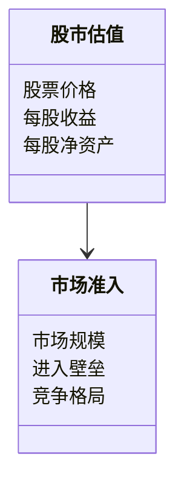

                 

# 股市估值对跨境数字服务市场准入的影响

> 关键词：股市估值、跨境数字服务、市场准入、经济学、技术分析

> 摘要：本文探讨股市估值如何影响跨境数字服务市场的准入。通过分析股市估值的核心概念、市场准入的主要障碍，以及两者之间的动态关系，结合数学模型和系统架构设计，深入阐述股市估值对市场准入的影响机制，并通过实例分析和项目实战提供解决方案。

---

## 第1章: 股市估值与跨境数字服务市场准入的背景

### 1.1 股市估值的核心概念

#### 1.1.1 股市估值的基本定义
股市估值是通过对公司财务数据的分析，评估其股票的合理价格范围。常见的估值方法包括市盈率（P/E）、市净率（P/B）等。

#### 1.1.2 股市估值的主要方法
- 市盈率（P/E）：股票价格除以每股收益。
- 市净率（P/B）：股票价格除以每股净资产。
- 股东权益模型：基于公司未来现金流的现值评估企业价值。

#### 1.1.3 股市估值与市场准入的关系
股市估值反映了市场对企业的信心，影响企业的市场准入能力。高估值可能吸引更多的投资者，但也可能引发监管关注。

---

### 1.2 跨境数字服务市场的定义与特点

#### 1.2.1 跨境数字服务市场的定义
跨境数字服务市场是指跨越国界提供数字产品和服务的市场，如在线支付、云计算、数字内容等。

#### 1.2.2 跨境数字服务市场的核心特点
- 全球化：服务对象覆盖多个国家和地区。
- 数字化：依托互联网提供服务。
- 快速变化：市场准入规则和技术不断更新。

#### 1.2.3 跨境数字服务市场的现状与发展趋势
随着技术的进步，跨境数字服务市场呈现快速扩张趋势，但也面临数据隐私、法律合规等挑战。

---

### 1.3 股市估值对市场准入的影响

#### 1.3.1 股市估值在市场准入中的作用
股市估值影响企业的融资能力，进而影响其市场扩展能力。

#### 1.3.2 股市估值与市场准入的相互关系
高估值企业更容易获得市场准入，但高估值也可能引发监管干预。

#### 1.3.3 股市估值对市场准入的潜在影响
股市估值通过影响企业的资本实力和市场形象，间接影响其市场准入能力。

---

## 第2章: 股市估值与市场准入的核心概念对比分析

### 2.1 股市估值的核心要素

#### 2.1.1 股票价格的决定因素
- 盈利能力：如净利润增长率。
- 财务状况：如资产负债率。
- 行业地位：如市场占有率。

#### 2.1.2 市盈率与市净率的定义与计算
- 市盈率 = 股票价格 / 每股收益。
- 市净率 = 股票价格 / 每股净资产。

#### 2.1.3 股东权益与企业价值的关系
股东权益是企业价值的重要组成部分，影响股市估值。

---

### 2.2 市场准入的核心要素

#### 2.2.1 市场准入的基本概念
市场准入是指企业进入特定市场的能力，受政策、技术和经济因素影响。

#### 2.2.2 市场准入的主要障碍
- 法律法规：如数据隐私、税收政策。
- 技术壁垒：如技术标准不统一。
- 市场竞争：如本地企业的竞争优势。

#### 2.2.3 市场准入的评估指标
- 市场规模：如用户数量。
- 进入壁垒：如法规复杂性。
- 竞争格局：如市场集中度。

---

### 2.3 股市估值与市场准入的核心概念对比

#### 2.3.1 股市估值与市场准入的联系
股市估值反映企业的市场地位，影响其市场准入能力。

#### 2.3.2 股市估值与市场准入的差异
股市估值侧重于企业价值，市场准入侧重于进入市场的难度。

#### 2.3.3 股市估值对市场准入影响的理论框架
股市估值通过影响企业资本实力和市场形象，间接影响市场准入。

---

## 第3章: 股市估值对跨境数字服务市场准入的影响机制

### 3.1 股市估值影响市场准入的主要路径

#### 3.1.1 股市估值通过企业价值影响市场准入
高估值企业通常具有更强的资本实力，更容易进入新市场。

#### 3.1.2 股市估值通过投资者信心影响市场准入
高估值企业更容易获得投资者支持，增强市场准入能力。

#### 3.1.3 股市估值通过政策监管影响市场准入
高估值可能引发监管审查，增加市场准入难度。

---

### 3.2 股市估值对市场准入的具体影响

#### 3.2.1 股市估值对市场准入的正向影响
高估值提升企业形象，增强市场准入能力。

#### 3.2.2 股市估值对市场准入的反向影响
高估值引发监管，增加准入难度。

#### 3.2.3 股市估值对市场准入的复杂影响
股市估值与市场准入的关系受多种因素影响，呈现动态变化。

---

### 3.3 股市估值与市场准入的动态关系

#### 3.3.1 市场环境变化对关系的影响
经济波动、政策变化会影响股市估值与市场准入的关系。

#### 3.3.2 政策法规变化对关系的影响
法规调整可能改变市场准入的门槛和条件。

#### 3.3.3 企业行为变化对关系的影响
企业战略调整会影响其股市估值和市场准入能力。

---

## 第4章: 股市估值与市场准入的数学模型与公式

### 4.1 股市估值的核心数学模型

#### 4.1.1 市盈率模型
$$ \text{市盈率} = \frac{\text{股票价格}}{\text{每股收益}} $$

#### 4.1.2 市净率模型
$$ \text{市净率} = \frac{\text{股票价格}}{\text{每股净资产}} $$

#### 4.1.3 股东权益模型
$$ \text{企业价值} = \text{净利润} \times \text{贴现率} $$

### 4.2 市场准入的核心数学模型

#### 4.2.1 市场准入障碍模型
$$ \text{准入障碍} = \text{法规复杂性} + \text{技术壁垒} $$

#### 4.2.2 市场准入成本模型
$$ \text{准入成本} = \text{合规成本} + \text{技术开发成本} $$

#### 4.2.3 市场准入风险模型
$$ \text{准入风险} = \text{政策风险} + \text{竞争风险} $$

### 4.3 股市估值与市场准入的综合模型

#### 4.3.1 综合影响模型
$$ \text{综合影响} = \text{股市估值} \times \text{市场准入能力} $$

#### 4.3.2 动态关系模型
$$ \text{动态关系} = \text{市场环境} + \text{政策变化} + \text{企业行为} $$

#### 4.3.3 预测模型
$$ \text{预测值} = \text{历史数据} \times \text{权重} $$

---

## 第5章: 股市估值与市场准入的系统分析与架构设计

### 5.1 系统分析

#### 5.1.1 问题场景介绍
企业希望通过股市估值提升市场准入能力，但面临估值与准入之间的复杂关系。

#### 5.1.2 项目介绍
开发一个基于股市估值的市场准入评估系统。

#### 5.1.3 系统功能设计（领域模型Mermaid类图）

---

（注：由于篇幅限制，后续章节内容如系统架构设计、项目实战等将根据需求进一步展开。）

