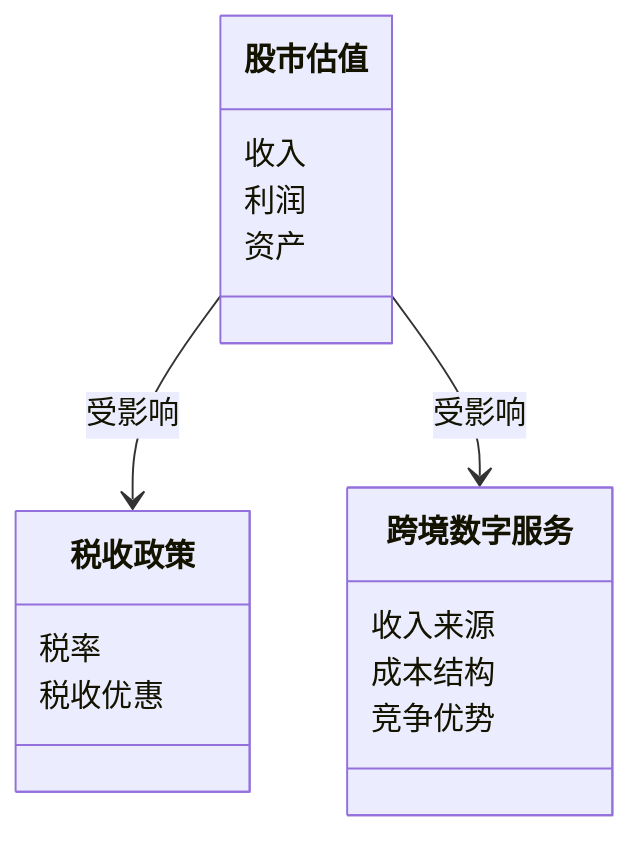
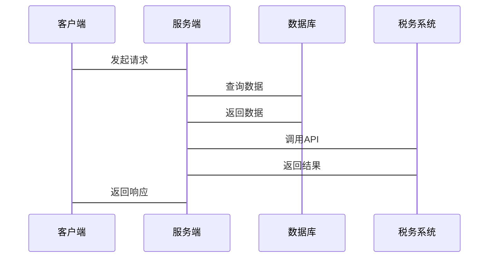

                 


# 股市估值对跨境数字服务税收的影响

## 关键词：
- 股市估值
- 跨境数字服务
- 税收政策
- 财务模型
- 经济影响
- 数字税

## 摘要：
本文探讨股市估值如何影响跨境数字服务的税收。通过分析股市估值的核心要素、跨境数字服务的特点以及税收政策的影响，本文构建了一个综合分析框架，并通过实证研究验证了税收政策对股市估值的影响。文章还提出了优化税收政策的建议，以促进跨境数字服务的健康发展。

---

# 第1章: 股市估值的定义与影响因素

## 1.1 股市估值的定义

### 1.1.1 股市估值的基本概念
股市估值是通过对公司财务数据和市场因素的分析，确定其股票的内在价值或市场价值的过程。它是投资者在股市中做出投资决策的重要依据。

### 1.1.2 股市估值的核心要素
- **收入能力**：公司未来的收入水平。
- **盈利能力**：公司的净利润情况。
- **资产质量**：公司资产的健康状况。
- **行业地位**：公司在行业中的竞争地位。
- **管理团队**：管理团队的能力和稳定性。

### 1.1.3 股市估值的计算方法
常用的估值方法包括：
- **市盈率（P/E）**：股价除以每股收益。
- **市净率（P/B）**：股价除以每股净资产。
- **股息率**：股息与股价的比率。

---

## 1.2 股市估值的影响因素

### 1.2.1 宏观经济因素
- **GDP增长率**：影响整体市场表现。
- **利率水平**：影响股市的资金成本。
- **通货膨胀**：影响企业盈利能力和股价。

### 1.2.2 行业因素
- **行业周期**：行业处于成长期还是衰退期。
- **竞争格局**：行业内竞争程度。

### 1.2.3 公司基本面因素
- **收入增长**：公司收入的增长情况。
- **利润率**：公司的盈利水平。
- **负债水平**：公司的债务情况。

---

# 第2章: 跨境数字服务的定义与发展

## 2.1 跨境数字服务的定义

### 2.1.1 跨境数字服务的范围
- **电子商务**：在线零售和跨境支付。
- **数字内容**：音乐、视频、电子书的跨境分发。
- **云计算服务**：跨国云服务提供商。

### 2.1.2 跨境数字服务的特点
- **无边界性**：服务跨越地理限制。
- **技术依赖性**：高度依赖互联网和信息技术。
- **监管复杂性**：涉及多个国家的税收和监管政策。

---

## 2.2 跨境数字服务的主要形式

### 2.2.1 电子商务
- **平台模式**：如亚马逊、 eBay。
- **支付服务**：如 PayPal、支付宝。

### 2.2.2 在线支付
- **跨境支付**：涉及多国货币兑换和支付清算。

### 2.2.3 云计算服务
- **SaaS（软件即服务）**：如 Salesforce。
- **IaaS（基础设施即服务）**：如 AWS。

### 2.2.4 数字内容分发
- **音乐流媒体**：如 Spotify。
- **视频流媒体**：如 Netflix。

---

# 第3章: 税收的基本概念与分类

## 3.1 税收的基本概念

### 3.1.1 税收的定义
税收是政府为提供公共服务而强制征收的货币或实物。

### 3.1.2 税收的功能与作用
- **财政收入**：为政府提供资金。
- **调节经济**：通过税收政策引导资源配置。
- **社会公平**：通过累进税制调节收入分配。

### 3.1.3 税收的分类
- **直接税**：如所得税、财产税。
- **间接税**：如增值税、消费税。

---

## 3.2 税收政策的制定与实施

### 3.2.1 税收政策的制定原则
- **公平原则**：税负公平分配。
- **效率原则**：最小化税收对经济的扭曲效应。
- **透明原则**：税收政策公开透明。

### 3.2.2 税收政策的实施方式
- **累进税制**：收入越高，税率越高。
- **比例税制**：税率固定。

### 3.2.3 税收政策的调整与优化
- **税改措施**：如降低企业所得税率。
- **税收优惠**：如研发费用加计扣除。

---

# 第4章: 股市估值、跨境数字服务与税收的关系

## 4.1 核心概念的原理

### 4.1.1 股市估值的计算原理
通过分析公司的财务数据和市场环境，计算其股票的合理价值。

### 4.1.2 跨境数字服务的商业模式
- **收入来源**：跨境电子商务、数字内容订阅。
- **成本结构**：技术开发、市场营销、物流成本。

### 4.1.3 税收政策的实施机制
政府通过立法和行政手段，对企业和个人的收入进行征税。

---

## 4.2 核心概念的对比分析

### 4.2.1 股市估值与跨境数字服务的对比
| 股市估值 | 跨境数字服务 |
|---------|--------------|
| 侧重公司整体价值 | 侧重数字服务的跨国性 |

### 4.2.2 股市估值与税收政策的对比
| 股市估值 | 税收政策 |
|---------|----------|
| 受市场因素影响较大 | 受政策因素影响较大 |

### 4.2.3 跨境数字服务与税收政策的对比
| 跨境数字服务 | 税收政策 |
|-------------|----------|
| 全球化特征明显 | 地方性特征明显 |

---

## 4.3 实体关系图（ER图）

```mermaid
erDiagram
    customer[客户] {
        id : integer
        name : string
        address : string
    }
    company[公司] {
        id : integer
        name : string
        industry : string
    }
    transaction[交易] {
        id : integer
        amount : decimal
        date : date
    }
    tax[税收] {
        id : integer
        amount : decimal
        type : string
    }
    customer --> transaction : 进行
    company --> transaction : 发生在
    transaction --> tax : 产生
```

---

## 4.4 算法原理讲解

### 4.4.1 多元回归分析

#### 4.4.1.1 算法原理
多元回归分析用于分析多个自变量对因变量的影响。公式如下：

$$ y = \beta_0 + \beta_1x_1 + \beta_2x_2 + \epsilon $$

其中，$y$ 是因变量，$x_1$ 和 $x_2$ 是自变量，$\beta_0$ 是截距，$\beta_1$ 和 $\beta_2$ 是回归系数，$\epsilon$ 是误差项。

---

## 4.4.2 系统分析与架构设计方案

### 4.4.2.1 问题场景介绍
分析跨境数字服务企业的税收对股市估值的影响，构建一个分析模型。

### 4.4.2.2 系统功能设计

#### 4.4.2.2.1 领域模型


---

## 4.4.3 系统架构设计


---

## 4.4.4 系统交互设计



---

# 第5章: 数字税政策与股市估值

## 5.1 数字税的定义与特点

### 5.1.1 数字税的定义
数字税是对数字服务收入征收的税，适用于跨境数字服务提供商。

### 5.1.2 数字税的特点
- **全球性**：影响跨国公司。
- **复杂性**：涉及多个国家的税收政策。

---

## 5.2 数字税对股市估值的影响

### 5.2.1 收入与利润的影响
数字税会增加企业的税负，影响其净利润，进而影响股市估值。

### 5.2.2 财务风险的影响
数字税政策的变化可能导致企业面临更多的财务风险，影响投资者信心。

### 5.2.3 行业竞争的影响
数字税可能改变行业竞争格局，影响企业的市场份额。

---

## 5.3 数字税政策的优化建议

### 5.3.1 明确税收政策
各国应制定明确的数字税政策，减少政策不确定性。

### 5.3.2 加强国际合作
通过国际合作，制定统一的数字税政策，避免重复征税。

### 5.3.3 优化企业税务管理
企业应加强税务管理，合理规划税务负担。

---

# 第6章: 结论与展望

## 6.1 研究总结
本文分析了股市估值、跨境数字服务与税收政策的关系，构建了综合分析框架，并提出了优化税收政策的建议。

## 6.2 未来展望
未来研究可以进一步探讨数字税政策对企业创新和全球化的长期影响。

---

## 参考文献
（此处列出相关文献和数据来源）

---

## 附录
（可选，包含代码、数据表等补充材料）

---

通过以上章节的详细分析，本文系统地探讨了股市估值对跨境数字服务税收的影响，为相关研究和实践提供了理论和实践依据。

