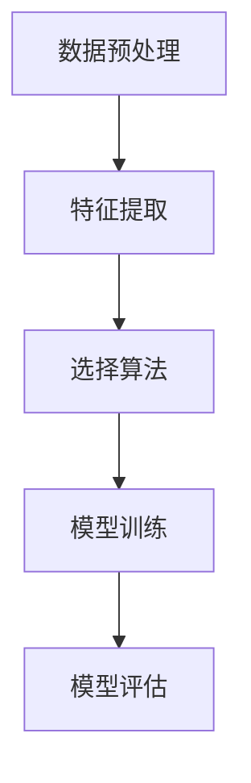
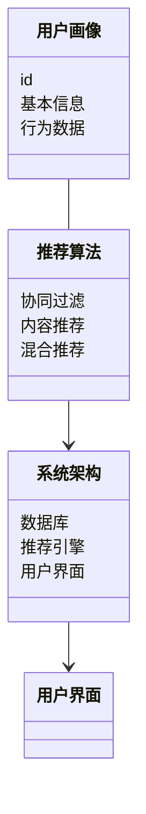
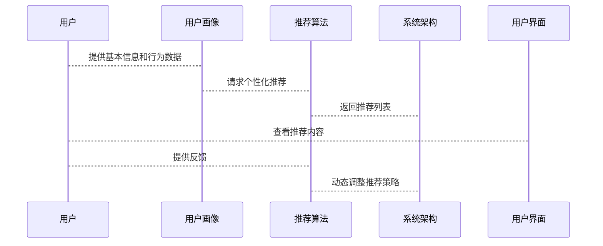

                 


```markdown
# 股市估值对跨境数字营销个性化策略的影响

## 关键词
- 股市估值
- 跨境数字营销
- 个性化策略
- 数据驱动
- 机器学习
- 系统架构

## 摘要
随着全球经济的全球化和数字化转型的加速，股市估值与跨境数字营销之间的关系变得日益紧密。本文将深入探讨股市估值对跨境数字营销个性化策略的影响，从理论到实践，分析如何利用数据驱动的方法优化营销策略。通过结合机器学习算法和系统架构设计，本文将为读者提供一套完整的解决方案，帮助企业在复杂多变的市场环境中制定更精准、更具竞争力的营销策略。

---

# 第一部分: 股市估值与跨境数字营销概述

## 第1章: 股市估值的基本概念

### 1.1 股市估值的定义与核心要素
股市估值是指对上市公司股票价值的评估，通常通过分析公司的财务状况、市场地位、行业前景等因素来确定其合理的市场价格。核心要素包括：
- **公司基本面**：收入、利润、资产负债表等。
- **市场环境**：宏观经济指标、行业趋势、政策环境等。
- **市场情绪**：投资者心理、市场波动性等。

### 1.2 股市估值的影响因素
- **宏观经济因素**：GDP增长率、通货膨胀、利率政策等。
- **行业因素**：行业周期、竞争格局、技术创新等。
- **公司基本面因素**：盈利能力、成长性、财务健康状况等。

### 1.3 股市估值的作用机制
- **估值与市场情绪的关系**：市场情绪波动会影响股票价格，进而影响估值。
- **估值与投资决策的关系**：投资者通过估值来判断股票是否被高估或低估，从而做出买卖决策。
- **估值与市场波动的关系**：估值偏差可能导致市场泡沫或价值低估，引发市场波动。

## 第2章: 跨境数字营销的个性化策略

### 2.1 跨境数字营销的定义与特点
- 跨境数字营销是指通过数字渠道（如网站、社交媒体、搜索引擎等）进行跨国营销活动，目标市场分布在多个国家或地区。
- 其特点是数据驱动、个性化、实时互动和全球化。

### 2.2 跨境数字营销的目标与挑战
- **目标**：提高品牌知名度、吸引目标客户、提升销售额、优化客户体验。
- **挑战**：文化差异、语言障碍、法律法规差异、技术门槛高。

### 2.3 跨境数字营销的个性化策略
- **个性化推荐**：基于用户行为数据和 preferences，推荐相关产品或内容。
- **数据驱动的个性化策略**：利用大数据分析技术，精准定位目标客户，制定个性化营销方案。
- **实施步骤**：数据收集、客户细分、策略制定、执行与优化。

## 第3章: 股市估值对跨境数字营销的影响

### 3.1 股市波动对跨境数字营销的影响
- **市场信心**：股市波动会影响消费者信心，进而影响消费行为。
- **消费者行为**：经济不确定性可能导致消费者减少非必需品的购买。
- **营销预算**：股市波动可能影响企业的营销预算，影响营销活动的规模和频率。

### 3.2 股市估值与跨境数字营销策略的关联
- **营销目标**：股市估值可以帮助企业评估其市场价值，制定合理的营销目标。
- **策略调整**：根据股市估值的变化，企业可以动态调整其营销策略。
- **效果评估**：股市估值是评估营销策略效果的重要指标之一。

### 3.3 数据驱动的股市估值与营销策略优化
- **数据驱动的股市估值方法**：利用大数据和机器学习技术，构建股票估值模型。
- **数据驱动的营销策略优化**：通过实时数据分析，优化营销内容和渠道。
- **动态调整**：根据股市估值的变化，实时调整营销策略，确保最佳效果。

---

# 第二部分: 股市估值与跨境数字营销的算法与系统设计

## 第4章: 股市估值预测的算法原理

### 4.1 股市估值预测的常用算法
- **线性回归模型**：适用于简单的线性关系，但不适用于复杂的市场波动。
- **支持向量回归**：适用于非线性关系，但需要大量数据支持。
- **随机森林回归**：适用于高维数据，具有较强的鲁棒性。
- **LSTM神经网络**：适用于时间序列数据，能够捕捉市场波动的长期依赖关系。

### 4.2 基于机器学习的股市估值预测模型
#### 4.2.1 数据预处理
- 数据清洗：处理缺失值、异常值。
- 特征工程：提取有用特征，如移动平均线、相对强弱指数等。

#### 4.2.2 模型训练
```python
# 示例代码：使用LSTM进行股市估值预测
import numpy as np
import pandas as pd
from keras.models import Sequential
from keras.layers import LSTM, Dense

# 数据准备
data = pd.read_csv('stock_data.csv')
features = data[['close', 'open', 'high', 'low']]
labels = data['next_day_close']

# 划分训练集和测试集
train_features = features[:int(0.8*len(features))]
train_labels = labels[:int(0.8*len(labels))]
test_features = features[int(0.8*len(features)):]
test_labels = labels[int(0.8*len(labels)):]

# 模型构建
model = Sequential()
model.add(LSTM(64, input_shape=(train_features.shape[1], 1)))
model.add(Dense(1))
model.compile(optimizer='adam', loss='mean_squared_error')

# 训练模型
model.fit(train_features, train_labels, epochs=100, batch_size=32)
```

### 4.3 算法流程图


## 第5章: 跨境数字营销个性化推荐的系统设计

### 5.1 系统功能设计
- **用户画像**：基于用户行为数据，构建用户画像。
- **推荐算法**：基于协同过滤、内容推荐或混合推荐算法，生成个性化推荐内容。
- **实时互动**：通过实时数据反馈，动态调整推荐策略。

### 5.2 系统架构设计


### 5.3 系统接口设计
- **输入接口**：用户行为数据、产品数据。
- **输出接口**：个性化推荐列表、推荐理由、实时反馈。

### 5.4 系统交互流程


---

# 第三部分: 项目实战与最佳实践

## 第6章: 股市估值与营销策略优化的项目实战

### 6.1 环境配置
- **工具安装**：安装Python、机器学习库（如Scikit-learn、TensorFlow）、数据处理工具（如Pandas、NumPy）。
- **数据源获取**：获取股票数据和营销数据，清洗和预处理数据。

### 6.2 核心实现
#### 6.2.1 股市估值预测
```python
# 示例代码：使用随机森林进行股市估值预测
from sklearn.ensemble import RandomForestRegressor
from sklearn.metrics import mean_squared_error

# 数据准备
features = data[['close', 'open', 'high', 'low']]
labels = data['next_day_close']

# 划分训练集和测试集
train_features = features[:int(0.8*len(features))]
train_labels = labels[:int(0.8*len(labels))]
test_features = features[int(0.8*len(features)):]
test_labels = labels[int(0.8*len(labels)):]

# 训练模型
model = RandomForestRegressor(n_estimators=100)
model.fit(train_features, train_labels)

# 预测和评估
predictions = model.predict(test_features)
print(mean_squared_error(test_labels, predictions))
```

#### 6.2.2 营销策略优化
- **数据驱动的策略优化**：基于股市估值结果，动态调整营销策略。
- **实时反馈机制**：根据市场反馈，实时优化营销内容和渠道。

### 6.3 案例分析
- **案例背景**：某跨国企业面临股市波动对其营销活动的影响。
- **解决方案**：利用机器学习模型预测股市估值，优化营销策略。
- **实施效果**：提高了营销转化率，降低了营销成本。

## 第7章: 最佳实践与未来展望

### 7.1 最佳实践
- **数据驱动**：充分利用数据进行分析和决策。
- **技术应用**：结合机器学习和大数据技术，提升营销效果。
- **动态调整**：根据市场变化，实时优化营销策略。

### 7.2 未来展望
- **技术进步**：人工智能和大数据技术的进一步发展，将为股市估值和营销策略优化提供更强大的工具。
- **全球化趋势**：随着全球经济的进一步融合，股市估值与跨境数字营销的关系将更加紧密。
- **创新与挑战**：未来需要更多创新的解决方案，以应对复杂多变的市场环境。

---

# 第四部分: 总结

## 第8章: 总结与展望
- **核心观点回顾**：股市估值对跨境数字营销的影响是多方面的，通过数据驱动的方法可以优化营销策略。
- **未来研究方向**：进一步研究股市估值与营销策略的动态关系，探索更多创新的技术和方法。

## 第9章: 注意事项与拓展阅读
- **注意事项**：在实际应用中，需注意数据的准确性和模型的可解释性。
- **拓展阅读**：推荐相关书籍和论文，供读者深入研究。

---

通过本文的分析和实践，我们可以看到，股市估值与跨境数字营销的结合是一个充满挑战和机遇的领域。利用数据驱动的方法和先进的技术工具，企业可以更好地应对市场变化，制定更有效的营销策略，实现业务增长。
```

