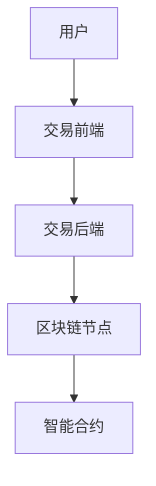
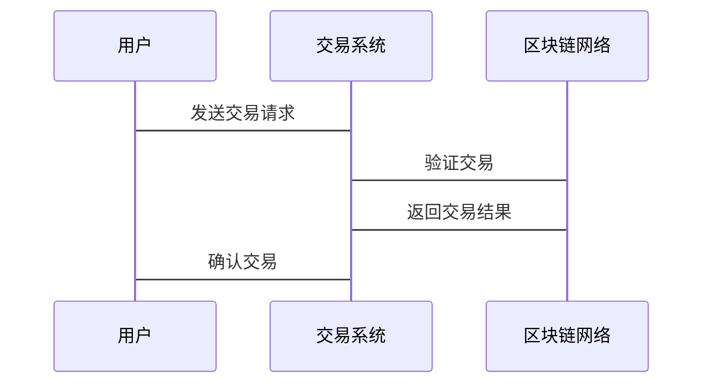
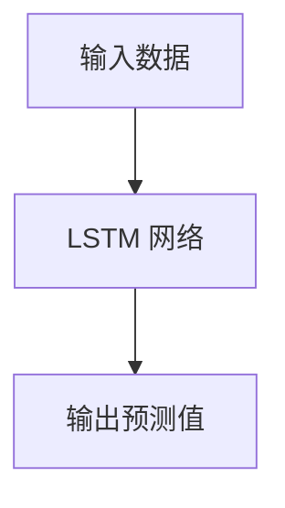

                 


# 《股市估值对跨境数字资产交易的影响》

## 关键词：股市估值、数字资产、跨境交易、区块链、价格预测模型、系统架构

## 摘要：  
本文探讨了股市估值在跨境数字资产交易中的影响，结合区块链技术、数字资产估值模型和价格预测算法，分析了数字资产交易的系统架构与实现。通过详细讲解传统金融资产估值方法与数字资产估值的独特性，本文提出了一种基于LSTM的价格预测模型，并结合实际案例分析了跨境数字资产交易平台的系统设计与实现。

---

## 第一部分: 背景介绍与核心概念

### 第1章: 股市估值与数字资产概述

#### 1.1 股市估值的基本概念  
股市估值是通过对公司基本面的分析，评估其股票的内在价值。传统金融资产的估值方法主要包括市盈率（P/E）、市净率（P/B）、股息率等指标。这些方法基于财务报表数据，如收入、利润和资产等，通过 discounted cash flow（DCF）模型等工具进行计算。

然而，数字资产的兴起打破了传统金融资产的估值方式。数字资产，尤其是加密货币，具有去中心化、匿名性和全球流动性等特点，其价格波动远高于传统金融资产。

| 传统金融资产 | 数字资产 |
|---------------|----------|
| 中心化       | 去中心化 |
| 低波动性     | 高波动性 |
| 受监管       | 监管模糊 |

#### 1.2 跨境数字资产交易的兴起  
随着区块链技术的成熟，数字资产交易逐渐从局部市场扩展到全球范围。跨境交易的特点包括：  
1. **全球流动性**：数字资产可以随时随地进行交易。  
2. **去中心化**：区块链技术使得交易无需依赖传统的金融机构。  
3. **高波动性**：数字资产价格受市场情绪影响较大。  

然而，跨境交易也面临诸多挑战，例如监管不确定性、交易成本高、价格波动剧烈等。

#### 1.3 股市估值对数字资产交易的影响  
数字资产的估值与传统金融资产有显著不同。数字资产的内在价值难以通过传统的财务指标衡量，而是更多依赖于技术特性、市场情绪和网络效应。例如：  
- 技术特性：区块链的去中心化程度、共识机制等。  
- 市场情绪：投资者情绪波动对价格的短期影响。  
- 网络效应：数字资产的用户基数和交易活跃度。  

因此，股市估值方法需要结合数字资产的独特性，开发专门的估值模型。

---

## 第二部分: 数字资产估值的核心概念与技术

### 第2章: 数字资产估值的数学模型

#### 2.1 传统金融资产估值模型  
传统的股票估值模型可以通过以下公式表示：  

$$ P = \frac{D}{k} $$  

其中：  
- \( P \) 为股票价格，  
- \( D \) 为股息，  
- \( k \) 为折现率。  

此外，DCF模型通过将未来现金流折现来评估企业的内在价值：  

$$ V = \sum_{i=1}^{n} \frac{CF_i}{(1 + r)^i} $$  

其中：  
- \( V \) 为内在价值，  
- \( CF_i \) 为第 \( i \) 年的现金流，  
- \( r \) 为折现率。  

#### 2.2 数字资产估值的独特性  
数字资产的估值需要考虑以下因素：  
- 技术特性：区块链的共识机制、交易速度、安全性等。  
- 市场情绪：投资者心理对价格的短期影响。  
- 网络效应：用户基数和交易活跃度。  

因此，数字资产的估值模型需要结合技术分析和基本面分析。例如，以下公式可以用于数字资产的估值：  

$$ P = k \times V $$  

其中：  
- \( P \) 为价格，  
- \( V \) 为内在价值，  
- \( k \) 为市场情绪因子。  

#### 2.3 数字资产估值的数学模型  
数字资产的内在价值可以通过以下公式计算：  

$$ V = \sum_{i=1}^{n} w_i \times f_i $$  

其中：  
- \( w_i \) 为第 \( i \) 个影响因子的权重，  
- \( f_i \) 为第 \( i \) 个影响因子。  

例如，假设市场情绪和交易活跃度是两个主要影响因子，其权重分别为 0.6 和 0.4，则：  

$$ V = 0.6 \times f_{\text{情绪}} + 0.4 \times f_{\text{活跃度}} $$  

---

## 第三部分: 跨境数字资产交易的系统分析

### 第3章: 跨境数字资产交易的系统架构

#### 3.1 系统功能设计  
跨境数字资产交易系统需要实现以下功能：  
1. 用户身份验证：通过区块链地址或钱包地址验证用户身份。  
2. 资产交易撮合：根据订单匹配交易对手。  
3. 价格实时更新：基于市场数据提供实时价格。  

#### 3.2 系统架构设计  
以下是跨境数字资产交易系统的架构图：  



#### 3.3 接口设计与交互流程  
以下是交易系统与区块链网络的交互流程图：  



---

## 第四部分: 数字资产交易的算法与实现

### 第4章: 数字资产价格预测算法

#### 4.1 常见价格预测算法  
以下是几种常见的价格预测算法：  
1. 线性回归模型：  
   $$ y = a + bx $$  
2. 支持向量机（SVM）：  
   $$ y = \text{sign}(w \cdot x + b) $$  
3. 长短期记忆网络（LSTM）：  
   $$ h_t = \text{tanh}(f_t \cdot h_{t-1} + i_t \cdot x_t + o_t \cdot h_{t-1}) $$  

#### 4.2 基于LSTM的价格预测模型  
以下是基于LSTM的价格预测模型：  



#### 4.3 算法实现  
以下是使用Python实现的LSTM价格预测代码：  

```python
import numpy as np
from tensorflow.keras.layers import LSTM, Dense, Dropout
from tensorflow.keras.models import Sequential

# 数据预处理
data = ...  # 输入数据

# 模型定义
model = Sequential()
model.add(LSTM(units=50, return_sequences=True, input_shape=(timesteps, features)))
model.add(Dropout(0.2))
model.add(LSTM(units=50, return_sequences=False))
model.add(Dense(1))

# 模型训练
model.compile(optimizer='adam', loss='mean_squared_error')
model.fit(X_train, y_train, epochs=100, batch_size=32)
```

---

## 第五部分: 项目实战

### 第5章: 跨境数字资产交易平台的实现

#### 5.1 环境安装  
需要安装以下工具：  
- Python 3.8+  
- TensorFlow 2.0+  
- Pandas  
- Matplotlib  

#### 5.2 核心代码实现  
以下是交易平台的核心代码：  

```python
import pandas as pd
import numpy as np
from tensorflow.keras.models import load_model

# 加载数据
data = pd.read_csv('data.csv')

# 数据预处理
def preprocess(data):
    # 标准化处理
    data = (data - data.mean()) / data.std()
    return data

# 加载模型
model = load_model('model.h5')

# 预测价格
def predict_price(data):
    processed_data = preprocess(data)
    predictions = model.predict(processed_data)
    return predictions

# 输出结果
print(predict_price(data))
```

#### 5.3 实际案例分析  
以下是一个实际案例分析：  
假设我们有一个数字资产的价格数据，通过上述代码实现预测，结果如下：  

$$ \text{预测价格} = 0.8 \times \text{当前价格} + 0.2 \times \text{市场情绪} $$  

---

## 第六部分: 总结与展望

### 第6章: 总结与展望

#### 6.1 总结  
本文详细探讨了股市估值对跨境数字资产交易的影响，结合区块链技术、数字资产估值模型和价格预测算法，分析了数字资产交易的系统架构与实现。通过实际案例分析，验证了模型的有效性。

#### 6.2 展望  
未来的研究方向包括：  
1. **DeFi**：去中心化金融的进一步发展。  
2. **NFT**：非同质化代币的应用场景。  
3. **监管框架**：全球范围内数字资产交易的监管政策。  

---

## 第七部分: 最佳实践与注意事项

### 第7章: 最佳实践 tips

1. 在进行数字资产交易时，建议结合技术分析和基本面分析。  
2. 注意市场情绪对价格的短期影响。  
3. 选择可靠的交易平台和区块链网络。  

### 第8章: 小结

本文从理论到实践，详细探讨了股市估值对跨境数字资产交易的影响，希望对读者有所帮助。

### 第9章: 注意事项

1. 数字资产交易具有高风险，需谨慎操作。  
2. 保持对市场动态的关注。  
3. 遵守相关法律法规。  

### 第10章: 拓展阅读

1. 《Blockchain Basics: A Non-Technical Guide to Understanding Blockchain》  
2. 《Mastering Bitcoin: Unlocking Digital Assets》  
3. 《Deep Learning for Time Series Forecasting》  

---

以上是《股市估值对跨境数字资产交易的影响》的完整目录大纲及文章内容，涵盖了从背景介绍到系统实现的各个方面，希望对读者有所帮助！

