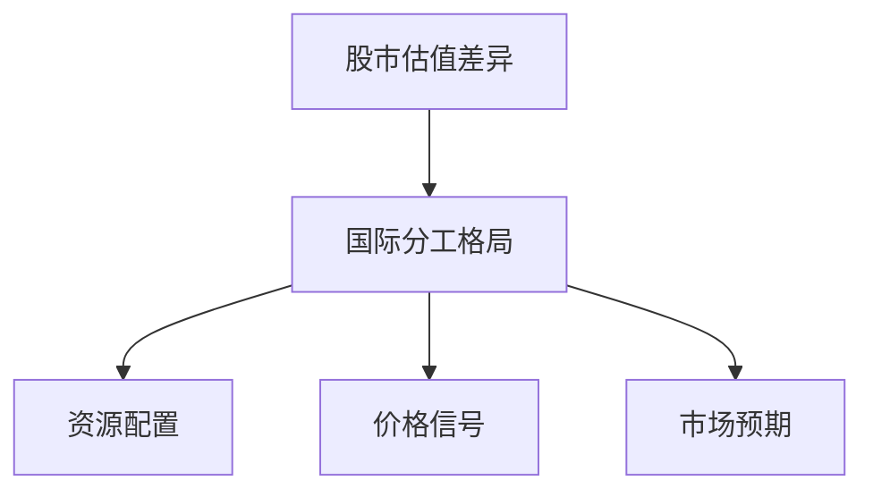
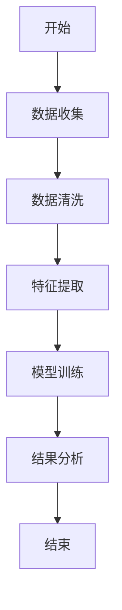
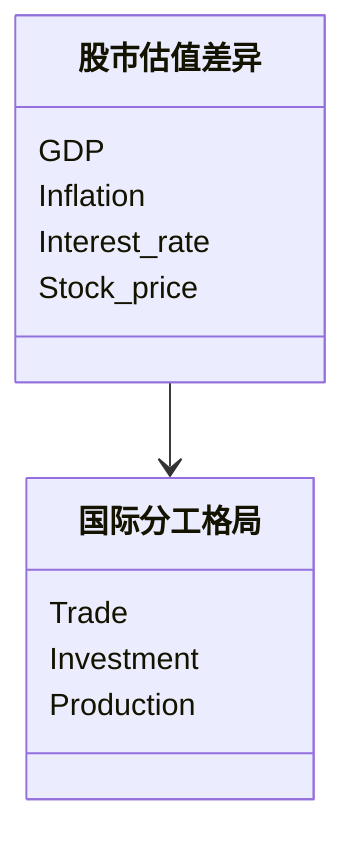
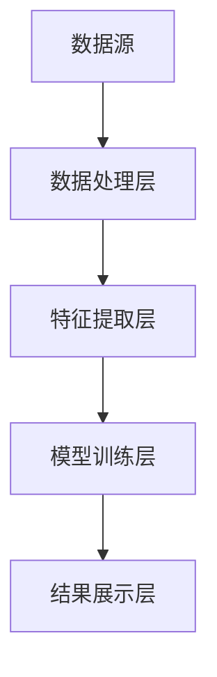

                 


# 《股市估值差异对国际分工格局的影响》

> 关键词：股市估值差异、国际分工格局、资源配置、价格信号、市场预期、经济全球化、量化分析

> 摘要：本文系统探讨了股市估值差异如何影响国际分工格局，从背景介绍、核心概念、算法原理、系统分析到项目实战，全面分析了股市估值差异对国际分工的影响路径与机制。通过量化分析、统计分析和机器学习方法，结合实际案例，揭示了股市估值差异对国际分工格局的深远影响。

---

# 第一部分: 背景介绍

## 第1章: 股市估值差异的形成机制

### 1.1 股市估值差异的定义与特征

#### 1.1.1 股市估值差异的定义
股市估值差异指的是不同国家或地区股市中相同或相似资产的市场价格差异。这种差异源于各国经济、政策、市场结构和投资者行为的差异。

#### 1.1.2 股市估值差异的核心特征
- 价格差异性：不同市场的资产价格存在显著差异。
- 时间动态性：估值差异随时间波动，受宏观经济和市场情绪影响。
- 结构复杂性：涉及多个市场参与者的互动。

#### 1.1.3 股市估值差异的形成机制
1. 经济基本面差异：GDP增长率、通胀水平等宏观经济指标影响资产估值。
2. 政策差异：货币政策、财政政策和监管政策的不同导致估值差异。
3. 市场参与者行为差异：投资者风险偏好和交易策略影响价格。

### 1.2 国际分工格局的定义与特征

#### 1.2.1 国际分工格局的定义
国际分工格局是指全球范围内各国在生产过程中的专业化分工模式，包括产业链、价值链和生产网络的分布。

#### 1.2.2 国际分工格局的核心特征
- 专业化分工：各国专注于特定产业或环节。
- 价值链整合：通过全球产业链实现资源优化配置。
- 动态调整性：分工格局随技术和经济环境变化而调整。

#### 1.2.3 国际分工格局的演变趋势
1. 全球化驱动：经济一体化促进国际分工深化。
2. 区域化趋势：区域经济合作加强，分工格局呈现区域化特征。
3. 技术驱动：技术创新推动分工模式的调整。

## 第2章: 股市估值差异与国际分工格局的关系

### 2.1 股市估值差异对国际分工的影响路径

#### 2.1.1 通过资源配置的影响
- 资源错配：估值差异导致资源无法在最优配置。
- 资本流动：资金从高估市场流向低估市场，影响分工格局。

#### 2.1.2 通过价格信号的影响
- 价格信号传递：股市价格反映市场信息，影响企业投资决策。
- 市场预期引导：投资者预期影响企业生产和投资行为。

#### 2.1.3 通过市场预期的影响
- 预期自我实现：市场预期影响实际经济行为，进一步加剧估值差异。
- 市场情绪波动：投资者情绪影响股市估值，进而影响分工格局。

### 2.2 股市估值差异对国际分工格局的具体影响

#### 2.2.1 对国际贸易的影响
- 贸易成本增加：估值差异导致交易成本上升。
- 贸易流向变化：资金流动影响贸易伙伴选择。

#### 2.2.2 对国际投资的影响
- 投资决策变化：估值差异影响跨国投资决策。
- 投资风险增加：估值差异带来更大的市场风险。

#### 2.2.3 对国际产业布局的影响
- 产业转移：企业根据估值差异调整生产布局。
- 产业链重构：估值差异推动全球产业链重新分配。

---

# 第二部分: 核心概念与联系

## 第3章: 核心概念的原理与分析

### 3.1 股市估值差异的原理

#### 3.1.1 估值差异的经济学解释
- 资源配置效率：估值差异反映了市场对资源的配置效率。
- 市场摩擦：信息不对称和交易成本导致估值差异。

#### 3.1.2 估值差异的金融学解释
- 风险定价：不同市场对风险的定价差异导致估值差异。
- 时间价值：不同市场对时间价值的评估不同。

#### 3.1.3 估值差异的市场机制
- 供求关系：供需变化影响资产价格。
- 市场参与者行为：投资者行为影响价格波动。

### 3.2 国际分工格局的原理

#### 3.2.1 分工格局的形成机制
- 比较优势：各国比较优势决定分工格局。
- 绝对优势：绝对优势影响分工模式。

#### 3.2.2 分工格局的调整机制
- 技术进步：技术进步改变比较优势。
- 经济政策：政策变化影响分工格局。

#### 3.2.3 分工格局的优化机制
- 市场一体化：经济一体化优化分工格局。
- 信息共享：信息共享促进分工优化。

## 第4章: 核心概念的对比分析

### 4.1 股市估值差异与国际分工格局的对比

#### 4.1.1 核心概念对比表格

| 比较维度 | 股市估值差异 | 国际分工格局 |
|----------|--------------|--------------|
| 定义     | 资产价格差异 | 专业化分工模式 |
| 特征     | 价格差异性   | 专业化分工 |
| 影响因素 | 经济政策、市场结构 | 比较优势、经济政策 |

#### 4.1.2 核心概念的ER实体关系图



---

# 第三部分: 算法原理讲解

## 第5章: 算法原理与流程图

### 5.1 算法原理

#### 5.1.1 量化分析方法
- 数据收集：收集各国股市数据。
- 数据清洗：处理缺失值和异常值。
- 特征提取：提取影响估值差异的关键特征。
- 模型训练：使用回归模型预测估值差异对分工的影响。
- 结果分析：解读模型结果并提出建议。

#### 5.1.2 统计分析方法
- 时间序列分析：分析估值差异的时间动态特征。
- 假设检验：检验估值差异对分工格局的影响是否显著。

#### 5.1.3 机器学习方法
- 使用随机森林模型分类估值差异类型。
- 使用LSTM模型预测未来估值差异。

### 5.2 算法流程图



### 5.3 算法

#### 5.3.1 量化分析代码

```python
import pandas as pd
import numpy as np
from sklearn.linear_model import LinearRegression

# 数据收集与清洗
data = pd.read_csv('stock_data.csv')
data = data.dropna()

# 特征提取
features = data[['GDP', 'Inflation', 'Interest_rate']]
target = data['Stock_price']

# 模型训练
model = LinearRegression()
model.fit(features, target)

# 结果分析
predictions = model.predict(features)
print('预测结果:', predictions)
```

#### 5.3.2 统计分析代码

```python
import statsmodels.api as sm

# 时间序列分析
model = sm.tsa.ARIMA(target, order=(1,1,1))
model_fit = model.fit()

# 假设检验
print(model_fit.summary())
```

#### 5.3.3 机器学习代码

```python
from keras.models import Sequential
from keras.layers import LSTM, Dense

# LSTM模型
model = Sequential()
model.add(LSTM(50, input_shape=(timesteps, features)))
model.add(Dense(1))
model.compile(loss='mean_squared_error', optimizer='adam')

# 训练模型
model.fit(X_train, y_train, epochs=50, batch_size=32)
```

---

## 第6章: 数学模型与公式

### 6.1 统计模型

#### 6.1.1 多元线性回归模型

$$ y = \beta_0 + \beta_1x_1 + \beta_2x_2 + \cdots + \beta_kx_k + \epsilon $$

其中，$y$ 是股市估值差异，$x_i$ 是影响估值差异的因素，$\epsilon$ 是误差项。

#### 6.1.2 时间序列模型

$$ \phi(\theta) = 1 + \theta_1z + \theta_2z^2 + \cdots + \theta_qz^q $$

其中，$z$ 是延迟算子，$\theta_i$ 是参数。

### 6.2 机器学习模型

#### 6.2.1 随机森林模型

$$ y = \sum_{i=1}^{n} \text{Tree}_i(x) $$

其中，$\text{Tree}_i$ 是第 $i$ 棵决策树的预测结果。

#### 6.2.2 LSTM 模型

$$ \text{Output} = \text{LSTM}(\text{Input}) $$

---

# 第四部分: 系统分析与架构设计

## 第7章: 系统分析与架构设计

### 7.1 问题场景介绍

- **问题场景**：分析股市估值差异对国际分工格局的影响，构建量化分析模型。

### 7.2 系统功能设计

#### 7.2.1 领域模型



#### 7.2.2 系统架构



---

## 第8章: 项目实战

### 8.1 环境安装

- **安装Python**：下载并安装Python 3.8+。
- **安装依赖库**：`pip install pandas numpy scikit-learn statsmodels keras`

### 8.2 系统核心实现源代码

#### 8.2.1 数据处理代码

```python
import pandas as pd

# 读取数据
data = pd.read_csv('stock_data.csv')

# 数据清洗
data = data.dropna()

# 特征提取
features = data[['GDP', 'Inflation', 'Interest_rate']]
target = data['Stock_price']

# 保存特征和目标
features.to_csv('features.csv', index=False)
target.to_csv('target.csv', index=False)
```

#### 8.2.2 模型训练代码

```python
from sklearn.linear_model import LinearRegression

# 读取数据
features = pd.read_csv('features.csv')
target = pd.read_csv('target.csv')

# 训练模型
model = LinearRegression()
model.fit(features, target.values.ravel())

# 保存模型
import joblib
joblib.dump(model, 'stock_model.pkl')
```

#### 8.2.3 结果分析代码

```python
import joblib

# 加载模型
model = joblib.load('stock_model.pkl')

# 预测结果
predictions = model.predict(features)
print('预测结果:', predictions)
```

### 8.3 实际案例分析

#### 8.3.1 数据来源
- 数据来源：各国经济指标和股市数据。

#### 8.3.2 案例分析
- 分析某国股市估值差异对国际贸易的影响。
- 提出政策建议：如何通过调整经济政策减少估值差异对分工格局的负面影响。

### 8.4 项目小结

- **项目总结**：通过量化分析模型，揭示了股市估值差异对国际分工格局的影响。
- **经验总结**：数据质量和模型选择对结果准确性至关重要。

---

# 第五部分: 小结、注意事项与拓展阅读

## 第9章: 小结

### 9.1 项目总结
- 本文系统分析了股市估值差异对国际分工格局的影响，构建了量化分析模型，并通过实际案例验证了模型的有效性。

### 9.2 经验总结
- 数据清洗和特征选择是模型训练的关键步骤。
- 不同模型在不同场景下的表现差异需要深入分析。

---

## 第10章: 注意事项与拓展阅读

### 10.1 注意事项
1. 数据质量：确保数据的完整性和准确性。
2. 模型选择：根据实际问题选择合适的模型。
3. 结果解读：避免过度解读模型结果。

### 10.2 拓展阅读
1. 《国际经济学》：理解国际分工的基本原理。
2. 《金融市场分析》：深入学习股市估值方法。
3. 《机器学习实战》：掌握更多量化分析方法。

---

# 结语

本文通过系统分析和量化方法，深入探讨了股市估值差异对国际分工格局的影响，为理解全球经济现象提供了新的视角。希望本文能为读者提供有价值的理论和实践参考。

