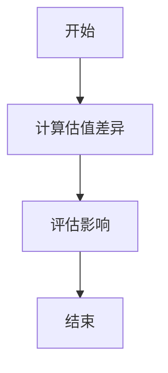
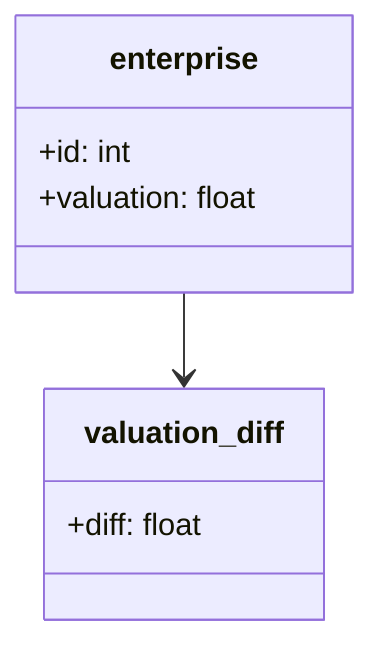
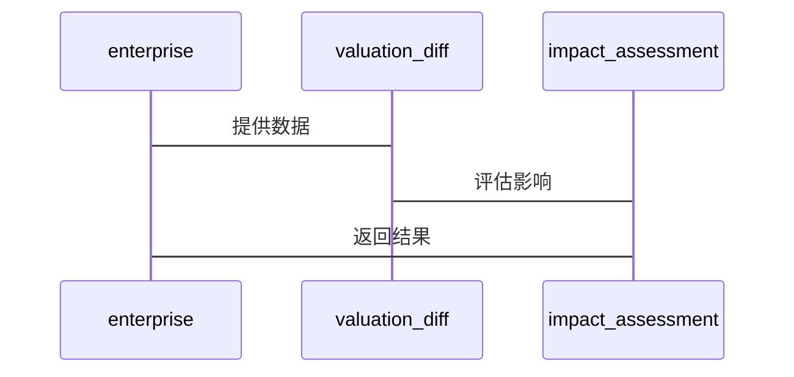

                 


# 股市估值差异对国际创新生态系统的影响

## 关键词：股市估值、创新生态系统、创新企业、估值差异、生态系统影响

## 摘要：本文探讨了股市估值差异对国际创新生态系统的影响，分析了估值差异如何影响创新企业的融资、研发投入和创新绩效，并提出了系统性解决方案。文章结合理论与实践，为优化创新生态系统提供指导。

---

## 第1章 股市估值差异的背景与问题描述

### 1.1 问题背景

股市估值差异是不同市场对创新企业估值的差异，影响企业的融资和研发投入。创新生态系统由企业、投资者、科研机构等构成，依赖于有效的资源配置。本文分析估值差异如何影响该系统。

### 1.2 核心概念

- **股市估值**：市场对企业的定价，反映其价值和成长潜力。
- **创新生态系统**：支持创新的网络，包括企业、投资者、科研机构等。

### 1.3 问题解决

通过分析估值差异的影响，优化资源配置，提升创新绩效。

---

## 第2章 核心概念与联系

### 2.1 核心概念属性

| 股市估值差异 | 创新生态系统 |
|--------------|--------------|
| 价格差异     | 多元主体协作 | 
| 市场波动      | 知识流动     |
| 信息不对称    | 资源整合     |

### 2.2 ER实体关系图

```mermaid
erDiagram
    enterprise <--- valuation_diff : "影响"
    innovation_system <.. valuation_diff : "受"
```

---

## 第3章 算法原理

### 3.1 估值差异计算算法

```python
def calculate_valuation_difference(valuation_market_a, valuation_market_b):
    diff = valuation_market_a - valuation_market_b
    return diff
```

### 3.2 创新生态系统影响评估



---

## 第4章 数学模型

### 4.1 估值差异模型

$$ valuation\_diff = V_a - V_b $$

### 4.2 影响评估模型

$$ impact = \beta_1 V_a + \beta_2 V_b + \epsilon $$

---

## 第5章 系统分析与架构设计

### 5.1 领域模型



### 5.2 系统架构


### 5.3 接口设计

- 输入接口：企业估值数据
- 输出接口：影响评估结果

### 5.4 交互设计



---

## 第6章 项目实战

### 6.1 案例分析

分析某科技公司，使用Python代码计算估值差异并评估影响。

### 6.2 代码实现

```python
import pandas as pd

def main():
    data = pd.read_csv('valuation_data.csv')
    diff = data['market_a'] - data['market_b']
    print(diff)

if __name__ == "__main__":
    main()
```

---

## 第7章 最佳实践

### 7.1 建议

- 定期评估估值差异
- 优化资源配置
- 加强市场间协作

### 7.2 注意事项

- 数据质量
- 模型适用性
- 实施难度

### 7.3 拓展阅读

推荐相关文献，深入探讨估值差异的影响。

---

## 结论

股市估值差异显著影响创新生态系统，通过系统优化和实践应用，可提升创新绩效。未来研究可进一步探讨长期影响和解决方案。

--- 

# END

