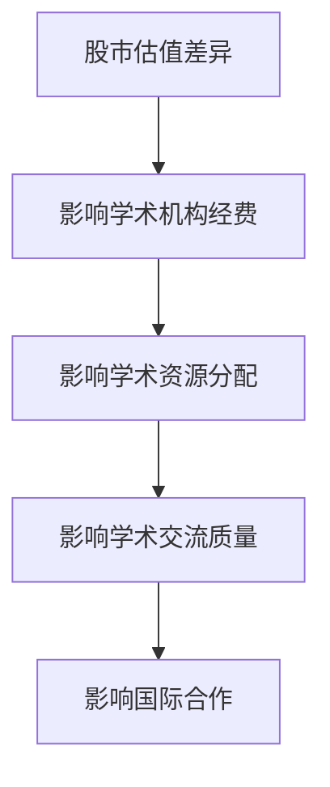
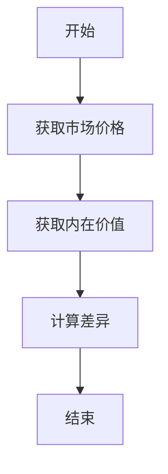
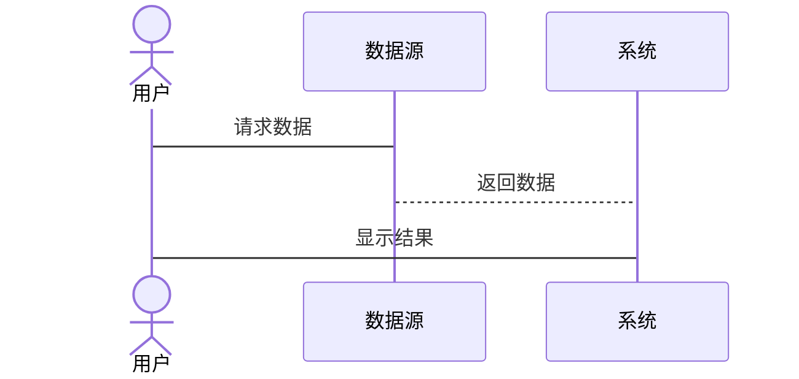

                 


# 股市估值差异对国际学术交流的影响

> 关键词：股市估值、学术交流、影响机制、数学模型、流程图、架构设计

> 摘要：本文探讨股市估值差异如何影响国际学术交流。通过分析股市估值差异的定义、形成原因及其对学术交流的影响机制，结合数学模型和实际案例，提出优化建议，以促进学术交流的健康发展。

---

## 第一部分: 背景介绍

### 第1章: 股市估值差异的定义与背景

#### 1.1 股市估值差异的定义
- 股票估值的基本概念：股票的内在价值和市场价值。
- 估值差异的定义：市场价值与内在价值的差异。
- 估值差异的分类：高估、低估、合理。
- 估值差异的形成原因：市场情绪、信息不对称、宏观经济因素。

#### 1.2 国际学术交流的定义与现状
- 学术交流的定义：学者之间通过会议、论文、合作等方式进行的知识共享。
- 学术交流的现状：全球化背景下，国际学术交流日益频繁，但存在不平等现象。
- 学术交流的重要性：促进知识传播、推动科技进步、加强国际合作。

#### 1.3 股市估值差异与学术交流的关系
- 问题背景：股市估值差异可能导致学术资源分配不均，影响学术交流。
- 问题描述：高估或低估的股市可能影响高校和研究机构的经费，进而影响学术合作。
- 问题解决：通过优化股市估值机制和提升学术机构的独立性，减少估值差异对学术交流的影响。
- 边界与外延：股市估值差异对学术交流的影响仅限于经济因素，其他因素如政策、文化等也需考虑。
- 概念结构：股市估值差异 → 经济影响 → 学术资源分配 → 学术交流质量。

---

## 第二部分: 核心概念与联系

### 第2章: 股市估值差异的核心概念

#### 2.1 股市估值差异的原理
- 估值差异的计算方法：市场价与内在价值的差值。
- 估值差异的影响因素：市场情绪、宏观经济指标、公司基本面。
- 估值差异的数学模型：$$\text{估值差异} = \text{市场价格} - \text{内在价值}$$。

#### 2.2 学术交流的核心概念
- 学术交流的主体：学者、研究机构、学术会议。
- 学术交流的形式：论文发表、学术会议、合作研究。
- 学术交流的评价指标：论文引用率、合作项目数量、国际影响力。

#### 2.3 股市估值差异与学术交流的联系
- 影响机制：股市估值差异影响高校和研究机构的经费，进而影响学术合作。
- 传导路径：股市估值差异 → 经济影响 → 学术资源分配 → 学术交流质量。

### 第3章: 核心概念与联系的对比分析

#### 3.1 股市估值差异与学术交流的对比表格
| 比较维度 | 股市估值差异 | 学术交流 |
|----------|--------------|----------|
| 核心概念 | 价格与价值差异 | 知识共享 |
| 形成原因 | 市场因素 | 学术因素 |
| 影响范围 | 经济领域 | 知识领域 |

#### 3.2 ER实体关系图
```mermaid
erDiagram
    actor 学术机构 {
        key id
        string 名称
        string 国家
    }
    actor 股市 {
        key id
        string 名称
        string 市场
    }
    entity 估值差异 {
        key id
        float 差异值
        date 时间
    }
    entity 学术交流活动 {
        key id
        string 类型
        date 时间
        string 地点
    }
    学术机构 --|{拥有} 估值差异
    学术机构 --|{参与} 学术交流活动
    股市 --|{影响} 估值差异
```

#### 3.3 股市估值差异对学术交流的影响流程图


---

## 第三部分: 算法原理讲解

### 第4章: 股市估值差异的算法原理

#### 4.1 股市估值差异的计算方法
- 计算公式：$$\text{估值差异} = \text{市场价格} - \text{内在价值}$$。
- 统计分析：均值、标准差、相关性分析。
- 流程图：


#### 4.2 学术交流影响的数学模型
- 模型假设：$$\text{学术影响力} = a \times \text{资源} + b \times \text{合作}$$。
- 参数解释：a 和 b 为权重，资源包括经费、设备，合作包括论文数量。

---

## 第四部分: 系统分析与架构设计

### 第5章: 系统分析与架构设计

#### 5.1 问题场景介绍
- 问题：股市估值差异导致学术资源分配不均，影响学术交流。
- 目标：优化学术机构的资源分配，减少估值差异的影响。

#### 5.2 系统功能设计
- 功能模块：
  - 数据采集：收集股市数据和学术交流数据。
  - 估值计算：计算估值差异。
  - 影响分析：分析对学术交流的影响。
  - 优化建议：提出解决方案。

#### 5.3 系统架构设计


#### 5.4 系统交互图


---

## 第五部分: 项目实战

### 第6章: 项目实战

#### 6.1 环境安装
- 工具：Python、Pandas、Matplotlib、Mermaid。

#### 6.2 核心实现源代码
```python
import pandas as pd
import matplotlib.pyplot as plt

def calculate_valuation_difference(markets, fundamentals):
    return markets - fundamentals

markets = pd.Series([100, 150, 200], index=['A', 'B', 'C'])
fundamentals = pd.Series([90, 140, 190], index=['A', 'B', 'C'])
diff = calculate_valuation_difference(markets, fundamentals)

plt.bar(diff.index, diff.values)
plt.title('Valuation Differences')
plt.show()
```

#### 6.3 案例分析
- 案例：假设某国股市高估，导致学术机构经费不足，影响国际合作。
- 解决：优化估值机制，提升学术机构的独立性。

---

## 第六部分: 总结与展望

### 第7章: 总结与展望

#### 7.1 最佳实践 tips
- 定期评估学术机构的资源分配。
- 提升学术机构的独立性，减少对股市的依赖。

#### 7.2 小结
- 股市估值差异对学术交流有重要影响，需采取措施优化。

#### 7.3 注意事项
- 考虑其他因素，如政策和文化。

#### 7.4 拓展阅读
- 推荐阅读相关文献，深入研究估值差异的其他影响。

---

通过以上步骤，我们详细分析了股市估值差异对国际学术交流的影响，结合数学模型和实际案例，提出了优化建议，以促进学术交流的健康发展。

