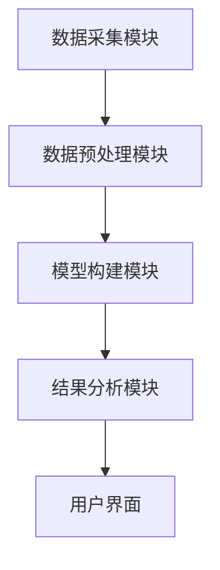
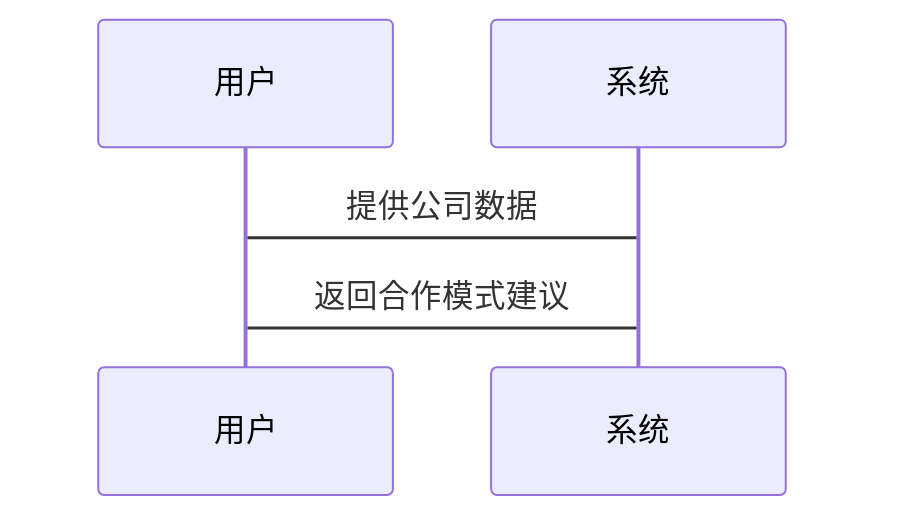

                 


# 《股市估值差异对国际学术合作模式的影响》

## 关键词：股市估值差异，国际学术合作模式，学术资源分配，合作策略优化，博弈论模型，系统架构设计

## 摘要：
本文探讨了股市估值差异对国际学术合作模式的影响，分析了股市估值差异如何影响学术资源分配和合作策略，提出了构建数学模型和系统架构的方法，并通过案例分析展示了实际应用。

---

## 第一部分：背景介绍

### 第1章：股市估值差异的背景与问题描述

#### 1.1 股市估值的基本概念
- **1.1.1 股市估值的定义与核心要素**
  - 股市估值是通过对公司财务数据和市场表现进行分析，评估其股票的内在价值。
  - 核心要素包括市盈率（P/E）、市净率（P/B）、股息率等。
- **1.1.2 股市估值差异的产生原因**
  - 不同市场对同一公司的估值差异主要源于信息不对称、市场情绪和经济环境差异。
- **1.1.3 股市估值差异对学术合作的潜在影响**
  - 估值差异可能导致资源分配不均，影响学术合作的深度和广度。

#### 1.2 国际学术合作模式的现状
- **1.2.1 国际学术合作的主要形式**
  - 合作研究、联合实验室、学术交流等。
- **1.2.2 当前学术合作的主要驱动因素**
  - 知识共享、资源互补、技术需求等。
- **1.2.3 学术合作中的资源分配问题**
  - 由于估值差异，资源分配可能不均，影响合作效率。

#### 1.3 股市估值差异与学术合作模式变化的关系
- **1.3.1 问题背景的提出**
  - 股市估值差异导致学术资源分配不均，影响合作模式。
- **1.3.2 问题描述的详细阐述**
  - 估值差异如何影响学术资源分配和合作策略。
- **1.3.3 问题解决的初步思路**
  - 建立数学模型，分析估值差异对合作模式的影响。

---

## 第二部分：核心概念与联系

### 第2章：股市估值差异的核心概念

#### 2.1 股市估值差异的定义与属性
- **2.1.1 股市估值差异的定义**
  - 同一公司在不同市场上的估值差异。
- **2.1.2 股市估值差异的主要属性**
  - 时间依赖性、市场差异性、信息敏感性。
- **2.1.3 股市估值差异的度量方法**
  - 使用相对指标，如相对市盈率、相对市净率。

#### 2.2 国际学术合作模式的核心要素
- **2.2.1 学术合作的主要参与者**
  - 高校、研究机构、企业。
- **2.2.2 学术合作的主要模式**
  - 合作研究、技术转让、人才共享。
- **2.2.3 学术合作的核心驱动因素**
  - 技术需求、知识共享、资源互补。

#### 2.3 股市估值差异与学术合作模式的联系
- **2.3.1 股市估值差异如何影响学术合作**
  - 估值差异可能导致资源分配不均，影响合作深度。
- **2.3.2 学术合作模式的多样性与股市估值差异的关系**
  - 估值差异驱动合作模式的多样化。
- **2.3.3 股市估值差异对学术合作模式的长期影响**
  - 长期估值差异可能导致合作模式的固化和优化。

---

## 第三部分：算法原理与数学模型

### 第3章：股市估值差异对学术合作影响的算法模型

#### 3.1 股市估值差异的分析模型
- **3.1.1 模型的构建思路**
  - 使用博弈论模型分析合作双方的策略选择。
- **3.1.2 模型的输入变量与输出结果**
  - 输入：公司财务数据、市场估值指标。
  - 输出：合作模式的优化建议。
- **3.1.3 模型的数学表达**
  - 设公司A的估值为V_A，公司B的估值为V_B。
  - 合作收益R = f(V_A, V_B)，其中f为合作收益函数。

#### 3.2 博弈论模型的应用
- **3.2.1 合作双方的收益函数**
  - R_A = a * V_A + b * V_B
  - R_B = c * V_A + d * V_B
  - 其中a, b, c, d为权重系数。
- **3.2.2 Nash均衡分析**
  - 分析合作双方的策略选择，寻找Nash均衡点。

#### 3.3 数学模型的实现
- **3.3.1 模型的构建**
  - 使用线性回归模型分析估值差异对合作收益的影响。
- **3.3.2 模型的验证**
  - 使用历史数据验证模型的准确性。

---

## 第四部分：系统分析与架构设计

### 第4章：系统分析与架构设计

#### 4.1 问题场景介绍
- 构建一个系统，模拟股市估值差异对学术合作的影响。

#### 4.2 系统功能设计
- **功能模块**：
  - 数据采集模块：收集公司财务数据和市场估值数据。
  - 模型构建模块：建立估值差异对合作收益的影响模型。
  - 结果分析模块：输出合作模式优化建议。

#### 4.3 系统架构设计
- 使用Mermaid图展示系统架构。



#### 4.4 系统接口设计
- **接口1**：数据采集接口，接收公司财务数据。
- **接口2**：模型计算接口，输出合作收益预测。

#### 4.5 系统交互设计
- 使用Mermaid图展示系统交互流程。



---

## 第五部分：项目实战

### 第5章：项目实战

#### 5.1 环境安装
- 安装Python和相关库（numpy, pandas, matplotlib）。

#### 5.2 核心实现源代码
```python
import numpy as np
import pandas as pd

def calculate_valuation_difference(company_data):
    valuation_diff = company_data['市盈率'] - company_data['行业平均市盈率']
    return valuation_diff

# 示例数据
data = {
    '公司': ['A', 'B', 'C'],
    '市盈率': [15, 20, 25],
    '行业平均市盈率': [18, 18, 18]
}
df = pd.DataFrame(data)

# 计算估值差异
diff = calculate_valuation_difference(df)
print(diff)
```

#### 5.3 代码解读与分析
- 代码实现计算公司估值差异，与行业平均市盈率进行比较。

#### 5.4 案例分析
- 以公司A为例，分析其估值差异对合作模式的影响。

#### 5.5 项目小结
- 总结项目实现过程中的关键点和经验教训。

---

## 第六部分：最佳实践

### 第6章：最佳实践

#### 6.1 小结
- 股市估值差异对国际学术合作模式的影响需要系统化的方法进行分析。

#### 6.2 注意事项
- 数据准确性是模型构建的关键。
- 模型需要定期更新，以适应市场变化。

#### 6.3 拓展阅读
- 推荐阅读相关领域的最新研究论文。

---

## 结语
通过系统化的分析和建模，本文揭示了股市估值差异对国际学术合作模式的深远影响，为学术机构和企业提供了优化合作策略的参考。

--- 

# END

