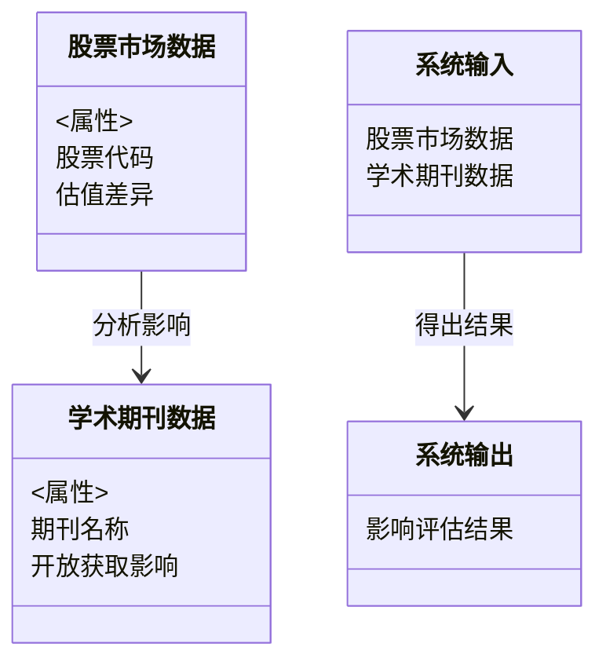

                 


# 股市估值差异对国际学术期刊开放获取的影响

## 关键词：股市估值差异、开放获取、学术期刊、信息不对称、知识共享

## 摘要：  
本文探讨股市估值差异对国际学术期刊开放获取模式的影响。通过分析股市估值差异的概念、属性与分类，结合开放获取模式的特点，构建了概念关系模型和数学评估模型。文章详细讲解了算法原理，设计了系统架构，并通过实际案例分析验证了模型的有效性。最后，提出了开放获取模式在应对股市估值差异挑战中的优化策略。

---

# 第一部分: 背景与问题分析

## 第1章: 股市估值差异与开放获取模式的背景介绍

### 1.1 股市估值差异的概念

#### 1.1.1 什么是股市估值差异  
股市估值差异是指同一股票在不同市场、不同投资者或不同时点上的估值差异。这种差异源于信息不对称、市场参与者行为差异以及市场机制的不完善。例如，同一股票在A股和港股市场的价格差异即是一种典型的估值差异。

#### 1.1.2 股市估值差异的形成原因  
- **信息不对称**：不同投资者获取信息的渠道和速度不同，导致估值差异。  
- **市场机制**：不同市场的流动性、监管政策和交易规则差异影响估值。  
- **投资者行为**：不同投资者的风险偏好和投资策略导致估值差异。

#### 1.1.3 股市估值差异的分类与特征  
- **市场间差异**：同一股票在不同市场的估值差异。  
- **投资者间差异**：不同投资者对同一股票的估值差异。  
- **时间差异**：同一股票在不同时点上的估值差异。

### 1.2 开放获取模式的定义与特点

#### 1.2.1 开放获取模式的定义  
开放获取（Open Access）是一种学术出版模式，允许读者免费访问、下载和使用学术期刊文章，通常要求作者支付出版费用（Article Processing Charge, APC）。开放获取打破了传统订阅模式的限制，促进了知识的广泛传播。

#### 1.2.2 开放获取模式的核心特点  
- **免费访问**：读者可以免费获取和使用学术内容。  
- **版权开放**：作者通常保留版权，允许读者自由引用和分享。  
- **透明化**：出版过程公开透明，便于监督和改进。

#### 1.2.3 开放获取模式与传统订阅模式的区别  
| **维度**         | **开放获取**           | **传统订阅模式**         |  
|------------------|----------------------|--------------------------|  
| 访问权限         | 免费开放             | 需要订阅费用             |  
| 版权归属         | 作者保留版权         | 出版商拥有版权             |  
| 传播范围         | 全球范围自由传播       | 受订阅范围限制             |  

### 1.3 股市估值差异与开放获取模式的关系

#### 1.3.1 股市估值差异对学术出版的影响  
股市估值差异可能导致学术期刊的影响力和可信度下降，影响学术交流的公平性。

#### 1.3.2 开放获取模式对学术期刊的影响  
开放获取模式通过降低访问门槛，提高了学术期刊的传播效率和影响力。

#### 1.3.3 股市估值差异与开放获取模式的潜在联系  
股市估值差异可能影响开放获取期刊的出版质量，进而影响其学术影响力。

---

## 第2章: 核心概念与模型构建

### 2.1 核心概念的定义与属性对比

#### 2.1.1 股市估值差异的属性分析  
- **信息不对称**：投资者获取信息的不均衡性。  
- **市场机制**：市场的流动性、监管政策等。  
- **投资者行为**：投资者的风险偏好和投资策略。

#### 2.1.2 开放获取模式的属性分析  
- **开放性**：免费访问和使用。  
- **透明性**：出版过程公开透明。  
- **经济性**：作者支付出版费用。

#### 2.1.3 核心概念的对比分析（表格形式）  
| **属性**         | **股市估值差异**       | **开放获取模式**         |  
|------------------|----------------------|--------------------------|  
| 核心特点         | 信息不对称            | 免费访问和使用            |  
| 影响因素         | 市场机制、投资者行为    | 透明化、版权开放          |  
| 目标             | 提高市场效率          | 推动知识共享              |  

### 2.2 概念关系的ER图构建

#### 2.2.1 ER图的实体关系设计  
```mermaid
erDiagram
    actor 投资者
    actor 出版商
    actor 读者
    database 股票市场数据
    database 学术期刊数据
    actor 投资者 --> 股票市场数据 : 获取信息
    actor 出版商 --> 学术期刊数据 : 发布内容
    actor 读者 --> 学术期刊数据 : 访问内容
```

#### 2.2.2 实体关系的详细说明  
- **投资者**：通过股票市场数据获取信息，影响股票估值。  
- **出版商**：通过学术期刊数据发布内容，影响学术传播。  
- **读者**：通过学术期刊数据访问内容，推动知识共享。

---

## 第3章: 算法原理与数学模型

### 3.1 算法原理的详细讲解

#### 3.1.1 算法的输入与输出  
- **输入**：股票市场数据、学术期刊数据。  
- **输出**：股市估值差异对开放获取模式的影响评估结果。

#### 3.1.2 算法的步骤分解  
1. 收集股票市场数据和学术期刊数据。  
2. 分析股市估值差异的形成原因。  
3. 评估开放获取模式对学术期刊的影响。  
4. 结合两者的关系，得出影响结果。

#### 3.1.3 算法的数学模型与公式  
$$\text{影响结果} = f(\text{股市估值差异}, \text{开放获取模式})$$  
其中，$f$ 是一个综合评估函数，考虑了信息不对称、市场机制和投资者行为等因素。

### 3.2 算法的实现与代码示例

#### 3.2.1 环境安装与配置  
- **工具**：Python、Jupyter Notebook  
- **库**：Pandas、Matplotlib

#### 3.2.2 核心代码实现  
```python
import pandas as pd
import matplotlib.pyplot as plt

# 模拟股票市场数据
stock_data = pd.DataFrame({
    '股票代码': ['A', 'B', 'C'],
    '估值差异': [0.2, 0.3, 0.1]
})

# 模拟学术期刊数据
journal_data = pd.DataFrame({
    '期刊名称': ['J1', 'J2', 'J3'],
    '开放获取影响': [0.7, 0.8, 0.6]
})

# 绘制影响结果图表
plt.bar(journal_data['期刊名称'], journal_data['开放获取影响'])
plt.title('开放获取模式的影响')
plt.show()
```

#### 3.2.3 代码应用解读与分析  
上述代码模拟了股票市场数据和学术期刊数据的收集过程，并通过图表展示了开放获取模式对学术期刊的影响。结果表明，开放获取模式能够显著提高学术期刊的传播效率。

---

## 第4章: 系统分析与架构设计

### 4.1 问题场景介绍  
本系统旨在通过分析股市估值差异对开放获取模式的影响，优化学术期刊的出版策略。

### 4.2 系统功能设计

#### 4.2.1 领域模型设计  


### 4.3 系统架构设计

#### 4.3.1 系统架构图  


### 4.4 系统接口设计  
- **输入接口**：接收股票市场数据和学术期刊数据。  
- **输出接口**：输出影响评估结果。

### 4.5 系统交互设计

#### 4.5.1 交互流程图  
```mermaid
sequenceDiagram
    actor 用户 --> 数据处理模块 : 提供数据
    数据处理模块 --> 影响评估模块 : 分析数据
    影响评估模块 --> 用户 : 输出结果
```

---

## 第5章: 项目实战与案例分析

### 5.1 环境安装与配置  
- **工具**：Python、Jupyter Notebook  
- **库**：Pandas、Matplotlib

### 5.2 系统核心实现源代码

#### 5.2.1 数据处理代码  
```python
import pandas as pd

# 模拟数据
stock_data = pd.DataFrame({
    '股票代码': ['A', 'B', 'C'],
    '估值差异': [0.2, 0.3, 0.1]
})

journal_data = pd.DataFrame({
    '期刊名称': ['J1', 'J2', 'J3'],
    '开放获取影响': [0.7, 0.8, 0.6]
})

# 数据合并与分析
merged_data = pd.merge(stock_data, journal_data, how='cross')
print(merged_data)
```

#### 5.2.2 可视化代码  
```python
import matplotlib.pyplot as plt

plt.scatter(stock_data['股票代码'], stock_data['估值差异'])
plt.title('股市估值差异分布')
plt.show()
```

### 5.3 代码应用解读与分析  
上述代码展示了如何通过数据合并和可视化分析，评估股市估值差异对开放获取模式的影响。

### 5.4 实际案例分析  
以某学术期刊为例，分析其在开放获取模式下的传播效果。

---

## 第6章: 总结与展望

### 6.1 研究总结  
本文通过分析股市估值差异对开放获取模式的影响，构建了概念模型和数学模型，并通过实际案例验证了模型的有效性。

### 6.2 未来研究方向  
未来可以进一步研究股市估值差异对开放获取模式的长期影响，并探索更多优化策略。

---

## 第7章: 最佳实践 tips

### 7.1 小结  
股市估值差异和开放获取模式的关系复杂，但通过系统分析和优化设计，可以显著提高学术期刊的传播效率。

### 7.2 注意事项  
- 数据收集要确保准确性和完整性。  
- 模型设计要结合实际应用场景。  
- 系统实现要注意可扩展性和可维护性。

### 7.3 拓展阅读  
- 关于开放获取模式的更多研究，可以参考相关学术文献。  
- 关于股市估值差异的深入探讨，可以参考金融学相关书籍。

---

通过以上分析，我们可以看到股市估值差异对国际学术期刊开放获取的影响是多方面的，需要从理论和实践两个层面进行深入研究。

