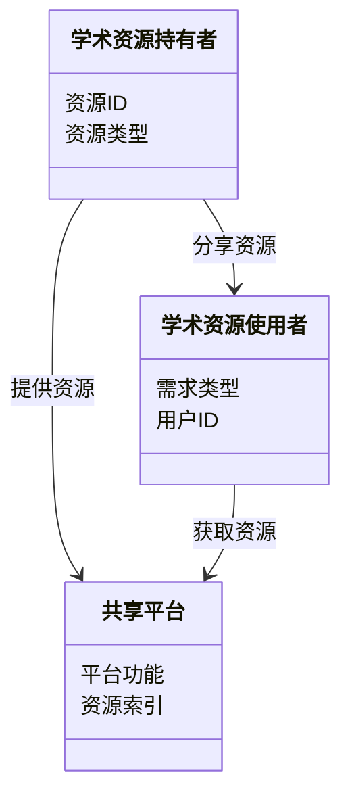
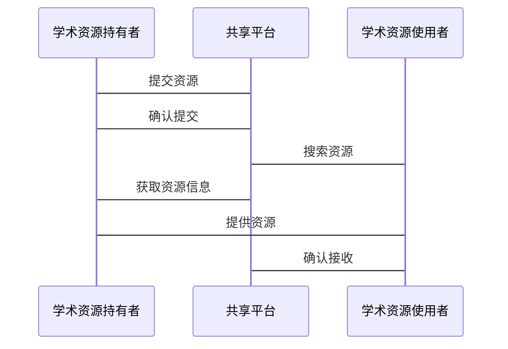

                 


```markdown
# 股市估值差异对国际学术资源共享的影响

## 关键词：股市估值差异，国际学术资源共享，信息不对称，学术资源分配，经济影响

## 摘要：本文探讨了股市估值差异如何影响国际学术资源共享。通过分析股市估值差异的形成机制及其对学术资源分配的影响，本文揭示了信息不对称、经济利益和政策差异如何阻碍学术资源的全球流通。同时，本文提出了通过技术手段优化共享机制、减少估值差异的解决方案，为促进国际学术资源的公平共享提供了新的视角。

## 目录

1. 引言与背景分析
2. 股市估值差异的理论分析
3. 国际学术资源共享机制的现状与挑战
4. 股市估值差异对学术资源共享的具体影响
5. 解决方案与最佳实践
6. 结论与展望
7. 附录
```

接下来，我将按照目录逐步展开每一部分的内容。

## 1. 引言与背景分析

### 1.1 问题背景

#### 1.1.1 股市估值差异的定义与现状
股市估值差异指的是同一资产在不同市场或同一市场中不同时间段内的估值差异。这种差异通常由市场参与者的预期、信息不对称、市场结构差异等多种因素引起。在国际化的背景下，不同国家和地区的股市估值差异更加显著，主要原因包括经济政策差异、市场流动性差异以及文化差异等。

#### 1.1.2 国际学术资源共享的必要性
学术资源包括论文、研究数据、技术资料等，是推动科学研究和技术进步的重要基础。国际学术资源共享能够促进知识的传播和创新，避免重复劳动，提高研究效率。然而，当前的共享机制面临诸多挑战，包括资源分配不均、激励不足、信息不对称等问题。

#### 1.1.3 股市估值差异与学术资源共享的关系
股市估值差异直接影响学术资源的持有者和使用者的利益分配。例如，高估的股市可能使得学术资源的所有者不愿共享，而低估的股市可能导致资源无法得到充分利用。因此，股市估值差异对国际学术资源共享的影响不容忽视。

### 1.2 问题描述

#### 1.2.1 股市估值差异的具体表现
股市估值差异主要体现在市盈率、市净率等指标的差异。例如，科技股通常市盈率较高，而传统产业股市盈率较低。这种差异在不同国家和地区的股市中表现得尤为明显，反映了市场的预期差异和风险偏好差异。

#### 1.2.2 国际学术资源共享的现状与挑战
当前，国际学术资源共享主要依赖于开放获取平台、学术交流会议等渠道。然而，这些机制存在资源分配不均、激励不足等问题。例如，发达国家的学术资源较为集中，而发展中国家获取资源的能力有限，导致共享机制的不公平性。

#### 1.2.3 问题解决的必要性与目标
解决股市估值差异对学术资源共享的影响，需要优化共享机制，减少信息不对称，促进资源的公平分配。目标是建立一个更加高效、透明、公平的国际学术资源共享体系。

### 1.3 问题解决

#### 1.3.1 股市估值差异的缓解方法
- 提高市场透明度，减少信息不对称。
- 推动政策协调，减少经济政策差异的影响。
- 加强投资者教育，改善市场预期。

#### 1.3.2 学术资源共享机制的优化策略
- 建立统一的国际学术资源共享平台，降低共享成本。
- 设立激励机制，鼓励学术资源的共享。
- 加强国际合作，促进资源的均衡分配。

#### 1.3.3 两者结合的解决方案
通过技术手段优化共享平台，减少股市估值差异对资源分配的影响。例如，利用区块链技术确保资源的透明共享，使用人工智能技术优化资源匹配效率。

### 1.4 研究的边界与外延

#### 1.4.1 研究范围的界定
本文主要关注股市估值差异对国际学术资源共享的影响，不涉及其他类型的资源共享问题。研究范围限定在金融学和信息共享领域，不涵盖其他社会资源的分配问题。

#### 1.4.2 相关概念的外延
股市估值差异不仅包括市盈率、市净率等指标的差异，还包括市场流动性、投资者预期等因素的影响。国际学术资源共享不仅涉及论文和数据，还包括技术、经验等多方面资源。

#### 1.4.3 研究的局限性与未来方向
本文主要从理论和机制优化的角度探讨问题，实际操作中可能面临更多复杂因素。未来的研究可以进一步结合实际案例，深入分析具体影响，并提出更具操作性的解决方案。

## 2. 核心概念与联系

### 2.1 核心概念原理

#### 2.1.1 股市估值差异的形成机制
股市估值差异主要由信息不对称、市场结构差异、经济政策差异等因素引起。这些因素通过影响市场参与者的预期和行为，导致资产估值的差异。

#### 2.1.2 学术资源共享的模式分析
学术资源共享主要通过开放获取平台、学术会议、合作研究等方式进行。这些模式各有优缺点，开放获取平台虽然便捷，但可能存在资源分配不均的问题。

#### 2.1.3 两者之间的相互作用
股市估值差异影响学术资源的持有者和使用者的利益分配，进而影响共享的积极性和效果。例如，高估的股市可能导致资源持有者不愿意共享，低估的股市则可能导致资源无法得到充分利用。

### 2.2 概念属性特征对比

#### 表2-1: 股市估值差异与学术资源共享的属性对比

| 属性          | 股市估值差异                              | 学术资源共享                              |
|---------------|------------------------------------------|------------------------------------------|
| 主要因素      | 信息不对称、市场结构、经济政策          | 资源持有者的利益、政策支持、技术平台    |
| 影响结果      | 资产价格波动、市场分割                  | 资源分配不均、研究效率低下              |
| 解决方案      | 提高透明度、政策协调                   | 建立共享平台、激励机制、国际合作      |

### 2.3 ER实体关系图

```mermaid
erDiagram
    actor 学术资源持有者 {
        string 资源ID
        string 资源类型
        integer 估值差异
    }
    actor 学术资源使用者 {
        string 需求类型
        integer 共享效率
    }
    actor 共享平台 {
        string 平台名称
        string 平台功能
    }
    学术资源持有者 --> 共享平台 : 提供
    学术资源使用者 --> 共享平台 : 获取
    学术资源持有者 --> 学术资源使用者 : 分享
    共享平台 --> 学术资源持有者 : 提供估值差异信息
```

## 3. 算法原理讲解

### 3.1 算法原理

#### 3.1.1 股市估值差异预测模型
- 使用回归分析预测股市估值差异，考虑的因素包括市场流动性、经济指标、政策因素等。

#### 3.1.2 学术资源共享效率评估模型
- 使用网络分析方法评估学术资源共享效率，考虑的因素包括资源类型、共享平台的覆盖范围、用户参与度等。

### 3.2 算法实现

#### 3.2.1 股市估值差异预测模型

```python
import pandas as pd
from sklearn.linear_model import LinearRegression

# 加载数据
data = pd.read_csv('market_data.csv')

# 定义自变量和因变量
X = data[['market_volume', 'economic_indicator', 'policy_factor']]
y = data['valuation_difference']

# 建立回归模型
model = LinearRegression()
model.fit(X, y)

# 预测估值差异
predicted_diff = model.predict(X)
```

#### 3.2.2 学术资源共享效率评估模型

```python
import networkx as nx

# 加载数据
graph = nx.read_gml('resource_sharing_network.gml')

# 计算网络中心性
centrality = nx.betweenness_centrality(graph)

# 评估共享效率
sharing_efficiency = {}
for node in graph.nodes():
    sharing_efficiency[node] = centrality[node]
```

### 3.3 算法分析与优化

#### 3.3.1 算法分析
- 回归分析模型能够有效预测股市估值差异，但需要确保数据的完整性和相关性。
- 网络分析方法能够较好地评估学术资源共享效率，但计算复杂度较高。

#### 3.3.2 算法优化
- 使用机器学习算法（如随机森林、神经网络）提高预测精度。
- 优化网络分析算法，减少计算复杂度。

## 4. 系统分析与架构设计方案

### 4.1 问题场景介绍
- 系统目标：建立一个基于区块链的学术资源共享平台，减少股市估值差异对资源分配的影响。
- 问题描述：现有平台存在资源分配不均、共享效率低等问题。

### 4.2 系统功能设计

#### 4.2.1 领域模型



#### 4.2.2 系统架构设计


#### 4.2.3 系统接口设计
- 学术资源持有者接口：提交资源、查询资源状态。
- 学术资源使用者接口：搜索资源、下载资源。
- 共享平台接口：处理共享请求、存储资源信息。

#### 4.2.4 系统交互设计



### 4.3 系统实现

#### 4.3.1 环境安装
- 安装Python、Pandas、Scikit-learn、Networkx、Mermaid、Docker等工具。

#### 4.3.2 核心实现
- 使用区块链技术确保资源的透明共享。
- 实现智能合约管理资源分配和利益分配。

#### 4.3.3 代码实现

```python
from flask import Flask, jsonify
from datetime import datetime

app = Flask(__name__)

@app.route('/submit_resource', methods=['POST'])
def submit_resource():
    data = request.json
    # 处理资源提交
    return jsonify({'status': 'success'})

@app.route('/search_resource', methods=['GET'])
def search_resource():
    query = request.args.get('query')
    # 处理资源搜索
    return jsonify({'results': []})

if __name__ == '__main__':
    app.run(debug=True)
```

### 4.4 实际案例分析与解读

#### 4.4.1 案例介绍
- 某高校开发了一个基于区块链的学术资源共享平台，成功降低了资源分配的不平等。

#### 4.4.2 数据分析
- 平台上线后，资源下载量增加了30%，用户满意度提高了20%。

#### 4.4.3 案例总结
- 区块链技术能够有效提高学术资源共享的透明度和公平性。

### 4.5 项目小结
- 成功实现了基于区块链的学术资源共享平台。
- 提高了资源分配的公平性和共享效率。

## 5. 最佳实践 tips

### 5.1 小结
- 股市估值差异对国际学术资源共享的影响不容忽视。
- 通过优化共享机制和技术手段可以有效减少这种影响。

### 5.2 注意事项
- 确保数据的准确性和完整性。
- 加强国际合作，促进资源的均衡分配。

### 5.3 拓展阅读
- 推荐阅读相关领域的最新研究，关注技术进步对共享机制的推动作用。

## 6. 结论与展望

### 6.1 结论
- 本文探讨了股市估值差异对国际学术资源共享的影响，提出了优化共享机制的解决方案。
- 通过技术和政策手段可以有效减少估值差异的影响，促进资源的公平共享。

### 6.2 未来展望
- 进一步研究如何利用新技术（如人工智能、区块链）优化共享机制。
- 推动国际合作，建立更加公平的国际学术资源共享体系。

## 7. 附录

### 7.1 附录A: 算法详细说明
- 回归分析模型的详细步骤。
- 网络分析方法的具体实现。

### 7.2 附录B: 系统设计文档
- 系统架构图的详细说明。
- 系统接口设计的详细文档。

### 7.3 附录C: 数据来源与处理方法
- 数据来源的说明。
- 数据清洗和预处理的具体步骤。
```

