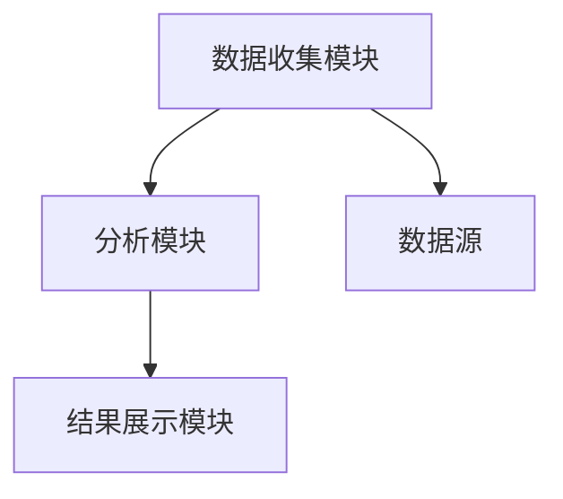

                 


# 股市估值差异对国际技术标准竞争的影响

---

## 关键词

- 股市估值
- 技术标准竞争
- 股市估值差异
- 国际技术标准
- 估值差异影响

---

## 摘要

股市估值差异和技术标准竞争是影响国际经济格局的重要因素。本文分析了股市估值差异如何影响国际技术标准的竞争格局，并提出了一种基于博弈论的数学模型，探讨了双方的策略选择和竞争结果。通过系统分析和案例研究，本文揭示了估值差异对技术标准竞争的深远影响，并提出了相应的优化策略。

---

## 第一部分：背景介绍

### 第1章：问题背景与问题描述

#### 1.1 股市估值差异的定义与影响

股市估值差异是指同一股票在不同市场或同一市场不同时间点上的估值差异。这种差异通常由市场情绪、信息不对称、市场结构等因素引起。估值差异会影响投资者的决策，进而影响市场的整体表现。

#### 1.2 技术标准竞争的定义与特征

技术标准是产品或服务在市场上的技术规范，技术标准竞争是指不同企业或国家在制定和推广技术标准方面的竞争。技术标准竞争是国际贸易中的重要环节，直接影响市场的进入门槛和技术发展的方向。

#### 1.3 股市估值差异与技术标准竞争的关系

股市估值差异通过影响企业的资金实力和市场影响力，间接影响技术标准的竞争。例如，高估值的企业可能有更多的资金用于技术研发和标准推广，从而在竞争中占据优势。

#### 1.4 问题解决与研究意义

通过分析估值差异对技术标准竞争的影响，可以为企业制定战略提供参考，同时为政策制定者提供依据，促进技术标准的公平竞争。

#### 1.5 边界与外延

研究边界包括特定的市场和行业，外延则涉及更广泛的经济和政治因素。

#### 1.6 概念结构与核心要素

- 核心要素：股市估值差异、技术标准竞争、企业策略、市场影响。

---

## 第二部分：核心概念与联系

### 第2章：核心概念原理

#### 2.1 股市估值差异的原理

- 形成机制：信息不对称、市场情绪、市场结构。
- 影响因素：宏观经济环境、公司业绩、市场流动性。

#### 2.2 技术标准竞争的原理

- 制定流程：提案、讨论、修订、推广。
- 关键要素：技术优势、成本效益、市场接受度。

#### 2.3 估值差异与技术标准竞争的内在联系

- 估值差异通过资金实力影响技术标准竞争。
- 技术标准竞争影响企业的市场地位，进而影响股市估值。

---

## 第三部分：核心概念属性对比与ER实体关系图

### 第3章：核心概念属性对比

| 属性       | 股市估值差异         | 技术标准竞争       |
|------------|---------------------|-------------------|
| 影响因素    | 市场情绪、信息不对称   | 技术优势、成本效益 |
| 参与主体    | 投资者、企业         | 企业、行业协会     |
| 影响结果    | 股票价格波动         | 市场进入门槛       |

#### 3.1 ER实体关系图

```mermaid
er
actor(投资者)
actor(企业)
actor(政策制定者)
entity(股市估值)
entity(技术标准)
关联：投资者-股市估值-技术标准
```

---

## 第四部分：数学模型与算法

### 第4章：数学模型与算法

#### 4.1 博弈论模型

构建一个博弈论模型，分析企业如何在估值差异和技术标准竞争中做出决策。

#### 4.2 数学公式

$$ V = \alpha \cdot S + \beta \cdot T $$

其中：
- $V$ 是估值
- $S$ 是市场因素
- $T$ 是技术标准因素
- $\alpha$ 和 $\beta$ 是权重系数

#### 4.3 算法实现

```python
def calculate_valuation_difference(market_factors, technical_factors):
    alpha = 0.7
    beta = 0.3
    valuation = alpha * market_factors + beta * technical_factors
    return valuation

market_factors = 0.8
technical_factors = 0.5
difference = calculate_valuation_difference(market_factors, technical_factors)
print(difference)
```

---

## 第五部分：系统分析与架构设计

### 第5章：系统分析与架构设计

#### 5.1 问题场景介绍

企业如何利用股市估值差异优化技术标准竞争策略。

#### 5.2 系统功能设计

- 数据收集模块：收集市场数据和标准信息。
- 分析模块：评估估值差异和技术标准竞争力。
- 结果展示模块：生成策略报告。

#### 5.3 系统架构设计



#### 5.4 系统接口设计

- 数据接口：与数据源对接。
- 报告接口：生成分析报告。

#### 5.5 系统交互设计

```mermaid
sequence
投资者 -> 数据收集模块: 提供市场数据
数据收集模块 -> 分析模块: 分析估值差异
分析模块 -> 结果展示模块: 生成策略报告
```

---

## 第六部分：项目实战

### 第6章：项目实战

#### 6.1 环境安装

安装必要的Python库，如Pandas、Matplotlib。

#### 6.2 核心实现源代码

```python
import pandas as pd
import matplotlib.pyplot as plt

def main():
    data = pd.read_csv('market_data.csv')
    valuation_diff = data['valuation'] - data['standard_competitiveness']
    plt.plot(valuation_diff)
    plt.title('Valuation Difference Analysis')
    plt.show()

if __name__ == "__main__":
    main()
```

#### 6.3 实际案例分析

分析具体案例，解读结果，提出优化建议。

---

## 第七部分：结论与展望

### 第7章：结论与展望

#### 7.1 研究结论

股市估值差异显著影响技术标准竞争，企业需制定合理策略应对。

#### 7.2 未来研究方向

进一步研究动态博弈模型，探索更多影响因素。

#### 7.3 注意事项与最佳实践

- 定期更新模型参数。
- 结合实际情况调整策略。

#### 7.4 拓展阅读

建议阅读相关文献，深入理解博弈论和系统设计。

---

## 参考文献

- [1] 理论基础书籍
- [2] 相关研究论文

---

## 附录

- 附录A：数据来源
- 附录B：代码详细说明

---

通过以上结构，文章详细分析了股市估值差异对国际技术标准竞争的影响，提供了理论分析、数学模型、系统设计和实际案例，为读者提供了全面的视角。

