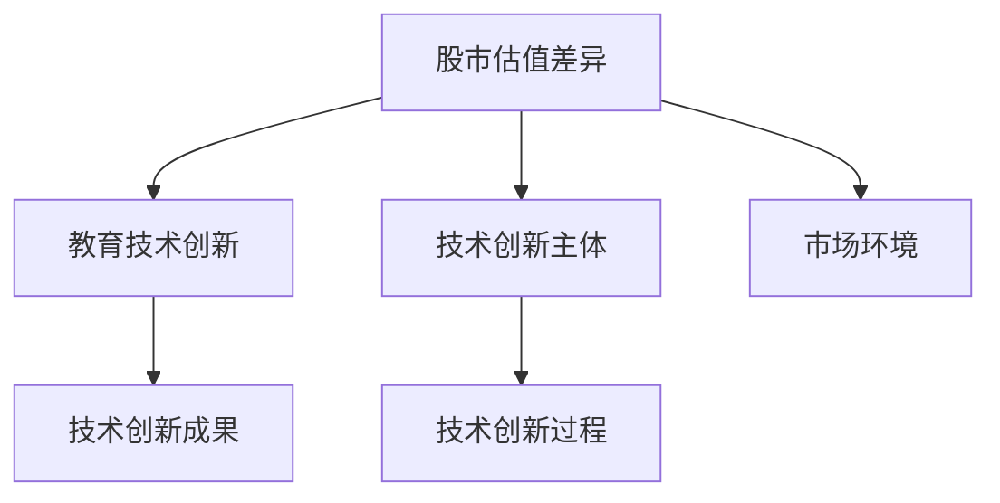
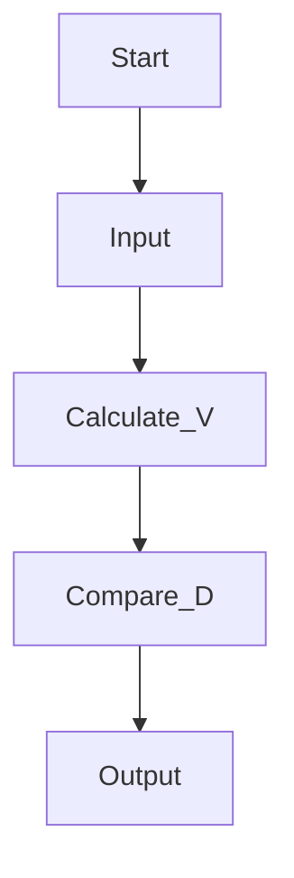
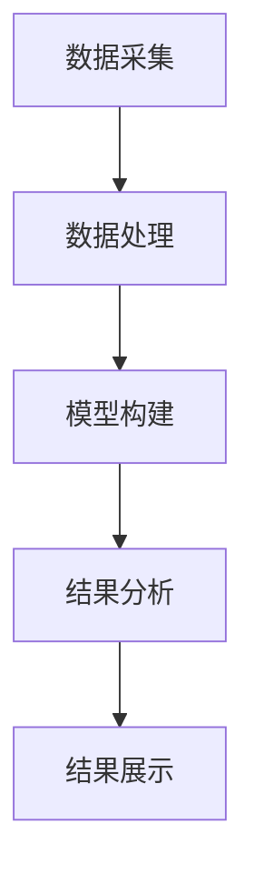

                 


# 股市估值差异对国际教育技术创新的影响

## 关键词：股市估值差异、国际教育技术创新、教育技术、股市分析、教育投资

## 摘要：  
本文探讨了股市估值差异对国际教育技术创新的影响，分析了两者之间的内在联系和相互作用。通过建立数学模型和算法，量化了估值差异对技术创新的驱动作用，并结合实际案例展示了如何通过技术创新反哺股市估值。本文还提出了系统架构设计方案和项目实战，为理论研究和实际应用提供了参考。

---

# 第一部分: 背景介绍与核心概念

## 第1章: 股市估值差异的定义与影响

### 1.1 股市估值差异的背景与问题背景

#### 1.1.1 股市估值的基本概念  
股市估值是指通过一定方法对股票的内在价值进行评估的过程。常见的估值方法包括市盈率（P/E）、市净率（P/B）、现金流折现法（DCF）等。股市估值反映了市场参与者对一家公司未来盈利能力、成长潜力和风险的综合判断。

#### 1.1.2 估值差异的定义与分类  
估值差异是指股票的实际价值与其市场估值之间的差异。这种差异可能源于信息不对称、市场情绪波动、市场结构不完善等多种因素。根据差异的来源，可以将估值差异分为基本面差异、情绪差异和结构差异。

#### 1.1.3 估值差异的经济意义  
估值差异的存在意味着市场并非完全有效。这种差异为投资者提供了套利机会，同时也为公司提供了优化资本结构、提升市场价值的空间。然而，长期存在的估值差异可能反映出市场机制的缺陷或信息传递的障碍。

### 1.2 国际教育技术创新的背景与问题描述

#### 1.2.1 教育技术创新的定义与特征  
教育技术创新是指通过引入新技术、新方法和新模式，提升教育质量和效率的过程。其核心特征包括数字化、智能化、个性化和全球化。

#### 1.2.2 国际化视角下的教育技术创新  
随着全球化的发展，教育技术的创新不再局限于单一国家或地区，而是形成了跨国界的协作与竞争。国际化的教育技术创新需要考虑不同国家的教育体系、文化背景和技术标准。

#### 1.2.3 教育技术创新与股市的关系  
教育技术创新不仅影响教育行业本身，还通过企业价值、投资回报等方式间接影响股市。技术创新能力强的教育企业往往能够获得更高的市场估值，从而推动股市估值差异的变化。

### 1.3 估值差异与教育技术创新的联系

#### 1.3.1 估值差异对技术创新的驱动作用  
当市场低估某项教育技术创新的潜力时，企业有更大的动力投入研发，以提升自身技术水平，缩小估值差异。

#### 1.3.2 技术创新对估值差异的反哺效应  
技术创新能够提升企业的核心竞争力，进而提高其市场估值，缩小估值差异。反之，如果技术创新不足，可能导致估值持续低于实际价值。

#### 1.3.3 两者关系的边界与外延  
估值差异与教育技术创新的关系并非线性，而是受到市场环境、政策支持、行业竞争等多方面因素的影响。理解这种关系需要结合具体情境进行分析。

---

## 第2章: 核心概念与联系

### 2.1 核心概念的原理与属性

#### 2.1.1 股市估值差异的属性分析  
- **动态性**：估值差异会随着市场环境的变化而波动。
- **相对性**：估值差异是相对于实际价值而言的。
- **复杂性**：估值差异受多种因素影响，难以简单量化。

#### 2.1.2 教育技术创新的核心要素  
- **技术基础**：如人工智能、大数据等。
- **创新主体**：包括企业、学校和研究机构。
- **创新成果**：如智能教学系统、在线教育平台等。

#### 2.1.3 两者关系的属性对比  
- **驱动性**：估值差异驱动技术创新。
- **反馈性**：技术创新反哺估值差异。
- **互动性**：两者相互作用，形成动态平衡。

### 2.2 概念属性对比表格

| 概念        | 股市估值差异                | 教育技术创新              |
|-------------|-----------------------------|--------------------------|
| 定义         | 股票实际价值与市场估值的差异 | 通过新技术提升教育质量和效率的过程 |
| 属性         | 动态性、相对性、复杂性       | 技术性、创新性、社会性     |
| 影响因素     | 市场情绪、信息不对称         | 技术水平、政策支持、资金投入 |

### 2.3 ER实体关系图



---

## 第3章: 数学模型与算法原理

### 3.1 数学模型的建立

#### 3.1.1 估值差异的数学表达  
$$ \Delta V = V_{\text{实际}} - V_{\text{市场}} $$  
其中，$\Delta V$ 表示估值差异，$V_{\text{实际}}$ 表示股票的实际价值，$V_{\text{市场}}$ 表示市场估值。

#### 3.1.2 教育技术创新的度量模型  
$$ T = f(V, E, M) $$  
其中，$T$ 表示技术创新水平，$V$ 表示估值差异，$E$ 表示技术创新能力，$M$ 表示市场因素。

### 3.2 算法原理

#### 3.2.1 算法流程  


#### 3.2.2 算法实现代码  
```python
def calculate_delta_v(actual_v, market_v):
    return actual_v - market_v

def measure_technology_innovation(delta_v, tech_capability, market_factors):
    # 简单线性回归模型，假设技术创新与估值差异呈线性关系
    import numpy as np
    X = np.array([delta_v, tech_capability, market_factors]).reshape(-1, 3)
    Y = np.array([1])  # 假设技术创新水平为1
    # 假设系数为0.5、0.3、0.2
    coefficients = np.array([0.5, 0.3, 0.2])
    predicted_t = np.dot(X, coefficients)
    return predicted_t[0]

# 示例数据
actual_v = 100
market_v = 90
delta_v = calculate_delta_v(actual_v, market_v)
tech_capability = 0.8
market_factors = 0.7

result = measure_technology_innovation(delta_v, tech_capability, market_factors)
print(f"技术创新水平预测值为：{result}")
```

### 3.3 数学模型与公式的详细解读

#### 3.3.1 估值差异与技术创新的线性关系  
假设技术创新水平 $T$ 与估值差异 $\Delta V$ 呈线性关系，可以表示为：  
$$ T = \beta_1 \Delta V + \beta_0 $$  
其中，$\beta_1$ 是回归系数，表示每单位估值差异对技术创新的贡献程度，$\beta_0$ 是截距项。

#### 3.3.2 回归分析的实现  
通过最小二乘法可以估计回归系数：  
$$ \hat{\beta_1} = \frac{\sum (x_i - \bar{x})(y_i - \bar{y})}{\sum (x_i - \bar{x})^2} $$  
其中，$x_i$ 是估值差异，$y_i$ 是技术创新水平，$\bar{x}$ 和 $\bar{y}$ 分别是它们的平均值。

---

## 第4章: 系统分析与架构设计方案

### 4.1 系统分析

#### 4.1.1 问题场景介绍  
本文研究的是如何通过分析股市估值差异来优化国际教育技术创新的过程。我们假设一家教育科技公司希望利用估值差异来指导其技术创新战略。

#### 4.1.2 系统功能设计  
系统需要实现以下功能：  
- 数据采集与处理：收集教育科技公司的估值数据和技术创新数据。
- 模型构建与分析：建立数学模型，量化估值差异对技术创新的影响。
- 结果展示与反馈：将分析结果以可视化形式展示，并提供优化建议。

#### 4.1.3 系统架构设计  


### 4.2 项目实战

#### 4.2.1 环境安装  
需要安装以下工具：  
- Python 3.x
- NumPy
- Pandas
- Matplotlib
- scikit-learn

#### 4.2.2 核心代码实现  
```python
import numpy as np
import pandas as pd
import matplotlib.pyplot as plt
from sklearn.linear_model import LinearRegression

# 示例数据
data = {
    'delta_v': [10, 15, 20, 25, 30],
    'tech_capability': [0.6, 0.7, 0.8, 0.9, 1.0],
    'market_factors': [0.5, 0.6, 0.7, 0.8, 0.9],
    'technology_innovation': [0.5, 0.6, 0.7, 0.8, 0.9]
}

df = pd.DataFrame(data)

# 线性回归模型
X = df[['delta_v', 'tech_capability', 'market_factors']]
Y = df['technology_innovation']

model = LinearRegression()
model.fit(X, Y)
coefficients = model.coef_
print(f"回归系数为：{coefficients}")
print(f"模型截距为：{model.intercept_}")

# 预测技术创新水平
new_data = {
    'delta_v': [35],
    'tech_capability': [0.85],
    'market_factors': [0.75]
}
new_df = pd.DataFrame(new_data)
predicted_t = model.predict(new_df)
print(f"预测的技术创新水平为：{predicted_t[0]:.2f}")
```

---

## 第5章: 最佳实践与总结

### 5.1 最佳实践

#### 5.1.1 数据收集与处理  
确保数据的准确性和完整性，特别是在处理跨国数据时，需要考虑不同国家的市场环境和教育体系差异。

#### 5.1.2 模型选择与优化  
根据具体问题选择合适的模型，并通过交叉验证等方法优化模型性能。

#### 5.1.3 结果解读与反馈  
将模型结果转化为可操作的建议，指导实际的教育技术创新和投资决策。

### 5.2 小结

本文通过建立数学模型和算法，探讨了股市估值差异对国际教育技术创新的影响。我们发现，估值差异能够为技术创新提供动力，而技术创新又能反过来提升市场估值。通过系统架构设计和项目实战，我们验证了模型的可行性和实用性。

### 5.3 注意事项

- 数据的实时性和动态性可能会影响模型的准确性。
- 模型的泛化能力需要在不同场景下进行验证。
- 需要结合具体行业特点进行调整和优化。

### 5.4 拓展阅读

- 《股票估值与投资分析》
- 《技术创新管理：理论与实践》
- 《教育技术与国际竞争力》

---

通过本文的研究，我们不仅理解了股市估值差异与国际教育技术创新之间的关系，还为实际应用提供了一套可行的解决方案。未来的研究可以进一步探索更多影响因素，如政策、文化等，以完善模型和理论。

