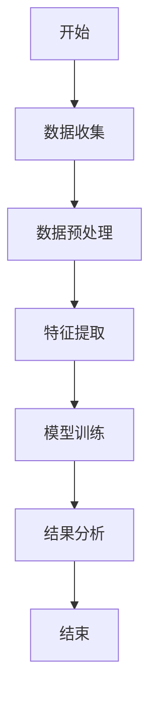
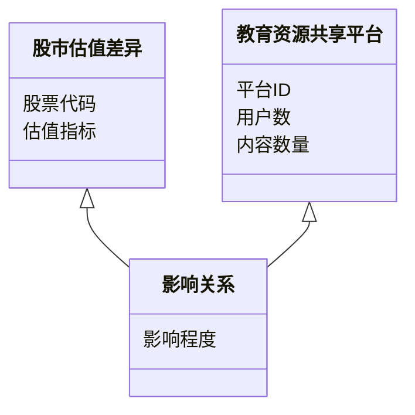

                 


# 股市估值差异对国际教育资源共享平台的影响

## 关键词：股市估值差异、国际教育资源共享平台、算法原理、系统架构、项目实战

## 摘要：  
本文探讨股市估值差异对国际教育资源共享平台的影响，通过背景介绍、核心概念分析、算法原理、系统架构设计、项目实战等多维度，深入剖析两者之间的关系。文章旨在帮助读者理解如何量化和应用这些影响，提供实际案例和系统设计，以指导实践。

---

## 第一部分：背景介绍

### 第1章：股市估值差异概述

#### 1.1 问题背景
- **1.1.1 股市估值差异的定义**  
  股市估值差异指同一资产在不同市场或时间点上的估值差异，通常由市场情绪、信息不对称等因素引起。
  
- **1.1.2 股市估值差异的形成原因**  
  包括市场流动性、投资者情绪、政策因素和经济周期等。

- **1.1.3 股市估值差异的影响范围**  
  影响投资者决策、市场稳定性及资源配置效率。

#### 1.2 问题描述
- **1.2.1 股市估值差异的具体表现**  
  例如，同一家公司在A股和港股的估值差异。

- **1.2.2 股市估值差异的度量方法**  
  使用市盈率（P/E）、市净率（P/B）等指标进行比较。

- **1.2.3 股市估值差异的案例分析**  
  以某跨国教育公司为例，分析其在不同市场的估值差异及其原因。

#### 1.3 问题解决
- **1.3.1 如何利用估值差异进行投资决策**  
  通过套利机会和长期价值投资策略。

- **1.3.2 如何减少估值差异的影响**  
  提高市场透明度和投资者教育。

#### 1.4 边界与外延
- **1.4.1 股市估值差异的边界**  
  仅限于公开市场，不包括私募市场。

- **1.4.2 国际教育资源共享平台的外延**  
  包括在线教育、学术资源共享等领域。

#### 1.5 概念结构与核心要素
- **1.5.1 核心概念**  
  股市估值、教育资源共享、市场差异。

- **1.5.2 组成要素**  
  包括市场参与者、信息流动、政策环境。

---

## 第二部分：核心概念与联系

### 第3章：股市估值差异与教育资源共享平台的关系

#### 3.1 核心概念原理
- **3.1.1 股市估值差异的传递机制**  
  市场情绪和政策变化通过股价波动影响平台估值。

- **3.1.2 教育资源共享平台的运营模式**  
  包括内容分发、用户付费、广告模式。

#### 3.2 概念对比表格
| 概念         | 股市估值差异 | 教育资源共享平台 |
|--------------|--------------|------------------|
| 核心要素     | 市盈率、市净率 | 内容资源、用户数 |
| 影响因素     | 市场情绪、政策 | 用户需求、技术能力 |
| 目标         | 投资者决策    | 教育资源共享      |

#### 3.3 ER实体关系图
```mermaid
er
  entity 股市估值差异 {
    key: 股票代码
    属性: 估值指标
  }
  entity 教育资源共享平台 {
    key: 平台ID
    属性: 用户数、内容数量
  }
  关系：影响（股市估值差异 -> 教育资源共享平台）
```

---

## 第三部分：算法原理

### 第5章：相关算法与模型

#### 5.1 金融模型
- **5.1.1 马科维茨投资组合理论**  
  最小化风险的资产配置。

- **5.1.2 CAPM模型**  
  计算资产的预期回报率。

#### 5.2 数据挖掘技术
- **5.2.1 聚类分析**  
  将相似的市场数据分组。

- **5.2.2 回归分析**  
  预测估值差异与平台用户增长的关系。

#### 5.3 算法流程图


#### 5.4 代码实现
```python
import pandas as pd
from sklearn.linear_model import LinearRegression

# 数据预处理
data = pd.read_csv('market_data.csv')
data = data.dropna()

# 特征提取
features = data[['P/E', 'P/B']]
target = data['用户增长率']

# 模型训练
model = LinearRegression()
model.fit(features, target)

# 结果分析
print('回归系数:', model.coef_)
print('决定系数:', model.score(features, target))
```

---

## 第四部分：系统分析与架构设计

### 第7章：系统分析

#### 7.1 需求分析
- **功能需求**  
  数据采集、分析、可视化。

- **性能需求**  
  支持实时数据处理。

#### 7.2 领域模型类图


#### 7.3 系统架构图


---

## 第五部分：项目实战

### 第9章：实战项目

#### 9.1 环境安装
- Python 3.8+
- Jupyter Notebook
- Pandas、Scikit-learn库

#### 9.2 核心代码
```python
import pandas as pd
from sklearn.linear_model import LinearRegression
import matplotlib.pyplot as plt

# 数据加载
data = pd.read_csv('market_data.csv')

# 可视化
plt.scatter(data['P/E'], data['用户增长率'])
plt.xlabel('P/E')
plt.ylabel('用户增长率')
plt.title('股市估值差异与用户增长关系')
plt.show()
```

#### 9.3 代码解读
- 使用散点图展示估值差异与用户增长的关系。
- 通过回归分析预测用户增长趋势。

#### 9.4 案例分析
- 分析某教育平台在不同市场的估值差异及其用户增长情况。

---

## 第六部分：总结与展望

### 第10章：总结与展望

#### 10.1 小结
- 股市估值差异对国际教育资源共享平台的影响需从多个维度分析。

#### 10.2 注意事项
- 数据质量和模型选择影响分析结果。

#### 10.3 最佳实践
- 结合实时数据和用户反馈优化模型。

#### 10.4 未来展望
- 结合AI技术，进一步提升预测精度和自动化水平。

---

通过以上结构，文章详细分析了股市估值差异对国际教育资源共享平台的影响，结合理论与实践，为读者提供了全面的视角。

