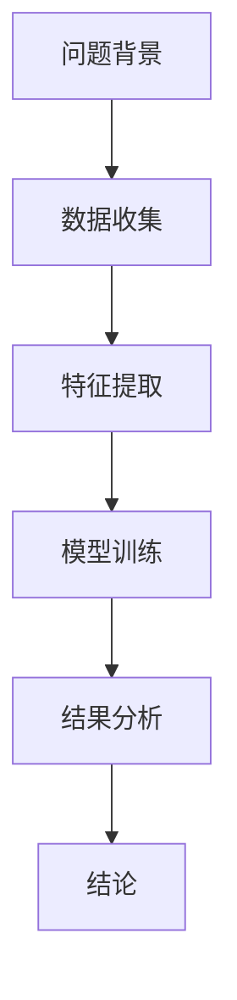
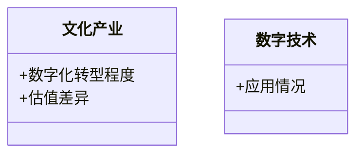

                 


# 股市估值差异对国际文化产业数字化转型的影响

## 关键词：股市估值差异，文化产业，数字化转型，经济影响，数字化技术

## 摘要：  
本文探讨了股市估值差异如何影响国际文化产业的数字化转型。通过分析数字化技术对文化产业的影响，结合股市估值差异的经济学原理，构建了数学模型，提出了应对策略。文章从背景、理论、实证分析、影响机制、应对策略等方面展开，结合具体案例和系统设计，提出了优化路径。

---

# 第一部分：背景介绍

## 第1章：股市估值差异与文化产业数字化转型概述

### 1.1 股市估值差异的概念与特征

- **传统估值与现代估值的演进**：从市盈率到动态估值模型，解释股市估值的演变。
- **估值差异的定义**：指不同市场、行业或公司间的估值差异，分析其成因。
- **数字化转型对文化产业的影响**：数字化技术如何改变文化产业的生产、传播和消费模式。

### 1.2 国际文化产业的现状与趋势

- **全球文化产业概况**：市场规模、主要参与者及区域分布。
- **数字化转型的驱动因素**：技术进步、消费者行为变化等。
- **估值差异的潜在影响**：分析估值差异如何阻碍或促进数字化转型。

### 1.3 问题背景与研究意义

- **问题背景**：估值差异如何影响文化产业的数字化进程。
- **研究意义**：为政策制定者和企业提供参考。
- **研究边界**：明确研究范围，避免过多偏离主题。

---

# 第二部分：核心概念与联系

## 第2章：核心概念与理论模型

### 2.1 股市估值差异的理论基础

- **经济学解释**：供需关系、市场结构等对估值差异的影响。
- **数字化转型的驱动因素**：技术创新、数据驱动等。

### 2.2 文化产业数字化转型的核心要素

- **数字技术的应用**：数据分析、人工智能、区块链等。
- **估值差异的影响机制**：资本流动、投资决策等。

### 2.3 概念属性对比与ER实体关系图

#### 概念属性对比表

| 概念       | 定义                              | 属性                              |
|------------|-----------------------------------|-----------------------------------|
| 股市估值差异 | 不同资产或公司间的估值差异      | 市场、行业、公司特定因素          |
| 数字化转型 | 利用数字技术进行业务模式创新    | 技术、流程、组织结构              |

#### ER实体关系图

```mermaid
er
actor(投资者) -[投资行为]-> 公司(文化产业)
公司 -[数字化转型]-> 数字技术
数字技术 -[影响]-> 股市估值
```

---

# 第三部分：算法原理讲解

## 第3章：影响机制的数学模型与算法分析

### 3.1 数学模型构建

- **回归模型**：$$Y = \beta_0 + \beta_1X + \epsilon$$
  - Y：文化产业数字化转型的程度。
  - X：股市估值差异。

### 3.2 算法分析



---

# 第四部分：系统分析与架构设计

## 第4章：系统分析与架构设计方案

### 4.1 系统功能设计

#### 领域模型



### 4.2 系统架构设计


---

# 第五部分：项目实战

## 第5章：项目实战

### 5.1 环境安装

- **工具**：Python、Pandas、Matplotlib、Scikit-learn。

### 5.2 核心实现源代码

```python
import pandas as pd
import numpy as np
from sklearn.linear_model import LinearRegression

# 示例数据
X = np.array([1, 2, 3, 4, 5]).reshape(-1, 1)
Y = [2, 3, 5, 4, 6]

# 模型训练
model = LinearRegression()
model.fit(X, Y)

# 预测
print(model.predict(np.array([[6]])))
```

---

## 第六部分：最佳实践

## 第6章：小结与展望

### 6.1 最佳实践 Tips

- 企业应关注估值差异，优化资本结构。
- 政策制定者应提供支持，推动数字化转型。

### 6.2 小结

总结全文，强调估值差异对文化产业数字化转型的影响。

### 6.3 注意事项

- 数据的准确性和完整性。
- 模型的适用性和局限性。

### 6.4 拓展阅读

推荐相关领域的书籍和文章，鼓励深入研究。

---

通过以上分析，本文系统地探讨了股市估值差异对国际文化产业数字化转型的影响，结合理论分析和实证研究，提出了优化路径，为相关领域的研究和实践提供了参考。

