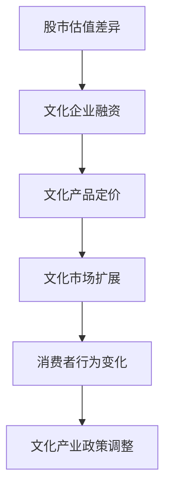
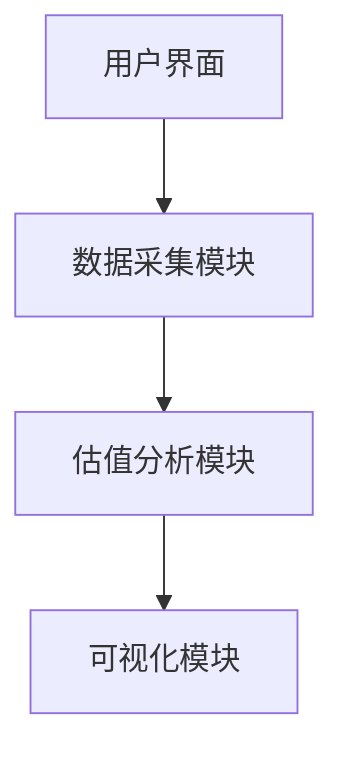

                 


# 股市估值差异对国际文化产业的影响

> **关键词**：股市估值差异，文化产业，国际比较，金融市场，文化资本

> **摘要**：本文探讨了股市估值差异对国际文化产业的影响，分析了估值差异的定义、影响因素及其对文化产业的直接和间接影响。通过构建理论模型和案例分析，文章详细阐述了估值差异如何影响文化企业的融资、市场扩展和消费者行为，并提出了应对策略和未来研究方向。

---

## 目录大纲

### 第一章：股市估值差异的定义与影响

1.1 股市估值差异的定义  
   - 1.1.1 股票估值的基本概念  
   - 1.1.2 估值差异的形成原因  
   - 1.1.3 估值差异的衡量方法  

1.2 股市估值差异的影响因素  
   - 1.2.1 市场供需关系  
   - 1.2.2 宏观经济环境  
   - 1.2.3 行业发展趋势  

1.3 文化产业的定义与特点  
   - 1.3.1 文化产业的基本概念  
   - 1.3.2 文化产业的分类与规模  
   - 1.3.3 文化产业的全球化特征  

---

### 第二章：国际文化产业的现状与挑战

2.1 国际文化产业的发展概况  
   - 2.1.1 全球文化产业的分布  
   - 2.1.2 主要国家文化产业的比较  
   - 2.1.3 文化产业的数字化趋势  

2.2 股市估值差异对文化产业的特殊影响  
   - 2.2.1 文化产业的高波动性  
   - 2.2.2 文化消费的地域差异  
   - 2.2.3 文化资本的流动性  

---

### 第三章：股市估值差异与文化产业的关联

3.1 股市估值差异的核心概念  
   - 3.1.1 估值差异的数学模型  
   - 3.1.2 文化产业的价值评估标准  
   - 3.1.3 估值差异的传导机制  

3.2 股市估值差异与文化产业的联系  
   - 3.2.1 估值差异对文化企业融资的影响  
   - 3.2.2 估值差异对文化产品定价的影响  
   - 3.2.3 估值差异对文化市场扩展的影响  

---

### 第四章：核心概念的属性特征对比

4.1 股市估值差异的属性特征  
   - 4.1.1 时间维度的波动性  
   - 4.1.2 空间维度的差异性  
   - 4.1.3 行业维度的特殊性  

4.2 文化产业的属性特征  
   - 4.2.1 内容生产的创造性  
   - 4.2.2 市场需求的多样性  
   - 4.2.3 产业政策的干预性  

---

### 第五章：ER实体关系图与流程图

5.1 ER实体关系图  
```mermaid
erDiagram
    投资者 [资金, 风险偏好] 
    文化企业 [产品类型, 市场份额] 
    金融市场 [市场指数, 利率] 
    投资者 --> 文化企业 : 投资 
    文化企业 --> 金融市场 : 上市融资 
```

5.2 估值差异传导机制的流程图  


---

### 第六章：算法原理与数学模型

6.1 估值差异的数学模型  
   - 6.1.1 估值差异的计算公式  
   - 6.1.2 文化产业价值评估的公式  

6.2 估值差异的算法实现  
   - 6.2.1 数据采集与预处理  
   - 6.2.2 估值差异的计算流程  
   - 6.2.3 算法实现的Python代码  

---

### 第七章：系统分析与架构设计

7.1 问题场景介绍  
   - 7.1.1 文化产业面临的估值差异问题  
   - 7.1.2 系统目标与范围  

7.2 系统功能设计  
   - 7.2.1 数据采集模块  
   - 7.2.2 估值分析模块  
   - 7.2.3 可视化模块  

7.3 系统架构设计  


7.4 系统接口设计  
   - 7.4.1 数据接口  
   - 7.4.2 分析接口  

---

### 第八章：项目实战与案例分析

8.1 项目环境安装  
   - 8.1.1 开发工具安装  
   - 8.1.2 数据源获取  

8.2 核心代码实现  
   - 8.2.1 数据处理代码  
   - 8.2.2 估值计算代码  
   - 8.2.3 可视化代码  

8.3 案例分析  
   - 8.3.1 美国电影产业的估值差异分析  
   - 8.3.2 中国文化产业的估值差异对比  

---

### 第九章：总结与展望

9.1 本章总结  
   - 9.1.1 核心观点回顾  
   - 9.1.2 研究发现总结  

9.2 未来研究方向  
   - 9.2.1 估值差异的动态变化研究  
   - 9.2.2 数字化文化产业的影响分析  

---

### 第十章：最佳实践与注意事项

10.1 最佳实践  
   - 10.1.1 文化企业如何应对估值差异  
   - 10.1.2 投资者如何评估文化产业风险  

10.2 小结  
   - 10.2.1 知识回顾  
   - 10.2.2 实践应用建议  

10.3 注意事项  
   - 10.3.1 数据来源的可靠性  
   - 10.3.2 模型的适用性  

10.4 拓展阅读  
   - 10.4.1 相关领域推荐书籍  
   - 10.4.2 专业期刊与研究报告  

---

通过以上目录，文章将从多个角度深入探讨股市估值差异对国际文化产业的影响，结合理论分析、算法实现和实际案例，为读者提供全面而深入的见解。

